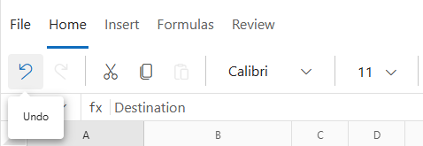
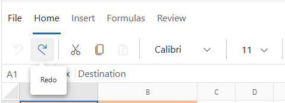

# Undo and Redo in Blazor Spreadsheet Component

The **Undo** and **Redo** functionality in the Blazor Spreadsheet component allows users to reverse or reapply recent actions. It maintains a history of spreadsheet operations, encouraging experimentation with data and formatting while preserving the ability to restore previous states. 

Undo and Redo are supported for most common operations, including:
* Cell editing and formatting
* Structural changes (e.g., inserting or deleting rows/columns)
* Data manipulation (e.g., sorting and filtering)
* Resizing rows and columns

The keyboard shortcuts **Ctrl + Z** for Undo and **Ctrl + Y** for Redo provide quick access without requiring interaction with the user interface.

N> The undo and redo history is limited to **25 operations** to optimize memory usage; once this limit is reached, older actions are automatically discarded. Additionally, the history is cleared when worksheet protection is enabled.

## Undo

The **Undo** operation reverses the most recent action performed within the Spreadsheet, restoring the previous state of the component and enabling safe modifications to content and formatting. End users can perform the undo operation through the user interface (UI) in the following ways:

* Click the **Undo** button located in the **Home** tab of the **Ribbon** to reverse the latest operation.
* Use the keyboard shortcut **Ctrl + Z** for a quick way to undo the last action.

N> The **Undo** button is automatically disabled when there are no reversible operations available.

## Redo

The **Redo** operation reapplies an action that was previously undone, allowing end users to move forward through the operation history and restore both data and interface states. Redo actions can be performed via the user interface in the following ways:

*   Click the **Redo** button located in the **Home** tab of the **Ribbon** to reapply the most recently undone operation.
*   Use the keyboard shortcut **Ctrl + Y** for quick access to redo the last undone action.

N> The **Redo** button is automatically disabled when no actions are available to reapply or when a cell is in edit mode. The redo history is cleared whenever a new action is performed after an undo.
