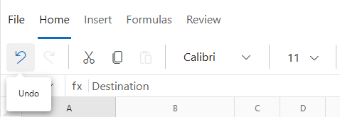
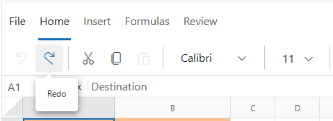

# Undo and Redo in Blazor Spreadsheet Component

The **Undo** and **Redo** functionality in the [Blazor Spreadsheet Editor](https://www.syncfusion.com/spreadsheet-editor-sdk/blazor-spreadsheet-editor) component allows users to reverse or reapply recent actions. It maintains a history of spreadsheet operations, encouraging experimentation while preserving the ability to restore previous states.

Undo and Redo are supported for most common operations, including:

* Cell editing and formatting
* Structural changes (e.g., inserting or deleting rows/columns)
* Data operations (e.g., sorting and filtering)
* Resizing rows and columns

The keyboard shortcuts **Ctrl + Z** for Undo and **Ctrl + Y** for Redo provide quick access without requiring interaction with the user interface.

N> The undo and redo history is limited to **25 operations** to optimize memory usage; once this limit is reached, older actions are automatically discarded. Additionally, the history is cleared when [worksheet protection](./protection#protect-sheet) is enabled.

## Undo

The **Undo** operation reverses the most recent action performed within the Spreadsheet, restoring the previous state of the component and enabling safe modifications to content and formatting. End users can undo through the UI in the following ways:

* Click the **Undo** button located in the **Home** tab of the **Ribbon** to reverse the latest operation.
* Use the keyboard shortcut **Ctrl + Z** for a quick way to undo the last action.

N> The **Undo** button is automatically disabled when there are no reversible operations available.

### Undo Programmatically

The undo action can also be performed programmatically by calling the [Undo()](https://help.syncfusion.com/cr/blazor/syncfusion.blazor.spreadsheet.sfspreadsheet.html#Syncfusion_Blazor_Spreadsheet_SfSpreadsheet_Undo) method.




@page "/"
@using Syncfusion.Blazor.Spreadsheet
@using Syncfusion.Blazor.Buttons

<SfButton OnClick="PerformUndo" Content="Undo"></SfButton>

<SfSpreadsheet @ref="SpreadsheetInstance" DataSource="DataSourceBytes">
    <SpreadsheetRibbon></SpreadsheetRibbon>
</SfSpreadsheet>

@code {
    public byte[] DataSourceBytes { get; set; }
    public SfSpreadsheet SpreadsheetInstance;

    protected override void OnInitialized()
    {
        string filePath = "wwwroot/Sample.xlsx";
        DataSourceBytes = File.ReadAllBytes(filePath);
    }

    public async Task PerformUndo()
    {
        // Reverses the most recent action in the active worksheet.
        await SpreadsheetInstance.Undo();
    }
}




## Redo

The **Redo** operation reapplies an action that was previously undone, allowing end users to move forward through the operation history. Redo actions can be performed via the user interface in the following ways:

* Click the **Redo** button located in the **Home** tab of the **Ribbon** to reapply the most recently undone operation.
* Use the keyboard shortcut **Ctrl + Y** for quick access to redo the last undone action.

N> The **Redo** button is automatically disabled when no actions are available to reapply or when a cell is in edit mode.The redo history is cleared whenever a new action is performed after an undo.

N> In some browsers, **Ctrl + Y** opens the browser history. If the shortcut does not trigger redo, click inside the Spreadsheet area before pressing the shortcut.

### Redo Programmatically

The redo action can also be performed programmatically by calling the [Redo()](https://help.syncfusion.com/cr/blazor/syncfusion.blazor.spreadsheet.sfspreadsheet.html#Syncfusion_Blazor_Spreadsheet_SfSpreadsheet_Redo) method.




@page "/"
@using Syncfusion.Blazor.Spreadsheet
@using Syncfusion.Blazor.Buttons

<SfButton OnClick="PerformRedo" Content="Redo"></SfButton>

<SfSpreadsheet @ref="SpreadsheetInstance" DataSource="DataSourceBytes">
    <SpreadsheetRibbon></SpreadsheetRibbon>
</SfSpreadsheet>

@code {
    public byte[] DataSourceBytes { get; set; }
    public SfSpreadsheet SpreadsheetInstance;

    protected override void OnInitialized()
    {
        string filePath = "wwwroot/Sample.xlsx";
        DataSourceBytes = File.ReadAllBytes(filePath);
    }

    public async Task PerformRedo()
    {
        // Reapplies the most recently undone action in the active worksheet.
        await SpreadsheetInstance.Redo();
    }
}


