# Worksheet Operations in Blazor Spreadsheet Component

A worksheet is a collection of cells organized in the form of rows and columns that allows for storing, formatting, and manipulating data. This feature supports data organization across multiple sheets, making it suitable for scenarios like managing department-wise records, financial reports, or project data in separate sheets.

N> If a workbook is protected, worksheet operations like inserting, deleting, renaming, hiding, unhiding, moving, or duplicating sheets are disabled through both the user interface (UI) and code. To know more about workbook protection, refer to the [Protect Workbook](./protection#protect-workbook) documentation.

## Insert Sheet

The Insert sheet feature in the [Blazor Spreadsheet Editor](https://www.syncfusion.com/spreadsheet-editor-sdk/blazor-spreadsheet-editor) component allows adding new sheets to a workbook, enabling better organization of data across multiple sheets. This feature can be accessed through user interface (UI) or programmatically, offering flexibility based on the application's requirements.

### Insert Sheet via UI

To add or insert a new sheet using the UI, follow these steps:

*   Click the `+` icon button in the **Sheet** tab. This will insert a new empty sheet next to the current active sheet.
    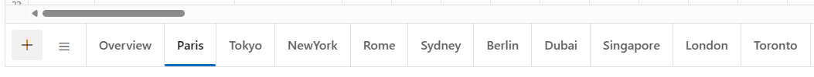

*   Right-click on a **Sheet** tab, and then select the **Insert** option from the context menu to insert a new empty sheet after the current active sheet.
    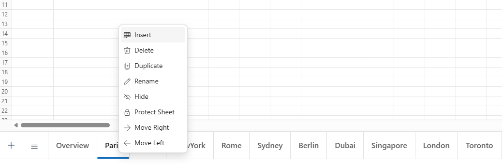

### Insert Sheet Programmatically

Use the [InsertSheetAsync()](https://help.syncfusion.com/cr/blazor/Syncfusion.Blazor.Spreadsheet.SfSpreadsheet.html#Syncfusion_Blazor_Spreadsheet_SfSpreadsheet_InsertSheetAsync_System_Nullable_System_Int32__System_Int32_) method to add one or more sheets to a workbook programmatically. It supports two main scenarios: adding multiple sheets with default names or adding a single sheet with a user-defined name. Below are the details for each scenario, including code examples and parameter information.

**Insert multiple sheets at a specific index**

This method inserts one or more sheets at a specified position in the workbook. The new sheets are assigned default names based on the next sequential numbers that are not already used in the workbook (for example, Sheet1 and Sheet2 if available; otherwise, the next unused numbers such as Sheet4 and Sheet5 when Sheet1 through Sheet3 already exist). For example, if the spreadsheet has three sheets named Sheet1, Sheet2, and Sheet3, adding two sheets at position 1 results in: Sheet1, Sheet4, Sheet5, Sheet2, Sheet3. If no position is provided, the sheets are added based on active sheet index. This is ideal for scenarios requiring multiple sheets, such as organizing large datasets or creating templates for repetitive tasks.

| Parameter | Type | Description |
| -- | -- | -- |
| index | int (optional) | The zero-based index where the sheets will be inserted. If not specified, sheets are added based on active sheet index. If the specified index is invalid (e.g., negative or beyond the workbook's sheet count), no action occurs. |
| count | int (optional) | The number of sheets to add. Defaults to 1 if not specified. |




@page "/"
@using Syncfusion.Blazor.Spreadsheet

<button @onclick="InsertSheetHandler">Insert Sheet</button>

<SfSpreadsheet @ref="SpreadsheetInstance" DataSource="DataSourceBytes">
    <SpreadsheetRibbon></SpreadsheetRibbon>
</SfSpreadsheet>

@code {
    public byte[] DataSourceBytes { get; set; }
    public SfSpreadsheet SpreadsheetInstance;

    protected override void OnInitialized()
    {
        string filePath = "wwwroot/Sample.xlsx";
        DataSourceBytes = File.ReadAllBytes(filePath);
    }

    public async Task InsertSheetHandler()
    {
        // Insert 2 sheets at index 1.
        await SpreadsheetInstance.InsertSheetAsync(1, 2);
    }
}




**Insert a single sheet with a user-defined name**

This method adds one sheet at a specific position with a user-defined name. Each call to this method adds only one sheet. Using meaningful names like "Budget" or "Inventory" makes the workbook easier to understand. If a negative index value is provided, the method will exit without adding any sheet.

| Parameter | Type | Description |
| -- | -- | -- |
| index | int | The zero-based index where the sheet will be inserted. If the specified index is invalid (e.g., negative or beyond the workbook's sheet count), no action occurs. |
| sheetName | string | The name for the new sheet. If the name already exists in the workbook, no action occurs. |




@page "/"
@using Syncfusion.Blazor.Spreadsheet

<button @onclick="InsertSheetHandler">Insert Sheet</button>

<SfSpreadsheet @ref="SpreadsheetInstance" DataSource="DataSourceBytes">
    <SpreadsheetRibbon></SpreadsheetRibbon>
</SfSpreadsheet>

@code {
    public byte[] DataSourceBytes { get; set; }
    public SfSpreadsheet SpreadsheetInstance;

    protected override void OnInitialized()
    {
        string filePath = "wwwroot/Sample.xlsx";
        DataSourceBytes = File.ReadAllBytes(filePath);
    }

    public async Task InsertSheetHandler()
    {
        // Insert a sheet at index 1 with a user-defined name.
        await SpreadsheetInstance.InsertSheetAsync(1, "Sales");
    }
}




## Get Active Worksheet

The [GetActiveWorksheet()](https://help.syncfusion.com/cr/blazor/Syncfusion.Blazor.Spreadsheet.SfSpreadsheet.html#Syncfusion_Blazor_Spreadsheet_SfSpreadsheet_GetActiveWorksheet) method retrieves properties of the active worksheet. This method is useful when it is necessary to obtain details about the currently active sheet. If no worksheet is active, this method returns null.

**Retrieve the active worksheet**

This method retrieves details of the currently active worksheet. Properties of the active worksheet, such as sheet name, index, or selected range, can be accessed for diagnostics, automation, or integration with other logic.

**Return value properties**

The method returns an object describing the active worksheet. The following properties are available on the returned object:

| Property | Type | Description |
| -- | -- | -- |
| Index | int | The zero-based index of the active worksheet within the workbook. |
| Name | string | The name of the active worksheet. |
| SelectedRange | string | The currently selected cell or range address in the active worksheet (for example, "A1" or "A2:B5"). |



@page "/"
@using Syncfusion.Blazor.Spreadsheet

<button @onclick="GetActiveWorksheet">Get Active Worksheet</button>
<SfSpreadsheet @ref="SpreadsheetInstance" DataSource="DataSourceBytes">
    <SpreadsheetRibbon></SpreadsheetRibbon>
</SfSpreadsheet>

@code {
    public byte[] DataSourceBytes { get; set; }
    public SfSpreadsheet SpreadsheetInstance;

    protected override void OnInitialized()
    {
        string filePath = "wwwroot/Sample.xlsx";
        DataSourceBytes = File.ReadAllBytes(filePath);
    }

    public void GetActiveWorksheet()
    {
        // Get the active sheet snapshot
        var active = SpreadsheetInstance.GetActiveWorksheet();
    }
}



## Get Worksheet Data

The [GetData()](https://help.syncfusion.com/cr/blazor/Syncfusion.Blazor.Spreadsheet.SfSpreadsheet.html#Syncfusion_Blazor_Spreadsheet_SfSpreadsheet_GetData_System_String_) method retrieves content from the worksheet. This method provides data as a dictionary, where each entry consists of a cell address and its associated `CellData` object. The returned data includes the actual value, number format, display text, wrap and lock status, hyperlinks, and calculated style of each cell in the target area. If the specified cell address is invalid or not set, the method returns null.

**Retrieve cell or range data from an active worksheet**

Call this method by passing the desired cell or range as the address. For example, provide a reference such as "A1" for a single cell, "A2:B5" for a range, or "Sheet1!A2:B5" to target a range on a specific sheet. The result can be iterated to read individual cell data for further processing, logging, or custom display.

| Parameter | Type | Description |
| :-- | :-- | :-- |
| cellAddress | string | Specifies the cell or range to read. Supports addresses such as "A1", "A2:B5", or "Sheet1!A2:B5". If omitted or invalid, the return value is null. |

**CellData properties**

Each entry in the returned dictionary maps a cell address to a `CellData` object that exposes the following properties:

| Property | Type | Description |
| -- | -- | -- |
| Value | object | The raw underlying value of the cell. |
| DisplayText | string | The value formatted as text, suitable for display. |
| NumberFormat | string | The number format string applied to the cell (for example, `0.00%` or `m/d/yyyy`). |
| Hyperlink | string | The hyperlink configured on the cell, or null if no hyperlink is set. |
| WrapText | bool | Indicates whether text wrapping is enabled for the cell. |
| isLocked | bool | Indicates whether the cell is locked when sheet protection is enabled. |
| Style | object | The calculated cell style, including font, fill, border, and alignment information for the cell. |



@page "/"
@using Syncfusion.Blazor.Spreadsheet

<button @onclick="GetData">Get Data</button>
<SfSpreadsheet @ref="SpreadsheetInstance" DataSource="DataSourceBytes">
    <SpreadsheetRibbon></SpreadsheetRibbon>
</SfSpreadsheet>

@code {
    public byte[] DataSourceBytes { get; set; }
    public SfSpreadsheet SpreadsheetInstance;

    protected override void OnInitialized()
    {
        string filePath = "wwwroot/Sample.xlsx";
        DataSourceBytes = File.ReadAllBytes(filePath);
    }

    public void GetData()
    {
        // Get the cellData snapshot
        var data = SpreadsheetInstance.GetData("Sheet2!D5:E6");
    }
}



## Delete Sheet

The Spreadsheet component supports removing sheets from a workbook. When the workbook contains only one sheet, the delete option is disabled in the user interface (UI), and no action occurs during programmatic deletion attempts. Sheets can be deleted using user interface (UI) or programmatically, based on application requirements.

### Delete Sheet via UI

To remove a sheet using the user interface (UI), follow these steps:

1.  Right-click a **Sheet** tab, and then select the **Delete** option from the context menu.

    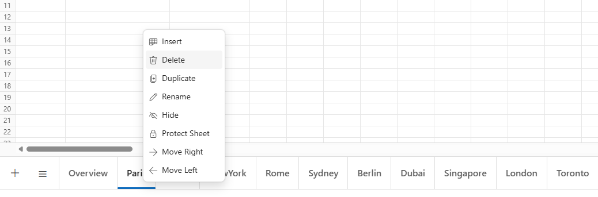

2.  Click **OK** in the confirmation dialog to permanently delete the sheet.

    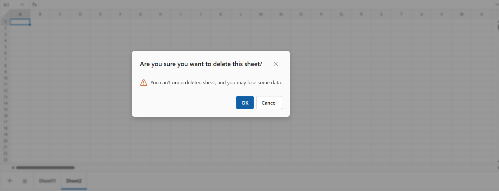

### Delete Sheet Programmatically

Sheets can be deleted using the [DeleteSheetAsync()](https://help.syncfusion.com/cr/blazor/Syncfusion.Blazor.Spreadsheet.SfSpreadsheet.html#Syncfusion_Blazor_Spreadsheet_SfSpreadsheet_DeleteSheetAsync_System_Nullable_System_Int32__) method (by index) or the [DeleteSheetAsync()](https://help.syncfusion.com/cr/blazor/Syncfusion.Blazor.Spreadsheet.SfSpreadsheet.html#Syncfusion_Blazor_Spreadsheet_SfSpreadsheet_DeleteSheetAsync_System_String_) overload (by name). Below are the details for each scenario, including code examples and parameter information.

**Delete sheet by index**

This method removes a sheet at a specific index. It works best when the sheet location in the workbook is known, such as when removing the first or last sheet through code. If no position is specified, the current active sheet gets deleted.

| Parameter | Type | Description |
| -- | -- | -- |
| index | int (optional) | The zero-based index of the sheet to delete. If no index is provided, the active sheet is deleted. If the index is invalid (e.g., negative or beyond the workbook's sheet count) or the workbook has only one sheet, no action occurs. |




@page "/"
@using Syncfusion.Blazor.Spreadsheet

<button @onclick="DeleteSheetHandler">Delete Sheet</button>

<SfSpreadsheet @ref="SpreadsheetInstance" DataSource="DataSourceBytes">
    <SpreadsheetRibbon></SpreadsheetRibbon>
</SfSpreadsheet>

@code {
    public byte[] DataSourceBytes { get; set; }
    public SfSpreadsheet SpreadsheetInstance;

    protected override void OnInitialized()
    {
        string filePath = "wwwroot/Sample.xlsx";
        DataSourceBytes = File.ReadAllBytes(filePath);
    }

    public async Task DeleteSheetHandler()
    {
        // Remove sheet at index 0.
        await SpreadsheetInstance.DeleteSheetAsync(0);
    }
}




**Delete sheet by name**

This method removes a sheet that matches the given name. It helps when the exact sheet name is known, like when deleting sheets called "Budget" or "Sales". No sheets will be deleted if only one sheet exists in the workbook. The method also won't delete any sheets if the provided name is invalid.

| Parameter | Type | Description |
| -- | -- | -- |
| sheetName | string | The name of the sheet to delete. If the name does not exist or the workbook has only one sheet, no action occurs. |




@page "/"
@using Syncfusion.Blazor.Spreadsheet

<button @onclick="DeleteSheetHandler">Delete Sheet</button>

<SfSpreadsheet @ref="SpreadsheetInstance" DataSource="DataSourceBytes">
    <SpreadsheetRibbon></SpreadsheetRibbon>
</SfSpreadsheet>

@code {
    public byte[] DataSourceBytes { get; set; }
    public SfSpreadsheet SpreadsheetInstance;

    protected override void OnInitialized()
    {
        string filePath = "wwwroot/Sample.xlsx";
        DataSourceBytes = File.ReadAllBytes(filePath);
    }

    public async Task DeleteSheetHandler()
    {
        // Remove sheet named "Sales".
        await SpreadsheetInstance.DeleteSheetAsync("Sales");
    }
}




## Rename Sheet

The rename sheet feature allows assigning a user-defined name to a sheet for better organization. Sheet names must be unique within the workbook, and renaming does not affect data or formulas. This feature is essential for improving workbook clarity, especially in complex workbooks with multiple sheets.

**Sheet naming rules**

When renaming a sheet through the user interface or programmatically, the new name must follow these Excel-compatible naming rules:

* Maximum of 30 characters.
* Cannot contain any of the following characters: `\`, `/`, `?`, `*`, `[`, `]`.
* Cannot be blank.

If any of these rules are violated when renaming programmatically, no action occurs.

To rename a sheet through the user interface (UI):

1.  Right-click a **Sheet** tab and select **Rename** from the context menu.

    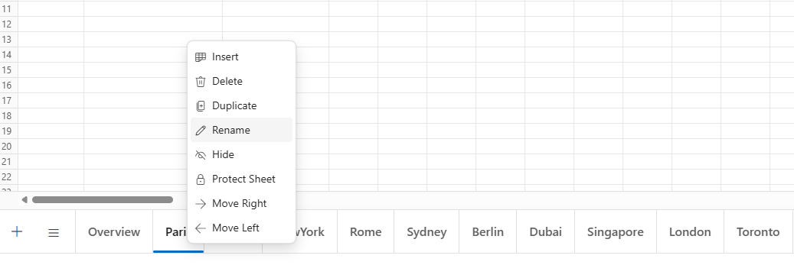

2.  Enter a new name in the dialog and click **Update** to confirm.

    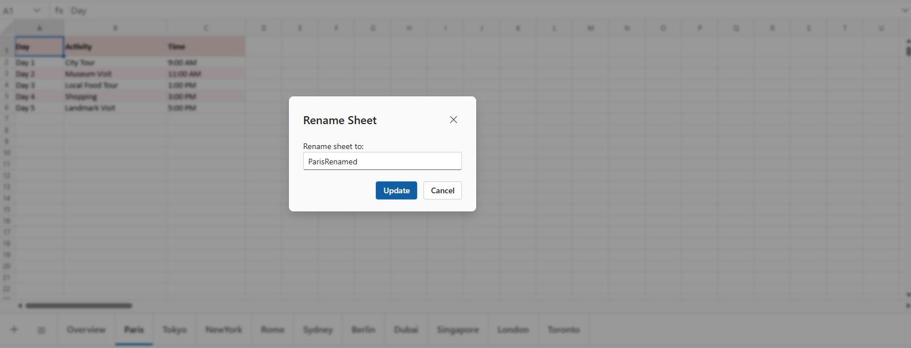

## Hide Sheet

Hiding sheets in the Spreadsheet component prevents unauthorized access or accidental changes. Hidden sheets remain in the workbook, retaining all data, formulas, and functionality, but are not visible in the user interface (UI). To hide a sheet, right-click the **Sheet** tab and select **Hide** from the context menu.

**NOTE**

* The **Hide** option is available only if the workbook has more than one visible sheet, ensuring at least one sheet remains visible.

* Hidden sheets can still be referenced in formulas and calculations.

* Access the sheet selection menu to view all sheets, including hidden ones. Hidden sheets appear in a dimmed, disabled state within the sheet selection menu, clearly indicating that they are hidden.

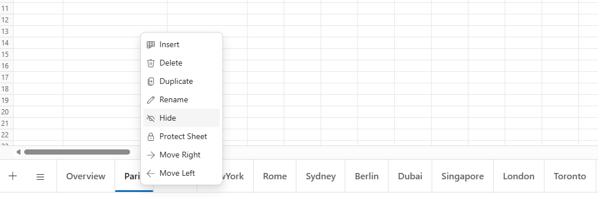

### Unhide Sheet

The Spreadsheet component allows restoring hidden sheets to view, which appear in a disabled state within the sheet selection menu. To make a hidden sheet visible again, click on the **Sheet** tab list icon and then select the hidden sheet. Once selected, the sheet will reappear in the sheet tab collection and become available for editing.

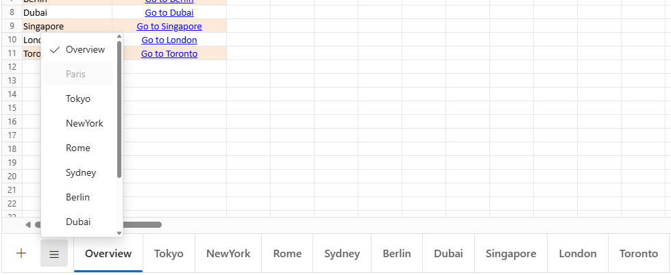

## Move Sheet

The Spreadsheet component allows reordering sheets by moving them to different positions within the workbook. This feature helps organize sheets in a preferred sequence for better navigation and workflow efficiency. Sheets can be moved using user interface (UI) or programmatically, based on application needs.

### Move Sheet via UI

To move a sheet using the user interface (UI), follow these steps:

1.  Click and hold on a **Sheet** tab, then drag it to the desired position.

2.  Right-click on a **Sheet** tab and select the **Move Left** or **Move Right** options from the context menu to reposition the sheet accordingly.

N> **Move Right** is enabled only if a sheet exists to the right, and **Move Left** is enabled only if a sheet exists to the left.

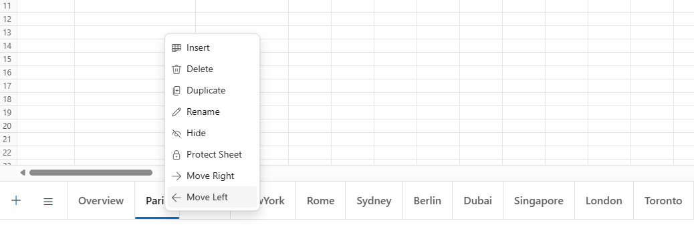
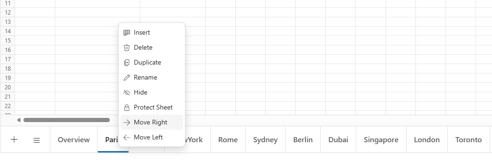

### Move Sheet Programmatically

The [MoveSheetAsync()](https://help.syncfusion.com/cr/blazor/Syncfusion.Blazor.Spreadsheet.SfSpreadsheet.html#Syncfusion_Blazor_Spreadsheet_SfSpreadsheet_MoveSheetAsync_System_Nullable_System_Int32__System_Int32_) method moves a sheet from one index to another programmatically. This method requires two parameters: the current zero-based index of the sheet to move and the destination zero-based index where the sheet will be placed. If either index is invalid (negative or beyond the sheet count), the method will not perform any action.

| Parameter | Type | Description |
| -- | -- | -- |
| sourceIndex | int | The zero-based index of the sheet to move. If invalid (e.g., negative or beyond sheet count), no action occurs. |
| destinationIndex | int | The zero-based index where the sheet will be moved. If invalid, no action occurs. |




@page "/"
@using Syncfusion.Blazor.Spreadsheet

<button @onclick="MoveSheetHandler">Move Sheet</button>

<SfSpreadsheet @ref="SpreadsheetInstance" DataSource="DataSourceBytes">
    <SpreadsheetRibbon></SpreadsheetRibbon>
</SfSpreadsheet>

@code {
    public byte[] DataSourceBytes { get; set; }
    public SfSpreadsheet SpreadsheetInstance;

    protected override void OnInitialized()
    {
        string filePath = "wwwroot/Sample.xlsx";
        DataSourceBytes = File.ReadAllBytes(filePath);
    }

    public async Task MoveSheetHandler()
    {
        // Move sheet from index 0 to index 2.
        await SpreadsheetInstance.MoveSheetAsync(0, 2);
    }
}




## Duplicate Sheet

The Spreadsheet component allows creating an exact copy of a sheet, including all data, formatting, formulas, and styling. Duplicating a sheet is useful for creating multiple sheets with similar content or structure. The duplicated sheet is inserted immediately after the original sheet and is assigned a unique name, typically appending a number (e.g., "Sheet1" becomes "Sheet1 (2)"). Sheet duplication can be performed through user interface (UI) or programmatically, depending on application needs.

### Duplicate Sheet via UI

To duplicate a sheet using the user interface (UI), simply right-click on the desired **Sheet** tab and choose the **Duplicate** option from the context menu.

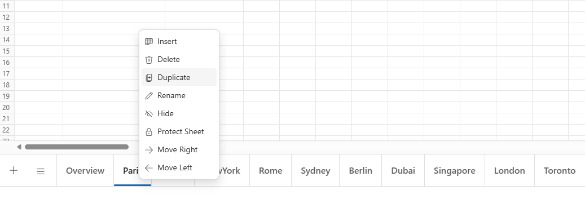

### Duplicate Sheet Programmatically

Use the [DuplicateSheetAsync()](https://help.syncfusion.com/cr/blazor/Syncfusion.Blazor.Spreadsheet.SfSpreadsheet.html#Syncfusion_Blazor_Spreadsheet_SfSpreadsheet_DuplicateSheetAsync_System_Nullable_System_Int32__) method to duplicate a worksheet programmatically by specifying its index or name. The duplicated sheet is inserted immediately after the original sheet. Below are details for duplicating a sheet by index or by name, including parameter information and code examples.

**Duplicate sheet by index**

This method creates a copy of the sheet at the specified index. If no index is provided, the active sheet is duplicated. This is useful when the position of the sheet in the workbook is known.

| Parameter | Type | Description |
| -- | -- | -- |
| index | int (optional) | The zero-based index of the sheet to duplicate. If no index is provided, the active sheet is duplicated. If the index is invalid (e.g., negative or beyond sheet count), no action occurs. |




@page "/"
@using Syncfusion.Blazor.Spreadsheet

<button @onclick="DuplicateSheetHandler">Duplicate Sheet</button>

<SfSpreadsheet @ref="SpreadsheetInstance" DataSource="DataSourceBytes">
    <SpreadsheetRibbon></SpreadsheetRibbon>
</SfSpreadsheet>

@code {
    public byte[] DataSourceBytes { get; set; }
    public SfSpreadsheet SpreadsheetInstance;

    protected override void OnInitialized()
    {
        string filePath = "wwwroot/Sample.xlsx";
        DataSourceBytes = File.ReadAllBytes(filePath);
    }

    public async Task DuplicateSheetHandler()
    {
        // Duplicate the sheet at index 0.
        await SpreadsheetInstance.DuplicateSheetAsync(0);
    }
}




**Duplicate sheet by name**

This method creates a copy of the sheet with the specified name. The sheet name matching is case-insensitive. This is useful when the exact sheet name is known, such as duplicating a sheet named "Budget" or "Sales".

| Parameter | Type | Description |
| -- | -- | -- |
| `sheetName` | `string` | The name of the sheet to duplicate. If the name does not exist, no action occurs. |




@page "/"
@using Syncfusion.Blazor.Spreadsheet

<button @onclick="DuplicateSheetHandler">Duplicate Sheet</button>

<SfSpreadsheet @ref="SpreadsheetInstance" DataSource="DataSourceBytes">
    <SpreadsheetRibbon></SpreadsheetRibbon>
</SfSpreadsheet>

@code {
    public byte[] DataSourceBytes { get; set; }
    public SfSpreadsheet SpreadsheetInstance;

    protected override void OnInitialized()
    {
        string filePath = "wwwroot/Sample.xlsx";
        DataSourceBytes = File.ReadAllBytes(filePath);
    }

    public async Task DuplicateSheetHandler()
    {
        // Duplicates the sheet named "Sheet1".
        await SpreadsheetInstance.DuplicateSheetAsync("Sheet1");
    }
}




## Gridlines

Gridlines provide a border-like appearance that helps distinguish cells on a worksheet. To hide gridlines, navigate to the **View** tab in the Ribbon toolbar and select the **Hide Gridlines** option; to show gridlines again, select the **Show Gridlines** option in the same tab, and these actions apply to the active worksheet.

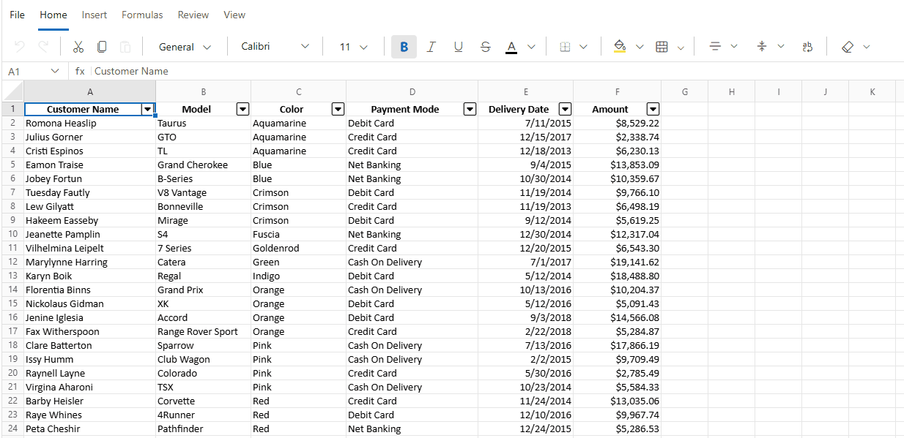