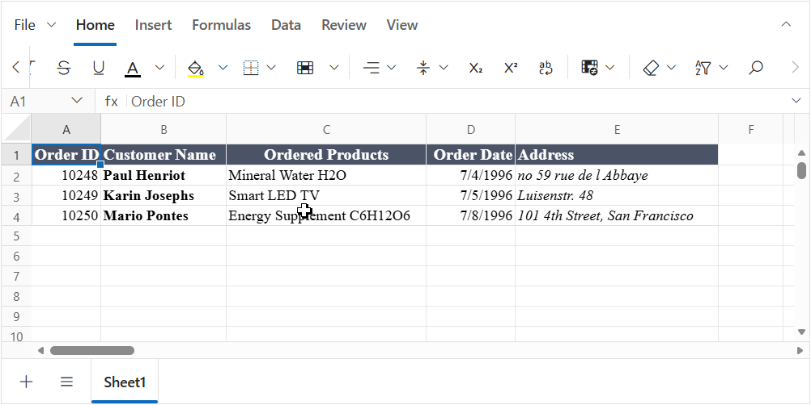

# Formatting in EJ2 JavaScript Spreadsheet control

Formatting options make your data easier to view and understand. The different types of formatting options in the Spreadsheet are,
* Number Formatting
* Text Formatting
* Cell Formatting
* Conditional Formatting
* Rich Text Formatting

## Number Formatting

Number formatting lets you define how data is displayed in the Spreadsheet. Use the [`allowNumberFormatting`](https://ej2.syncfusion.com/javascript/documentation/api/spreadsheet#allownumberformatting) property to enable or disable the number formatting option in the Spreadsheet. The different types of number formatting supported in the Spreadsheet are,

| Types | Format Code | Format ID |
|---------|---------|---------|
| General(default) | NA | 0 |
| Number | `0.00` | 2 |
| Currency | `$#,##0.00` | NA |
| Accounting | `_($* #,##0.00_);_($* (#,##0.00);_($* "-"??_);_(@_)` | 44 |
| ShortDate | `m/d/yyyy` | 14 |
| LongDate | `dddd, mmmm dd, yyyy` | NA |
| Time | `h:mm:ss AM/PM` | NA |
| Percentage | `0.00%` | 10 |
| Fraction | `# ?/?` | 12 |
| Scientific | `0.00E+00` | 11 |
| Text | `@` | 49 |

Number formatting can be applied in the following ways:
* Using the `format` property in `cell`, you can set the desired format to each cell at initial load.For example, `cells: [{ value: '1000', format: '$#,##0.00' }]`.

* Using the [`numberFormat`](https://ej2.syncfusion.com/javascript/documentation/api/spreadsheet#numberformat) method, you can set the number format to a cell or range of cells.

* Selecting the number format option from the ribbon toolbar.

### Custom Number Formatting

Spreadsheet supports custom number formats to display your data as numbers, dates, times, percentages, and currency values. If the pre-defined number formats do not meet your needs, you can set your own custom formats using the custom number formats dialog or the `numberFormat` method.

The different types of custom number format populated in the custom number format dialog are,

| Type | Format Code | Format ID |
|-------|---------|---------|
| General(default) | NA | 0 |
| Number | `0` | 1 |
| Number | `0.00` | 2 |
| Number | `#,##0` | 3 |
| Number | `#,##0.00` | 4 |
| Number | `#,##0_);(#,##0)` | 37 |
| Number | `#,##0_);[Red](#,##0)` | 38 |
| Number | `#,##0.00_);(#,##0.00)` | 39 |
| Number | `#,##0.00_);[Red](#,##0.00)` | 40 |
| Currency | `$#,##0_);($#,##0)` | 5 |
| Currency | `$#,##0_);[Red]($#,##0)` | 6 |
| Currency | `$#,##0.00_);($#,##0.00)` | 7 |
| Currency | `$#,##0.00_);[Red]($#,##0.00)` | 8 |
| Percentage | `0%` | 9 |
| Percentage | `0.00%` | 10 |
| Scientific | `0.00E+00` | 11 |
| Scientific | `##0.0E+0` | 48 |
| Fraction | `# ?/?` | 12 |
| Fraction | `# ??/??` | 13 |
| ShortDate | `m/d/yyyy` | 14 |
| Custom | `d-mmm-yy` | 15 |
| Custom | `d-mmm` | 16 |
| Custom | `mmm-yy` | 17 |
| Custom | `h:mm AM/PM` | 18 |
| Custom | `h:mm:ss AM/PM` | 19 |
| Custom | `h:mm` | 20 |
| Custom | `h:mm:ss` | 21 |
| Custom | `m/d/yyyy h:mm` | 22 |
| Custom | `mm:ss` | 45 |
| Custom | `mm:ss.0` | 47 |
| Text | `@` | 49 |
| Custom | `[h]:mm:ss` | 46 |
| Accounting | `_($* #,##0_);_($* (#,##0);_($* "-"_);_(@_)` | 42 |
| Accounting | `_(* #,##0_);_(* (#,##0);_(* "-"_);_(@_)` | 41 |
| Accounting | `_($* #,##0.00_);_($* (#,##0.00);_($* "-"??_);_(@_)` | 44 |
| Accounting | `_(* #,##0.00_);_(* (#,##0.00);_(* "-"??_);_(@_)` | 43 |

Custom Number formatting can be applied in the following ways:

* Using the [`numberFormat`](https://ej2.syncfusion.com/javascript/documentation/api/spreadsheet#numberformat) method, you can set your own custom number format to a cell or range of cells.

* Selecting the custom number format option from the custom number formats dialog, or type your own format in the dialog input and then click the apply button. It will apply the custom format for the selected cells.

The following code example shows the number formatting in cell data.












## Configure Culture-based Custom Format

Previously, the custom format dialog always displayed formats using the English settings (group separator, decimal separator, and currency symbol were not updated based on the applied culture). Starting from version `27.1.*`, the custom format dialog will now display formats according to the applied culture. You can select a culture-based number format from the dialog or enter your own format using the culture-specific decimal separator, group separator, and currency symbol. Then, click "Apply" to apply the culture-specific custom format to the selected cells.

onfigureLocalizedFormat` method should be called after the Spreadsheet is instantiated and before rendering (or before opening the custom format dialog).

Compared to Excel, the date, time, currency, and accounting formats vary across different cultures. For example, when an Excel file with the date format `'m/d/yyyy'` is imported in the `en-US` culture, the spreadsheet displays the date in that format. However, when the same file is imported in the German culture, the date format changes to `'dd.MM.yyyy'`, which is the default for that region. The default number format ID for the date is 14. To customize the date format based on the culture, you should map the default number format ID to the appropriate culture-specific format code, like this: `{ id: 14, code: 'dd.MM.yyyy' }` in the `configureLocalizedFormat` method.

> The format code should use the default decimal separator (.) and group separator (,).

The code below illustrates how culture-based format codes are mapped to their corresponding number format ID for the `German` culture.

The following code example demonstrates how to configure culture-based formats for different cultures in the spreadsheet.












## Text and Cell Formatting

Text and cell formatting enhances the look and feel of your cells. It helps to highlight a particular cell or range of cells from a whole workbook. You can apply formats like font size, font family, font color, text alignment, border, etc. to a cell or range of cells. Use the [`allowCellFormatting`](https://ej2.syncfusion.com/javascript/documentation/api/spreadsheet#allowcellformatting) property to enable or disable the text and cell formatting option in the Spreadsheet. You can set the formats in the following ways:

* Using the `style` property, you can set formats to each cell at initial load.
* Using the [`cellFormat`](https://ej2.syncfusion.com/javascript/documentation/api/spreadsheet#cellformat) method, you can set formats to a cell or range of cells.
* You can also apply by clicking the desired format option from the ribbon toolbar.

### Fonts

Various font formats supported in the spreadsheet are font-family, font-size, bold, italic, strike-through, underline, and font color.

### Text Alignment

You can align text in a cell either vertically or horizontally using the `textAlign` and `verticalAlign` properties.

### Indents

To enhance the appearance of text in a cell, you can change the indentation of a cell's content using the `textIndent` property.

### Fill Color

To highlight a cell or range of cells from the whole workbook, you can apply a background color for a cell using the `backgroundColor` property.

### Borders

You can add borders around a cell or range of cells to define a section of worksheet or a table. The different types of border options available in the spreadsheet are,

| Types | Actions |
|-------|---------|
| Top Border | Specifies the top border of a cell or range of cells.|
| Left Border | Specifies the left border of a cell or range of cells.|
| Right Border | Specifies the right border of a cell or range of cells.|
| Bottom Border | Specifies the bottom border of a cell or range of cells.|
| No Border | Specifies the clearing of the border from a cell or range of cells.|
| All Border | Specifies all borders of a cell or range of cells.|
| Horizontal Border | Specifies the top and bottom borders of a cell or range of cells.|
| Vertical Border | Specifies the left and right borders of a cell or range of cells.|
| Outside Border | Specifies the outside border of a range of cells.|
| Inside Border | Specifies the inside border of a range of cells.|

You can also change the color, size, and style of the border. The size and style supported in the spreadsheet are,

| Types | Actions |
|-------|---------|
| Thin | Specifies the `1px` border size (default).|
| Medium | Specifies the `2px` border size.|
| Thick | Specifies the `3px` border size.|
| Solid | Specifies the `solid` border (default).|
| Dashed | Specifies the `dashed` border.|
| Dotted | Specifies the `dotted` border.|
| Double | Specifies the `double` border.|

Borders can be applied in the following ways:

* Using the `border`, `borderTop`, `borderLeft`, `borderRight`, `borderBottom` properties, you can set the desired border to each cell at initial load.
* Using the [`setBorder`](https://ej2.syncfusion.com/javascript/documentation/api/spreadsheet#setborder) method, you can set various border options to a cell or range of cells.
* Selecting the border options from the ribbon toolbar.

The following code example shows the style formatting in text and cells of the spreadsheet.












### Limitations of Formatting

The following features are not supported in Formatting:

* Insert row/column between the formatting applied cells.
* Formatting support for row/column.

## Conditional Formatting

Conditional formatting helps you to format a cell or range of cells based on the conditions applied. You can enable or disable conditional formats by using the [`allowConditionalFormat`](https://ej2.syncfusion.com/javascript/documentation/api/spreadsheet#allowConditionalFormat) property.

> The default value for the `allowConditionalFormat` property is `true`.

### Apply Conditional Formatting

You can apply conditional formatting in the following ways:

* Select the conditional formatting icon in the Ribbon toolbar under the Home Tab.

* Using the [`conditionalFormat()`](https://ej2.syncfusion.com/javascript/documentation/api/spreadsheet#conditionalFormat) method to define the condition.

* Using the `conditionalFormats` in the sheets model.

Conditional formatting has the following types in the spreadsheet:

### Highlight cells rules

Highlight cells rules option in the conditional formatting enables you to highlight cells with a preset color depending on the cell's value.

The following options can be given for the highlight cells rules as type,

> 'GreaterThan', 'LessThan', 'Between', 'EqualTo', 'ContainsText', 'DateOccur', 'Duplicate', 'Unique'.

The following preset colors can be used for formatting styles,

> `"RedFT"` - Light Red Fill with Dark Red Text,
> `"YellowFT"` - Yellow Fill with Dark Yellow Text,
> `"GreenFT"` - Green Fill with Dark Green Text,
> `"RedF"` - Red Fill,
> `"RedT"` - Red Text.

### Top bottom rules

Top bottom rules option in the conditional formatting allows you to apply formatting to the cells that satisfy a statistical condition with other cells in the range.

The following options can be given for the top bottom rules as type,

> 'Top10Items', 'Bottom10Items', 'Top10Percentage', 'Bottom10Percentage', 'BelowAverage', 'AboveAverage'.

### Data Bars

You can apply data bars to represent the data graphically inside a cell. The longest bar represents the highest value and the shorter bars represent the smaller values.

The following options can be given for the data bars as type,

> 'BlueDataBar', 'GreenDataBar', 'RedDataBar', 'OrangeDataBar', 'LightBlueDataBar', 'PurpleDataBar'.

### Color Scales

Using color scales, you can format your cells with two or three colors, where different color shades represent the different cell values. In the Green-Yellow-Red(GYR) Color Scale, the cell that holds the minimum value is colored as red. The cell that holds the median is colored as yellow, and the cell that holds the maximum value is colored as green. All other cells are colored proportionally.

The following options can be given for the color scales as type,

> 'GYRColorScale', 'RYGColorScale', 'GWRColorScale', 'RWGColorScale', 'BWRColorScale', 'RWBColorScale', 'WRColorScale', 'RWColorScale', 'GWColorScale', 'WGColorScale', 'GYColorScale', 'YGColorScale'.

### Icon Sets

Icon sets will help you to visually represent your data with icons. Every icon represents a range of values. In the Three Arrows(colored) icon, the green arrow icon represents the values greater than 67%, the yellow arrow icon represents the values between 33% to 67%, and the red arrow icon represents the values less than 33%.

The following options can be given for the icon sets as type,

> 'ThreeArrows', 'ThreeArrowsGray', 'FourArrowsGray', 'FourArrows', 'FiveArrowsGray', 'FiveArrows', 'ThreeTrafficLights1', 'ThreeTrafficLights2', 'ThreeSigns', 'FourTrafficLights', 'FourRedToBlack', 'ThreeSymbols', 'ThreeSymbols2', 'ThreeFlags', 'FourRating', 'FiveQuarters', 'FiveRating', 'ThreeTriangles', 'ThreeStars', 'FiveBoxes'.

### Custom Format

Using the custom format for conditional formatting you can set cell styles like color, background color, font style, font weight, and underline.

In the MAY and JUN columns of the following code sample, conditional formatting custom format is applied.

> In the Conditional format, custom format is supported for Highlight cell rules and Top bottom rules.

### Clear Rules

You can clear the defined rules in the following ways:

* Using the "Clear Rules" option in the Conditional Formatting button of the HOME Tab in the ribbon to clear the rule from selected cells.

* Using the [`clearConditionalFormat()`](https://ej2.syncfusion.com/javascript/documentation/api/spreadsheet#clearConditionalFormat) method to clear the defined rules.













### Limitations of Conditional Formatting

The following features have some limitations in Conditional Formatting:

* Insert row/column between the conditional formatting.
* Conditional formatting with formula support.
* Copy and paste the conditional formatting applied cells.
* Custom rule support.

## Rich Text Formatting

Rich text formatting allows you to apply different styles to specific portions of text within a single cell to improve readability and presentation. Currently, subscript and superscript formatting are supported, and other rich text font styles are not supported.

In the **Syncfusion EJ2 JavaScript Spreadsheet**, rich text formatting is supported through the [`richText`](https://ej2.syncfusion.com/javascript/documentation/api/spreadsheet#cells) property of the cell model. This property lets you define multiple text segments inside a cell, where each segment can have its own style.

Each `richText` segment contains:

- `text` – Specifies the content of the segment  
- `style` – Defines formatting using the cell style properties

## Subscript and Superscript

Subscript and superscript formatting are supported as part of rich text formatting and can be applied to specific portions of text within a cell.

To apply these formats, use the `verticalAlign` property within the style of a rich text segment:

Set `verticalAlign: 'super'` for superscript and `verticalAlign: 'sub'` for subscript.

#### How to Apply Subscript and Superscript

You can apply subscript and superscript formatting in the following ways:

1. Double-click the cell to enter edit mode, select the desired portion of text within the cell, then click the Subscript or Superscript option in the ribbon to apply the formatting.



2. You can define the [`richText`](https://ej2.syncfusion.com/javascript/documentation/api/spreadsheet#richtext) property directly while initializing the Spreadsheet. This is useful when you want the formatting to be applied when the data is loaded.

```js
cells: [
    {
        value: 'H2O',
        richText: [
            { text: 'H' },
            { text: '2', style: { verticalAlign: 'sub' } },
            { text: 'O' }
        ]
    }
]
```

3. You can also apply subscript and superscript dynamically using the [`updateCell`](https://ej2.syncfusion.com/javascript/documentation/api/spreadsheet#updatecell) method.

```js
spreadsheet.updateCell({
    value: 'X2',
    richText: [
        { text: 'X' },
        { text: '2', style: { verticalAlign: 'super' } }
    ]
}, 'A5');
```

The following code example shows the subscript and superscript formatting in cells of the spreadsheet.











## Limitations
* **Limited formatting support:** Only subscript and superscript formatting are supported within rich text. Other formatting options such as font size, font color, and font weight are not supported.
* **Edit mode requirement:** Formatting can be applied only while the cell is in edit mode. Selecting text outside of edit mode does not support subscript or superscript formatting.

## See Also

* [Rows and columns](./rows-and-columns)
* [Hyperlink](./link)
* [Sorting](./sort)
* [Filtering](./filter)
* [Ribbon customization](./ribbon#ribbon-customization)
