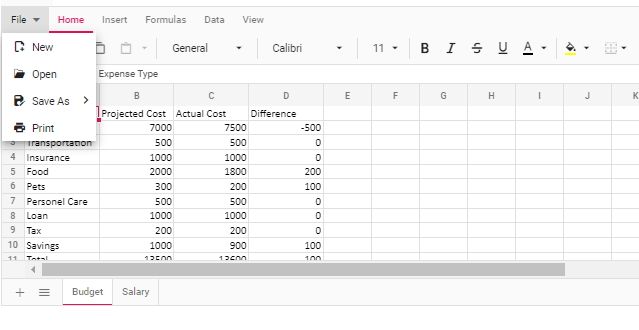
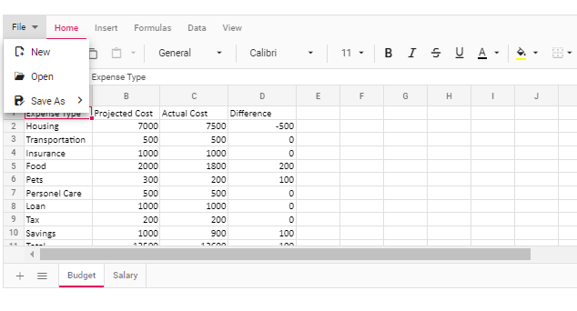

# Print in EJ2 JavaScript Spreadsheet control

The printing functionality allows end-users to print all contents, such as tables, charts, images, and formatted contents, available in the active worksheet or entire workbook in the Spreadsheet. You can enable or disable print functionality by using the `allowPrint` property, which defaults to **true**.

## Default printing

The active worksheet in the Spreadsheet can be printed by selecting the **File > Print** option in the ribbon menu. You can also initiate the printing using the `Ctrl` + `P` keyboard shortcut when the Spreadsheet is in focus. These two options print only the data from the active sheet without including rows headers, column headers and grid lines.

## Custom printing

The active worksheet or entire workbook can be printed with customized options using the [`print`](https://ej2.syncfusion.com/javascript/documentation/api/spreadsheet#print) method. The `print` method takes one parameter, that is, `printOptions`, which can be used for customization.

The `printOptions` is an object of the [`PrintOpts`](https://ej2.syncfusion.com/javascript/documentation/api/spreadsheet#printopts) interface and contains three properties, as described below.

* `type` - It specifies whether to print the current sheet or the entire workbook. The value for this property is either **ActiveSheet** or **Workbook**.
* `allowGridLines` - This property specifies whether grid lines should be included in the printing or not. The grid lines will be included in the printed copy when set to **true**. When set to **false**, it will not be available.
* `allowRowColumnHeader` - This property specifies whether row and column headers should be included in the printing or not. The headers will be included in the printed copy when set to **true**. When set to **false**, it will not be available.

> When the `print` method is called without any parameters, the default printing will be performed.












## Disable printing

The printing functionality in the Spreadsheet can be disabled by setting the [`allowPrint`](https://ej2.syncfusion.com/javascript/documentation/api/spreadsheet#allowprint) property to **false**. After disabling, the **Print** option is removed from the **File** menu of the ribbon, and the <kbd>Ctrl</kbd>+<kbd>P</kbd> keyboard shortcut is also disabled.












## Limitations

* Changing the page orientation to landscape is not supported in either the `print` method or the browser's print preview dialog.
* Styles applied through the data validation feature (such as highlight colors and error indicators) are not included in the printed copy.
* Content added to cell templates, such as HTML elements, Syncfusion&reg; controls, or custom components, is not included in the printed copy.
