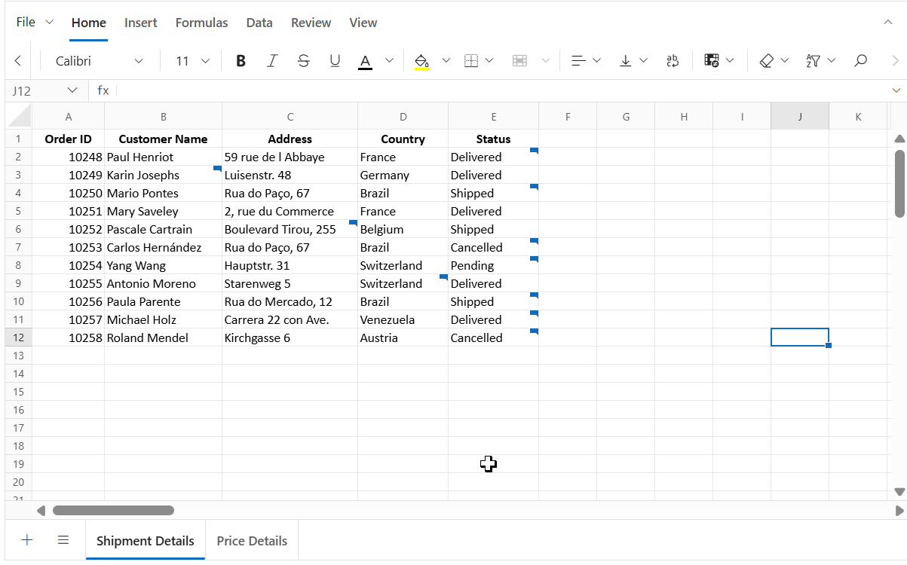

# Comment in EJ2 TypeScript Spreadsheet control

The **Comment** feature allows you to add remarks and **replies** to cells, making it easier to provide feedback or enabling contextual discussions without altering cell values. Comment are distinct from **Notes** and includes advanced capabilities such as replies, resolve/reopen, and an optional **Comments Review Pane** to maintain clear communication and streamline review workflows. When a cell contains a comment, a small comment indicator appears in its corner. Hover over the indicator to preview the comment.


## Author identity

The Syncfusion Spreadsheet does not automatically track user identity. To tag new comments and replies with an author name, set the `author` property when initializing the Spreadsheet.

```ts

    import { Spreadsheet } from '@syncfusion/ej2-spreadsheet';
    // Initialize Spreadsheet component
    const spreadsheet: Spreadsheet = new Spreadsheet(
        // Set the author name, If not set, "Guest User" will be shown as the author by default.
        author: 'Place the Author Name Here'
    );
    // Render initialized Spreadsheet
    spreadsheet.appendTo('#element');

```
If the author property is not set, comments and replies will display Guest User as the author by default.

The host application is responsible for setting the current user's display name for each session.

## Adding a comment

You can add a **comment** to a cell in the following ways:
* **Context menu**: Right-click the target cell and click **"New Comment"**.
* **Ribbon**: Use **Review > Comment > New Comment**.
* **Keyboard shortcut**: Press **Ctrl + Shift + F2** to open the comment container.
* **Programmatically**: Use the `updateCell` method to assign a comment to a specific cell.

**Example for using `updateCell` method with comment:**

```ts

    // Create a comment at the target cell using updateCell
    spreadsheet.updateCell({
    comment: {
        author: 'Chistoper', text: 'Are you completed the report',
        createdTime: 'January 03, 2026 at 5:00 PM',
        isResolved: false,
        replies: [{ author: 'John', text: 'Yes, completed',
        createdTime: 'January 03, 2026 at 7:00 PM' }]
    }
    }, 'Sheet1!D5');

```


After posting, the comment becomes visible with the comment indicator in the cell and can be previewed on hover.

## Adding a reply

You can add one or more replies to an existing comment to provide additional details or answers:

* **Hover over the comment indicator** on the cell to open the comment container, type your reply in the input box, and click **Post**.
* **Context menu**: Right-click the cell, select **Comment > New Reply**, enter your reply, and click **Post**.
* **Ribbon**: Use **Review > Comment > New Comment** on a cell that already has a comment. This triggers **reply mode**.
* **Keyboard shortcut**: Press **Ctrl + Shift + F2** on a cell that contains a comment to open the comment container in reply mode.

After posting, the replies appear under the initial comment in the container.

## Editing a comment or reply

You can edit the content of a comment or its replies directly within the container

* **Initial comment**: Hover over the cell indicator to open the comment container. Click the **⋯ (More thread actions)** menu in the header, select **Edit Comment**, modify the text, and click **Post**.
* **Reply**: Hover over the specific reply, click the **⋯ (More actions)**, select **Edit Comment**, update the text, and click **Post**.


## Deleting a reply

You can remove a specific reply from a comment:

* Hover over the reply inside the comment container, click **⋯ (More actions)** and select **Delete Comment**.


## Resolve and Reopen

The **Resolve** option marks a comment as completed when the discussion or issue is addressed. When a thread is resolved, its background color changes to indicate the resolved state, and the reply input box and reply menu actions are hidden. Use **Reopen** to restore the comment if further discussion is needed.

### Resolve a comment
* Hover over the cell indicator to open the comment container and click **⋯ (More thread actions)** menu in the container header and select **Resolve Thread**. 

### Reopen a comment
* Hover over the cell indicator to open the comment container and click **Reopen** button in the header to make the thread active again.


You can also use the `isResolved` property in the comment model when initializing or updating comments programmatically.

## Deleting a comment

You can delete an entire comment thread
(including all replies) using any of the following methods:

* **Context menu**: Right-click the cell that contains the comment and select **Comment > Delete Comment**.
* **Ribbon**: Use **Review > Comment > Delete Comment** on a cell that contains the comment.
* **Comment container**: Hover over the cell indicator to open the comment container, click **⋯ (More thread actions)** menu in the container header and select **Delete Thread** for active comment or use the **Delete Thread** button in container header for the resolved comment.

Deleting a thread removes the comment and all its replies from the cell.

## Next and Previous Comment

The **Review > Comment > Next Comment and Previous Comment** options in the ribbon allow you to quickly navigate between cells that contain comments:

* **Next Comment**: Moves to the next cell with a comment.
* **Previous Comment**: Moves to the previous cell with a comment.

Navigation starts within the active sheet. When all comments in the active sheet have been visited (end or start reached), the navigation automatically continues to the next or previous sheet that contains comments. This ensures you can review all comments across the workbook without manually switching sheets.

## Show Comments and Comments Review Pane

The **Comments Review Pane** provides a centralized view of all comments in the active sheet and offers filtering, inline actions, and navigation. This pane helps you manage comments efficiently without switching between individual cells.

You can show or hide the Comments Review Pane using:

* **Ribbon**: Use **Review > Comment > Show Comments**.
* **Property**: Set the `showCommentsPane` property when initializing the Spreadsheet.

> The default value for the `showCommentsPane` property is `false`.



### Features of the Comments Review Pane

The Comments Review Pane allows you to:

* **Add new comment** using the **New** button.
* **Filter comments** by **All**, **Active**, or **Resolved** to focus on specific comments.
* **Navigate between comments** and synchronize selection with the corresponding cells.
* Perform actions such as:
  * **Reply** – Add replies directly from the pane.
  * **Edit** – Modify the text of a comment or reply.
  * **Delete** – Remove a reply or an entire thread.
  * **Resolve/Reopen** – Change the status of a comment.

When the Review Pane is open, all actions performed in the pane or in the cell’s comment container are synchronized:

* Selecting a comment in the Review Pane highlights the corresponding cell in the sheet.
* Selecting a cell with a comment focuses the related comment in the Comment Review Pane.
* Actions such as **Reply**, **Edit**, **Delete**, and **Resolve/Reopen** update both the pane comment container and the cell comment container instantly, ensuring consistency across the UI.

## Saving a Workbook with Comments

You can save spreadsheet data along with **comments** using **File > Save As > Microsoft Excel(.xlsx)**.
- **MS Excel (.xlsx)** - Preserves all **threaded comments** (modern comments).

> Comments are **not included** when exporting to **.xls**, **.csv**, and **.pdf**.

### Why Comments Are Not Saved in `.xls`
The **.xls** format is based on the older Excel binary structure (BIFF8), which does not support modern features like **threaded comments**.
Threaded comments introduced in newer Excel versions require the **Open XML** structure used by `.xlsx`.  

>To retain threaded comments, always save the workbook in **.xlsx** format.

## Integrating comments during initial loading using cell data binding

You can bind **comments** to cells at initial load by providing a `comment` object in the cell model. Each cell supports **per comment thread**, which can include:
- **Initial comment fields**: `author`, `text`, `createdTime`, `isResolved`
- **Replies**: A **flat array** of `{ author, text, createdTime }` objects (no nested replies-of-replies)

When the workbook renders, cells that include a `comment`:
- Show the **comment indicator** in the cell corner.
- Open the **comment container** on hover.
- Appear in the **Comments Review Pane** if it is shown.


In the below example, comments are added to specific cells via cell data binding. The review pane is shown initially, and comments are added using `updateCell` method in the `created` event.









        


### Notes

* **One thread per cell**: Attach a single `comment` object per cell. New remarks should be added as replies inside the existing thread.
* **Resolved**: Use `isResolved: true` to render a thread in resolved state.
* **Indicator & preview**: Cells with comments show an indicator; hover opens the comment container for preview and inline actions.
* **Comments Review pane**: Set `showCommentsPane: true` to manage threads centrally (add, filter, navigate, reply, edit, delete, resolve/reopen).

## Limitations

* **Un-posted comment is not stored**: If you type in the comment container and close it without clicking **Post**, the entered text is not saved. Only posted content is persisted in the comment model.
* **Export support**: Threaded comments are not exported to **.xls**, **.csv**, and **.pdf**.
* **Single thread per cell**: Only one comment thread is supported per cell; replies are a flat list (no nested reply-to-reply).
* **Non-collaborative**: Real-time multi-user sync is not supported; the host app must set the author identity for the session.