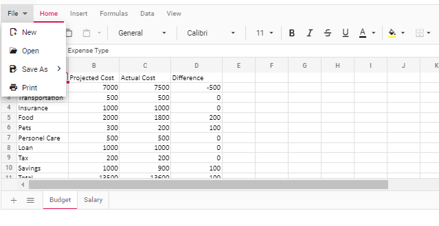
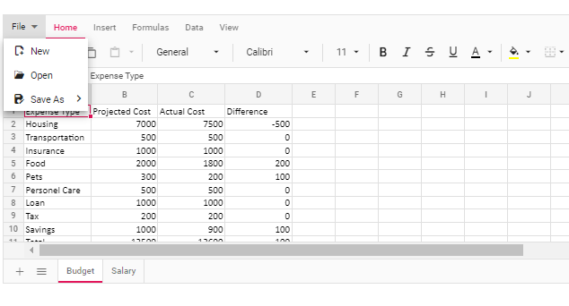

# Print in EJ2 TypeScript Spreadsheet control

The printing functionality allows end-users to print all contents, such as tables, charts, images, and formatted contents, available in the active worksheet or entire workbook in the Spreadsheet. You can enable or disable print functionality by using the `allowPrint` property, which defaults to **true**.

## Default printing

The active worksheet in the Spreadsheet can be printed by selecting the **File > Print** option in the ribbon menu. You can also initiate the printing using the `Ctrl` + `P` keyboard shortcut when the Spreadsheet is in focus. These two options print only the data from the active sheet without including rows headers, column headers and grid lines.

## Custom printing

The active worksheet or entire workbook can be printed with customized options using the `print` method. The `print` method takes one parameter, that is, `printOptions`, which can be used for customization.

The `printOptions` contain three properties, as described below.

* `type` - It specifies whether to print the current sheet or the entire workbook. The value for this property is either **ActiveSheet** or **Workbook**.
* `allowGridLines` - This property specifies whether grid lines should be included in the printing or not. The grid lines will be included in the printed copy when set to **true**. When set to **false**, it will not be available.
* `allowRowColumnHeader` - This property specifies whether row and column headers should be included in the printing or not. The headers will be included in the printed copy when set to **true**. When set to **false**, it will not be available.

> When the `print` method is called without any parameters, the default printing will be performed.









        


## Disable printing

The printing functionality in the Spreadsheet can be disabled by setting the [`allowPrint`](https://ej2.syncfusion.com/documentation/api/spreadsheet/#allowprint) property to **false**. After disabling, the **"Print"** option will not be available in the **"File"** menu of the ribbon and as a keyboard shortcut.

 







        


## Limitations

* When printing the document, changing the page orientation to landscape is not supported in both the `print` method and print preview dialog of the web browser.
* The styles provided for the data validation functionality will not be available in the printed copy of the document.
* The content added to the cell templates, such as HTML elements, Syncfusion&reg; controls, and others, will not be available in the printed copy of the document.
