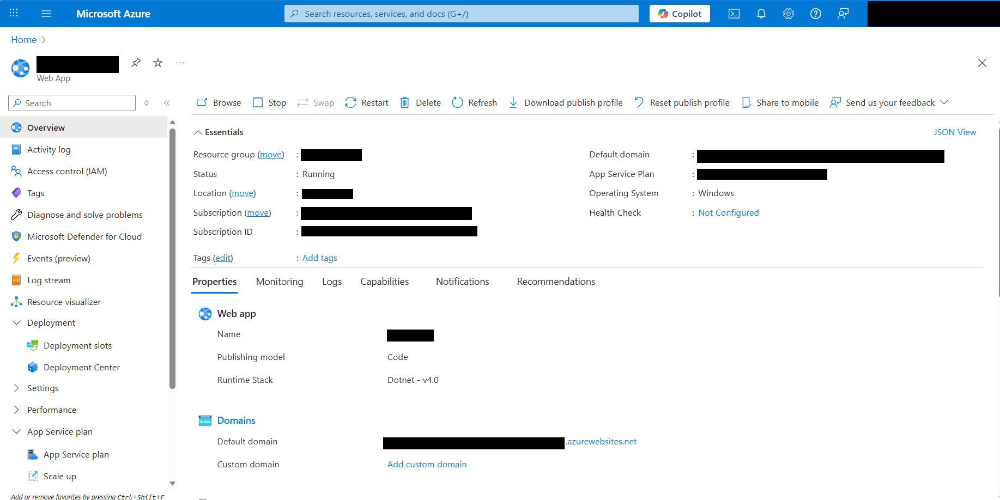

# Deploy Spreadsheet Server Docker Image to Azure App Service via CLI

## Prerequisites

* `Docker` installed on your machine (Windows, macOS, or Linux).
* `Azure CLI` installed based on your operating system. [Download Azure CLI](https://docs.microsoft.com/en-us/cli/azure/install-azure-cli)
* An active [`Azure subscription`](https://azure.microsoft.com/en-gb) with App Services access.
* The [`Spreadsheet Server Docker image`](https://hub.docker.com/r/syncfusion/spreadsheet-server) available.

## Deploy to Azure App Service using Azure CLI

**Step 1:**  Log in to Azure

Open your terminal and sign in to Azure using the command below. This authenticates your CLI with Azure.

```bash
az login
```

**Step 2:** Create a resource group

Create a resource group with the following command in your preferred location.

```bash
az group create --name < your-app-name> --location <your-selected-region>
```

**Step 3:** Create an app service plan

Create a resource group with the following command in your preferred location.

```bash
az appservice plan create --name  --resource-group < your-resource-group> --sku S1 --is-linux
```

This creates an App Service plan in the standard pricing tier (S1) and ensures it runs on Linux containers with the --is-linux flag. 

**Step 4:** Create the docker-compose.yml file

Define your container configuration in a docker-compose.yml file. This file specifies the container name, image, and environment variables for the Spreadsheet Server:

```bash
version: '3.4' 

services:
  spreadsheet-server:
    image: syncfusion/spreadsheet-server
    environment:
      
      # Provide your license key for activation
      SYNCFUSION_LICENSE_KEY: YOUR_LICENSE_KEY
    ports:
      - "6002:8080"

```

Note: Replace YOUR_LICENSE_KEY with your valid Syncfusion license key.

**Step 5:** Create a Docker compose app

Deploy the containerized app to Azure App Service using the following command.

```bash
az webapp create --resource-group <your-resource-group> --plan < your-app-service-plan> --name <your-app-name> --multicontainer-config-type compose --multicontainer-config-file docker-compose.yml
```

This command creates a web app that runs your Spreadsheet Server Docker container using the configuration defined in the docker-compose.yml file.

**Step 6:** Browse your app

Once deployed, your app will be live at https://XXXXXXXXXX.azurewebsites.net.



**Step 7:** With your server running, verify that it supports import and export operations by testing the following endpoints:
```
openUrl="https://XXXXXXXXXX.azurewebsites.net/api/spreadsheet/open"
saveUrl="https://XXXXXXXXXX.azurewebsites.net/api/spreadsheet/save
```
Append the App Service running URL to the service URL in the client‑side Spreadsheet Editor component. For more information about how to get started with the Spreadsheet Editor component, refer to this [`getting started page`](../getting-started.md)

For more information about the app container service, please look deeper into the [`Microsoft Azure App Service`](https://docs.microsoft.com/en-us/visualstudio/deployment/) for a production-ready setup.