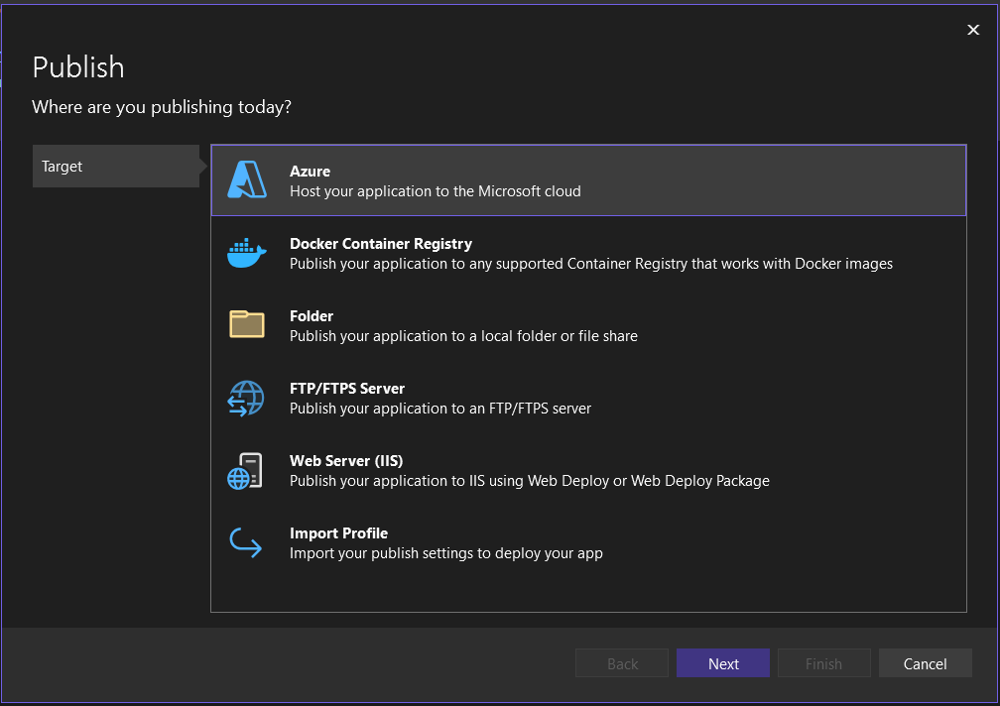
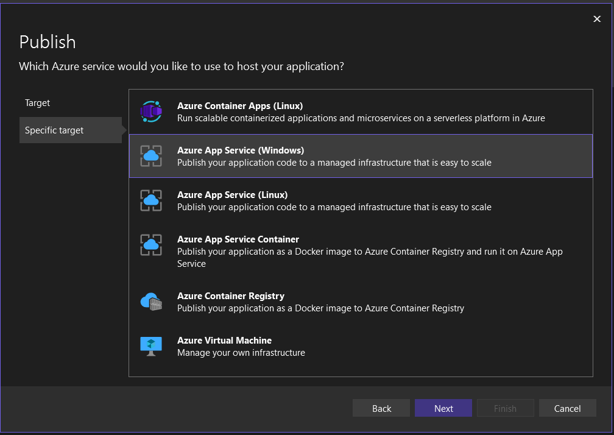
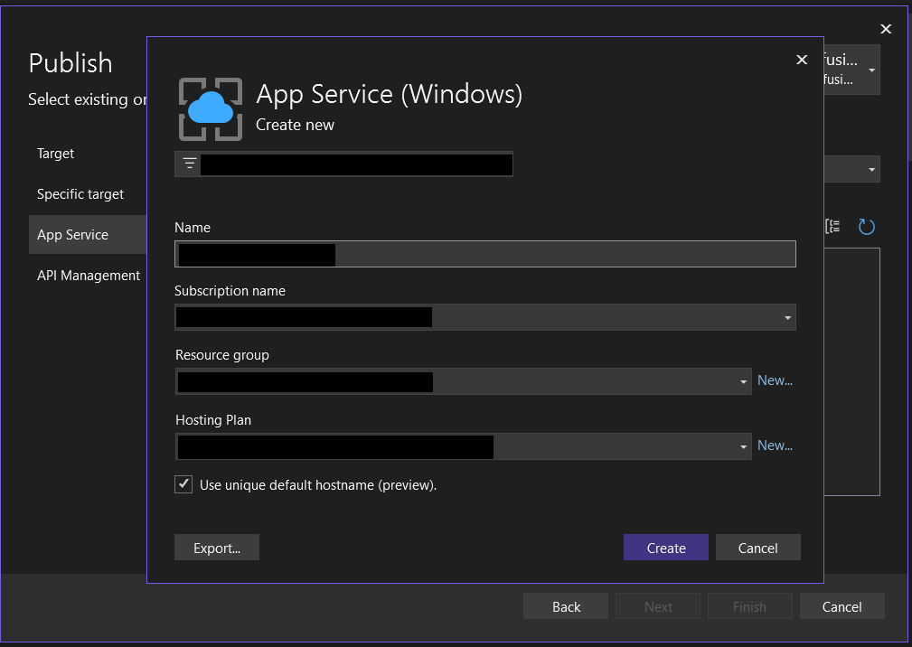
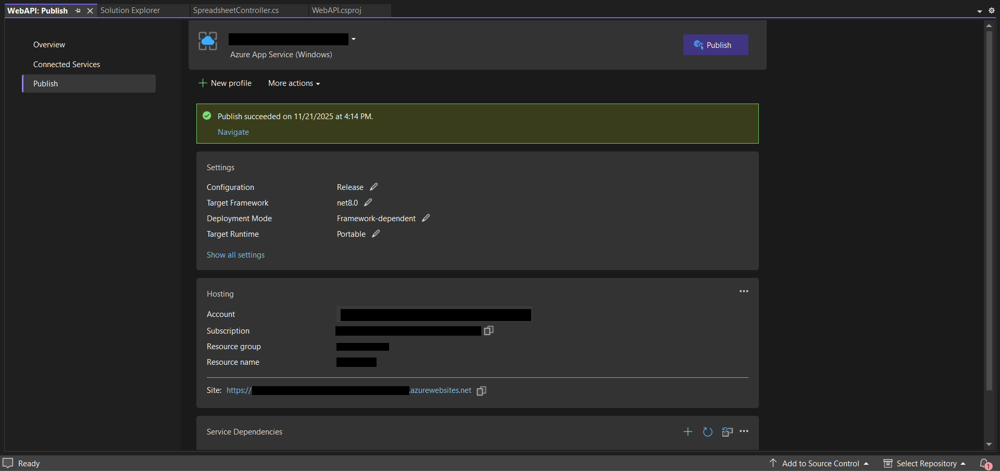

# Publish ASP.NET Core Spreadsheet Server to Azure App Service from Visual Studio in React Spreadsheet Editor component

## Prerequisites

* `Visual Studio 2022` or later is installed.
* [`.NET 8.0 SDK`](https://dotnet.microsoft.com/en-us/download/dotnet/8.0) or later installed.
* An active [`Azure subscription`](https://azure.microsoft.com/en-gb) with App Services access.
* The [`Spreadsheet Web API project`](https://github.com/SyncfusionExamples/EJ2-Spreadsheet-WebServices/tree/main/WebAPI) repository cloned locally.

Make sure you build the project using the Build > Build Solution menu command before following the deployment steps.

## Publish to Azure App Service

**Step 1:** In Solution Explorer, right-click the project and click Publish (or use the Build > Publish menu item).


**Step 2:** In the Pick a publish target dialog box, select Azure as deployment target.



**Step 3:** After selecting Azure, choose Azure App Service under the target options.



**Step 4:** Select Publish. The Create App Service dialog box appears. Sign in with your Azure account, if necessary, and then the default app service settings populate the fields.



**Step 5:** Select Create. Visual Studio deploys the app to your Azure App Service, and the web app loads in your browser with the app name at `http://<app_name>.azurewebsites.net`.



**Step 6:** Once the deployment process is complete, The deployed API will be live at the following URL:
https://XXXXXXXXXX.azurewebsites.net

**Step 7:** With your server running, verify that it supports import and export operations by testing the following endpoints:
```
openUrl="https://XXXXXXXXXX.azurewebsites.net/api/spreadsheet/open"
saveUrl="https://XXXXXXXXXX.azurewebsites.net/api/spreadsheet/save
```
Append the App Service running URL to the service URL in the client‑side Spreadsheet Editor component. For more information about how to get started with the Spreadsheet Editor component, refer to this [`getting started page`](../getting-started.md)

For more information about the app container service, please look deeper into the [`Microsoft Azure App Service`](https://docs.microsoft.com/en-us/visualstudio/deployment/) for a production-ready setup.