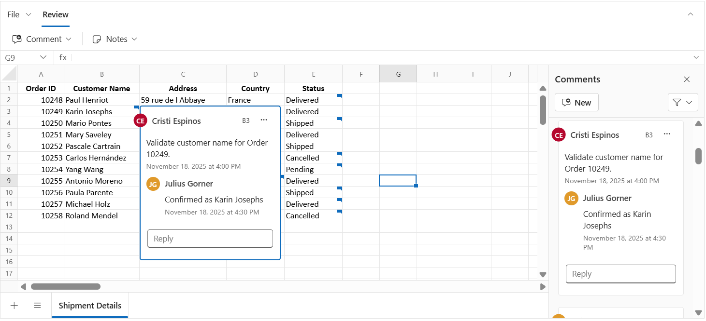
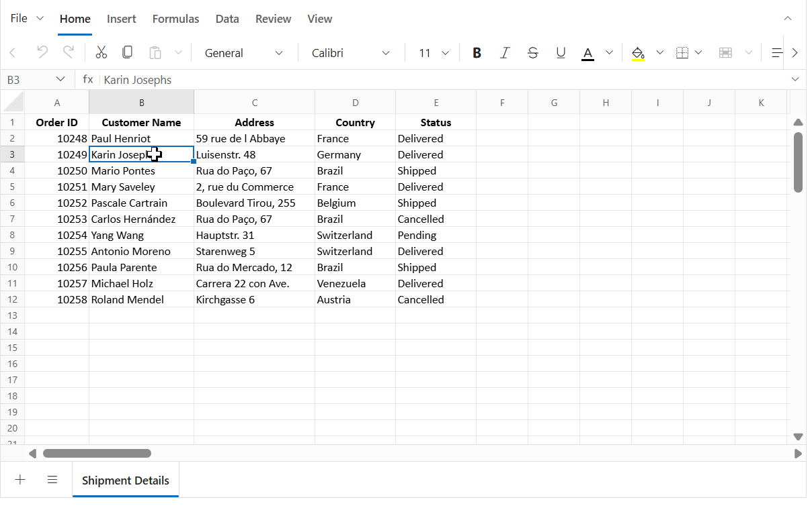
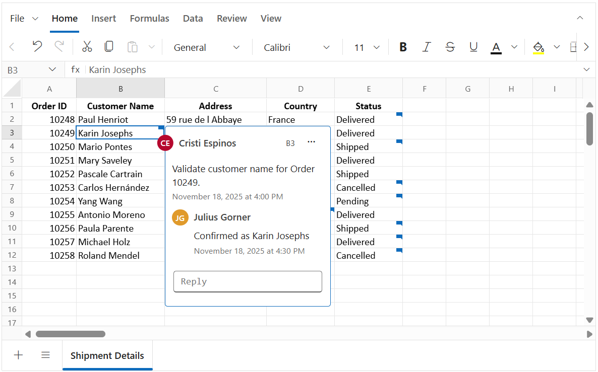
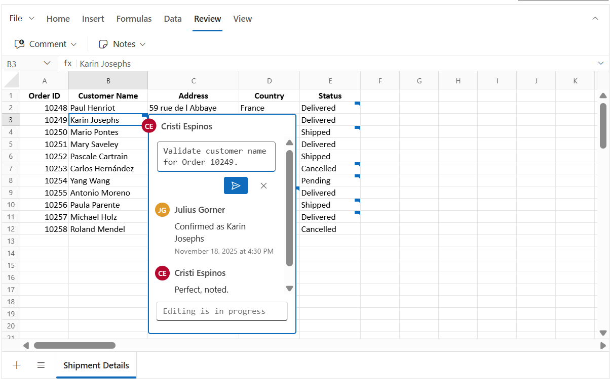
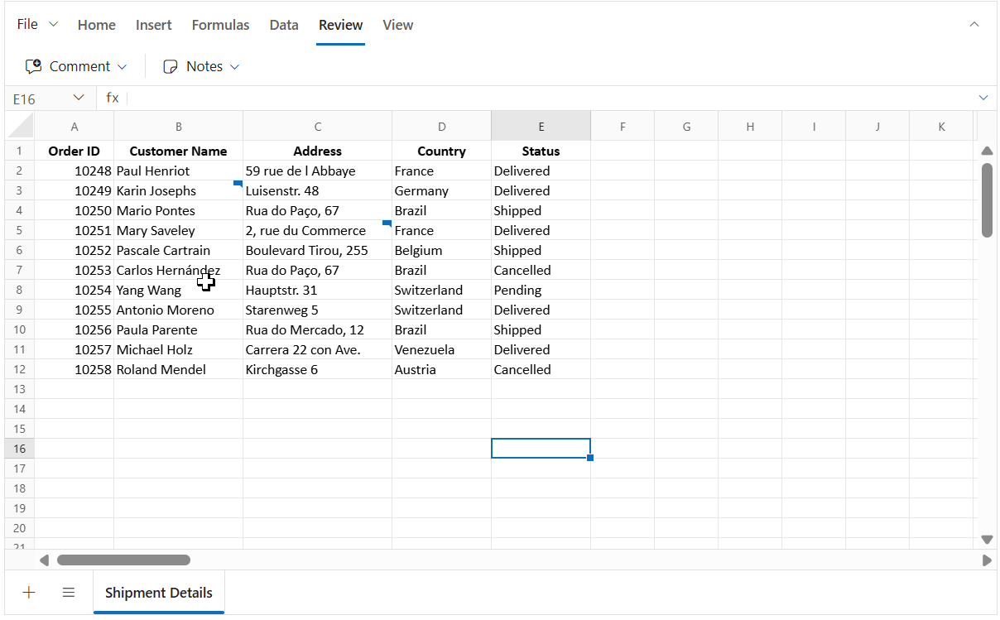
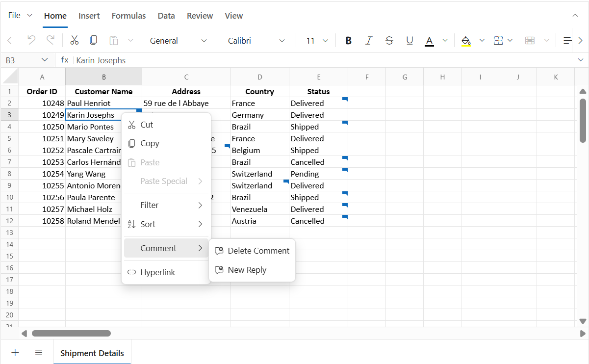
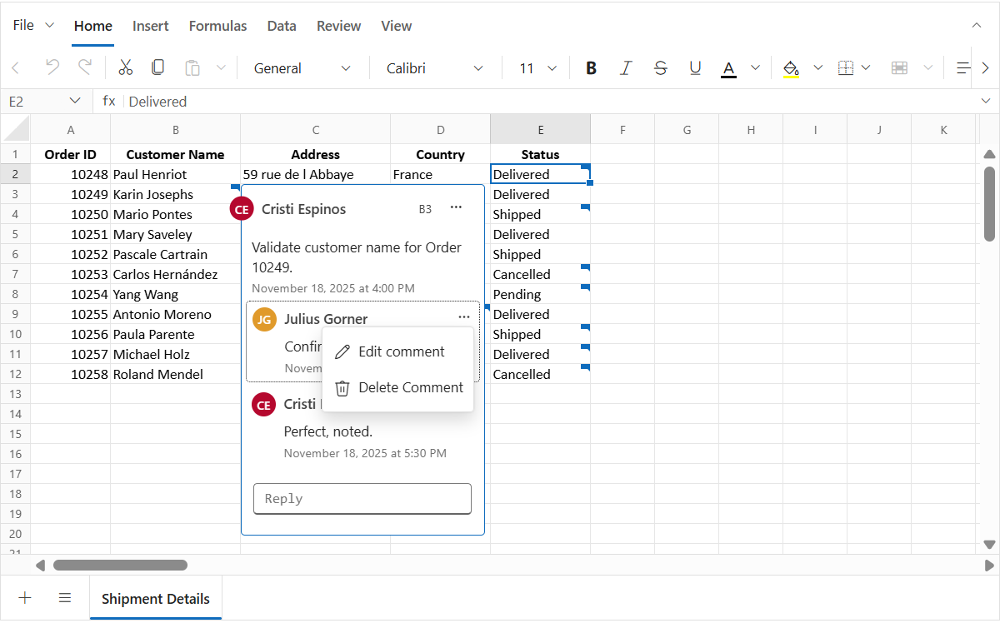
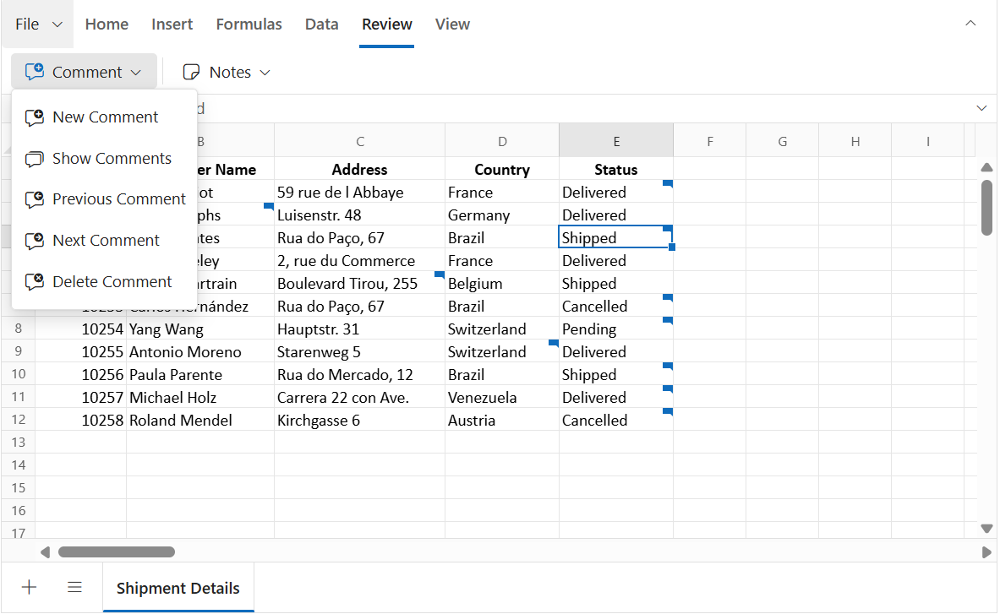
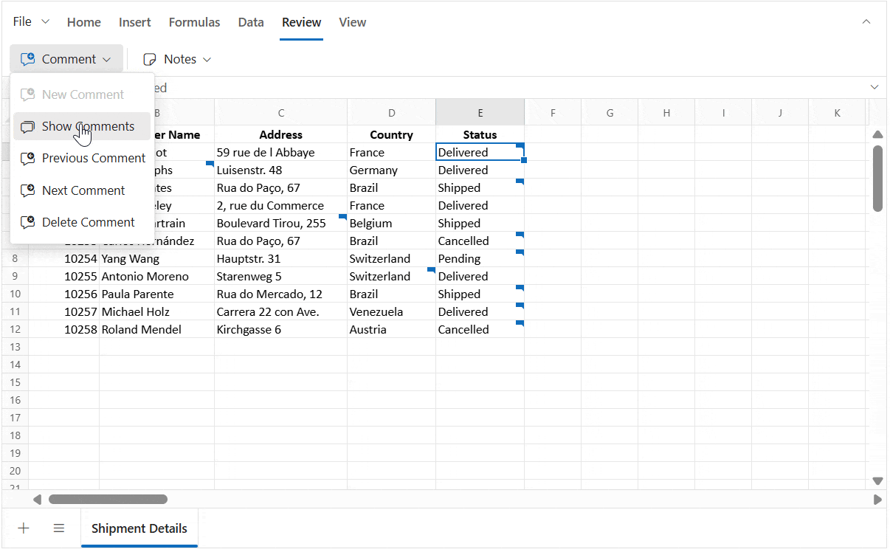

# Comment in React Spreadsheet control
The **Comment** feature allows you to add feedback to cells without changing their values, enabling contextual discussions through threaded **replies**. Unlike [Notes](./notes), Comment include advanced review tools such as `resolve` and `reopen` to track status, plus an optional **Comments Review Pane** for browsing and managing threads.

Cells that contain a comment show a small indicator. Hovering over the cell opens a preview of the comment editor. This helps maintain a clear workflow for collaboration while keeping the original data unchanged.



## Author identity
The Syncfusion Spreadsheet does not automatically track author details. To assign an author name to new comments and replies, set the `author` property when initializing the Spreadsheet.  

If the `author` property is not defined, the default value will be **Guest User**.


```ts
    import * as React from 'react';
    import { createRoot } from 'react-dom/client';
    import { SpreadsheetComponent } from '@syncfusion/ej2-react-spreadsheet';
    export default function App() {
        return (
            <SpreadsheetComponent 
                // Set the author name, If not set, "Guest User" will be shown as the author by default.
                author='Place the Author Name Here'>
            </SpreadsheetComponent>
        );
    }
    const root = createRoot(document.getElementById('root')!);
    root.render(<App />);
```
> If the `author` property is not set, "Guest User" will appear as the author for comments and replies by default.

## Adding a comment

A **comment** can be added to a cell in different ways:

* **Context menu**: Right-click the cell and choose **New Comment**.  
* **Ribbon**: Go to **Review > Comment > New Comment**.  
* **Keyboard shortcut**: Press <kbd>Ctrl</kbd> + <kbd>Shift</kbd> + <kbd>F2</kbd> to open the comment editor for the active cell.  
* **Programmatically**:  
  * Use the [updateCell](https://ej2.syncfusion.com/react/documentation/api/spreadsheet/index-default#updatecell) method with the comment model to add a comment to a specific cell.  
  * Bind comments during initial load by linking the comment model with the cell model.  

The image below shows that once a comment is posted, the cell displays an indicator, and the comment can be previewed on hover.



## Adding a reply

Replies can be added to an existing comment to provide more details or responses:

* **Context menu**: Right-click the cell that already has a comment, choose **Comment > New Reply**, type the reply, and click **Post**.
* **Ribbon**: Go to **Review > Comment > New Comment** on a cell that contains a comment. This opens the comment editor in **reply mode**.
* **Comment editor**: Hover over the comment indicator to open the editor, type the reply, and click **Post**.  
* **Keyboard shortcut**: Press <kbd>Ctrl</kbd> + <kbd>Shift</kbd> + <kbd>F2</kbd> on a cell with a comment to open the editor in reply mode.

After posting, replies appear directly under the original comment in the comment editor.



## Editing a comment
You can edit the content of a comment or its replies directly within the comment editor.

* **Edit first comment**: In the comment editor. Click the **"⋯" (More thread actions)** menu in the header, select the **Edit Comment**, modify the text and click **Post**.
* **Edit a reply comment**: In the comment editor, hover over the specific reply, click the **"⋯" (More actions)**, select the **Edit Comment**, modify the text and click **Post**.



## Resolve and Reopen
The **Resolve thread** option is used to mark a comment thread as completed once the issue or discussion has been addressed. When a thread is resolved, its background color changes to show the resolved state, and the reply input box along with reply menu actions are hidden.  

If more discussion is needed later, the **Reopen** option can be used. Reopening a thread restores it to active state, brings back the reply input box, and re-enables the reply menu actions so the conversation can be continued.

### Resolve a comment
* In the comment editor, click the **"⋯" (More thread actions)** menu in the header and select **Resolve Thread**. 

### Reopen a comment
* In the comment editor, click the **Reopen** button in the header to make the thread active again.



You can also use the `isResolved` property in the comment model when initializing or updating comments programmatically.

**Example: Using `isResolved` property in the comment model with the `updateCell` method**

```ts
// Update a cell with a comment using the updateCell method
    spreadsheet.updateCell({
        comment: {
            author: 'Chistoper', text: 'Are you completed the report',
            createdTime: 'January 03, 2026 at 5:00 PM',
            // Set to true to mark the thread as resolved; false keeps it active
            isResolved: false,
            replies: [{ author: 'John', text: 'Yes, completed',
            createdTime: 'January 03, 2026 at 7:00 PM' }]
        }
    }, 'Sheet1!D5');
```

## Deleting a comment or reply
You can delete either a specific reply or an entire comment thread (including all replies) using the following options:

### Deleting a comment thread
* **Context menu**: Right-click the cell that contains the comment and select **Comment > Delete Comment**.  
* **Ribbon**: Go to **Review > Comment > Delete Comment** on a cell that contains the comment.  
* **Comment editor**: In the comment editor, click the **"⋯" (More thread actions)** menu in the header and select **Delete Thread** for an active comment, or use the **Delete Thread** button in the header for a resolved comment.

Deleting a thread removes the comment and all of its replies from the cell.



### Delete a reply
In the comment editor, hover over the reply and click the **"⋯" (More actions)** menu then select **Delete Comment**.



## Next and Previous Comment

The **Review > Comment > Next Comment** and **Previous Comment** options in the ribbon allow you move quickly between cells that contain comments:

* **Next Comment**: Jumps to the next cell with a comment.  
* **Previous Comment**: Jumps to the previous cell with a comment.

Navigation starts in the active sheet. When all comments in that sheet have been visited (end or start reached), the navigation continues automatically to the next or previous sheet that has comments. This makes it easy to review all comments across the workbook without switching sheets manually.



## Comments review pane
The **Comments review pane** gives a clear, central view of all comments in the active sheet, making it easier to manage discussions without moving through each cell one by one. It provides options for filtering, quick actions, and navigation, helping maintain an efficient review process across the workbook.

You can show or hide the Comments review pane in two ways:

* **Ribbon**: Go to **Review > Comment > Show Comments**.
* **Property**: Set the `showCommentsPane` property to **true** when initializing the Spreadsheet. By default, this property is set to **false**.



### Features of the comments review pane
The "Comments" review pane appears inside the Spreadsheet to give a dedicated space for handling comments. It works as a central place where all comment threads can be viewed, managed, and organized without moving cell by cell.

The "Comments" review pane supports the following actions:

* Add a new comment using the **New** button.
* Filter comments by **All**, **Active**, or **Resolved** to show specific threads.
* Move between comments and link the selection with the related cells.
* Perform actions such as:
  * **Reply** – Add a reply directly in the review pane.
  * **Edit** – Change the text of a comment or reply.
  * **Delete** – Remove a reply or the whole thread.
  * **Resolve/Reopen** – Update the status of a comment.

When the review pane is open, any action done in the review pane or in the cell’s comment editor stays in synchronized.


* Selecting a comment in the review pane highlights the matching cell in the worksheet.
* Selecting a cell that has a comment opens the related comment thread in the review pane.
* Actions such as **Reply**, **Edit**, **Delete**, and **Resolve/Reopen** update both the review pane and the cell comment editor at the same time, keeping them consistent.  
* The review pane updates automatically when comments are added, removed, or resolved, so the latest state is always shown without needing to refresh.

## Saving a Workbook with Comments
You can save spreadsheet data along with **comments** using **File > Save As > Microsoft Excel(.xlsx)**.
- **MS Excel (.xlsx)** - Preserves all **threaded comments** (modern comments).

> Comments are **not included** when exporting to **.xls**, **.csv**, and **.pdf**.

### Why comments are not saved in `.xls`
### Why comments are not saved in `.xls`

The **.xls** format is built on the older Excel binary structure (BIFF8). This structure does not support newer features such as **threaded comments**.
Threaded comments require the **Open XML** structure that is used in `.xlsx` files.  

> To retain threaded comments, always save the workbook in **.xlsx** format.

## Bind Comments via code-behind

You can attach a **comment thread** to cells during initial load by adding a `comment` object in the cell model. Each cell supports one comment thread, which can include:

- **Comment**: Contains `author`, `text`, `createdTime`, and `isResolved`.
- **Replies**: A list of replies. Each reply has its own `author`, `text`, and `createdTime`. Nested replies (replies to replies) are not supported.

In the example below, comments are added to a specific cell using cell data binding. The "Comments" review pane is shown at startup by enabling the `showCommentsPane` property, and comments are added with the `updateCell` method inside the `created` event.









        


### Important Notes
* **One thread per cell**: Attach a single `comment` object per cell. New remarks should be added as replies inside the existing thread.
* **Author Identity**: The author name for each comment and reply is static once set. When exporting, the author information is preserved for all comments, even if multiple authors exist in the workbook.
* **New comment**: When the "Comments" review pane is enabled, adding a new comment renders the drafted comment editor directly in the "Comments" review pane.

## Limitations

* **Draft comments are not saved**: Text typed in the comment editor is lost if the editor is closed without clicking **Post**. Only posted comments are stored and shown again when the editor is reopened.  
* **Comments and Notes cannot be used together**: A cell can have either a comment or a note, but not both. If a cell already has a comment, a note cannot be added, and if it has a note, a comment cannot be added.  
* **Comments in print output**: Comments are not included when printing the worksheet or workbook.  
* **No real-time collaboration**: Multiple people cannot edit comments at the same time. However, when a workbook is exported and then imported again, the author details for each comment and reply remain available.

## See Also
* [Notes](./notes)
* [Hyperlink](./link)
