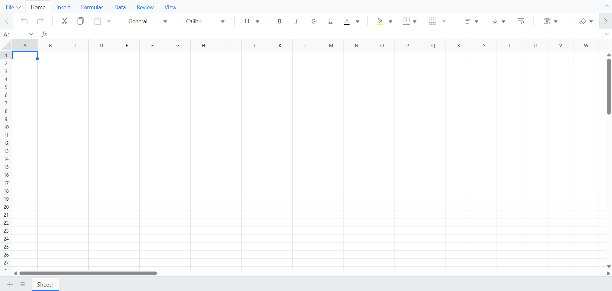

# Create a React Spreadsheet Application with Agentic UI Builder

This guide shows you how to create a [React Spreadsheet Editor](https://www.syncfusion.com/spreadsheet-editor-sdk/react-spreadsheet-editor) component simply by typing what you want using natural language commands — with the [**Syncfusion® React Agentic UI Builder**](https://www.syncfusion.com/explore/mcp-servers/) (powered by Syncfusion's MCP Server). Just describe it, and the tool builds the complete implementation of the spreadsheet component for you.

### Prerequisite
- Make sure the **React Agentic UI Builder** is installed in your IDE. Refer to the official [Getting Started](https://ej2.syncfusion.com/react/documentation/mcp-server/agentic-ui-builder/getting-started) and [installation guide](https://ej2.syncfusion.com/react/documentation/mcp-server/installation).
- Ensure you have a [React project](https://help.syncfusion.com/document-processing/excel/spreadsheet/react/getting-started) set up (JavaScript or TypeScript, any supported version) before using the Agentic UI Builder.

### Usage

Once installed, open your React project in your preferred IDE, launch the AI assistant, and describe what you want to build using the ```#sf_react_ui_builder``` command, as shown below:

**Example:**

```
#sf_react_ui_builder Create an empty React Spreadsheet using the Bootstrap 5 theme. Install the required packages, import the theme CSS in the correct order, and initialize the spreadsheet.
```

The UI Builder delivers full implementations, covering layout, components, and styling. The following illustration shows the generated output:



### Individual Tools

You can directly invoke individual tools by name for more targeted assistance (especially useful for specialized tasks). In addition to the main UI Builder, tools like `layout`, `style`, and `component` are available. For more details, see the [individual tools documentation](https://ej2.syncfusion.com/react/documentation/mcp-server/agentic-ui-builder/getting-started#individual-tools).

### Tips & Best Practices

- Enable **Agent mode** in your IDE for smooth, multi-step execution with confirmation prompts.
- Use higher-capability models (**Claude Sonnet 4.5 or newer, GPT-5**) as they typically produce more accurate, higher-quality code.

### Troubleshooting

- If a step times out or becomes unresponsive, cancel it and retry the current step.
- If the generated code does not match expectations, refine your prompt and run the command again.
- Always review the generated code and commands before accepting or applying them in production.

### See also

- To explore customization options for layouts, components, styles, and more examples of effective prompts, refer to the [prompt Library](https://ej2.syncfusion.com/react/documentation/mcp-server/agentic-ui-builder/prompt-library).