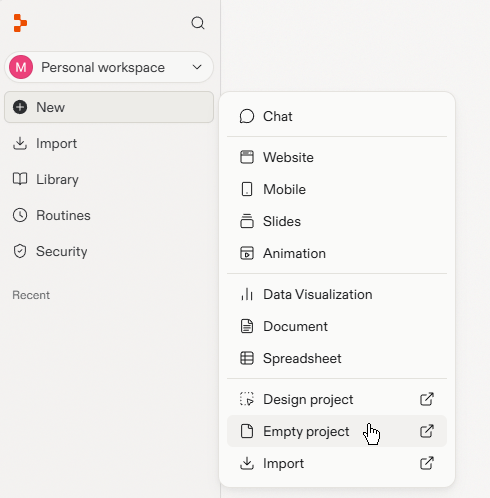
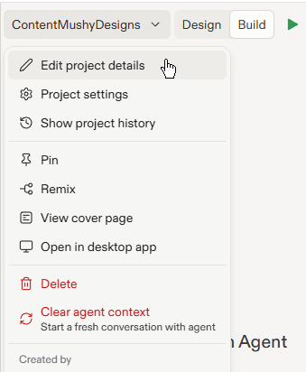
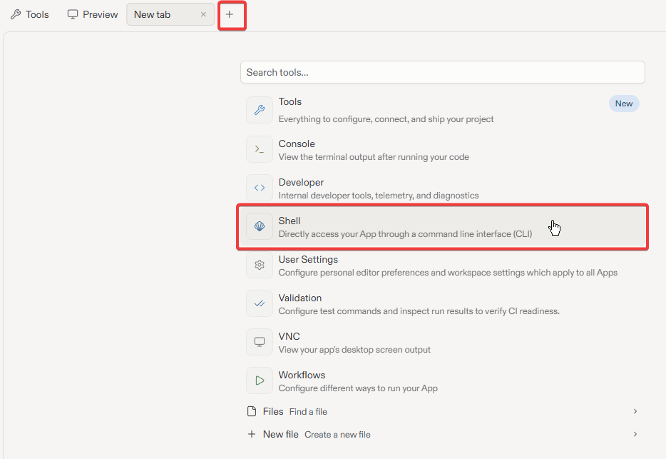
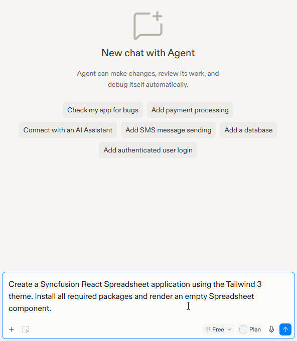
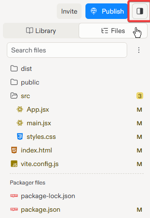
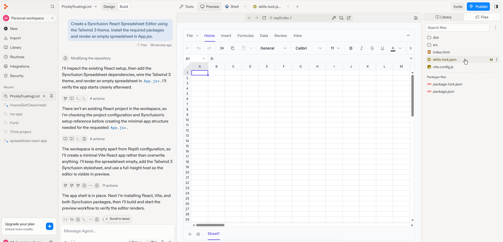
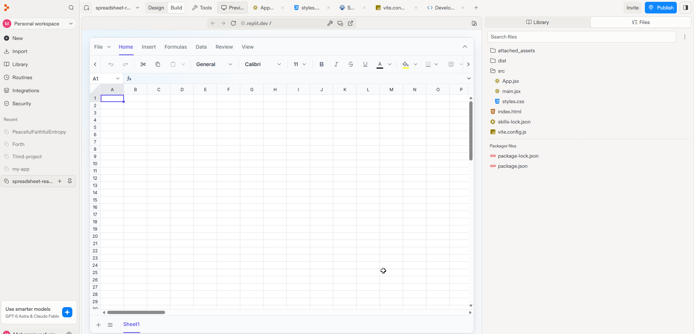

# Getting Started with React Spreadsheet in Replit

This section provides a step-by-step guide for setting up a React application in [Replit](https://replit.com) and integrating the [Syncfusion® React Spreadsheet Editor](https://www.syncfusion.com/spreadsheet-editor-sdk/react-spreadsheet-editor) component — without installing any local tools.

## What is Replit?

[Replit](https://replit.com) is a browser-based, AI-powered development environment (agentic UI builder) that lets you write, run, and deploy applications entirely in the cloud. It requires no local setup and is well suited for users who are new to software development, or who want to prototype and iterate quickly without configuring local development tools.

## Prerequisites

Before getting started, ensure the following:

* A free or paid [Replit account](https://replit.com).
* A valid [**Syncfusion license key**](https://help.syncfusion.com/document-processing/licensing/overview) (licensed or trial).

> **Note:** No local Node.js, npm, or IDE installation is required. All development happens inside the Replit browser environment.

## Create an Empty Project in Replit

1. Sign in to [Replit](https://replit.com).
2. Click **New** and Select **Empty project**. <br/><br/>

3. Replit creates an empty project with a default generated name.
4. To rename the project, click the project name dropdown located at the top of the Replit workspace, select **Edit project details**, and enter a name such as `spreadsheet-app`. <br/><br/>


## Create a React Spreadsheet Application in Replit

This section explains how to add a simple React Spreadsheet application to the current Replit project and integrate the [React Spreadsheet Editor](https://www.syncfusion.com/spreadsheet-editor-sdk/react-spreadsheet-editor) component with the minimum required setup using either of the following approaches.

Before proceeding, click the **+** icon in the tab bar and select **Shell** from the new tab. The Shell is required for both the Agent Skills and Vite CLI approaches described in the following sections.







## Install Syncfusion® React Spreadsheet Editor SDK Skills

In the Shell tab, run the following command to install the Syncfusion® React Spreadsheet Editor SDK [skills](https://github.com/syncfusion/spreadsheet-editor-sdk-skills/tree/master/skills/syncfusion-react-spreadsheet-editor):




npx skills add syncfusion/spreadsheet-editor-sdk-skills --skill syncfusion-react-spreadsheet-editor




## How Syncfusion® Spreadsheet Editor SDK Skills Work

Once skills are installed, the Replit Agent automatically:

1. **Reads the skill files** — The agent retrieves component APIs, best practices, and code patterns from the installed Syncfusion skills.
2. **Grounds code generation** — The agent uses skill-based knowledge instead of generic AI suggestions, ensuring accurate Syncfusion APIs and patterns.
3. **Generates production-ready code** — The agent generates complete, working implementations that can be directly integrated into your application.
4. **Enforces best practices** — The agent recommends correct packages, proper license registration, theme setup, and configuration.

## Use the Replit Agent with Skills

Once skills are installed, the Replit Agent can generate Spreadsheet component code automatically. Open the **Replit Agent** panel and enter a prompt such as:

**Example Prompts:**

```
Create a Syncfusion React Spreadsheet application using the Tailwind 3 theme. Install all required packages and render an empty Spreadsheet component.
```



The agent will:
- Create a React application.
- Install the required Syncfusion packages (@syncfusion/ej2-react-spreadsheet, @syncfusion/ej2-tailwind3-theme, etc.)
- Register the license key before component initialization if mentioned
- Import the theme CSS in the correct file
- Generate the complete Spreadsheet component implementation with your requested features
- Create sample data and configuration based on your requirements

You can use the agent to apply different spreadsheet actions by entering prompts for data validation, formatting, conditional formatting, open/save operations, and other Spreadsheet features.

**Review and Modify:** Review the generated code by opening the **Library** panel on the right side. Click the **Files** tab to view all project files. Then, click on files like `src/App.jsx`, `src/main.jsx`, and `src/index.css` to view and edit the generated code if needed. You can also press **Ctrl + Shift + L** to quickly toggle the Library panel.



## Run the Application

Once the agent finishes generating the application code, click the **Run** button (▶) at the top of the Replit workspace. The React Spreadsheet Editor application will be built and rendered in the preview pane, as shown below.



For more information about Spreadsheet Editor SDK Skills, including:
- See Supported platforms
- Comprehensive example prompts
- Troubleshooting tips

See [Agent Skills in Spreadsheet Editor SDK](../../../../Skills/spreadsheet-editor-sdk/component-skills.md)



## Initialize a React Application with Vite

In the Shell, run the following commands to create a new React application named `spreadsheet-app` using Vite:




npm create vite@latest spreadsheet-app -- --template react
cd spreadsheet-app




npm create vite@latest spreadsheet-app -- --template react-ts
cd spreadsheet-app




When prompted, confirm the installation by pressing **Enter**. This scaffolds a React Vite project in your current Replit workspace.

After the project is created, open the **Library** panel on the right side of the workspace. You can open it by clicking the **Open Library** option or by pressing **Ctrl + Shift + L** on your keyboard. Then, click the **Files** tab to view, create, edit, and manage the generated project files, such as `src/App.jsx`, `src/main.jsx`, `package.json`, and `vite.config.js`.


## Install Dependencies

Run the following command to install the generated project dependencies:

```bash
npm install
```

## Install Syncfusion® React Spreadsheet Packages

Install the Syncfusion React Spreadsheet component package:

```bash
npm install @syncfusion/ej2-react-spreadsheet --save
```

## Register the Syncfusion® License Key

Open `src/main.jsx` (or `src/main.tsx` for TypeScript) and add the license registration before the `createRoot` call:




import { registerLicense } from '@syncfusion/ej2-base';
registerLicense('YOUR_LICENSE_KEY');





import { registerLicense } from '@syncfusion/ej2-base';
registerLicense('YOUR_LICENSE_KEY');




Replace `YOUR_LICENSE_KEY` with your actual Syncfusion license key. See [How to generate a Syncfusion license key](https://help.syncfusion.com/document-processing/licensing/how-to-generate) for more details.

## Import the Required CSS Styles

Themes for Spreadsheet can be applied using CSS or SASS files from the [npm theme packages](https://ej2.syncfusion.com/react/documentation/appearance/theme#theme-packages), CDN, CRG, or [Theme Studio](https://ej2.syncfusion.com/react/documentation/appearance/theme-studio). For more information, see the [themes documentation](https://ej2.syncfusion.com/react/documentation/appearance/theme).

This guide uses the `Tailwind 3` theme as an example. Install the theme package:

```bash
npm install @syncfusion/ej2-tailwind3-theme
```

Open `src/index.css` and replace the existing content with the theme import:

```css
@import '../node_modules/@syncfusion/ej2-tailwind3-theme/styles/spreadsheet/index.css';
```

## Add the Syncfusion® React Spreadsheet Component

Open `src/App.jsx` (or `src/App.tsx` for TypeScript) and replace the existing content with the following:





import { SpreadsheetComponent } from '@syncfusion/ej2-react-spreadsheet';

export default function App() {
    return (<SpreadsheetComponent openUrl='https://document.syncfusion.com/web-services/spreadsheet-editor/api/spreadsheet/open' 
                saveUrl='https://document.syncfusion.com/web-services/spreadsheet-editor/api/spreadsheet/save' />);
}






import { SpreadsheetComponent } from '@syncfusion/ej2-react-spreadsheet';

export default function App(): JSX.Element {
  return (<SpreadsheetComponent openUrl='https://document.syncfusion.com/web-services/spreadsheet-editor/api/spreadsheet/open' 
            saveUrl='https://document.syncfusion.com/web-services/spreadsheet-editor/api/spreadsheet/save' />);
}





> **Note:** The [`openUrl`](https://ej2.syncfusion.com/react/documentation/api/spreadsheet/index-default#openurl) and [`saveUrl`](https://ej2.syncfusion.com/react/documentation/api/spreadsheet/index-default#saveurl) endpoints used in this example are provided only for demonstration purposes. For development and production use, we strongly recommend configuring your own local or hosted web service for the Open and Save actions instead of relying on the online demo service. For more information, refer to the [`Web Services`](https://help.syncfusion.com/document-processing/excel/spreadsheet/react/web-services/webservice-overview) section.

## Run the Application

Click the **Run** button (▶) at the top of the Replit workspace. Once the application starts running, the React Spreadsheet Editor is rendered in the preview pane, as shown below.







## Key Features to Explore

Once your Spreadsheet is running, you can enhance it with:

- **Data Binding**: Bind data from APIs, databases, or CSV files
- **Formulas**: Add Excel-like formulas for calculations
- **Cell Formatting**: Apply styles, colors, and borders
- **Data Validation**: Restrict data entry with validation rules
- **Filters & Sorting**: Enable filtering and sorting on columns
- **Charts**: Visualize data with built-in chart support
- **Export/Import**: Save and load Excel files

## Tips for working in Replit

* **Shell access:** Use the **Shell** tab to run any `npm` commands, such as installing additional packages or starting/stopping the dev server manually.
* **Persistent storage:** Replit persists your project files automatically. Changes are saved as you type.
* **View and manage project files:** Use the **Library** panel to access applications, documents, images, and other resources generated by Replit Agent. To view and edit project files, switch to the **Files** tab. You can also use the **...** (More options) menu to create, edit, and manage files. Press **Ctrl + Shift + L** to quickly open the Library panel.

## Environment Variables in Replit

If you need to store sensitive information (API keys, database URLs), use Replit Secrets:

1. Click the **Secrets** icon (lock icon) in the left sidebar
2. Add your secret with a key and value (e.g., `SYNCFUSION_LICENSE_KEY=your_key_here`)
3. Access it in your code using `process.env.SYNCFUSION_LICENSE_KEY`

## Publish the Application in Replit

Replit allows you to publish your application to a live public URL without leaving the browser. To deploy your application:

1. Click the **Publish** button in the top-right corner of the Replit workspace.

    **Note:** Publishing options and availability depend on your Replit plan. Replit automatically recommends the most appropriate publishing option based on your project type. For the latest publishing guidance, refer to the [Replit documentation](https://docs.replit.com/home/publish-the-site).

2. Once the publishing process is complete, Replit provides a public URL, such as `https://syncfusion-spreadsheet-app.<your-username>.replit.app`, that you can share with users.

## Troubleshooting

| Issue | Resolution |
|---|---|
| **Preview shows "Your app is not running"** | If the issue persists, Open the Agent panel and enter error text in preview<br/><br/>My Vite React app is not starting in Preview. Check the workflow, start the development server, and fix any runtime errors.
| **Preview shows "Blocked request. This host is not allowed"** | Open the Agent panel and enter error text in preview <br/> <br/>The preview shows "Blocked request. This host is not allowed\". Update vite.config.js to allow Replit hosts by configuring server.allowedHosts or server.host and restart the application.|
| **Blank output / component not visible** | Ensure the theme CSS is imported in `App.css` and that `App.css` is imported in `App.jsx`. |
| **License warning banner** | Verify that `registerLicense` is called before `createRoot` in `main.jsx`. |
| **Module not found errors** | Open the Shell and run `npm install` to restore all dependencies. |
| **Shell commands not working** | Wait for Replit to finish booting the environment, then retry. |
| **Slow first load** | Replit free-tier Repls may take a few seconds to wake up after inactivity. |

## See also

* [Getting Started with React Spreadsheet](../getting-started.md)
* [Agent Skills in Spreadsheet Editor SDK](../../../../Skills/spreadsheet-editor-sdk/component-skills.md)
* [Replit documentation](https://docs.replit.com/)
