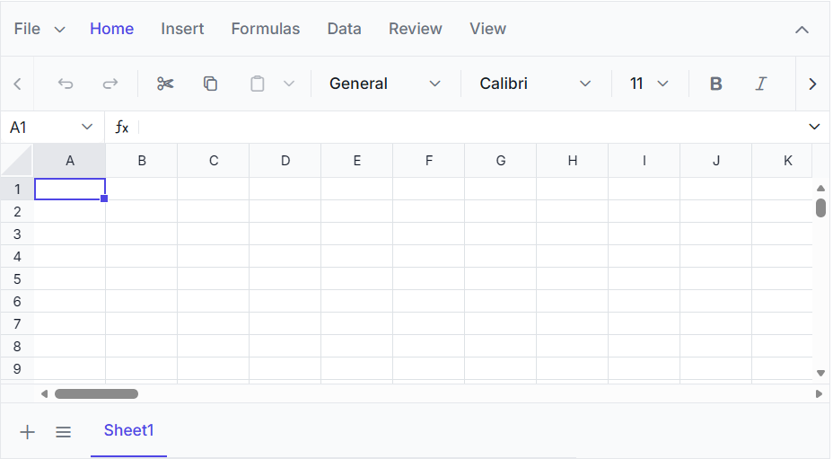

# Getting Started with React Spreadsheet

This section explains how to create a simple React application and add the [React Spreadsheet Editor](https://www.syncfusion.com/spreadsheet-editor-sdk/react-spreadsheet-editor) component with the minimum required setup.





## Prerequisites

- [Node.js 24+](https://nodejs.org/en) (LTS recommended).
- Syncfusion CLI.

## Install the Syncfusion CLI 

Install the Syncfusion CLI globally using the following command:



npm install -g @syncfusion/syncfusion-cli



## Set up the Vite project using Syncfusion CLI

You can create a React Vite application using the Syncfusion CLI. The CLI provides two ways to create a project:

### Non-interactive mode

Non-interactive mode allows you to create a project directly using a single command with the required command-line arguments.



sf new my-app --framework react --type ts --template spreadsheet-editor --theme tailwind3



In this mode, the project configuration is passed directly in the command. The above command creates a React Vite application configured with the Syncfusion<sup style="font-size:70%">&reg;</sup> `Spreadsheet Editor` component.

### Interactive mode

Interactive mode guides you through the project creation process with step-by-step prompts.



sf



When you run the `sf` command, the CLI prompts you to select the required project configuration. To create a React Vite application with the Syncfusion<sup style="font-size:70%">&reg;</sup> `Spreadsheet Editor` component, select the following options:




√ Project name? ... my-app
√ Choose Framework: » React
√ Choose Build Tool: » Vite
√ Choose Language: » TypeScript
√ Choose Template: » Spreadsheet Editor
√ Choose Theme: » Tailwind3
√ Choose Style Format: » CSS
√ Would you like to integrate the Syncfusion MCP Server (AI Assistant) into this project? ... no
√ Would you like to install Syncfusion Component Skills for AI-powered development? ... no      
√ Install dependencies and start app now? ... no




The above selections generate a React Vite application configured with the Syncfusion<sup style="font-size:70%">&reg;</sup> `Spreadsheet Editor` component. You can choose different values for language, theme, style format, MCP setup, and skills installation based on your project requirements.

The Syncfusion<sup style="font-size:70%">&reg;</sup> CLI creates the project with a predefined template. After the project is generated, you can customize or replace the component code based on your application requirements.

## Run the project

Once the project is created, navigate to the project directory and run the following commands in your terminal.



cd my-app
npm install
npm run dev



The output will appear as follows:






## Prerequisites

[System requirements for React components](https://ej2.syncfusion.com/react/documentation/system-requirement)

## Create a React application

Use [`Vite`](https://vite.dev/guide/) to create a new React application, as it provides a faster development environment, smaller bundle sizes, and optimized builds.

To create a new React application, run one of the following commands based on your preferred environment.




npm create vite@latest spreadsheet-app -- --template react
cd spreadsheet-app




npm create vite@latest spreadsheet-app -- --template react-ts
cd spreadsheet-app




## Install the Syncfusion® React Spreadsheet package

Install the [Syncfusion® React Spreadsheet](https://www.npmjs.com/package/@syncfusion/ej2-react-spreadsheet) package from npm using the following command:

```
npm install @syncfusion/ej2-react-spreadsheet
```

## Register a Syncfusion License Key

Before initializing the Syncfusion React Spreadsheet component, generate a Syncfusion license key and register it in the application.

- [Generate a Syncfusion License Key](https://help.syncfusion.com/document-processing/licensing/how-to-generate)
- [Register a Syncfusion License Key in a React Application](https://help.syncfusion.com/document-processing/licensing/how-to-register-in-an-application#reactjs)

## Add CSS references

Add the following Spreadsheet and dependent component styles to `src/index.css` file. Replace the existing content with the theme import code below.

```css
@import '@syncfusion/ej2-base/styles/tailwind3.css';
@import '@syncfusion/ej2-inputs/styles/tailwind3.css';
@import '@syncfusion/ej2-buttons/styles/tailwind3.css';
@import '@syncfusion/ej2-splitbuttons/styles/tailwind3.css';
@import '@syncfusion/ej2-lists/styles/tailwind3.css';
@import '@syncfusion/ej2-navigations/styles/tailwind3.css';
@import '@syncfusion/ej2-popups/styles/tailwind3.css';
@import '@syncfusion/ej2-dropdowns/styles/tailwind3.css';
@import '@syncfusion/ej2-grids/styles/tailwind3.css';
@import '@syncfusion/ej2-react-spreadsheet/styles/tailwind3.css';
```

> **Note:** This example uses the `Tailwind3` theme. To use a different built-in theme, replace the `tailwind3.css` references with the corresponding theme stylesheets. Refer to the [Themes documentation](https://ej2.syncfusion.com/react/documentation/appearance/theme) for information about the available themes and the different ways to include theme styles in a React application.

## Add the Syncfusion® React Spreadsheet component

Import and render the `SpreadsheetComponent` in `src/App.jsx` or `src/App.tsx`. Replace the existing content with the following code.





import { SpreadsheetComponent } from '@syncfusion/ej2-react-spreadsheet';

export default function App() {
    return (<SpreadsheetComponent openUrl='https://document.syncfusion.com/web-services/spreadsheet-editor/api/spreadsheet/open' 
                saveUrl='https://document.syncfusion.com/web-services/spreadsheet-editor/api/spreadsheet/save' />);
}






import { SpreadsheetComponent } from '@syncfusion/ej2-react-spreadsheet';

export default function App() {
  return (<SpreadsheetComponent openUrl='https://document.syncfusion.com/web-services/spreadsheet-editor/api/spreadsheet/open' 
            saveUrl='https://document.syncfusion.com/web-services/spreadsheet-editor/api/spreadsheet/save' />);
}





> **Note:** The [`openUrl`](https://ej2.syncfusion.com/react/documentation/api/spreadsheet/index-default#openurl) and [`saveUrl`](https://ej2.syncfusion.com/react/documentation/api/spreadsheet/index-default#saveurl) endpoints used in this example are provided only for demonstration purposes. For development and production use, we strongly recommend configuring your own local or hosted web service for the Open and Save actions instead of relying on the online demo service. For more information, refer to the [`Web Services`](https://help.syncfusion.com/document-processing/excel/spreadsheet/react/web-services/webservice-overview) section.

## Run the application

Run the following command to start the development server:

```
npm run dev
```

After the application starts, open the localhost URL shown in the terminal to view the React Spreadsheet Editor in the browser. The output will appear as follows:







You can also explore the Spreadsheet interactively using the live sample below.



> [View Sample in GitHub](https://github.com/SyncfusionExamples/getting-started-with-the-react-spreadsheet-component) to explore the complete source code.

## Video tutorial

To get started quickly with React Spreadsheet, you can watch this video:




## See also

* [Open Excel files](./open-excel-files)
* [Save Excel files](./save-excel-files)
* [Web Services](./web-services/webservice-overview)
* [Data Binding](./data-binding)