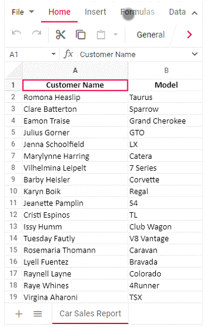

# Mobile responsiveness in React Spreadsheet component

The Spreadsheet control rendered in desktop mode becomes adaptive on mobile devices where the layout adjusts according to the parent element’s dimensions to accommodate different screen resolutions.

## Adaptive Behavior

- Ribbon header, ribbon content, and sheet tab overflow are accessible using touch and swipe action.
- A navigation arrow appears at the end of the ribbon content to move to overflowed items. When the rightmost end is reached, the arrow converts to a left navigation arrow to move back.

## Touch gestures
- Use horizontal swipe gestures to reveal overflowed ribbon items.
- Tap the navigation arrows to jump to the next/previous segment of the ribbon content.

