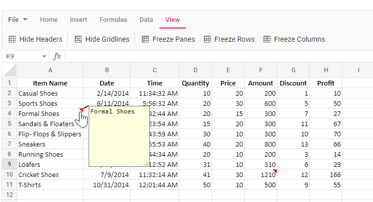
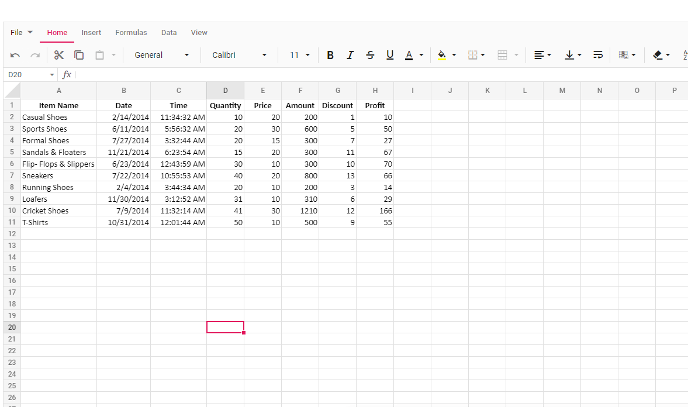
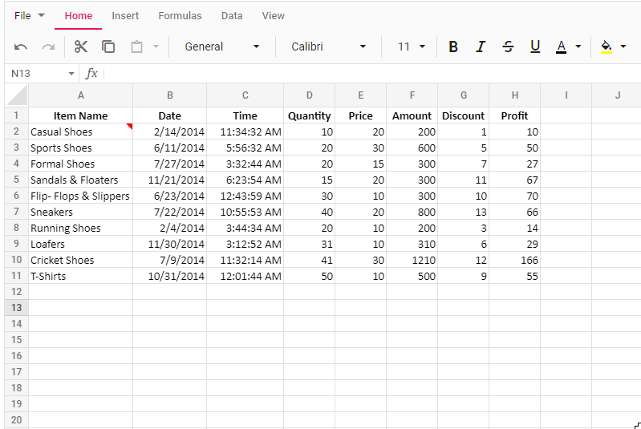
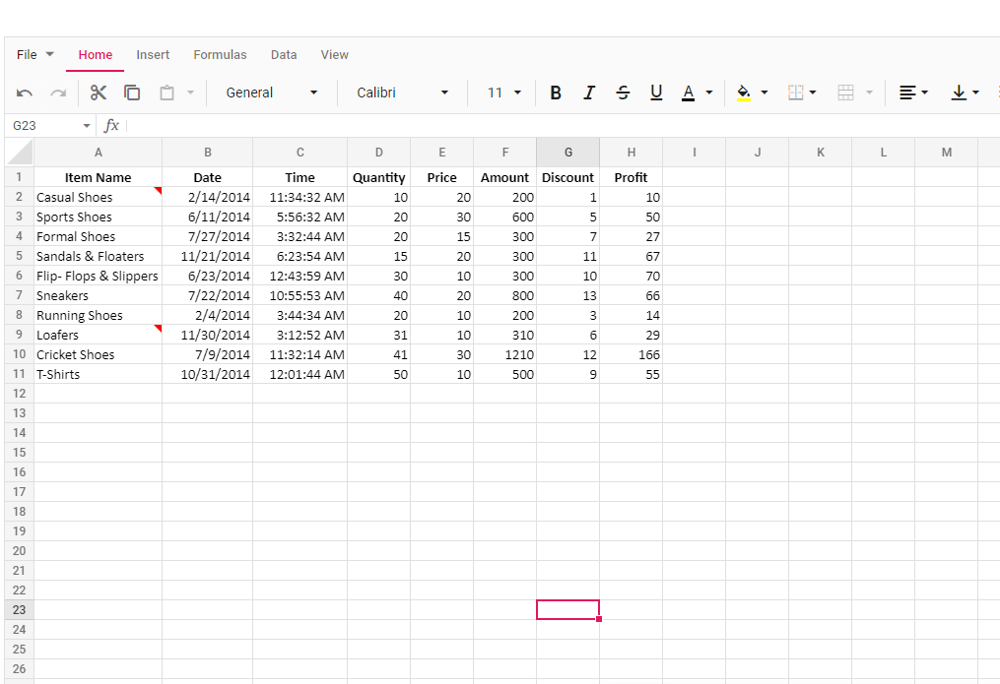
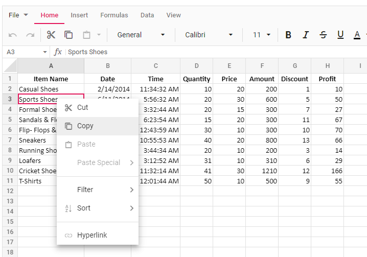

# Notes in React Spreadsheet component

The **Notes** feature is used to insert comments, provide feedback, suggest changes, or leave remarks on specific cells while reviewing documents in the Spreadsheet. You can enable or disable the notes functionality using the [enableNotes](https://ej2.syncfusion.com/react/documentation/api/spreadsheet/index-default#enablenotes) property, which defaults to **true**.

* When opening an Excel document with notes, they are displayed in the Spreadsheet control.
* Cells containing notes are marked with a small red triangle in the top-right corner. Hovering over these cells shows the note content.

In the below example, you can add, edit, save, and delete notes.










 

## Adding a note

In the active worksheet, you can add a note in the following ways:

* **Context Menu**: Right-click the desired cell and select **Add Note**.
* **Ribbon**: Select the cell, navigate to the **Review** tab, click the **Notes** dropdown, and select **Add Note**.
* **Keyboard Shortcut**: Select the cell and press <kbd>Shift</kbd> + <kbd>F2</kbd>.
* **Programmatically**: 
    * Use the `updateCell` method with the note model to add a note to a specific cell.
    * Bind notes via code-behind during initial load by associating the note model with the cell model.

A dialog box will open where you can enter the note content. After entering the content, you can either click on other cells or press the <kbd>Esc</kbd> button to automatically save the note and close the dialog box.

## Editing a note

In the active worksheet, you can modify the content of existing notes in the document:

* **Context Menu**: Right-click the cell containing the note and select **Edit Note**.
* **Ribbon**: Select the cell containing the note, navigate to the **Review** tab, click the **Notes** dropdown, and select **Edit Note**.
* **Keyboard Shortcut**: Select the cell containing the note and press <kbd>Shift</kbd> + <kbd>F2</kbd>.

The note editor dialog box will open with the existing content. After editing the content, you can either click on other cells or press the <kbd>Esc</kbd> button to automatically save the changes and close the dialog box.

## Deleting a note

You can remove notes from cells using the following ways:

* **Context Menu**: Right-click the cell containing the note and select **Delete Note**.
* **Ribbon**: Select the cell containing the note, navigate to the **Review** tab, click the **Notes** dropdown, and select **Delete Note**.

The note will be removed from the cell, and the red triangle indicator will be removed.

## Navigating Between Notes

The Syncfusion React Spreadsheet makes it easy to move between cells that contain notes.  
Navigation options are available in the **Notes** dropdown under the **Review** tab.

### Previous Note
To navigate to the previous note:
* Go to the **Review** tab, open the **Notes** dropdown, and select **Previous Note**.
* The Spreadsheet will highlight the previous note in the current worksheet, searching leftward and then upward.
* If no earlier note exists in the sheet, the search continues in the previous worksheet.
* If the workbook has no notes, the selection stays on the current cell.

### Next Note
To navigate to the next note:
* Go to the **Review** tab, open the **Notes** dropdown, and select **Next Note**.
* The Spreadsheet will highlight the next note in the current worksheet, searching rightward and then downward.
* If no later note exists in the sheet, the search continues in the next worksheet.
* If the workbook has no notes, the selection stays on the current cell.

This navigation feature streamlines reviewing by letting you jump directly between notes across worksheets.  
It ensures efficient traversal, so you don’t miss any feedback or comments while working through your document.

## Show/Hide Note

The **Show/Hide Note** option allows you to toggle the visibility of individual notes as sticky notes within the worksheet. When enabled, the note appears as a persistent floating text box, making it convenient to reference key information without hovering over the cell.

To toggle the visibility of a note:

* **Context Menu**: Right-click the cell containing the note and select **Show/Hide Note**.
* **Ribbon**: Select the cell, go to the **Review** tab, click the **Notes** dropdown, and choose **Show/Hide Note**.

**Behavior:**

* **Default State (Hidden)**: Notes are hidden by default and only appear when hovering over the cell, which displays a red triangle indicator.
* **Sticky State (Visible)**: Toggling Show/Hide Note on a hidden note makes it visible as a sticky note, which remains on display even when navigating to other cells or selections.
* **Toggle Functionality**: Selecting Show/Hide Note again on a visible note hides it, reverting to the default state.
* **Independent Control**: Each note can be toggled individually, allowing you to display only the most relevant notes for your current task.

## Show All Notes

The **Show All Notes** option enables you to display all notes in the current worksheet simultaneously as sticky notes, simplifying the review of multiple comments at a glance.

To activate:

* Navigate to the **Review** tab, click the **Notes** dropdown, and select **Show All Notes**.

All notes in the worksheet will appear as floating text boxes near their respective cells.

> **Note**: After using Show All Notes, you can hide individual notes selectively via the **Show/Hide Note** option. Additionally, any new notes added to the worksheet will automatically appear as visible sticky notes when Show All Notes is active.

This functionality improves workflow by giving you flexible control over note visibility—whether focusing on one cell or reviewing all feedback at once.

## Saving the Document with Notes

You can save and export Spreadsheet data along with notes into an Excel document.  
To do this, go to **File > Save As** in the ribbon menu.  

Notes are preserved when exporting to:
* **Microsoft Excel (.xlsx)**  
* **Microsoft Excel 97–2003 (.xls)**  

Notes are **not** included when exporting to:
* **Comma Separated Values (.csv)**  
* **Excel Macro-Enabled Workbook (.xlsm)**  
* **Excel Binary Workbook (.xlsb)**  
* **PDF Document (.pdf)**  

## Disabling notes

To disable the note functionality, you need to set the [enableNotes](https://ej2.syncfusion.com/react/documentation/api/spreadsheet/index-default#enablenotes) property to **false**. 

* Notes in the document will not be displayed when opened in the Spreadsheet when `enableNotes` set to `false`.  
* The **Add Note** option will be removed from the context menu. 
* Keyboard shortcuts related to notes will no longer work. 

In the below example, the note functionality is disabled in the Spreadsheet.










 

## Integrating Notes During Initial Loading and Using Cell Data Binding

You can add notes to cells initially when the Spreadsheet loads by using **cell data binding**.  
This is done through the `notes` property in the cell settings.

* Define the `notes` property inside the cell configuration.  
* When the Spreadsheet initializes, the notes will automatically appear in the specified cells.  
* Each cell can have its own note content bound through the model.

In the below example, you can navigate between notes using **Previous Note** and **Next Note** options, toggle individual note visibility with **Show/Hide Note**, display all notes at once using **Show All Notes** and see how notes are added using the `updateCell` method in the `created` event.










 

## Limitations

* When importing the document with notes, the formatting of the content in the notes will not be available. Similarly, while adding notes, we cannot apply formatting to them.
* The style and appearance of the dialog box for the notes, including size, color, border, and other elements, cannot be directly changed.
* Exporting the workbook along with notes is not supported in file formats such as Comma Separated Values (.csv), Excel Macro-Enabled Workbook (.xlsm), Excel Binary Workbook (.xlsb), and PDF Document (.pdf).
* Notes added outside the used ranges of the worksheet will not be included in the exported document.
