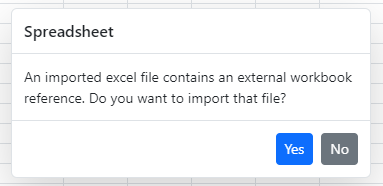

# Open Excel Files in Syncfusion React Spreadsheet

The Syncfusion React Spreadsheet allows you to open Excel files (.xlsx) by reading the file, converting it into the client‑side Spreadsheet model, and rendering it with full support for data, styles, formats, and more.

To enable opening Excel files, set the [`allowOpen`](https://ej2.syncfusion.com/react/documentation/api/spreadsheet/index-default#allowopen) property to **true** and specify the service url using th [`openUrl`](https://ej2.syncfusion.com/react/documentation/api/spreadsheet/index-default#openurl) property. The control will send the uploaded file to this endpoint, where it is processed and returned as JSON for the Spreadsheet to render.

For a quick walkthrough on how the open functionality works, refer to the following video:


## UI options to open Excel files

In user interface you can open an Excel document by clicking `File > Open` menu item in ribbon.

The following sample shows the `Open` option by using the [`openUrl`](https://ej2.syncfusion.com/react/documentation/api/spreadsheet/index-default#openurl) property in the Spreadsheet control. You can also use the [`beforeOpen`](https://ej2.syncfusion.com/react/documentation/api/spreadsheet/index-default#beforeopen) event to trigger before opening an Excel file.












Please find the below table for the beforeOpen event arguments.

 | **Parameter** | **Type** | **Description** |
| ----- | ----- | ----- |
| file | FileList or string or File | To get the file stream. `FileList` -  contains length and item index. <br/> `File` - specifies the file lastModified and file name. |
| cancel | boolean | To prevent the open operation. |
| requestData | object |  To provide the Form data. |

> * Use `Ctrl + O` keyboard shortcut to open Excel documents.
> * The default value of the [allowOpen](https://ej2.syncfusion.com/react/documentation/api/spreadsheet/index-default#allowopen) property is `true`. For demonstration purpose, we have showcased the [allowOpen](https://ej2.syncfusion.com/react/documentation/api/spreadsheet/index-default#allowopen) property in previous code snippet.

## Open Excel files programmatically

To open Excel files programmatically in the Spreadsheet, you can use the [`open`](https://ej2.syncfusion.com/react/documentation/api/spreadsheet/index-default#open) method of the Spreadsheet component. Before invoking this method, ensure that the [`openUrl`](https://ej2.syncfusion.com/react/documentation/api/spreadsheet/index-default#openurl) property is properly configured, as it is required for processing the file on the server.

The following code example demonstrates how to open an Excel file programmatically in the Spreadsheet.

```js
import React, { useRef } from 'react';
import { createRoot } from 'react-dom/client';
import { SpreadsheetComponent } from '@syncfusion/ej2-react-spreadsheet';

const App = () => {
  const spreadsheetRef = useRef(null);

  const onCreated = () => {
    fetch('https://js.syncfusion.com/demos/ejservices/data/Spreadsheet/LargeData.xlsx')
      .then((response) => response.blob())
      .then((fileBlob) => {
        const file = new File([fileBlob], 'Sample.xlsx');
        spreadsheetRef.current?.open({ file });
      });
  };

  return (
    <SpreadsheetComponent
      ref={spreadsheetRef}
      created={onCreated}
      openUrl="https://document.syncfusion.com/web-services/spreadsheet-editor/api/spreadsheet/open"
      saveUrl="https://document.syncfusion.com/web-services/spreadsheet-editor/api/spreadsheet/save"
    />
  );
};

export default App;

const root = createRoot(document.getElementById('spreadsheet'));
root.render(<App />);
```

## Supported Excel file formats for Open

The following Excel file formats are supported for opening in the Spreadsheet component:

* Microsoft Excel Workbook (.xlsx)
* Microsoft Excel 97–2003 Workbook (.xls)
* Comma-Separated Values (.csv)
* Excel Macro‑Enabled Workbook (.xlsm)
* Excel Binary Workbook (.xlsb)

## Import options

### Open Excel files from local system

If you explore your machine to select and upload an Excel document using the file uploader, you will receive the uploaded document as a raw file in the [success](https://ej2.syncfusion.com/react/documentation/api/uploader/index-default#success) event of the file uploader. In this `success` event, you should pass the received raw file as an argument to the Spreadsheet's [open](https://ej2.syncfusion.com/react/documentation/api/spreadsheet/index-default#open) method to see the appropriate output.

The following code example shows how to import an Excel document using file uploader in spreadsheet.












### Open Excel files from URL

You can achieve to access the remote Excel file by using the [`created`](https://ej2.syncfusion.com/react/documentation/api/spreadsheet/index-default#created) event. In this event you can fetch the Excel file and convert it to a blob. Convert this blob to a file and [`open`](https://ej2.syncfusion.com/react/documentation/api/spreadsheet/index-default#open) this file by using Spreadsheet component open method.










 

### Open Excel files from Blob data

By default, the Spreadsheet component provides an option to browse files from the local file system and open them within the component. If you want to open an Excel file from blob data, you need to fetch the blob data from the server or another source and convert this blob data into a `File` object. Then, you can use the [open](https://ej2.syncfusion.com/react/documentation/api/spreadsheet/#open) method in the Spreadsheet component to load that `File` object.

Please find the code to fetch the blob data and load it into the Spreadsheet component below.












### Load server-side Excel files into Spreadsheet

By default, the Spreadsheet component provides an option to browse files from the local file system and open them within the component. If you want to load an Excel file located on a server, you need to configure the server endpoint to fetch the Excel file from the server location, process it using `Syncfusion.EJ2.Spreadsheet.AspNet.Core`, and send it back to the client side as `JSON data`. On the client side, you should use the [openFromJson](https://ej2.syncfusion.com/react/documentation/api/spreadsheet/index-default#openfromjson) method to load that `JSON data` into the Spreadsheet component.

**Server Endpoint**:

```csharp
    public IActionResult Open([FromBody] FileOptions options)
    {
        OpenRequest open = new OpenRequest();
        string filePath = _env.ContentRootPath.ToString() + "\\Files\\" + options.FileName + ".xlsx";
        // Getting the file stream from the file path.
        FileStream fileStream = new FileStream(filePath, FileMode.Open);
        // Converting "MemoryStream" to "IFormFile".
        IFormFile formFile = new FormFile(fileStream, 0, fileStream.Length, "", options.FileName + ".xlsx"); 
        open.File = formFile;
        // Processing the Excel file and return the workbook JSON.
        var result = Workbook.Open(open);
        fileStream.Close();
        return Content(result);
    }

    public class FileOptions
    {
        public string FileName { get; set; } = string.Empty;
    }
```

**Client Side**:

```js

    // Fetch call to server to load the Excel file.
    fetch('https://localhost:{{Your_port_number}}/Home/Open', {
        method: 'POST',
        headers: {
            'Content-Type': 'application/json',
        },
        body: JSON.stringify({ FileName: 'Sample' }),
    })
    .then((response) => response.json())
    .then((data) => {
            // Load the JSON data into spreadsheet.
            spreadsheet.openFromJson({ file: data });
    })

```

You can find the server endpoint code to fetch and process the Excel file in this [attachment](https://www.syncfusion.com/downloads/support/directtrac/general/ze/WebApplication1_(1)-880363187). After launching the server endpoint, you need to update the URL on the client side sample as shown below.

```js
// To open an Excel file from the server.
fetch('https://localhost:{{port_number}}/Home/Open')
```

### Open Excel files with AWS Lambda

Before proceeding with the opening process, you should deploy the spreadsheet open/save web API service in AWS Lambda. To host the open/save web service in the AWS Lambda environment, please refer to the following KB documentation.

[How to deploy a spreadsheet open and save web API service to AWS Lambda](https://support.syncfusion.com/kb/article/17184/how-to-deploy-a-spreadsheet-open-and-save-web-api-service-to-aws-lambda)

After deployment, you will get the AWS service URL for the open and save actions. Before opening the Excel file with this hosted open URL, you need to prevent the default file opening process to avoid getting a corrupted file on the open service end. The spreadsheet component appends the file to the `formData` and sends it to the open service, which causes the file to get corrupted. To prevent this, set the `args.cancel` value to `true` in the [`beforeOpen`](https://ej2.syncfusion.com/react/documentation/api/spreadsheet/index-default#beforeopen) event. After that, you will get the selected file in the `beforeOpen` event argument. Then, convert this file into a base64 string and send it to the open service URL using a fetch request.

On the open service end, convert the base64 string back to a file and pass it as an argument to the workbook `Open` method. The open service will process the file and return the spreadsheet data in JSON format. You will then receive this JSON data in the fetch success callback. Finally, use the [openFromJson](https://ej2.syncfusion.com/react/documentation/api/spreadsheet/index-default#openfromjson) method to load this JSON data into the spreadsheet component.

The following code example shows how to open an Excel file using a hosted web service in AWS Lambda, as mentioned above.

```js
function Default() {
    let spreadsheet;
    const beforeOpenHandler = (eventArgs) => {
        eventArgs.cancel = true; // To prevent the default open action.
        if (eventArgs.file) {
            const reader = new FileReader();
            reader.readAsDataURL(eventArgs.file);
            reader.onload = () => {
                // Removing the xlsx file content-type.
                const base64Data = reader.result.replace('data:application/vnd.openxmlformats-officedocument.spreadsheetml.sheet;base64,', '');
                openExcel({
                    file: base64Data,
                    extension: eventArgs.file.name.slice(eventArgs.file.name.lastIndexOf('.') + 1),
                    password: eventArgs.password || ''
                });
            };
        }
    };
    const openExcel = (requestData) => {
        // Fetch call to AWS server for open processing.
        fetch('https://xxxxxxxxxxxxxxxxxx.amazonaws.com/Prod/api/spreadsheet/open', {
            method: 'POST',
            headers: {
                'Accept': 'application/json, text/plain',
                'Content-Type': 'application/json;charset=UTF-8'
            },
            body: JSON.stringify(requestData)
        }).then((response) => {
            if (response.ok) {
                return response.json();
            }
        }).then((data) => {
            // Loading the JSON data into our spreadsheet.
            if (data.Workbook && data.Workbook.sheets) {
                spreadsheet.openFromJson({ file: data });
            }
        }).catch((error) => {
            console.log(error);
        });
    };
    return (<div className='control-pane'>
            <div className='control-section spreadsheet-control'>
                <SpreadsheetComponent openUrl='https://xxxxxxxxxxxxxxxxxx.amazonaws.com/Prod/api/spreadsheet/open' ref={(ssObj) => { spreadsheet = ssObj; }} beforeOpen={beforeOpenHandler}>
                </SpreadsheetComponent>
            </div>
        </div>);
}
export default Default;
```

```csharp
public IActionResult Open(OpenOptions openOptions)
{
    // Convert the base64 string to bytes array.
    byte[] bytes = Convert.FromBase64String(openOptions.File);
    // Loading the bytes array to stream.
    MemoryStream stream = new MemoryStream(bytes);
    OpenRequest open = new OpenRequest();
    // Converting the stream into FormFile.
    open.File = new FormFile(stream, 0, bytes.Length, "Sample", "Sample." + openOptions.Extension);
    if (string.IsNullOrEmpty(openOptions.Password))
        open.Password = openOptions.Password;
    var result = Workbook.Open(open);
    return Content(result);
}

public class OpenOptions
{
    public string File { get; set; } = string.Empty;
    public string Password { get; set; } = string.Empty;
    public string Extension { get; set; } = string.Empty;
}
```

### Open Base64-encoded Excel data

In the Syncfusion<sup style="font-size:70%">&reg;</sup> Spreadsheet component, there is no direct option to open data as a `Base64` string. To achieve this, the `import()` function fetches the `Base64` string, converts it to a Blob, creates a File object from the Blob, and then opens it using the [open](https://ej2.syncfusion.com/react/documentation/api/spreadsheet/index-default#open) method in the spreadsheet.

The following code example shows how to open the spreadsheet data as base64 string.













### Open Excel files in read-only mode

You can open Excel file into a read-only mode by using the [`openComplete`](https://ej2.syncfusion.com/react/documentation/api/spreadsheet/index-default#opencomplete) event. In this event, you must protect all the sheets and lock its used range cells by using [`protectSheet`](https://ej2.syncfusion.com/react/documentation/api/spreadsheet/index-default#protectsheet) and [`lockCells`](https://ej2.syncfusion.com/react/documentation/api/spreadsheet/index-default#lockcells) methods.













## Advanced Open options

### Configure JSON deserialization

Previously, when opening a workbook JSON object into the Spreadsheet using the [openFromJson](https://ej2.syncfusion.com/react/documentation/api/spreadsheet/index-default#openfromjson) method, the entire workbook, including all features specified in the JSON object, was processed and loaded into the Spreadsheet. 

Now, you have the option to selectively ignore some features during the opening of the JSON object by configuring deserialization options and passing them as arguments to the `openFromJson` method. This argument is optional, and if not configured, the entire workbook JSON object will be loaded without ignoring any features.

```ts
spreadsheet.openFromJson({ file: file }, { ignoreStyle: true });
```

| Options | Description |
| ----- | ----- |
| onlyValues |  If **true**, only the cell values will be loaded. |
| ignoreStyle | If **true**, styles will be excluded when loading the JSON data. |
| ignoreFormula | If **true**, formulas will be excluded when loading the JSON data. |
| ignoreFormat | If **true**, number formats will be excluded when loading the JSON data. |
| ignoreConditionalFormat | If **true**, conditional formatting will be excluded when loading the JSON data. |
| ignoreValidation | If **true**, data validation rules will be excluded when loading the JSON data. |
| ignoreFreezePane | If **true**, freeze panes will be excluded when loading the JSON data. |
| ignoreWrap | If **true**, text wrapping settings will be excluded when loading the JSON data. |
| ignoreChart | If **true**, charts will be excluded when loading the JSON data. |
| ignoreImage | If **true**, images will be excluded when loading the JSON data. |
| ignoreNote | If **true**, notes will be excluded when loading the JSON data. |

The following code snippet demonstrates how to configure the deserialization options and pass them as arguments to the openFromJson method:












### Optimize Open performance with parsing options

Opening large Excel files into the React Spreadsheet can sometimes lead to slower performance and increased memory usage. This is often caused by the processing of additional elements such as styles and number formats—even when the actual data content is minimal. For example, an Excel file with only a small amount of data but a large number of styled or formatted empty cells can significantly impact load time and memory consumption.

To address this, we've introduced parsing options that allow users to selectively skip non-essential features during the open process. By enabling options like `IgnoreStyle` and `IgnoreFormat`, you can reduce the amount of data processed, resulting in:
* Faster load times
* Lower memory usage
* Smaller JSON responses

These enhancements are especially beneficial for users working with large or complex Excel files, offering a more efficient and responsive experience.

> **Note:** These options are ideal when styles and number formats are not critical to your use case and the focus is on loading the actual data efficiently. 

The code example below demonstrates how to configure the `IgnoreStyle` and `IgnoreFormat` parsing options on the `server-side`.

**Code Snippet:**

**Server-Side Configuration:**
```csharp
public IActionResult Open(IFormCollection openRequest) 
{ 
    OpenRequest open = new OpenRequest();
    ...
    open.ParseOptions = new WorkbookParseOptions() { 
        IgnoreStyle = true, 
        IgnoreFormat = true
    }; 
    ...
    return Content(Workbook.Open(open)); 
} 
```

### Open large Excel files with chunk response processing

When opening large Excel files with many features and data, the server response can become very large. This might cause memory issues or connection problems during data transmission. The `Chunk Response Processing` feature solves this by dividing the server response into smaller parts, called chunks, and sending them to the client in parallel. The client receives these chunks and combines them to load the Excel data smoothly into the spreadsheet.

You can enable this feature by setting the [`chunkSize`](https://ej2.syncfusion.com/react/documentation/api/spreadsheet/opensettings#chunksize) property in the [`openSettings`](https://ej2.syncfusion.com/react/documentation/api/spreadsheet/index-default#opensettings) object. Set the [`chunkSize`](https://ej2.syncfusion.com/react/documentation/api/spreadsheet/opensettings#chunksize) to a value greater than 0 (in bytes). The [`chunkSize`](https://ej2.syncfusion.com/react/documentation/api/spreadsheet/opensettings#chunksize) defines how large each chunk will be. Make sure your server supports chunked responses to use this feature effectively.

> This feature reduces memory usage on both the server and client, ensuring that resources are managed efficiently during data transmission. By sending smaller parts of data, it prevents connection issues that could occur with large payloads, making the transmission process more reliable. Additionally, it allows large Excel files to be loaded smoothly into the spreadsheet, providing a seamless user experience even with extensive data.

The following code example demonstrates the client-side and server-side configuration required for handling chunk-based responses when opening an Excel file.

**Client Side**:

```js
import { SpreadsheetComponent } from '@syncfusion/ej2-react-spreadsheet';

const App = () => {

  const spreadsheetRef = React.useRef(null);
  const openSettings = {
    // Specifies the size (in bytes) of each chunk for the server response when opening a document.
    chunkSize: 1000000,
    // Specifies the number of retry attempts for a failed server request when returning the opened file responses in chunks.
    // This ensures reliable handling of temporary network or server disruptions during the chunked response process.
    retryCount: 3,
    // Specifies the delay (in milliseconds) before retrying a failed server request when returning the opened file responses in chunks.
    // This ensures controlled retries in case of temporary network or server disruptions during the chunked response process.
    retryAfterDelay: 500
  }

  const openUrl = 'https://localhost:{{port_number}}/Home/Open';

  return (
    <div className='control-section spreadsheet-control'>
      <SpreadsheetComponent openUrl={openUrl} openSettings={openSettings} ref={spreadsheetRef}>
      </SpreadsheetComponent>
    </div>
  );
}

export default App;
```

**Server Endpoint**:

```csharp
public IActionResult Open(IFormCollection openRequest)
{
    OpenRequest open = new OpenRequest();
    if (openRequest.Files.Count > 0)
    {
        open.File = openRequest.Files[0];
    }
    Microsoft.Extensions.Primitives.StringValues chunkPayload;
    if (openRequest.TryGetValue("chunkPayload", out chunkPayload))
    {
        // The chunk payload JSON data includes information essential for processing chunked responses.
        open.ChunkPayload = chunkPayload;
    }
    var result = Workbook.Open(open, 150);
    return Content(result);
}
```

The [attachment](https://www.syncfusion.com/downloads/support/directtrac/general/ze/WebApplication1_7-101537213) includes the server endpoint code for handling chunk-based open processing. After launching the server endpoint, update the `openUrl` property of the spreadsheet in the client-side sample with the server URL, as shown below.

```js
    // Specifies the service URL for processing the Excel file, converting it into a format suitable for loading in the spreadsheet.
    <SpreadsheetComponent ref={spreadsheetRef} openUrl="https://localhost:{{port_number}}/Home/Open">
    </SpreadsheetComponent>
```

## Customization

### Add custom headers to Open requests

You can add your own custom header to the open action in the Spreadsheet. For processing the data, it has to be sent from server to client side and adding customer header can provide privacy to the data with the help of Authorization Token. Through the [`beforeOpen`](https://ej2.syncfusion.com/react/documentation/api/spreadsheet/index-default#beforeopen) event, the custom header can be added to the request during open action.












### Handle external workbook reference confirmation

When you open an Excel file that contains external workbook references, you will see a confirmation dialog. This dialog allows you to either continue with the file opening or cancel the operation. This confirmation dialog will appear only if you set the `AllowExternalWorkbook` property value to **false** during the open request, as shown below. This prevents the spreadsheet from displaying inconsistent data.

```csharp
public IActionResult Open(IFormCollection openRequest)
    {
        OpenRequest open = new OpenRequest();
        open.AllowExternalWorkbook = false;
        open.File = openRequest.Files[0];
        return Content(Workbook.Open(open));
    }
```

> This feature is only applicable when importing an Excel file and not when loading JSON data or binding cell data.



## Server configuration

In the Spreadsheet component, Excel import processing is handled on the `server‑side`. Therefore, to enable Excel importing in your application, you need to configure a server using any of the following web service technologies:

* WebAPI
* WCF Service
* ASP.NET MVC Controller Action

The following code example demonstrates how to configure the server using a `WebAPI` service.

```csharp

    [Route("api/[controller]")]
    public class SpreadsheetController : Controller
    {
        //To open Excel file
        [AcceptVerbs("Post")]
        [HttpPost]
        [EnableCors("AllowAllOrigins")]
        [Route("Open")]
        public IActionResult Open(IFormCollection openRequest)
        {
            OpenRequest open = new OpenRequest();
            open.File = openRequest.Files[0];
            return Content(Workbook.Open(open));
        }
    }
```

## Server dependencies

Open helper functions are shipped in the Syncfusion.EJ2.Spreadsheet package, which is available in Essential Studio<sup style="font-size:70%">&reg;</sup> and [`nuget.org`](https://www.nuget.org/). Following list of dependencies required for Spreadsheet open and save operations.

* Syncfusion.EJ2
* Syncfusion.EJ2.Spreadsheet
* Syncfusion.Compression.Base
* Syncfusion.XlsIO.Base

And also refer [this](https://help.syncfusion.com/document-processing/excel/spreadsheet/asp-net-core/open-save#server-dependencies) for more information.