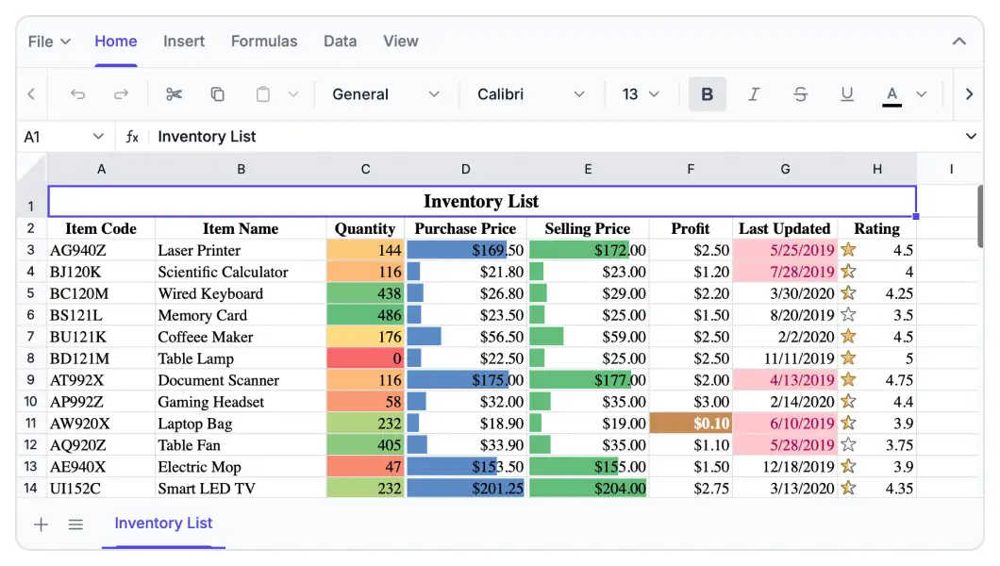

# Overview of the React Spreadsheet Component

The [React Spreadsheet Editor](https://www.syncfusion.com/spreadsheet-editor-sdk/react-spreadsheet-editor) is an user interactive component to organize and analyze data in tabular format with configuration options for customization. It will load data by importing an Excel/CSV file or from local and remote data sources such as JSON, RESTful services, OData services, and more. The populated data can be exported as Excel with XLSX, XLS, CSV and PDF formats.

## Key features

* [Data sources](data-binding): Bind the Spreadsheet component with an array of objects or data from a web service using `DataManager`.
* [Virtualization](scrolling-and-virtualization#virtual-scrolling): Provides the option to load large amount of data without performance degradation.
* [Selection](selection): Provides the option to select a cell or range of cells.
* [Editing](cell-ranges-and-operations/editing): Provides the option to dynamically edit a cell.
* [Formulas](formulas-and-calculations): Provides built-in calculation library with pre-defined formulas and named range support.
* [Clipboard](cell-ranges-and-operations/clipboard): Provides the option to perform clipboard operations.
* [Cell formatting](formatting/text-cell-formatting): Provides the option to customize the appearance of cells.
* [Number formatting](formatting/number-formatting): Provides the option to format the cell value.
* [Open](./open-excel-files): Provides the option to open Excel and CSV files in Spreadsheet.
* [Save](./save-excel-files): Provides the option to save Spreadsheet data as Excel, CSV, and PDF documents.
* [Sorting](sort): Helps you to arrange the data to particular order in a selected range of cells.
* [Filtering](filter): Helps you to view specific rows in the Spreadsheet by hiding the other rows.
* [Undo Redo](undo-redo): Provides the option to perform undo redo operations in Spreadsheet.
* [Hyperlink](link): Provides the option to navigate to web link or cell reference within the sheet or to other sheet in Spreadsheet.
* [Resize](mobile-responsiveness): Allows you to change the row height and column width. Auto fit the rows and columns based on its content.
* [Wrap text](cell-ranges-and-operations/wrap-text): Provides the option to display the large content as multiple lines in a single cell.
* [Data validation](./data-validation): Provides the option to validate edited values based on data validation rules defined for a cell or range of cells.
* [Find and replace](searching): Provides the option to find the data and replace it across all sheets in Spreadsheet.
* [Protect sheet](protect-sheet): Provides the option to restrict user actions like cell editing, row and column insertion, deletion, and resizing.
* [Borders](formatting/text-cell-formatting#borders): Provides the option to customize cell gridlines such as color and its style for enhanced UI.
* [Show/hide](worksheet#sheet-visibility): Provides the option to show/hide rows, columns and sheets.
* [Insert/delete](rows-and-columns/insert-rows-and-columns): Provides the option to insert/delete rows, columns and sheets.
* [Merge cells](cell-ranges-and-operations/merge-cells): Provides the option to combine two or more cells located in the same row or column into a single cell.
* [Conditional formatting](formatting/conditional-formatting): Provides the option to format a cell or range of cells based on conditions applied.
* [Autofill](cell-ranges-and-operations/autofill): Provides the option to fill or copy a series or pattern of values and formats into adjacent cells in any direction.
* [Clear](cell-ranges-and-operations/clear): Provides the option to clear the content, formats, and hyperlinks applied to a cell or range of cells in a Spreadsheet.
* [Aggregates](formulas-and-calculations): Provides the option to check the sum, average, count, and more for the selected cells or range in the sheet.
* [Picture](images-and-illustrations/overview): Allows you to view, insert, and modify a picture in a Spreadsheet with customizing options.
* [Chart](charts-and-visualizations/overview): Transforms your Spreadsheet data to an intuitive overview for better understanding and to make smart business decisions.
* [Freeze panes](rows-and-columns/freeze-pane): Allows you to keep the specified rows and columns always visible at the top and left side of the sheet while scrolling through the sheet.
* [Password protection](protect-sheet#protect-workbook): Allows you to protect the workbook with a password.
* [Multi-line editing](cell-ranges-and-operations/editing): Allows you to insert a line break between paragraphs of the text within a cell in a Spreadsheet.
* [Calculate range selection](selection): Helps you to select a range or multiple ranges when editing a formula in a cell.
* [Right-to-left (RTL)](global-local#right-to-left-rtl): Aligns content in the Spreadsheet component from right to left.
* [Templates](template): Templates can be used to create custom user experiences in the Spreadsheet.
* [Globalization](global-local): Personalize the Spreadsheet component with different languages, as well as culture-specific number, date, and time formatting.
* [Accessibility](accessibility): Provides with built-in accessibility support which helps to access all the Spreadsheet component features through the keyboard, screen readers, or other assistive technology devices.