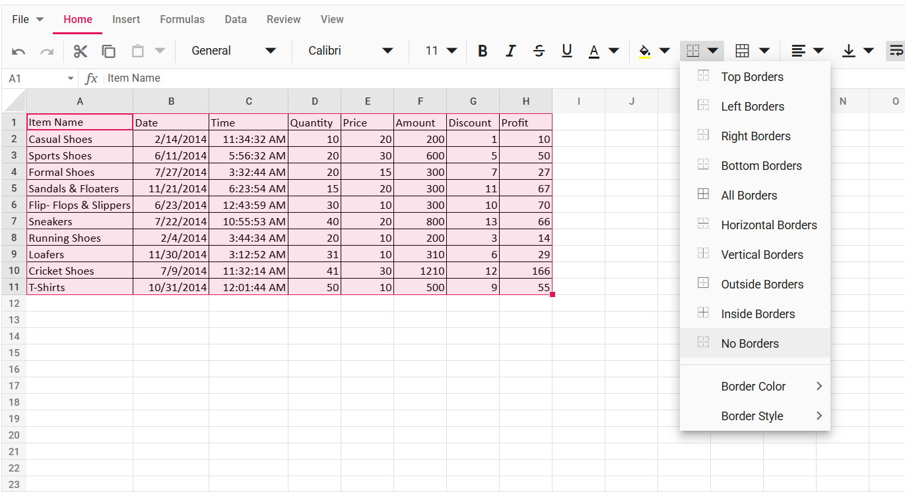

## Cell Styling and Text Formatting

Text and cell formatting improves the appearance of your spreadsheet and helps highlight specific cells or ranges. You can apply formats such as font size, font family, font color, text alignment, borders, and more. Use the [`allowCellFormatting`](https://ej2.syncfusion.com/react/documentation/api/spreadsheet#allowcellformatting) property to enable or disable text and cell formatting in the Spreadsheet.  

You can set formats in the following ways:  
* Use the [style](https://ej2.syncfusion.com/react/documentation/api/spreadsheet/cell#style) property to apply formats to each cell during the initial load.
* Use the [`cellFormat`](https://ej2.syncfusion.com/react/documentation/api/spreadsheet#cellformat) method to apply formats to a cell or range of cells dynamically.  
* Apply formatting directly by clicking the desired format option from the ribbon toolbar.

### Fonts

Various font formats supported in the spreadsheet are font-family, font-size, bold, italic, strike-through, underline and font color.

### Text Alignment

You can align text in a cell either vertically or horizontally using the  [`textAlign`](https://ej2.syncfusion.com/react/documentation/api/spreadsheet/textalign) and [verticalAlign](https://ej2.syncfusion.com/react/documentation/api/spreadsheet/verticalalign) property.

### Indents

To enhance the appearance of text in a cell, you can change the indentation of a cell content using [textIndent](https://ej2.syncfusion.com/react/documentation/api/spreadsheet/cellstylemodel#textindent) property.

### Fill color

To highlight cell or range of cells from whole workbook you can apply background color for a cell using [backgroundColor](https://ej2.syncfusion.com/react/documentation/api/spreadsheet/cellstylemodel#backgroundcolor) property.

The following code example shows the style formatting in text and cells of the spreadsheet.


















### Borders

The Syncfusion React Spreadsheet component allows you to apply borders to a cell or a range of cells. Borders help you separate sections, highlight data, or format tables clearly in your worksheet. You can apply borders in different styles, sizes, and colors based on your needs.

#### Border Types

The Spreadsheet supports many types of borders. Each type adds a border to a specific side or area of the selected cells:

| Types | Actions |
|-------|---------|
| **Top Border** | Specifies the top border of a cell or range of cells.|
| **Left Border** | Specifies the left border of a cell or range of cells.|
| **Right Border** | Specifies the right border of a cell or range of cells.|
| **Bottom Border** | Specifies the bottom border of a cell or range of cells.|
| **No Border** | Used to clear the border from a cell or range of cells.|
| **All Border** | Specifies all border of a cell or range of cells.|
| **Horizontal Border** | Specifies the top and bottom border of a cell or range of cells.|
| **Vertical Border** | Specifies the left and right border of a cell or range of cells.|
| **Outside Border** | Specifies the outside border of a range of cells.|
| **Inside Border** | Specifies the inside border of a range of cells.|

#### Customize Border Colors and Styles

You can also change how the border looks by adjusting its size and style. The Spreadsheet supports the following options:

| Types | Actions |
|-------|---------|
| **Thin** | Specifies the `1px` border size (default).|
| **Medium** | Specifies the `2px` border size.|
| **Thick** | Specifies the `3px` border size.|
| **Solid** | Used to create the `solid` border (default).|
| **Dashed** | Used to create the `dashed` border.|
| **Dotted** | Used to create the `dotted` border.|
| **Double** | Used to create the `double` border.|

Borders can be applied in the following ways,

- Using the `border`, `borderLeft`, `borderRight`, `borderBottom` properties, you can set the desired border to each cell at initial load. The [border](https://ej2.syncfusion.com/react/documentation/api/spreadsheet/cellstylemodel#border) property is part of  [CellStyleModel](https://ej2.syncfusion.com/react/documentation/api/spreadsheet/cellstylemodel) and is applied via the cell's `style` object.
- Using the [setBorder](https://ej2.syncfusion.com/react/documentation/api/spreadsheet/index-default#setborder) method, you can set various border options to a cell or range of cells.
- Selecting the border options from the ribbon toolbar.

The following code sample shows how to apply different typed border, colors and styles in the Spreadsheet.


















#### Remove Borders

To remove the border style on the target cells, use the UI "No Border" option in the ribbon.

 

### Limitations of Formatting

The following features are not supported in Formatting:

* Insert row/column between the formatting applied cells.
* Formatting support for row/column.

## Note

You can refer to our [React Spreadsheet](https://www.syncfusion.com/spreadsheet-editor-sdk/react-spreadsheet-editor) feature tour page for feature highlights. You can also explore our [React Spreadsheet example](https://www.syncfusion.com/spreadsheet-editor-sdk/react-spreadsheet-editor) to learn how to present and manipulate data.

## See Also
* [Formatting Cells](./formatting)
* [Number Formatting](./number-formatting)
* [Conditional Formatting](./conditional-formatting)
* [Cell Range](./cell-range)
