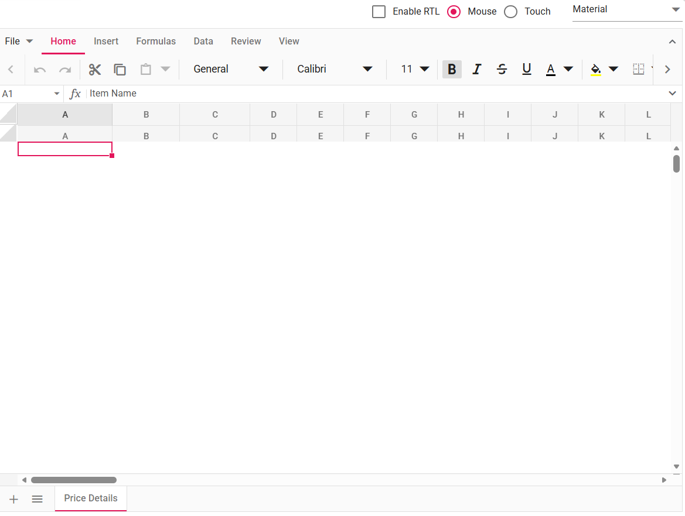

# Double Header Rendering Issue in React Spreadsheet Component

In some scenarios, the Spreadsheet header appears twice or is rendered below the data instead of at the top. This typically occurs when multiple refresh or resize actions are triggered simultaneously or in rapid succession.

**Common cause:**
```js
  this.spreadsheet.refresh();
  this.spreadsheet.resize(); // Multiple operations queued without waiting
```

The image below illustrates the double header rendering issue:



---
## Troubleshooting checklist (in order)

Follow these steps in order to diagnose and fix the double-header issue:

1. **Ensure only one refresh/resize at a time:** Avoid triggering multiple `refresh()` or `resize()` actions simultaneously or before previous operations complete.

2. **Avoid refresh in rapid UI updates:** Do not call `refresh()` during frequent UI updates, loops, or multiple event triggers.

3. **Use lifecycle events carefully:** Use event handlers (`created`, `actionComplete`, etc.) without redundant `refresh()` or `resize()` calls.

4. **Verify package version:** Ensure you are using the latest version of the Spreadsheet package. Known issues related to double headers may already be resolved in newer versions.

5. **Initialization & mounts:** Ensure the Spreadsheet component is initialized only once and that no duplicate mounts occur in your application.

6. **Inspect frozen panes and merged cells:** If your Spreadsheet uses frozen panes, hidden rows, or merged cells, verify these features aren't interfering with header rendering.

7. **Inspect CSS/layout issues:** Use browser developer tools to inspect and rule out CSS-related issues (position, z-index, transforms) that may visually duplicate or misplace the header.

---

## See Also

* [Performance Best Practices](../performance-best-practices)
* [Resize handling](../mobile-responsiveness)
* [Freeze Panes](../freeze-pane)
