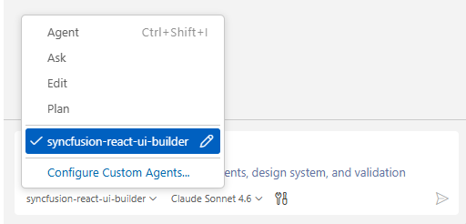

# Syncfusion® React UI Builder Skill with Spreadsheet for AI Assistants

**Syncfusion® React UI Builder Skill** is an AI-powered agent skill that accelerates React Spreadsheet development by transforming natural-language UI requirements into production-ready code using Syncfusion® React components.

Integrated with your AI-powered IDE, it leverages deep knowledge of **Syncfusion® Spreadsheet** and other React components to deliver accurate and ready-to-use code.
By combining intelligent code generation with best practices, accessibility standards, and design-system consistency, React UI Builder helps you rapidly build scalable spreadsheet applications and user interfaces without leaving your development workflow.

## Prerequisites

Before installing React UI Builder Skill with Spreadsheet, ensure the following:

- Install [APM (Agent Package Manager)](https://microsoft.github.io/apm/getting-started/installation/#quick-install-recommended)
- Required [Node.js](https://nodejs.org/en) version ≥ 18
- React application (existing or new); see [Quick Start](https://ej2.syncfusion.com/react/documentation/getting-started/quick-start)
- A supported AI agent or IDE that integrates with the Skills (VS Code, Cursor, Syncfusion® Code Studio, etc.)
- Active Syncfusion<sup style="font-size:70%">&reg;</sup> license(any of the following):  
  - [Commercial](https://www.syncfusion.com/sales/unlimitedlicense)  
  - [Community License](https://www.syncfusion.com/products/communitylicense)  
  - [Free Trial](https://www.syncfusion.com/account/manage-trials/start-trials)

## Key Benefits

### **AI-Driven UI Generation**
- Transforms prompts into fully developed React components rather than just partial code snippets.
- Automatically selects appropriate Syncfusion® components and Spreadsheet features.
- Produces structured, maintainable code.

### **Component Usage & API Accuracy**
- Uses correct Syncfusion® Spreadsheet APIs
- Injects required feature modules (editing, formulas, data binding, charting, etc.)
- Avoids unsupported or deprecated patterns

### **Patterns & Best Practices**
- Recommended component composition and state management
- Event handling aligned with React standards
- Secure and scalable coding patterns

### **Accessibility & Responsiveness**
- WCAG 2.1 AA–aligned output
- Semantic HTML with ARIA support where applicable
- Mobile-first responsive layouts and graceful degradation for small screens

### **Design-System Integration**
- Supports Tailwind, Bootstrap, Material, or custom themes
- Ensures consistent Syncfusion® styling and theme usage

## Installation

Before installing React UI Builder Skill with Spreadsheet, ensure that APM (Agent Package Manager) is installed and available in your environment.

### Verify APM Installation

Run the following command to confirm APM is installed:

```bash
apm --version
```

### Install the Syncfusion® React UI Builder Skill with Spreadsheet package using APM

Use the APM CLI to install the React UI Builder Skill with Spreadsheet for your preferred environment:




apm install syncfusion/react-ui-builder -t copilot




apm install syncfusion/react-ui-builder -t cursor




apm install syncfusion/react-ui-builder -t codex




apm install syncfusion/react-ui-builder -t claude




After installation, the following artifacts are added to your project for the GitHub Copilot target:

- `.agent/skills/` – contains the skill files
- `.github/agents/` – contains the agent configuration

Refer to the [documentation](https://microsoft.github.io/apm/reference/cli/targets/#detection-signals) for details about supported deployment targets.

> For [Syncfusion® Code Studio](https://help.syncfusion.com/code-studio/reference/configure-properties/custom-agents#predefined-agents), use the Copilot command above to install the React UI Builder.

## How the Syncfusion® React UI Builder Skill Works with Spreadsheet

1. **Intent Analysis:** Parse the user's prompt to identify component types and high-level layout intent (grid, editor, data inspector, dashboard).
2. **Project Detection:** Automatically detects project framework, package manager, existing themes, and Spreadsheet configuration.
3. **Component Mapping:** Map intent to Syncfusion® Spreadsheet and React components, including required modules (ribbon, formula, import/export, cell-formatting).
4. **Theming & Design System**  
   Load required theming guidelines and confirm key design choices:
   - CSS framework (Tailwind, Bootstrap, Material, or Greenfield(custom theme)). If no themes detected in the existing project, Greenfield and Syncfusion Tailwind3 theme are shown as the default option.
   - Syncfusion theme (Tailwind3, Bootstrap5, Material3, fluent2)
    - Light and Dark Mode
   - Core design basics (colors, spacing, typography, responsiveness, accessibility)
5. **Code Generation:** Produce TypeScript React components with Spreadsheet integration, props interfaces, and CSS/styling scaffolding.
6. **Dependency Management:** Recommend or install required Syncfusion® packages and peer dependencies.
7. **Validation:** Run accessibility and basic security checks, request confirmation for changes.
8. **Code Insertion:** Create files or patch existing files following project structure and conventions.

Key enforcement points:

- Adds correct theme and CSS imports for chosen Syncfusion® themes
- Injects only the feature modules required by generated components (e.g., Formula, CellFormatting, DataValidation)
- Generates semantic HTML with keyboard and ARIA support where appropriate
- Avoids unsupported or deprecated API usages for Syncfusion® components

> The assistant handles most stages automatically and may request confirmation where required.

## Using the AI Assistant

After installing React UI Builder Skill with Spreadsheet and APM, the relevant agent and skill files are added to your project under:

- `.agent/skills/` (skill files)
- `.github/agents/` (React UI builder agent configuration, based on the selected target)

To start using the skill:

1.Open your supported IDE.
2.In the chat panel, select the `syncfusion-react-ui-builder` agent from the **Agent dropdown**.



3.Start prompting the agent with a clear description of your UI requirements.

> For Syncfusion® Code Studio, if the UI Builder agent is not shown, ensure that the agent location is configured to use it in the chat, and refer to the [documentation](https://help.syncfusion.com/code-studio/reference/configure-properties/usersettings#agent-file-locations) to configure the agent location properly.

**Example Prompts:**



Create a spreadsheet for managing project tasks with columns for task ID, task name, assignee, priority, status, start date, due date, and progress. Apply clear formatting with readable headers, aligned values, and date formatting. Add dropdown validation for priority and status fields. Use conditional formatting to highlight overdue tasks and high-priority items. Include formulas to calculate completion percentages and a summary section showing total tasks, completed tasks, and pending tasks. Adjust column widths for readability and make the layout suitable for team tracking.


Create a spreadsheet for managing customer support tickets with columns for ticket ID, customer name, issue category, priority, assigned agent, created date, resolution status, and resolution notes. Format the sheet with clear headers, readable alignment, and spacing so users can quickly scan and understand the data. Allow users to add notes or comments to individual cells to capture additional details for each ticket. Include charts to show how tickets are distributed based on their status, helping teams monitor workload at a glance. Keep the layout simple, structured, and easy to use for day-to-day support operations.



Generated code follows best practices with accessible, semantic HTML, responsive mobile-first layouts, strong TypeScript typing, and built-in security measures such as input validation and avoidance of embedded secrets.

## Best Practices

Follow these guidelines to get the most out of UI Builder and ensure high-quality production-ready results:

- **Stay consistent:** Maintain consistent file organization, naming conventions, and coding standards throughout your project.
- **Use advanced AI models:** For best results, use **Claude Sonnet 4.6 or higher** capability models to produce better code quality and more accurate implementations.
- **Review all content and assets before production:** Replace any placeholder images or icons with your brand assets. Also validate the logic, security, and compatibility with your existing code before deployment.

## Troubleshooting

- **APM installation failure**: Refer to this [documentation](https://microsoft.github.io/apm/getting-started/installation/#troubleshooting)

- **Skills not loading**: Ensure the **.agent/** and **.github/agents/** folders exist in your project and that the skill was installed successfully using APM. Verify that the correct agent is selected from the Agent dropdown in your IDE.

- **Component not rendering**: Retry generation using the specific component skill to resolve the issue, and ensure required Syncfusion® packages and themes are properly configured.

- **Syncfusion license banner appears**: Use the licensing skill to correctly register and validate your Syncfusion® license key in the application.


## FAQ

**Which agents/IDEs are supported?**
Any Skills-compatible agent that reads local skill files (Code Studio, VS Code, Cursor, etc.).

**Are skills loaded automatically?**  
Yes. Supported agents automatically load relevant skills based on your query.

**Can I customize the generated styles?**
Yes. The skill supports choosing Tailwind, Bootstrap, Material, or a custom theme; generated components include clear integration points for style adjustments.

**Does it modify files automatically?**
The skill proposes changes and requires confirmation for insertion; automatic dependency installation may be offered depending on agent permissions.

## See also

- [Agent Skills Standards](https://agentskills.io/home)
- [Agent Package Manager](https://microsoft.github.io/apm/getting-started/quick-start/)
