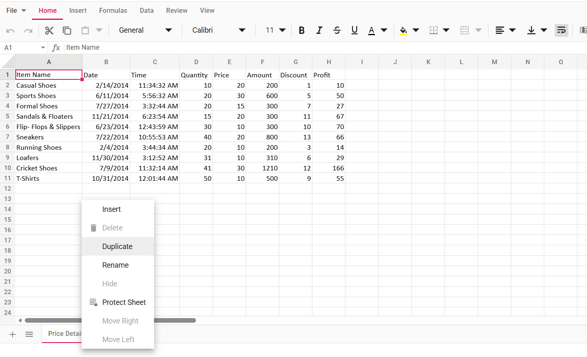
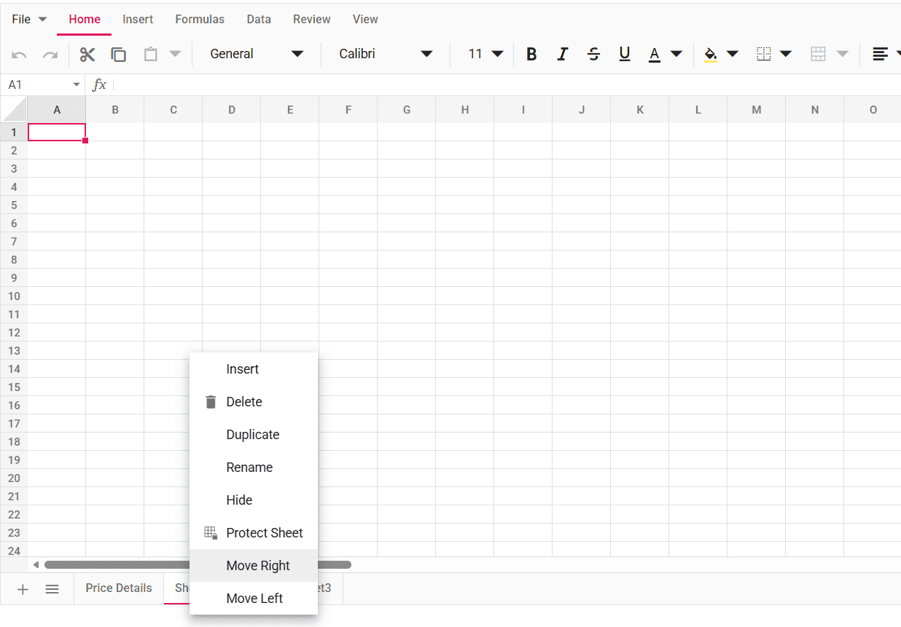

# Worksheet in React Spreadsheet component

Worksheet is a collection of cells organized in the form of rows and columns that allows you to store, format, and manipulate the data.

## Add sheet

You can dynamically add or insert a sheet by one of the following ways,

* Click the `Add Sheet` button in the sheet tab. This will add a new empty sheet next to current active sheet.
* Right-click on the sheet tab, and then select `Insert` option from the context menu to insert a new empty sheet before the current active sheet.
* Using [`insertSheet`](https://ej2.syncfusion.com/react/documentation/api/spreadsheet#insertsheet) method, you can insert one or more sheets at your desired index.

The following code example shows the insert sheet operation in spreadsheet.
















 

### Insert a sheet programmatically and make it active sheet 

A sheet is a collection of cells organized in the form of rows and columns that allows you to store, format, and manipulate the data. Using [insertSheet](https://ej2.syncfusion.com/react/documentation/api/spreadsheet#insertsheet) method, you can insert one or more sheets at the desired index. Then, you can make the inserted sheet as active sheet by focusing the start cell of that sheet using the [goTo](https://ej2.syncfusion.com/react/documentation/api/spreadsheet#goto) method.

The following code example shows how to insert a sheet programmatically and make it the active sheet.












## Delete sheet

The Spreadsheet has support for removing an existing worksheet. You can dynamically delete the existing sheet by the following way,

* Right-click on the sheet tab, and then select `Delete` option from context menu.
* Using [`delete`](https://ej2.syncfusion.com/react/documentation/api/spreadsheet#delete ) method to delete the sheets.

## Rename sheet

You can dynamically rename an existing worksheet in the following way,

* Right-click on the sheet tab, and then select `Rename` option from the context menu.

## Headers

By default, the row and column headers are visible in worksheets. You can dynamically show or hide worksheet headers by using one of the following ways,

* Switch to `View` tab, and then select `Hide Headers` option to hide both the row and column headers.
* Set `showHeaders` property in `sheets` as `true` or `false` to show or hide the headers at initial load. By default, the `showHeaders` property is enabled in each worksheet.

## Gridlines

Gridlines act as a border like appearance of cells. They are used to distinguish cells on the worksheet. You can dynamically show or hide gridlines by using one of the following ways,

* Switch to `View` tab, and then select `Hide Gridlines` option to hide the gridlines in worksheet.
* Set `showGridLines` property in `sheets` as `true` or `false` to show or hide the gridlines at initial load. By default, the `showGridLines` property is enabled in each worksheet.

The following code example shows the headers and gridlines operation in spreadsheet.
















 

## Sheet visibility

Hiding a worksheet can help prevent unauthorized or accidental changes to your file.

There are three visibility state as like Microsoft Excel,

| State | Description |
|-------|---------|
| `Visible` | You can see the worksheet once the component is loaded. |
| `Hidden` | This worksheet is not visible, but you can unhide by selecting the sheet from `List All Sheets` dropdown menu. |
| `VeryHidden` | This worksheet is not visible and cannot be unhidden. Changing the state property to `Visible` is the only way to view this sheet. |

The following code example shows the three types of sheet visibility state.
















 

## Duplicate sheet

The Spreadsheet component allows you to create a copy of an existing worksheet along with its data, formatting, and configurations. Duplicating a sheet is useful when you want to reuse the same structure or data without manually recreating it.

You can duplicate a worksheet in the following way,

Right-click on the sheet tab, and then select the `Duplicate` option from the context menu.

When the `Duplicate` option is selected, a new worksheet is created as an exact copy of the selected sheet and is placed next to it. The duplicated sheet will automatically be assigned a unique name to avoid conflicts with existing sheet names.

## Move sheet

The Spreadsheet component provides options to rearrange worksheets by moving them to the left or right within the sheet tab panel. This helps you organize worksheets in the required order.

You can move a worksheet using the following way,

Right-click on the sheet tab, and then select either `Move Left` or `Move Right` option from the context menu.

Move sheet options

`Move Left` – Moves the selected worksheet one position to the left.
`Move Right` – Moves the selected worksheet one position to the right.

The Move Left and Move Right options are enabled only when there are two or more worksheets available in the Spreadsheet. These options are automatically disabled when the selected sheet is already at the first or last position.

## Note

You can refer to our [React Spreadsheet](https://www.syncfusion.com/spreadsheet-editor-sdk/react-spreadsheet-editor) feature tour page for its groundbreaking feature representations. You can also explore our [React Spreadsheet example](https://www.syncfusion.com/spreadsheet-editor-sdk/react-spreadsheet-editor) to knows how to present and manipulate data.

## See Also

* [Sheet protection](./protect-sheet)
* [Rows and columns](./rows-and-columns)
* [Cell range](./cell-range)
* [Formatting](./formatting)
