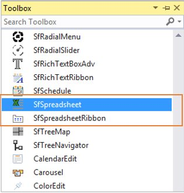
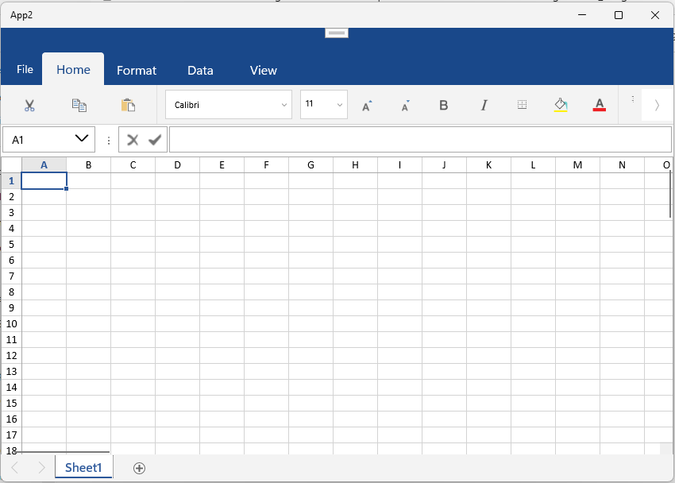

# Getting Started with UWP Spreadsheet (SfSpreadsheet)

This section briefly explains how to include the [UWP Spreadsheet Editor](https://www.syncfusion.com/spreadsheet-editor-sdk/uwp-spreadsheet-editor) component in UWP App using Visual Studio

## Prerequisites
* [System requirements for UWP components](https://help.syncfusion.com/uwp/system-requirements)

## Create a new UWP App in Visual Studio

1. Open **Visual Studio** and click **Create a new project**.
2. Select **Blank App (Universal Windows)** from the project templates and click **Next**.
3. Enter a **Project name** (for example, `SpreadsheetApp`), choose a **Location**, and click **Create**.
4. In the **New Universal Windows Platform Project** dialog, select the required **Target version** and **Minimum version** (Windows 10, version 1903 or later is recommended) and click **OK**.

For more information, see [Microsoft templates](https://learn.microsoft.com/en-us/visualstudio/get-started/csharp/tutorial-uwp?view=visualstudio&tabs=vs-2022-17.10) or [Syncfusion&reg; UWP project creation](https://help.syncfusion.com/uwp/visual-studio-integration/create-project).

## Assemblies Deployment

You can add a UWP spreadsheet component to your application by installing it via NuGet packages (recommended) or by manually adding the required assemblies to the project.





### Install Syncfusion&reg; UWP Spreadsheet NuGet Package

To add the **UWP Spreadsheet** component to the application, open the NuGet package manager in Visual Studio (*Tools → NuGet Package Manager → Manage NuGet Packages for Solution*), search and install:

•	[Syncfusion.SfSpreadsheet.UWP](https://www.nuget.org/packages/Syncfusion.SfSpreadsheet.UWP)

The following table lists the optional NuGet packages that enable additional features in the SfSpreadsheet control.

<table>
<tr>
<th>
Optional NuGet Packages</th><th>
Description</th></tr>
<tr>
<td>
{{'[Syncfusion.SfSpreadsheetHelper.UWP](https://www.nuget.org/packages/Syncfusion.SfSpreadsheetHelper.UWP)' | markdownify}}</td><td>
Contains the classes responsible for importing charts and sparklines into SfSpreadsheet.</td></tr>
<tr>
<td>
{{'[Syncfusion.ExcelChartToImageConverter.UWP](https://www.nuget.org/packages/Syncfusion.ExcelChartToImageConverter.UWP)' | markdownify}}</td><td>
Contains the classes responsible for converting charts to images.</td></tr>
<tr>
<td>
{{'[Syncfusion.SfChart.UWP](https://www.nuget.org/packages/Syncfusion.SfChart.UWP)' | markdownify}}</td><td>
Contains the classes responsible for importing chart types such as line charts, pie charts, and sparklines.</td></tr>
</table>





### Add Syncfusion&reg; UWP Spreadsheet Assemblies

To manually add the assemblies:

The table below lists the assemblies required to be added to the project when the UWP Spreadsheet control is used in your application.

<table>
<tr>
<th>
Assembly</th><th>
Description</th></tr>
<tr>
<td>
Syncfusion.SfCellGrid.UWP.dll</td><td>
Contains the base classes that provide the virtualized cell-display architecture and cell selection/interaction behavior.</td></tr>
<tr>
<td>
Syncfusion.SfGridCommon.UWP.dll</td><td>
Contains the classes that expose the scroll viewer properties and disposable elements.</td></tr>
<tr>
<td>
Syncfusion.SfSpreadsheet.UWP.dll</td><td>
Contains the classes that handle the UI operations of SfSpreadsheet, such as importing sheets and applying formulas and styles.</td></tr>
<tr>
<td>
Syncfusion.SfShared.UWP.dll</td><td>
Contains the classes that hold the properties and operations of controls such as SfUpDown, SfNavigator, and the Looping control.</td></tr>
<tr>
<td>
Syncfusion.SfInput.UWP.dll</td><td>
Contains the input control classes such as SfDropDownButton, SfTextBoxExt, and SfMaskedEdit.</td></tr>
<tr>
<td>
Syncfusion.SfRibbon.UWP.dll</td><td>
Contains the Ribbon control classes such as SfRibbon, SfRibbonMenu, and SfRibbonGalleryItem.</td></tr>
<tr>
<td>
Syncfusion.SfTabControl.UWP.dll</td><td>
Contains the tab control classes such as SfTabControl and SfTabItem.</td></tr>
<tr>
<td>
Syncfusion.XlsIO.UWP.dll</td><td>
Contains the base classes responsible for reading and writing Excel files, worksheet manipulation, and formula calculation.</td></tr>
</table>

The following optional assemblies enable additional features such as charts and sparklines:

<table>
<tr>
<th>
Optional Assemblies</th><th>
Description</th></tr>
<tr>
<td>
Syncfusion.SfSpreadsheetHelper.UWP.dll</td><td>
Contains the classes responsible for importing charts and sparklines into SfSpreadsheet.</td></tr>
<tr>
<td>
Syncfusion.ExcelChartToImageConverter.UWP.dll</td><td>
Contains the classes responsible for converting charts to images.</td></tr>
<tr>
<td>
Syncfusion.SfChart.UWP.dll</td><td>
Contains the classes responsible for importing chart types such as line charts, pie charts, and sparklines.</td></tr>
</table>





## Add UWP Spreadsheet component

UWP Spreadsheet control can be added to an application either through the designer (XAML) or programmatically using code.

N> In all of the XAML snippets below, replace `YourNamespace` (in `xmlns:local="using:YourNamespace"` and `x:Class="YourNamespace.MainPage"`) with the actual namespace of your project (for example, `App1`).





1. Open the **MainPage.xaml** file.

2. Open the Visual Studio **Toolbox**. Navigate to the **Syncfusion® Controls for UWP** tab and find the **SfSpreadsheet** / **SfSpreadsheetRibbon** toolbox items.

   

3. Drag **SfSpreadsheet** from the Toolbox and drop it into the Designer area.

   **For Spreadsheet:**

   
   

       <Page
           xmlns="http://schemas.microsoft.com/winfx/2006/xaml/presentation"
           xmlns:x="http://schemas.microsoft.com/winfx/2006/xaml"
           xmlns:local="using:YourNamespace"
           xmlns:d="http://schemas.microsoft.com/expression/blend/2008"
           xmlns:mc="http://schemas.openxmlformats.org/markup-compatibility/2006"
           xmlns:Spreadsheet="using:Syncfusion.UI.Xaml.Spreadsheet"
           x:Class="YourNamespace.MainPage"
           mc:Ignorable="d"
           Background="{ThemeResource ApplicationPageBackgroundThemeBrush}">

           <Grid>
               <Spreadsheet:SfSpreadsheet  x:Name="spreadsheet" />
           </Grid>
       </Page>

   
   

   N> Assign a name (for example, `spreadsheet`) so you can reference the control from code-behind.

4. Drag **SfSpreadsheetRibbon** from the Toolbox and drop it into the Designer area.

   **For Ribbon:**

   
   

       <Page
           xmlns="http://schemas.microsoft.com/winfx/2006/xaml/presentation"
           xmlns:x="http://schemas.microsoft.com/winfx/2006/xaml"
           xmlns:local="using:YourNamespace"
           xmlns:d="http://schemas.microsoft.com/expression/blend/2008"
           xmlns:mc="http://schemas.openxmlformats.org/markup-compatibility/2006"
           xmlns:Spreadsheet="using:Syncfusion.UI.Xaml.Spreadsheet"
           x:Class="YourNamespace.MainPage"
           mc:Ignorable="d"
           Background="{ThemeResource ApplicationPageBackgroundThemeBrush}">

           <Grid>
               <Spreadsheet:SfSpreadsheetRibbon />
           </Grid>
       </Page>

   
   

5.To make an interaction between Ribbon items and SfSpreadsheet, need to bind the `SfSpreadsheet` as DataContext to the `SfSpreadsheetRibbon`.

   
   

       <Page
           xmlns="http://schemas.microsoft.com/winfx/2006/xaml/presentation"
           xmlns:x="http://schemas.microsoft.com/winfx/2006/xaml"
           xmlns:local="using:YourNamespace"
           xmlns:d="http://schemas.microsoft.com/expression/blend/2008"
           xmlns:mc="http://schemas.openxmlformats.org/markup-compatibility/2006"
           xmlns:Spreadsheet="using:Syncfusion.UI.Xaml.Spreadsheet"
           x:Class="YourNamespace.MainPage"
           mc:Ignorable="d"
           Background="{ThemeResource ApplicationPageBackgroundThemeBrush}">

           <Grid>
               <Spreadsheet:SfSpreadsheet  x:Name="spreadsheet" />
               <Spreadsheet:SfSpreadsheetRibbon DataContext="{Binding ElementName=spreadsheet}" />
           </Grid>
       </Page>








Spreadsheet is available in the following namespace [_Syncfusion_._UI_._Xaml_._Spreadsheet_](https://help.syncfusion.com/cr/UWP/Syncfusion.UI.Xaml.Spreadsheet.html) and it can be created programmatically either by using XAML or C# code.





    <Page
        xmlns="http://schemas.microsoft.com/winfx/2006/xaml/presentation"
        xmlns:x="http://schemas.microsoft.com/winfx/2006/xaml"
        xmlns:local="using:App1"
        xmlns:d="http://schemas.microsoft.com/expression/blend/2008"
        xmlns:mc="http://schemas.openxmlformats.org/markup-compatibility/2006"
        xmlns:Spreadsheet="using:Syncfusion.UI.Xaml.Spreadsheet"
        x:Class="App1.MainPage"
        mc:Ignorable="d"
        Background="{ThemeResource ApplicationPageBackgroundThemeBrush}">

        <Grid>
            <Grid.RowDefinitions>
                <RowDefinition Height="Auto"/>
                <RowDefinition Height="*"/>
            </Grid.RowDefinitions>
            <Spreadsheet:SfSpreadsheet Name="spreadsheet" Grid.Row="1" />
            <Spreadsheet:SfSpreadsheetRibbon DataContext="{Binding ElementName=spreadsheet}" Grid.Row="0" />
        </Grid>
    </Page>





....
using Syncfusion.UI.Xaml.Spreadsheet;
....

public MainPage()
{
    this.InitializeComponent();

    Grid grid = new Grid();

    grid.RowDefinitions.Add(new RowDefinition { Height = GridLength.Auto });
    grid.RowDefinitions.Add(new RowDefinition { Height = new GridLength(1, GridUnitType.Star) });

    SfSpreadsheet spreadsheet = new SfSpreadsheet();
    SfSpreadsheetRibbon ribbon = new SfSpreadsheetRibbon() { SfSpreadsheet = spreadsheet };

    Grid.SetRow(ribbon, 0);
    Grid.SetRow(spreadsheet, 1);

    grid.Children.Add(ribbon);
    grid.Children.Add(spreadsheet);

    this.Content = grid;
}





N> To load the SfSpreadsheet in Windows Mobile, add the above code in MainPage.xaml file in DeviceFamily-Mobile folder.





## Build and run the application

1. Build the solution by pressing <kbd>Ctrl</kbd>+<kbd>Shift</kbd>+<kbd>B</kbd> (or *Build → Build Solution*). Resolve any missing-reference errors that appear in the **Error List**.
2. To launch the application without the debugger, press <kbd>Ctrl</kbd>+<kbd>F5</kbd>. The output will appear as follows:

To learn how to create, open, and save files in the UWP Spreadsheet Component, see [Workbook Operations](Workbook-Operations.md).

N> [View the UWP Spreadsheet sample in GitHub](https://github.com/SyncfusionExamples/uwp-spreadsheet-examples).

## See Also
* [Display Charts and Sparklines](Shapes.md)
