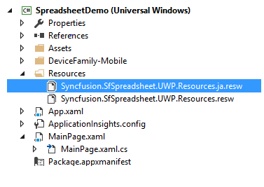
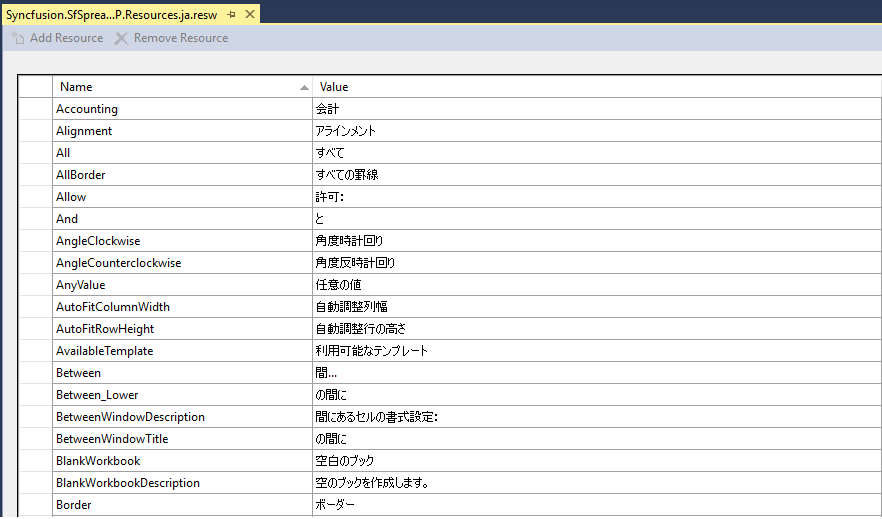
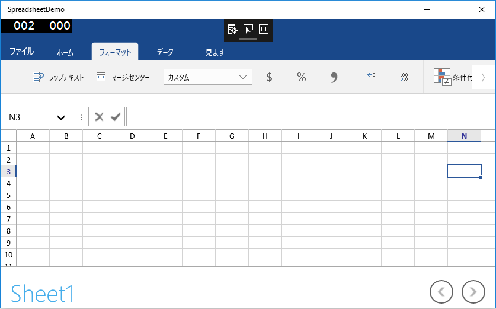
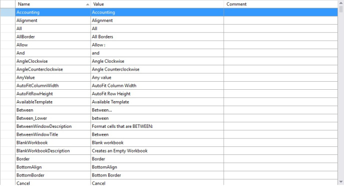

# Localization in UWP Spreadsheet (SfSpreadsheet)

Localization is the process of adapting the application UI to a specific language or culture. SfSpreadsheet provides support to localize all the static text in a Ribbon and all dialogs to any desired language. Localization can be done by adding a resource file and setting the specific culture in the application.

SfSpreadsheet allows you to set a custom resource using a Resw file. You can define your string values in the resource file for a specific culture and set the culture in your application.

## Set Current UI Culture to the Application

To set the CultureInformation in the application, set the `CurrentUICulture` before the `InitializeComponent()` method is called.

Setting of the culture information,




public MainPage()
{
    System.Globalization.CultureInfo.CurrentUICulture = new System.Globalization.CultureInfo("ja-JP");
    InitializeComponent();
}




Now, the application is set to the Japanese Culture info.

## Localization using Resource File

The following steps show how to implement localization in SfSpreadsheet.

* Create a folder and name it `Resources` in your application.
* Add the default English ('en-US') resource file of `SfSpreadsheet` to the `Resources` folder, named `Syncfusion.SfSpreadsheet.UWP.resw`.
  You can download the .resw file [here](https://www.syncfusion.com/downloads/support/directtrac/general/ze/Syncfusion.SfSpreadsheet.UWP.Resources1773657760)
* Create a .resw (resource) file under the `Resources` folder and name it `Syncfusion.SfSpreadsheet.UWP.[Culture name].resw`.
  For example, `Syncfusion.SfSpreadsheet.UWP.ja-JP.resw` for the Japanese culture.

* Add the resource key (Name) and its corresponding localized value in the Resource Designer of the `Syncfusion.SfSpreadsheet.UWP.ja.resw` file.
  For your reference, you can download the Japanese ('ja-JP') .resw file [here](https://www.syncfusion.com/downloads/support/directtrac/general/ze/Syncfusion.SfSpreadsheet.UWP.Resources.ja2068752327)

The following screenshot shows the localization applied in SfSpreadsheet:

## Modifying the Localized Strings in the Resource File

To modify the default localized strings, add the default [Resw](https://www.syncfusion.com/downloads/support/directtrac/general/ze/Syncfusion.SfSpreadsheet.UWP.Resources1773657760) (resource) file of `SfSpreadsheet` to the `Resources` folder of your application and name it `Syncfusion.SfSpreadsheet.UWP.resw`.

Then, change the Name/Value pairs in the `Syncfusion.SfSpreadsheet.UWP.resw` file to update the default localized strings.

