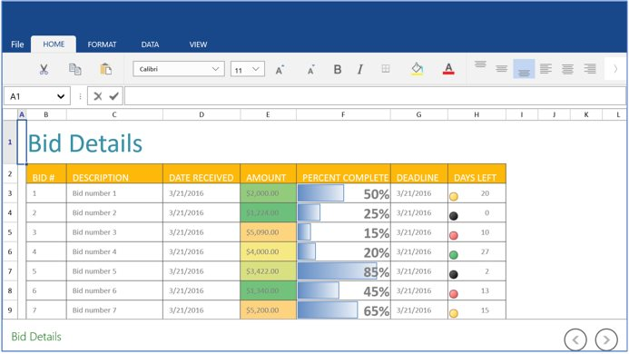

# Workbook Operations in UWP Spreadsheet

This section explains how to manage Excel workbooks in SfSpreadsheet, including creating new files, opening existing workbooks from various sources, and saving changes efficiently.

## Creating a new Excel Workbook

A new workbook can be created by using the `Create` method with the specified number of worksheets. By default, a workbook will be created with a single worksheet.




    spreadsheet.Create(2);




## Opening an existing Excel Workbook

The Excel Workbook can be opened in SfSpreadsheet using the `Open` method in the following ways:




//Using Stream,
spreadsheet.Open(Stream file)

//Using StorageFile,
spreadsheet.Open (StorageFile file)

//Using Workbook,
spreadsheet.Open(IWorkbook workbook)

// Example: Open Excel file from Embedded Resource

Stream fileStream = typeof(MainPage).GetTypeInfo().Assembly.GetManifestResourceStream("SfSpreadsheetDemo.Assets.BidDetails.xlsx");
this.spreadsheet.Open(fileStream);




> **Note:** Follow the steps below to ensure the above code properly loads and displays the Excel file:
> 
> 1. Add the Excel file inside the **Assets** folder of your UWP application
> 2. Right-click the file and select **Properties**
> 3. Set the **Build Action** to **Embedded Resource**

## Saving an Excel Workbook

The Excel workbook can be saved in SfSpreadsheet using the `Save` method. If the workbook already exists on the system drive, it will be saved in the same location; otherwise, a Save Dialog box opens to save the workbook to a user-specified location.




    spreadsheet.Save();




Use the `SaveAs` method to save an existing Excel file with modifications to a different location.

The `SaveAs` method in SfSpreadsheet can be used in the following ways:




//Using Storage File,
spreadsheet.SaveAs (StorageFile file);

//Using String,
spreadsheet.SaveAs (string file);

//For Dialog box,
spreadsheet.SaveAs();
      


