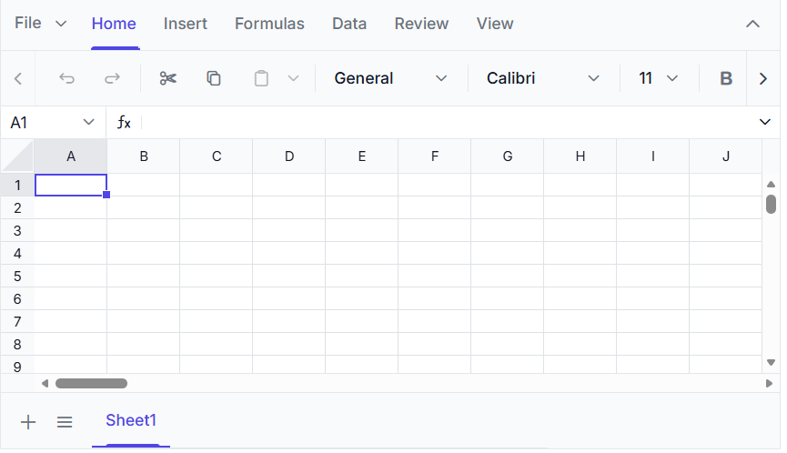

# Getting Started with the Vue Spreadsheet Component in Vue 2

This article provides a step-by-step guide for setting up a Vue 2 project and integrating the [Vue Spreadsheet Editor](https://www.syncfusion.com/spreadsheet-editor-sdk/vue-spreadsheet-editor).

## Prerequisites

[System requirements for Vue components](https://ej2.syncfusion.com/vue/documentation/system-requirements)

## Create a Vue Application

Use [Vue CLI](https://cli.vuejs.org/#getting-started) to set up a Vue application, as it provides a modular project architecture, flexible configuration, and an integrated plugin system.

Install Vue CLI globally, using the following command:

```
npm install -g @vue/cli
```

Create a new Vue application using the following commands:

```
vue create quickstart
cd quickstart
```

> When prompted during project creation, select **Default ([Vue 2] babel, eslint)** to scaffold a Vue 2 project. (If you are using **Vue 3**, refer to the [Getting Started with the Vue 3 Spreadsheet Component](./vue-3-getting-started) instead.)

## Install the Vue Spreadsheet package

Install the [Vue Spreadsheet Editor](https://www.npmjs.com/package/@syncfusion/ej2-vue-spreadsheet) package from npm using the following command:

```
npm install @syncfusion/ej2-vue-spreadsheet
```

## Register a Syncfusion License Key

Before initializing the Syncfusion Vue Spreadsheet control, generate a Syncfusion license key and register it in the application.

- [Generate a Syncfusion License Key](https://help.syncfusion.com/document-processing/licensing/how-to-generate)
- [Register a Syncfusion License Key in a Vue Application](https://help.syncfusion.com/document-processing/licensing/how-to-register-in-an-application#vuejs)

## Add CSS references

Add the following Spreadsheet and dependent component style references in the **\<style\>** section. Replace the existing content with the theme import code below.




@import "@syncfusion/ej2-base/styles/tailwind3.css";
@import "@syncfusion/ej2-buttons/styles/tailwind3.css";
@import "@syncfusion/ej2-dropdowns/styles/tailwind3.css";
@import "@syncfusion/ej2-inputs/styles/tailwind3.css";
@import "@syncfusion/ej2-navigations/styles/tailwind3.css";
@import "@syncfusion/ej2-popups/styles/tailwind3.css";
@import "@syncfusion/ej2-splitbuttons/styles/tailwind3.css";
@import "@syncfusion/ej2-grids/styles/tailwind3.css";
@import "@syncfusion/ej2-vue-spreadsheet/styles/tailwind3.css";




> **Note:** This example uses the `Tailwind 3` theme. To use a different built-in theme, replace the `tailwind3.css` references with the corresponding theme stylesheets. Refer to the [Themes documentation](https://ej2.syncfusion.com/vue/documentation/appearance/theme) for information about the available themes and the different ways to include theme styles in a Vue application.

## Add the Vue Spreadsheet component to the application

Import and register the [Vue Spreadsheet Editor](https://www.syncfusion.com/spreadsheet-editor-sdk/vue-spreadsheet-editor) component directives in the `script` section of **src/App.vue** by replacing the existing code with the following code. Then, define the component in the `template` section.





import { SpreadsheetComponent } from "@syncfusion/ej2-vue-spreadsheet";

export default {
  name: "App",
  components: {
    "ejs-spreadsheet": SpreadsheetComponent
  },
  data: () => {
    return {
      openUrl: 'https://document.syncfusion.com/web-services/spreadsheet-editor/api/spreadsheet/open',
      saveUrl: 'https://document.syncfusion.com/web-services/spreadsheet-editor/api/spreadsheet/save'
    }
  }
}





## Initialize the Spreadsheet Editor

Add the Spreadsheet Editor component to the **\<template\>** section in the `src/App.vue` file by replacing the existing code with the following code.





<ejs-spreadsheet :openUrl="openUrl" :saveUrl="saveUrl"></ejs-spreadsheet>





> **Note:** The [`openUrl`](https://ej2.syncfusion.com/vue/documentation/api/spreadsheet/index-default#openurl) and [`saveUrl`](https://ej2.syncfusion.com/vue/documentation/api/spreadsheet/index-default#saveurl) endpoints used in this example are provided only for demonstration purposes. For development and production use, we strongly recommend configuring your own local or hosted web service for the Open and Save actions instead of relying on the online demo service. For more information, refer to the [`Host Spreadsheet Open and Save Services`](https://www.syncfusion.com/blogs/post/host-spreadsheet-open-and-save-services).

## Run the Application

Run the following command to start the application:

```
npm run serve
```

After the application starts, open the localhost URL shown in the terminal to view the Vue Spreadsheet Editor in the browser. The output will appear as follows:



You can also explore the Spreadsheet interactively using the live sample below.



> [View Sample in GitHub](https://github.com/SyncfusionExamples/getting-started-with-the-vue-spreadsheet-component).

N> Looking for the full Vue Spreadsheet component overview, features, pricing, and documentation? Visit the [Vue Spreadsheet Editor](https://www.syncfusion.com/spreadsheet-editor-sdk/vue-spreadsheet-editor) page.

## See also

* [Open and Save](./open-save)
* [Data Binding](./data-binding)
