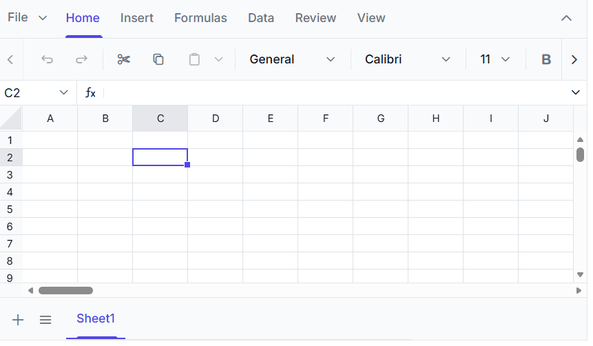

# Getting Started with the Vue Spreadsheet Component in Vue 3

This article provides a step-by-step guide for setting up a [Vite](https://vitejs.dev/) project with a JavaScript environment and integrating the Syncfusion<sup style="font-size:70%">&reg;</sup> Vue Spreadsheet component using the [Composition API](https://vuejs.org/guide/introduction.html#composition-api) / [Options API](https://vuejs.org/guide/introduction.html#options-api).

## Prerequisites

[System requirements for Syncfusion® Vue components](https://ej2.syncfusion.com/vue/documentation/system-requirements)

## Set up the Vite project

A recommended approach for beginning with Vue is to scaffold a project using [Vite](https://vitejs.dev/). To create a new Vite project, use one of the commands that are specific to either NPM or Yarn.




npm create vite@latest
cd my-project
npm install




yarn create vite
cd my-project
yarn install




## Install the Syncfusion® Vue Spreadsheet package

Install the [Vue Spreadsheet](https://www.npmjs.com/package/@syncfusion/ej2-vue-spreadsheet) package from npm using the following command:

```
npm install @syncfusion/ej2-vue-spreadsheet --save
```

## Add CSS references

You can import themes for the Syncfusion<sup style="font-size:70%">&reg;</sup> Vue component in various ways, such as using CSS or SASS styles from npm packages, CDN, [CRG](https://ej2.syncfusion.com/javascript/documentation/common/custom-resource-generator) and [Theme Studio](https://ej2.syncfusion.com/vue/documentation/appearance/theme-studio).




<style>
  @import '../node_modules/@syncfusion/ej2-base/styles/material.css';  
  @import '../node_modules/@syncfusion/ej2-buttons/styles/material.css';  
  @import '../node_modules/@syncfusion/ej2-dropdowns/styles/material.css';  
  @import '../node_modules/@syncfusion/ej2-inputs/styles/material.css';  
  @import '../node_modules/@syncfusion/ej2-navigations/styles/material.css';
  @import '../node_modules/@syncfusion/ej2-popups/styles/material.css';
  @import '../node_modules/@syncfusion/ej2-splitbuttons/styles/material.css';
  @import '../node_modules/@syncfusion/ej2-grids/styles/material.css';
  @import "../node_modules/@syncfusion/ej2-vue-spreadsheet/styles/material.css";
</style>




## Note

Refer to [themes topic](https://ej2.syncfusion.com/vue/documentation/appearance/theme) to know more about built-in themes and different ways to refer to themes in a Vue project.

## Add Syncfusion<sup style="font-size:70%">&reg;</sup> Vue component

Follow the below steps to add the Vue Spreadsheet component using `Composition API` or `Options API`:

1.First, import and register the Spreadsheet component and its child directives in the `script` section of the **src/App.vue** file. If you are using the `Composition API`, you should add the `setup` attribute to the `script` tag to indicate that Vue will be using the `Composition API`.

2.In the `template` section, define the Spreadsheet component with sheets directives. Sheet directives are used to define the sheet definition for the Spreadsheet component.

3.Declare the values for the `dataSource` property in the `script` section.

Here is the summarized code for the above steps in the **src/App.vue** file:




<template>
  <ejs-spreadsheet ref="spreadsheet" :openUrl="openUrl" :saveUrl="saveUrl">
    <e-sheets>
      <e-sheet>
        <e-ranges>
          <e-range :dataSource="data"></e-range>
        </e-ranges>
      </e-sheet>
    </e-sheets>
  </ejs-spreadsheet>
</template>

<script setup>
import { ref } from "vue";
import { SpreadsheetComponent as EjsSpreadsheet, RangesDirective as ERanges, RangeDirective as ERange, SheetsDirective as ESheets, SheetDirective as ESheet} from "@syncfusion/ej2-vue-spreadsheet";

const openUrl = 'https://document.syncfusion.com/web-services/spreadsheet-editor/api/spreadsheet/open';
const saveUrl = 'https://document.syncfusion.com/web-services/spreadsheet-editor/api/spreadsheet/save';

const data = [
          {
            OrderID: 10248,
            Name: "VINET",
            Country: "France",
          },
          {
            OrderID: 10249,
            Name: "TOMSP",
            Country: "Germany",
          }
        ];
</script>

<style>
  @import "../node_modules/@syncfusion/ej2-base/styles/material.css";
  @import "../node_modules/@syncfusion/ej2-buttons/styles/material.css";
  @import "../node_modules/@syncfusion/ej2-dropdowns/styles/material.css";
  @import "../node_modules/@syncfusion/ej2-inputs/styles/material.css";
  @import "../node_modules/@syncfusion/ej2-navigations/styles/material.css";
  @import "../node_modules/@syncfusion/ej2-popups/styles/material.css";
  @import "../node_modules/@syncfusion/ej2-splitbuttons/styles/material.css";
  @import "../node_modules/@syncfusion/ej2-grids/styles/material.css";
  @import "../node_modules/@syncfusion/ej2-vue-spreadsheet/styles/material.css";
</style>




<template>
  <ejs-spreadsheet ref="spreadsheet" :openUrl="openUrl" :saveUrl="saveUrl">
    <e-sheets>
      <e-sheet>
        <e-ranges>
          <e-range :dataSource="data"></e-range>
        </e-ranges>
      </e-sheet>
    </e-sheets>
  </ejs-spreadsheet>
</template>

<script>
  import { SpreadsheetComponent, RangesDirective, RangeDirective, SheetsDirective, SheetDirective } from "@syncfusion/ej2-vue-spreadsheet";

  export default {
    name: "App",
    // Declaring component and its directives
    components: {
      "ejs-spreadsheet": SpreadsheetComponent,
      "e-sheets": SheetsDirective,
      "e-sheet": SheetDirective,
      "e-ranges": RangesDirective,
      "e-range": RangeDirective,
    },
    // Bound properties declarations
    data() {
       return {
    data:[
          {
            OrderID: 10248,
            Name: "VINET",
            Country: "France",
          },
          {
            OrderID: 10249,
            Name: "TOMSP",
            Country: "Germany",
          }
        ],
    openUrl: 'https://document.syncfusion.com/web-services/spreadsheet-editor/api/spreadsheet/open',
    saveUrl: 'https://document.syncfusion.com/web-services/spreadsheet-editor/api/spreadsheet/save'
    };
    },
  };
</script>

<style>
  @import "../node_modules/@syncfusion/ej2-base/styles/material.css";
  @import "../node_modules/@syncfusion/ej2-buttons/styles/material.css";
  @import "../node_modules/@syncfusion/ej2-dropdowns/styles/material.css";
  @import "../node_modules/@syncfusion/ej2-inputs/styles/material.css";
  @import "../node_modules/@syncfusion/ej2-navigations/styles/material.css";
  @import "../node_modules/@syncfusion/ej2-popups/styles/material.css";
  @import "../node_modules/@syncfusion/ej2-splitbuttons/styles/material.css";
  @import "../node_modules/@syncfusion/ej2-grids/styles/material.css";
  @import "../node_modules/@syncfusion/ej2-vue-spreadsheet/styles/material.css";
</style>




> **Note:** The [`openUrl`](https://ej2.syncfusion.com/vue/documentation/api/spreadsheet/index-default#openurl) and [`saveUrl`](https://ej2.syncfusion.com/vue/documentation/api/spreadsheet/index-default#saveurl) endpoints used in this example are provided only for demonstration purposes. For development and production use, we strongly recommend configuring your own local or hosted web service for the Open and Save actions instead of relying on the online demo service. For more information, please refer to our [`blog`](https://www.syncfusion.com/blogs/post/host-spreadsheet-open-and-save-services) post.

## Run the project

To run the project, use the following command:




npm run dev




yarn run dev




The output will appear as follows:



After the application starts, open the local URL shown in the terminal to view the Vue Spreadsheet Editor in the browser.

> You can refer to our [Vue Spreadsheet](https://www.syncfusion.com/spreadsheet-editor-sdk/vue-spreadsheet-editor) feature tour page for its groundbreaking feature representations. You can also explore our [Vue Spreadsheet example](https://document.syncfusion.com/demos/spreadsheet-editor/vue/#/tailwind3/spreadsheet/default.html) that shows you how to present and manipulate data.

## See also

* [Data Binding](./data-binding)
* [Open Excel files](./open-excel-files)
* [Save Excel files](./save-excel-files)
