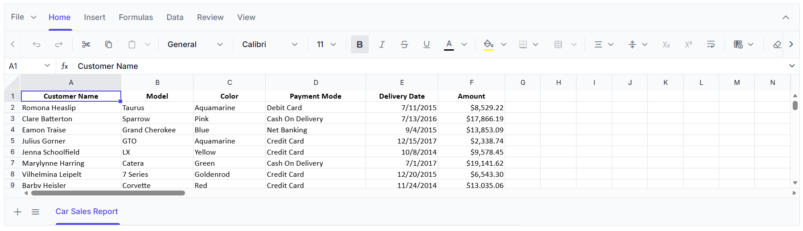

# Getting Started with Vue 3 Spreadsheet

This article provides a step-by-step guide for setting up a [Vite](https://vitejs.dev/) project with a JavaScript environment and integrating the [Vue Spreadsheet Editor](https://www.syncfusion.com/spreadsheet-editor-sdk/vue-spreadsheet-editor) component using the [Composition API](https://vuejs.org/guide/introduction.html#composition-api) / [Options API](https://vuejs.org/guide/introduction.html#options-api).




## Prerequisites

- [Node.js 24+](https://nodejs.org/en) (LTS recommended).
- Syncfusion CLI.

## Install the Syncfusion CLI 

Install the Syncfusion CLI globally using the following command:



npm install -g @syncfusion/syncfusion-cli



## Set up the Vite project using Syncfusion CLI

You can create a Vue application with [Vite](https://vite.dev/) using the Syncfusion CLI. The CLI provides two ways to create a project:

### Non-interactive mode

Non-interactive mode allows you to create a project directly using a single command with the required command-line arguments.



sf new my-project --framework vue --template spreadsheet-editor --theme tailwind3



In this mode, the project configuration is passed directly in the command. The above command creates a `Vue` application with Vite and configured it with the Syncfusion<sup style="font-size:70%">&reg;</sup> `Spreadsheet Editor` component. The generated project uses the TypeScript and the Composition API.

### Interactive mode

Interactive mode guides you through the project creation process with step-by-step prompts.



sf



When you run the `sf` command, the CLI prompts you to select the required project configuration options. To create a Vue application with Vite and the Syncfusion<sup style="font-size:70%">&reg;</sup> `Spreadsheet Editor` component, select the following options:




√ Project name? ... my-project
√ Choose Framework: » Vue
√ Choose Language: » TypeScript
√ Choose Template: » Spreadsheet Editor
√ Choose Theme: » Tailwind3
√ Choose Style Format: » CSS
√ Would you like to integrate the Syncfusion MCP Server (AI Assistant) into this project? ... no
√ Would you like to install Syncfusion Component Skills for AI-powered development? ... no      
√ Install dependencies and start app now? ... no




The above selections generate a `Vue` application with Vite and configure it with the Syncfusion<sup style="font-size:70%">&reg;</sup> `Spreadsheet Editor` component. You can choose different values for language, theme, style format, MCP setup, and skills installation based on your project requirements.

The Syncfusion<sup style="font-size:70%">&reg;</sup> CLI creates the project with a predefined template. After the project is generated, you can customize or replace the component code based on your application requirements.

## Run the project

Once the project is created, navigate to the project directory and run the following commands in your terminal.



cd my-project
npm install
npm run dev



The output will appear as follows:







## Prerequisites

[System requirements for Vue components](https://ej2.syncfusion.com/vue/documentation/system-requirements)

## Create a Vue Application

To create a new Vue application, run one of the following commands.

```
npm create vite@latest spreadsheet-app -- --template vue
cd spreadsheet-app
```

## Install the Vue Spreadsheet package

Install the [Vue Spreadsheet Editor](https://www.npmjs.com/package/@syncfusion/ej2-vue-spreadsheet) package from npm using the following command:

```
npm install @syncfusion/ej2-vue-spreadsheet
```

## Import the required CSS styles

Themes for Spreadsheet can be applied using CSS or SASS files from the [npm theme packages](https://ej2.syncfusion.com/vue/documentation/appearance/theme#theme-packages), CDN, CRG, or [Theme Studio](https://ej2.syncfusion.com/vue/documentation/appearance/theme-studio). For more information, see the [themes documentation](https://ej2.syncfusion.com/vue/documentation/appearance/theme).

This guide uses the `Tailwind 3` theme as an example, sourced from the theme package. In this package, each component includes an `index.css` file that automatically loads all the required dependency styles. To install the [Tailwind 3](https://www.npmjs.com/package/@syncfusion/ej2-tailwind3-theme) theme package, use the following command:

```bash
npm install @syncfusion/ej2-tailwind3-theme
```

Add the required Spreadsheet theme style reference to `src/style.css` file:




@import "@syncfusion/ej2-tailwind3-theme/styles/spreadsheet/index.css";




N> The `index.css` file automatically includes all required dependent component styles for the Spreadsheet. You do not need to import individual dependency styles such as Base, Inputs, Buttons, SplitButtons, Lists, Navigations, Popups, Dropdowns, Grids separately.

N> Refer to the [Themes topic](https://ej2.syncfusion.com/vue/documentation/appearance/theme) to learn more about built-in themes and different ways to refer to themes in a Vue 3 project.

## Add the Vue Spreadsheet component to the application

Import and register the [Vue Spreadsheet Editor](https://www.syncfusion.com/spreadsheet-editor-sdk/vue-spreadsheet-editor) component directives in the `script` section of **src/App.vue**. If you use the `Composition API`, add the `setup` attribute to the `script` tag. Then, define the component in the `template` section.





<template>
  <ejs-spreadsheet :openUrl="openUrl" :saveUrl="saveUrl"></ejs-spreadsheet>
</template>

<script setup>
import { SpreadsheetComponent as EjsSpreadsheet } from "@syncfusion/ej2-vue-spreadsheet";

const openUrl = 'https://document.syncfusion.com/web-services/spreadsheet-editor/api/spreadsheet/open';
const saveUrl = 'https://document.syncfusion.com/web-services/spreadsheet-editor/api/spreadsheet/save';

</script>






<template>
  <ejs-spreadsheet :openUrl="openUrl" :saveUrl="saveUrl"></ejs-spreadsheet>
</template>

<script>
  import { SpreadsheetComponent } from "@syncfusion/ej2-vue-spreadsheet";

  export default {
    name: "App",
    // Declaring component and its directives
    components: {
      "ejs-spreadsheet": SpreadsheetComponent
    },
    // Bound properties declarations
    data() {
      return {
        openUrl: 'https://document.syncfusion.com/web-services/spreadsheet-editor/api/spreadsheet/open',
        saveUrl: 'https://document.syncfusion.com/web-services/spreadsheet-editor/api/spreadsheet/save'
      };
    },
  };
</script>





N> The [`openUrl`](https://ej2.syncfusion.com/vue/documentation/api/spreadsheet/index-default#openurl) and [`saveUrl`](https://ej2.syncfusion.com/vue/documentation/api/spreadsheet/index-default#saveurl) endpoints used in this example are provided only for demonstration purposes. For development and production use, we strongly recommend configuring your own local or hosted web service for the Open and Save actions instead of relying on the online demo service. For more information, refer to the [`link`](https://www.syncfusion.com/blogs/post/host-spreadsheet-open-and-save-services).

## Run the Application

Run the following command to start the application:

```
npm run dev
```

After the application starts, open the localhost URL shown in the terminal to view the Vue Spreadsheet Editor in the browser. The output will appear as follows:






> [View Sample in GitHub](https://github.com/SyncfusionExamples/getting-started-with-the-vue-spreadsheet-component).

N> Looking for the full Vue Spreadsheet component overview, features, pricing, and documentation? Visit the [Vue Spreadsheet Editor](https://www.syncfusion.com/spreadsheet-editor-sdk/vue-spreadsheet-editor) page.

## See also

* [Open and Save](./open-save)
* [Data Binding](./data-binding)
