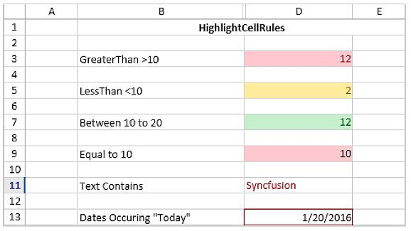
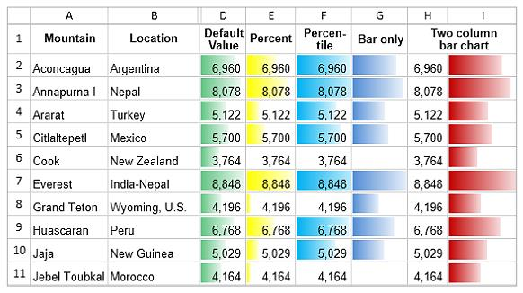
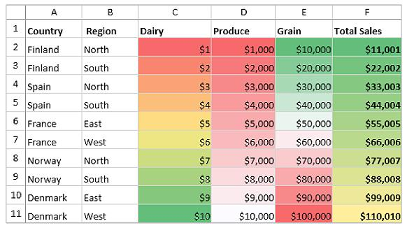
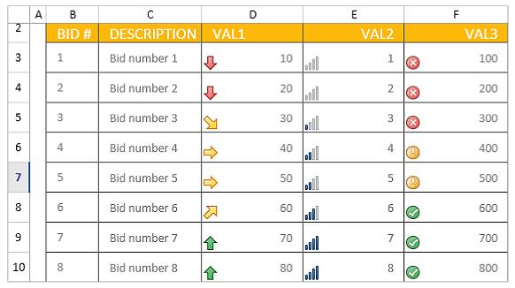

# Conditional Formatting in WPF Spreadsheet (SfSpreadsheet)

This section explains how to apply conditional formatting rules programmatically at run time in SfSpreadsheet.

In SfSpreadsheet, to apply a conditional format to a cell or range of cells, add an [IConditionalFormat](https://help.syncfusion.com/cr/wpf/Syncfusion.XlsIO.IConditionalFormat.html) to that range by using the [AddCondition](https://help.syncfusion.com/cr/wpf/Syncfusion.XlsIO.IConditionalFormats.html#Syncfusion_XlsIO_IConditionalFormats_AddCondition) method, then call `InvalidateCell` on `ActiveGrid` to refresh the view.



var worksheet = spreadsheet.Workbook.Worksheets[0];
IConditionalFormats condition = worksheet.Range["A1"].ConditionalFormats;
IConditionalFormat condition1 = condition.AddCondition();



## Highlight Cell Rules

### Based on Cell Value

To format cells based on a cell value, set the format type to **CellValue** and configure options such as the formula, operator, and background color. Then, invalidate the cells to refresh the view.



var worksheet = spreadsheet.Workbook.Worksheets[0];
IConditionalFormats condition = worksheet.Range["A1:A100"].ConditionalFormats;
IConditionalFormat condition1 = condition.AddCondition();
condition1.FormatType = ExcelCFType.CellValue;
condition1.Operator = ExcelComparisonOperator.Greater;
condition1.FirstFormula = "10";
condition1.BackColor = ExcelKnownColors.Light_orange;
spreadsheet.ActiveGrid.InvalidateCell(GridRangeInfo.Col(1));



> Use `SecondFormula` together with `FirstFormula` when the operator is `Between` or `NotBetween`.

### Based on Formula or Cell References

To format cells based on a formula or cell reference, set the format type to **Formula** and configure options such as the formula and background color. Then, invalidate the cells to refresh the view.



var worksheet = spreadsheet.Workbook.Worksheets[0];
IConditionalFormats condition = worksheet.Range["A1:A100"].ConditionalFormats;
IConditionalFormat condition1 = condition.AddCondition();
condition1.FormatType = ExcelCFType.Formula;
condition1.FirstFormula = "=(B1+B2)>50";
condition1.BackColor = ExcelKnownColors.Brown;
spreadsheet.ActiveGrid.InvalidateCell(GridRangeInfo.Col(1));



### Based on Specific Text

To format cells based on a specified text, set the format type to **SpecificText** and configure options such as the text, operator, and background color. Then, invalidate the cells to refresh the view.



var worksheet = spreadsheet.Workbook.Worksheets[0];
IConditionalFormats condition = worksheet.Range["A1:A100"].ConditionalFormats;
IConditionalFormat condition1 = condition.AddCondition();
condition1.FormatType = ExcelCFType.SpecificText;
condition1.Text = "SYNC";
condition1.Operator = ExcelComparisonOperator.ContainsText;
condition1.BackColor = ExcelKnownColors.Light_orange;
spreadsheet.ActiveGrid.InvalidateCell(GridRangeInfo.Col(1));



### Based on Time Period

To format cells based on a time period, set the format type to **TimePeriod** and configure the time period type and background color. The `Operator` property is not required for `TimePeriod`. Then, invalidate the cells to refresh the view.

Supported `CFTimePeriods` values include: `Today`, `Yesterday`, `Tomorrow`, `Last7Days`, `ThisWeek`, `LastWeek`, `ThisMonth`, `LastMonth`.



var worksheet = spreadsheet.Workbook.Worksheets[0];
IConditionalFormats condition = worksheet.Range["A1:A100"].ConditionalFormats;
IConditionalFormat condition1 = condition.AddCondition();
condition1.FormatType = ExcelCFType.TimePeriod;
condition1.TimePeriodType = CFTimePeriods.Today;
condition1.BackColor = ExcelKnownColors.Light_orange;
spreadsheet.ActiveGrid.InvalidateCell(GridRangeInfo.Col(1));



Sample output

## Data Bars

To apply a conditional format based on data bars, set the format type to **DataBar** and configure the associated properties such as the bar color, `MinPoint`, and `MaxPoint`. Then, invalidate the cells to update the view.

Supported `ConditionValueType` values include: `LowestValue`, `HighestValue`, `Number`, `Percent`, `Formula`, `Automatic`,and `Percentile`.



var worksheet = spreadsheet.Workbook.Worksheets[0];
var conditionalFormats = worksheet.Range["B1:B100"].ConditionalFormats;
var conditionalFormat = conditionalFormats.AddCondition();
conditionalFormat.FormatType = ExcelCFType.DataBar;
conditionalFormat.DataBar.BarColor = Color.FromArgb(255, 214, 0, 123);
conditionalFormat.DataBar.MinPoint.Type = ConditionValueType.LowestValue;
conditionalFormat.DataBar.MaxPoint.Type = ConditionValueType.HighestValue;
spreadsheet.ActiveGrid.InvalidateCell(GridRangeInfo.Col(2));



Sample output

## Color Scales

To apply a conditional format based on color scales, set the format type to **ColorScale** and configure the associated properties such as the condition count and color criteria. Then, invalidate the cells to update the view.



var worksheet = spreadsheet.Workbook.Worksheets[0];
var conditionalFormats = worksheet.Range["C2:C100"].ConditionalFormats;
var conditionalFormat = conditionalFormats.AddCondition();
conditionalFormat.FormatType = ExcelCFType.ColorScale;
conditionalFormat.ColorScale.SetConditionCount(2);
conditionalFormat.ColorScale.Criteria[0].FormatColorRGB = Color.FromArgb(255, 99, 190, 123);
conditionalFormat.ColorScale.Criteria[1].FormatColorRGB = Color.FromArgb(255, 90, 138, 198);
spreadsheet.ActiveGrid.InvalidateCell(GridRangeInfo.Col(3));



Sample output

## Icon Sets

To apply a conditional format for icon sets, set the format type to **IconSet** and configure the associated properties such as the icon type and criteria. Then, invalidate the cells to update the view.

Supported `ExcelIconSetType` values include: `ThreeArrows`, `ThreeArrowsGray`, `ThreeFlags`, `ThreeTrafficLights1`, `ThreeTrafficLights2`, `ThreeSigns`, `ThreeSymbols`, `ThreeSymbols2`, `FourArrows`, `FourArrowsGray`, `FourRedToBlack`, `FourRating`, `FourTrafficLights`, `FiveArrows`, `FiveArrowsGray`, `FiveRating`, and `FiveQuarters`.



var worksheet = spreadsheet.Workbook.Worksheets[0];
var conditionalFormats = worksheet.Range["D2:D100"].ConditionalFormats;
var conditionalFormat = conditionalFormats.AddCondition();
conditionalFormat.FormatType = ExcelCFType.IconSet;
conditionalFormat.IconSet.IconSet = ExcelIconSetType.ThreeSymbols;
spreadsheet.ActiveGrid.InvalidateCell(GridRangeInfo.Col(4));



Sample output

> **See also:**
> - [WPF Spreadsheet Editor](https://www.syncfusion.com/wpf-controls/spreadsheet) feature tour
> - [WPF Spreadsheet example](https://github.com/syncfusion/wpf-demos) on GitHub
> - Related: [Cell Formatting](https://help.syncfusion.com/wpf/spreadsheet/cell-formatting), [Number Formatting](https://help.syncfusion.com/wpf/spreadsheet/number-formatting)