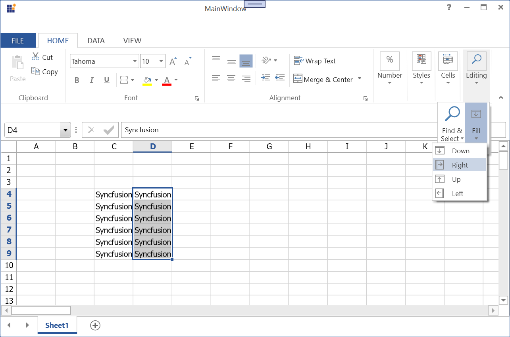

# Editing in WPF Spreadsheet (SfSpreadsheet)

This section explains about the Editing behavior, Data Validation and Hyperlinks in SfSpreadsheet.

## Editing

The SfSpreadsheet control provides support for editing, you can modify and commit the cell values in the workbook.

By default, editing is enabled in `SfSpreadsheet`. To disable it, set the [AllowEditing](https://help.syncfusion.com/cr/wpf/Syncfusion.UI.Xaml.CellGrid.SfCellGrid.html#Syncfusion_UI_Xaml_CellGrid_SfCellGrid_AllowEditing) property to `false`.



// Subscribe to the event (typically in the constructor or page load).
spreadsheet.WorkbookLoaded += spreadsheet_WorkbookLoaded;

void spreadsheet_WorkbookLoaded(object sender, WorkbookLoadedEventArgs args)
{
    spreadsheet.ActiveGrid.AllowEditing = false;
}



### Editing a cell programmatically

#### Start Editing
    
You can edit a cell programmatically by using the [BeginEdit](https://help.syncfusion.com/cr/wpf/Syncfusion.UI.Xaml.Spreadsheet.SpreadsheetCurrentCell.html#Syncfusion_UI_Xaml_Spreadsheet_SpreadsheetCurrentCell_BeginEdit_System_Boolean_) method.



spreadsheet.ActiveGrid.CurrentCell.BeginEdit(true);



#### End Editing

You can end the editing of a cell programmatically in any of the following ways:

* [ValidateAndEndEdit](https://help.syncfusion.com/cr/wpf/Syncfusion.UI.Xaml.CellGrid.GridCurrentCell.html#Syncfusion_UI_Xaml_CellGrid_GridCurrentCell_ValidateAndEndEdit) - Validates and ends the edit operation for the current cell. If the `cancel` parameter is `true`, the current cell remains in edit mode; if validation succeeds, the new value is committed and the focus moves to the next cell; if validation fails, the old value is restored and the focus moves to the next cell.

* [EndEdit](https://help.syncfusion.com/cr/wpf/Syncfusion.UI.Xaml.CellGrid.GridCurrentCell.html#Syncfusion_UI_Xaml_CellGrid_GridCurrentCell_EndEdit_System_Boolean_) - Commits and ends the edit operation for the current cell. If passed with the parameter `true`, the new value is committed; otherwise, the old value is restored.



//Validates and end the edit operation,
spreadsheet.ActiveGrid.CurrentCell.ValidateAndEndEdit();

//Commits the value and end the edit operation,
spreadsheet.ActiveGrid.CurrentCell.EndEdit(true);



### Locking or Unlocking a cell

Locking cells disables editing and formatting of those cells when the sheet is protected. By default, all cells are locked in the worksheet.
However, when the sheet is protected, you can still edit or format a cell by unlocking it first.

> **Note:** A cell's lock state has no effect unless the worksheet is also protected (for example, by calling `Worksheet.Protect("password")`).



var worksheet = spreadsheet.ActiveSheet;
var excelStyle = worksheet.Range["A2"].CellStyle;

//To unlock a cell,           
excelStyle.Locked = false;

//To lock a cell, 
excelStyle.Locked = true; 



### Properties, Methods and Events

The order of events when editing and committing a cell value in SfSpreadsheet,

<table>
<tr>
<th>
Events</th><th>
Description</th></tr>
<tr>
<td>
{{ '[CurrentCellBeginEdit](https://help.syncfusion.com/cr/wpf/Syncfusion.UI.Xaml.CellGrid.SfCellGrid.html)' | markdownify }}</td><td>
Occurs when the current cell enters into edit mode. This event allows to cancel entering the edit mode.</td></tr>
<tr>
<td>
{{ '[CurrentCellValueChanged](https://help.syncfusion.com/cr/wpf/Syncfusion.UI.Xaml.CellGrid.SfCellGrid.html)' | markdownify }}</td><td>
Occurs when the current cell value is changed in edit mode.</td></tr>
<tr>
<td>
{{ '[CurrentCellValidating](https://help.syncfusion.com/cr/wpf/Syncfusion.UI.Xaml.CellGrid.SfCellGrid.html)' | markdownify }}</td><td>
Occurs when the current cell value is going to be validated. It allows you to validate and cancel the end editing.</td></tr>
<tr>
<td>
{{ '[CurrentCellValidated](https://help.syncfusion.com/cr/wpf/Syncfusion.UI.Xaml.CellGrid.SfCellGrid.html)' | markdownify }}</td><td>
Occurs after the current cell is validated.</td></tr>
<tr>
<td>
{{ '[CurrentCellEndEdit](https://help.syncfusion.com/cr/wpf/Syncfusion.UI.Xaml.CellGrid.SfCellGrid.html)' | markdownify }}</td><td>
Occurs when the current cell leaves from edit mode.</td></tr>
</table>

The following table lists the properties associated with editing.

<table>
<tr>
<th>
Properties</th><th>
Description</th></tr>
<tr>
<td>
{{ '[AllowEditing](https://help.syncfusion.com/cr/wpf/Syncfusion.UI.Xaml.CellGrid.SfCellGrid.html#Syncfusion_UI_Xaml_CellGrid_SfCellGrid_AllowEditing)' | markdownify }}</td><td>
Gets or sets a value indicating whether the editing operation is allowed. **Default:** `true`.</td></tr>
<tr>
<td>
{{ '[EditorSelectionBehavior](https://help.syncfusion.com/cr/wpf/Syncfusion.UI.Xaml.CellGrid.SfCellGrid.html#Syncfusion_UI_Xaml_CellGrid_SfCellGrid_EditorSelectionBehavior)' | markdownify }}</td><td>
Gets or sets a value indicating whether the editor selects all the text or places the caret at the end of the existing value when entering edit mode.</td></tr>
<tr>
<td>
{{ '[EditTrigger](https://help.syncfusion.com/cr/wpf/Syncfusion.UI.Xaml.CellGrid.SfCellGrid.html#Syncfusion_UI_Xaml_CellGrid_SfCellGrid_EditTrigger)' | markdownify }}</td><td>
Gets or sets a value that indicates which user action causes a cell to enter Edit Mode.</td></tr>
<tr>
<td>
{{ '[IsEditing](https://help.syncfusion.com/cr/wpf/Syncfusion.UI.Xaml.CellGrid.GridCurrentCell.html#Syncfusion_UI_Xaml_CellGrid_GridCurrentCell_isEditing)' | markdownify }}</td><td>
Gets whether the current cell is in edit mode.</td></tr>
</table>

The following table lists the methods associated with editing.

<table>
<tr>
<th>
Methods</th><th>
Description</th></tr>
<tr>
<td>
{{ '[BeginEdit](https://help.syncfusion.com/cr/wpf/Syncfusion.UI.Xaml.Spreadsheet.SpreadsheetCurrentCell.html#Syncfusion_UI_Xaml_Spreadsheet_SpreadsheetCurrentCell_BeginEdit_System_Boolean_)' | markdownify }}</td><td>
Begins the editing operation of the current cell and returns true if the current cell enters into edit mode.</td></tr>
<tr>
<td>
{{ '[EndEdit](https://help.syncfusion.com/cr/wpf/Syncfusion.UI.Xaml.Spreadsheet.SpreadsheetCurrentCell.html#Syncfusion_UI_Xaml_Spreadsheet_SpreadsheetCurrentCell_EndEdit_System_Boolean_)' | markdownify }}</td><td>
Commits and ends the edit operation of the current cell.</td></tr>
<tr>
<td>
{{ '[ValidateAndEndEdit](https://help.syncfusion.com/cr/wpf/Syncfusion.UI.Xaml.CellGrid.GridCurrentCell.html#Syncfusion_UI_Xaml_CellGrid_GridCurrentCell_ValidateAndEndEdit)' | markdownify }}</td><td>
Validates and ends the edit operation of the current cell.</td></tr>
<tr>
<td>
{{ '[Validate](https://help.syncfusion.com/cr/wpf/Syncfusion.UI.Xaml.CellGrid.GridCurrentCell.html#Syncfusion_UI_Xaml_CellGrid_GridCurrentCell_Validate_System_Boolean__)' | markdownify }}</td><td>
Validates the current cell in SfSpreadsheet.</td></tr>
</table>

## Fill neighboring cells with formula or data

The fill command fills adjacent cells with the same text, numbers, formulas, or formatted data. To do this:

* Select a cell or range of cells to fill.
* Go to **Home** > **Fill** and choose the fill direction (**Down**, **Right**, **Up**, or **Left**).

## Data Validation

Data validation restricts the type or range of values that can be entered in a cell.

### Applying Data Validation at runtime

SfSpreadsheet allows you to apply data validation rules at runtime for a particular cell or range using the `IDataValidation` interface.



//Number Validation
IDataValidation numberValidation = spreadsheet.ActiveSheet.Range["A5"].DataValidation;
numberValidation.AllowType = ExcelDataType.Integer;
numberValidation.CompareOperator = ExcelDataValidationComparisonOperator.Between;
numberValidation.FirstFormula = "4";
numberValidation.SecondFormula = "15";
numberValidation.ShowErrorBox = true;
numberValidation.ErrorBoxText = "Accepts values only between 4 to 15";

//Date Validation
IDataValidation dateValidation = spreadsheet.ActiveSheet.Range["B4"].DataValidation;
dateValidation.AllowType = ExcelDataType.Date;
dateValidation.CompareOperator = ExcelDataValidationComparisonOperator.Greater;
dateValidation.FirstDateTime = new DateTime(2016,5,5);
dateValidation.ShowErrorBox = true;
dateValidation.ErrorBoxText = "Enter the date value which is greater than 05/05/2016";

//TextLength Validation
IDataValidation textLengthValidation = spreadsheet.ActiveSheet.Range["A3:B3"].DataValidation;
textLengthValidation.AllowType = ExcelDataType.TextLength;
textLengthValidation.CompareOperator = ExcelDataValidationComparisonOperator.LessOrEqual;
textLengthValidation.FirstFormula = "4";
textLengthValidation.ShowErrorBox = true;
textLengthValidation.ErrorBoxText = "Text length should be lesser than or equal 4 characters";

//List Validation
IDataValidation listValidation = spreadsheet.ActiveSheet.Range["D4"].DataValidation;
listValidation.ListOfValues = new string[] { "10", "20", "30" };

//Custom Validation
IDataValidation customValidation = spreadsheet.ActiveSheet.Range["D4"].DataValidation;
customValidation.AllowType = ExcelDataType.Formula;
customValidation.FirstFormula = "=A1+A2>0";
customValidation.ErrorBoxText = "Sum of the values in A1 and A2 should be greater than zero";



For more reference, see the [XlsIO](http://help.syncfusion.com/file-formats/xlsio/working-with-data-validation) UG.

> **Tip:** To load a ComboBox in a cell of SfSpreadsheet, apply list validation to that cell.

## Hyperlink

A hyperlink is a convenient way to access web pages, files, and data within a worksheet or other worksheets in a workbook. SfSpreadsheet supports adding, editing, and removing hyperlinks in the workbook.

### Add a Hyperlink to a cell

SfSpreadsheet supports adding a hyperlink to a cell through the hyperlinks collection using the `IHyperLink` interface.

SfSpreadsheet supports the following hyperlink types:

* Web URL
* Cell or range in workbook
* E-mail
* External files



// Creating a Hyperlink for e-mail,
var range = spreadsheet.ActiveSheet.Range["A5"];
IHyperLink hyperlink1 = spreadsheet.ActiveSheet.HyperLinks.Add(range);
hyperlink1.Type = ExcelHyperLinkType.Url;
hyperlink1.Address = "mailto:Username@syncfusion.com";
hyperlink1.TextToDisplay="Send Mail";
spreadsheet.ActiveGrid.InvalidateCell(GridRangeInfo.Cell(5, 1));

// Creating a Hyperlink for Opening Files,
var range1 = spreadsheet.ActiveSheet.Range["D5"];
IHyperLink hyperlink2 = spreadsheet.ActiveSheet.HyperLinks.Add(range1);
hyperlink2.Type = ExcelHyperLinkType.File;
hyperlink2.Address = @"C:\Samples\Local";
hyperlink2.TextToDisplay = "File Location";
spreadsheet.ActiveGrid.InvalidateCell(GridRangeInfo.Cell(5, 4));

//Creating a Hyperlink to refer another cell in the workbook,
var range2 = spreadsheet.ActiveSheet.Range["C13"];
IHyperLink hyperlink3 = spreadsheet.ActiveSheet.HyperLinks.Add(range2);
hyperlink3.Type = ExcelHyperLinkType.Workbook;
hyperlink3.Address = "Sheet2!C23";
hyperlink3.TextToDisplay = "Sample";
spreadsheet.ActiveGrid.InvalidateCell(GridRangeInfo.Cell(13, 3));



### Edit or Remove a Hyperlink

SfSpreadsheet provides support to edit or remove the hyperlinks from the range by accessing Hyperlinks collection.



//To Edit a hyperlink in a cell,
var hyperlink = spreadsheet.ActiveSheet.Range["A5"].Hyperlinks[0];
hyperlink.TextToDisplay = "Sample";
hyperlink.Address = "http://help.syncfusion.com";
spreadsheet.ActiveGrid.InvalidateCell(GridRangeInfo.Cell(5,1));

//To remove a hyperlink in a cell,
var hyperlink = spreadsheet.ActiveSheet.Range["A5"].Hyperlinks.RemoveAt(0);
spreadsheet.ActiveGrid.InvalidateCell(GridRangeInfo.Cell(5,1));



N> You can refer to our [WPF Spreadsheet Editor](https://www.syncfusion.com/wpf-controls/spreadsheet) feature tour page for its groundbreaking feature representations. You can also explore our [WPF Spreadsheet example](https://github.com/syncfusion/wpf-demos) to know how to render and configure the spreadsheet.