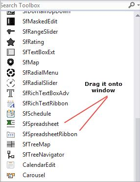
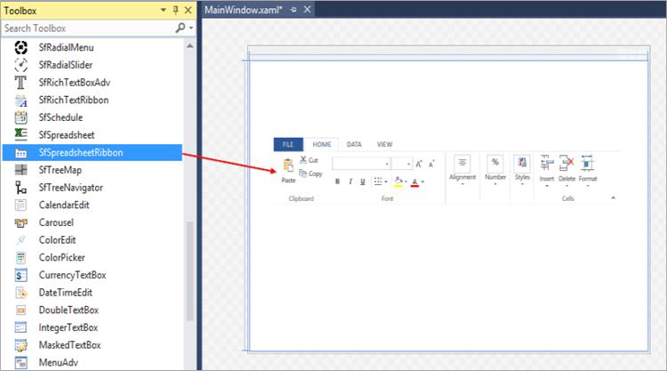
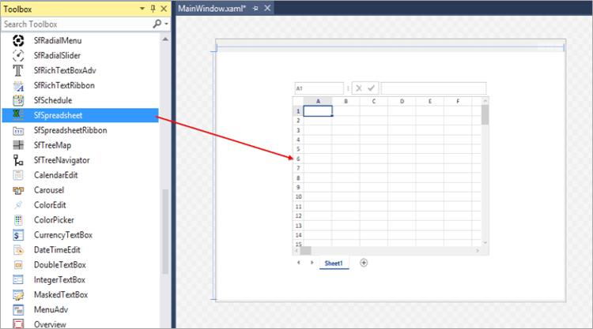
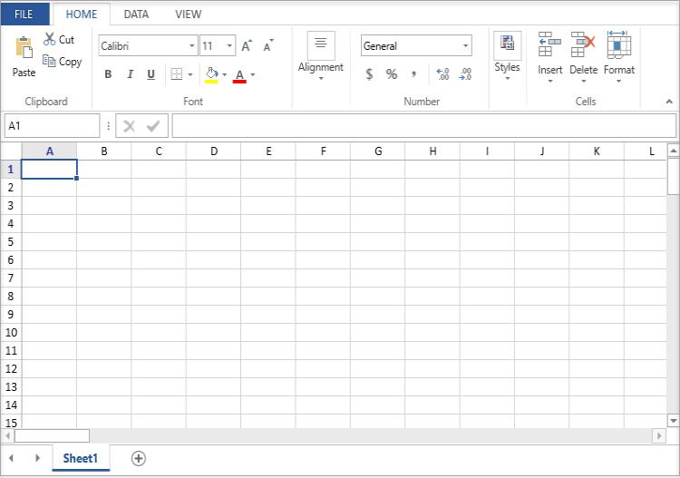

# Getting Started with WPF Spreadsheet (SfSpreadsheet)
This section briefly explains how to include the [WPF Spreadsheet Editor](https://www.syncfusion.com/spreadsheet-editor-sdk/wpf-spreadsheet-editor) component in a WPF application using Visual Studio.

## Prerequisites
* [System requirements for WPF components](https://help.syncfusion.com/wpf/system-requirements)

## Create a new WPF App in Visual Studio

You can create a **WPF Application** using Visual Studio via [Microsoft Templates](https://learn.microsoft.com/en-us/dotnet/desktop/wpf/get-started/create-app-visual-studio) or the [Syncfusion&reg; WPF](https://help.syncfusion.com/wpf/visual-studio-integration/template-studio).

## Assemblies Deployment

To add a WPF spreadsheet component to your application, install it via NuGet packages (Recommended) or manually add the required assemblies to the project.





### Install Syncfusion&reg; WPF Spreadsheet NuGet packages

To add the **WPF Spreadsheet** component to the application, open the NuGet package manager in Visual Studio (*Tools → NuGet Package Manager → Manage NuGet Packages for Solution*), search for and install:

•	[Syncfusion.SfSpreadsheet.WPF](https://www.nuget.org/packages/Syncfusion.SfSpreadsheet.WPF)

To ensure the control is styled correctly, install the theme package:

•	[Syncfusion.Themes.Windows11Light.WPF](https://www.nuget.org/packages/Syncfusion.Themes.Windows11Light.WPF)


 


### Add Syncfusion® WPF Spreadsheet Assemblies

The table below lists the assemblies required to be added to the project when the WPF Spreadsheet control is used in your application. All assemblies in this table are required.

<table>
<tr>
<th>
Assembly</th><th>
Description</th></tr>
<tr>
<td>
Syncfusion.SfCellGrid.WPF.dll</td><td>
Contains the base and fundamental classes that hold the underlying architecture for displaying cells with virtualized behavior and cell selection/interaction.</td></tr>
<tr>
<td>
Syncfusion.SfGridCommon.WPF.dll</td><td>
Contains the classes that hold the properties and functions of the scroll viewer and disposable elements.</td></tr>
<tr>
<td>
Syncfusion.SfSpreadsheet.WPF.dll</td><td>
Contains the classes that handle all the UI operations of SfSpreadsheet, such as importing sheets and applying formulas/styles.</td></tr>
<tr>
<td>
Syncfusion.Shared.WPF.dll</td><td>
Contains the classes that hold controls like Color pickers, Chromeless window, ComboBoxAdv, DateTimeEdit, etc.</td></tr>
<tr>
<td>
Syncfusion.Tools.WPF.dll</td><td>
Contains the classes that hold controls like TabControlExt, TabItemExt, Gallery, GroupBar, and TabSplitter, which are used in SfSpreadsheet.</td></tr>
<tr>
<td>
Syncfusion.XlsIO.Base.dll</td><td>
Contains the base classes that are responsible for reading and writing Excel files, worksheet manipulations, and formula calculations.</td></tr>
</table>

Below are the additional DLLs required for applying themes and skinning to the SfSpreadsheet control:

<table> <tr> <th>Assembly</th> <th>Description</th> </tr> <tr> <td>Syncfusion.Themes.Windows11Light.WPF.dll</td> <td>Contains the Windows 11 Light theme style for Syncfusion WPF controls.</td> </tr> <tr> <td>Syncfusion.SfSkinManager.WPF.dll</td> <td>Contains the SfSkinManager that helps to apply different themes to Syncfusion WPF controls.</td> </tr> </table>

N> Add these references to your project to use the skinning and theming capabilities of the SfSpreadsheet.

### Optional Assemblies

The following optional assemblies enable additional features in the SfSpreadsheet control. Add only those required by your scenario. Each optional assembly is also available as a NuGet package with the same base name (for example, `Syncfusion.SfSpreadsheetHelper.WPF`).

<table>
<tr>
<th>
Optional Assemblies</th><th>
Description</th></tr>
<tr>
<td>
Syncfusion.SfSpreadsheetHelper.WPF.dll</td><td>
Contains the classes that are responsible for importing charts and sparklines into SfSpreadsheet.</td></tr>
<tr>
<td>
Syncfusion.ExcelChartToImageConverter.WPF.dll</td><td>
Contains the classes that are responsible for converting charts as images.</td></tr>
<tr>
<td>
Syncfusion.SfChart.WPF.dll</td><td>
Contains the classes that are responsible for importing charts such as Line, Pie, Column, and Bar charts. Sparklines are handled by <code>Syncfusion.SfSpreadsheetHelper.WPF</code>, not by this assembly.</td></tr>
<tr>
<td>
Syncfusion.ExcelToPDFConverter.Base.dll</td><td>
Contains the base and fundamental classes that are responsible for converting Excel to PDF.</td></tr>
<tr>
<td>
Syncfusion.Pdf.Base.dll</td><td>
Contains the base and fundamental classes for creating PDF.</td></tr>
</table>


 


## Add WPF Spreadsheet component

WPF Spreadsheet control can be added to an application either through the designer (XAML) or programmatically using code. 


 


1. Add the theme and the [SfSkinManager](https://help.syncfusion.com/cr/wpf/Syncfusion.SfSkinManager.html) namespace to style the control correctly. Include the SfSkinManager namespace in the XAML code and apply the desired theme.

    
    
    <Window x:Class="YourNamespace.MainWindow"
            xmlns="http://schemas.microsoft.com/winfx/2006/xaml/presentation"
            xmlns:x="http://schemas.microsoft.com/winfx/2006/xaml"
            xmlns:syncfusionskin="clr-namespace:Syncfusion.SfSkinManager;assembly=Syncfusion.SfSkinManager.WPF"
            syncfusionskin:SfSkinManager.Theme="{syncfusionskin:SkinManagerExtension ThemeName=Windows11Light}">

    </Window>
    
    

2. Open the Visual Studio **Toolbox**. Navigate to the Syncfusion® Controls tab and find the `SfSpreadsheet` and `SfSpreadsheetRibbon` toolbox items. (If the Syncfusion tab is missing, install the controls using the [Syncfusion® WinForms/WPF installer](https://help.syncfusion.com/wpf/visual-studio-integration/visual-studio-extensions/extensions) and restart Visual Studio.)

    

3. Drag `SfSpreadsheet` and `SfSpreadsheetRibbon` from the Toolbox and drop them in the Designer area.

    

    
    
    <Window x:Class="YourNamespace.MainWindow"
            xmlns="http://schemas.microsoft.com/winfx/2006/xaml/presentation"
            xmlns:x="http://schemas.microsoft.com/winfx/2006/xaml"
    	xmlns:syncfusion="clr-namespace:Syncfusion.UI.Xaml.Spreadsheet;assembly=Syncfusion.SfSpreadsheet.WPF"
            xmlns:syncfusionskin="clr-namespace:Syncfusion.SfSkinManager;assembly=Syncfusion.SfSkinManager.WPF"
            syncfusionskin:SfSkinManager.Theme="{syncfusionskin:SkinManagerExtension ThemeName=Windows11Light}">
        <Grid>
    	<syncfusion:SfSpreadsheetRibbon />
        </Grid>
    </Window>
    
    

4. Spreadsheet can be added to the application by dragging `SfSpreadsheet` to the Designer area.

    
    
    <Window x:Class="YourNamespace.MainWindow"
            xmlns="http://schemas.microsoft.com/winfx/2006/xaml/presentation"
            xmlns:x="http://schemas.microsoft.com/winfx/2006/xaml"
    	xmlns:syncfusion="clr-namespace:Syncfusion.UI.Xaml.Spreadsheet;assembly=Syncfusion.SfSpreadsheet.WPF"
            xmlns:syncfusionskin="clr-namespace:Syncfusion.SfSkinManager;assembly=Syncfusion.SfSkinManager.WPF"
            syncfusionskin:SfSkinManager.Theme="{syncfusionskin:SkinManagerExtension ThemeName=Windows11Light}">

        <Grid>
    	<syncfusion:SfSpreadsheet x:Name = spreadsheet />
        </Grid>
    </Window>
    
    

    N> Declare a name for the Spreadsheet component (for example, `x:Name="spreadsheet"`) so that it can be referenced from the Ribbon.

    

5. To make an interaction between Ribbon items and `SfSpreadsheet`, bind the `SfSpreadsheet` as DataContext to the `SfSpreadsheetRibbon`.

   
   
   <Window x:Class="YourNamespace.MainWindow"
            xmlns="http://schemas.microsoft.com/winfx/2006/xaml/presentation"
            xmlns:x="http://schemas.microsoft.com/winfx/2006/xaml"
            xmlns:syncfusion="clr-namespace:Syncfusion.UI.Xaml.Spreadsheet;assembly=Syncfusion.SfSpreadsheet.WPF"
            xmlns:syncfusionskin="clr-namespace:Syncfusion.SfSkinManager;assembly=Syncfusion.SfSkinManager.WPF"
            syncfusionskin:SfSkinManager.Theme="{syncfusionskin:SkinManagerExtension ThemeName=Windows11Light}">

        <Grid>
    	<syncfusion:SfSpreadsheetRibbon DataContext= "{Binding ElementName=spreadsheet}"  />
    	<syncfusion:SfSpreadsheet x:Name = spreadsheet />
        </Grid>
   </Window>
   
   


 


Spreadsheet is available in the following namespace “_Syncfusion_._UI_._Xaml_._Spreadsheet_” and it can be created programmatically by using XAML  



<Window x:Class="WpfApp1.MainWindow"
        xmlns="http://schemas.microsoft.com/winfx/2006/xaml/presentation"
        xmlns:x="http://schemas.microsoft.com/winfx/2006/xaml"
        xmlns:d="http://schemas.microsoft.com/expression/blend/2008"
        xmlns:mc="http://schemas.openxmlformats.org/markup-compatibility/2006"
        xmlns:syncfusion="http://schemas.syncfusion.com/wpf"
        xmlns:syncfusionskin ="clr-namespace:Syncfusion.SfSkinManager;assembly=Syncfusion.SfSkinManager.WPF"
        syncfusionskin:SfSkinManager.Theme="{syncfusionskin:SkinManagerExtension ThemeName=Windows11Light}"
        mc:Ignorable="d">
    <Grid>
        <Grid.RowDefinitions>
            <RowDefinition Height="Auto"/>
            <RowDefinition Height="*"/>
        </Grid.RowDefinitions>
        <syncfusion:SfSpreadsheetRibbon Grid.Row="0" DataContext="{Binding ElementName=spreadsheet}"  />
        <syncfusion:SfSpreadsheet Name="spreadsheet" Grid.Row="1" />
    </Grid>
</Window>



using Syncfusion.SfSkinManager;
using Syncfusion.UI.Xaml.Spreadsheet;
....

public MainWindow()
{
    InitializeComponent();

    SfSkinManager.ApplyThemeAsDefaultStyle = true;

    SfSkinManager.SetTheme(this, new Theme("Windows11Light"));

    Grid grid = new Grid();

    grid.RowDefinitions.Add(new RowDefinition { Height = GridLength.Auto });

    grid.RowDefinitions.Add(new RowDefinition { Height = new GridLength(1, GridUnitType.Star) });

    SfSpreadsheet spreadsheet = new SfSpreadsheet();

    SfSpreadsheetRibbon ribbon = new SfSpreadsheetRibbon() { SfSpreadsheet = spreadsheet };

    Grid.SetRow(ribbon, 0);

    Grid.SetRow(spreadsheet, 1);

    grid.Children.Add(ribbon);

    grid.Children.Add(spreadsheet);

    this.Content = grid;
}




 


## Run the application

Press <kbd>Ctrl</kbd>+<kbd>F5</kbd> (Windows) or <kbd>⌘</kbd>+<kbd>F5</kbd> (macOS) to launch the application.The output will appear as follows:

## Next steps

To learn how to create, open, and save files in the WPF Spreadsheet Component, see [Workbook Operations](Workbook-Operations).

[Find the complete WPF Spreadsheet sample on GitHub.](https://github.com/SyncfusionExamples/create-view-edit-excel-files-using-wpf-spreadsheet)

For the full WPF Spreadsheet Editor component overview, features, pricing, and documentation, visit the [WPF Spreadsheet Editor](https://www.syncfusion.com/spreadsheet-editor-sdk/wpf-spreadsheet-editor) page.

## See Also
- [Workbook Operations](Workbook-Operations)
- [Data Management](Data-Management)
- [Shapes](Shapes)