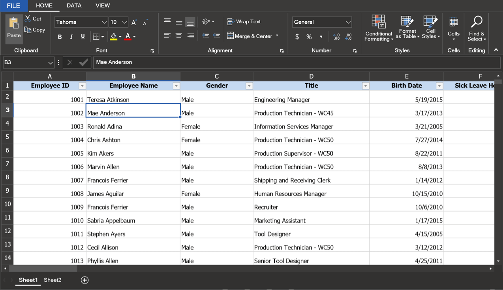

# Themes in WPF Spreadsheet (SfSpreadsheet)

SfSpreadsheet supports built-in themes for customizing its appearance.

## Available Themes

### Material
* MaterialLight
* MaterialDark

### Office2019
* Office2019Colorful
* Office2019Black
* Office2019White
* Office2019DarkGray

### Fluent
* FluentLight
* FluentDark

### System
* SystemTheme

Refer to the below links to apply themes for the SfSpreadsheet,

  * [Apply theme using SfSkinManager](https://help.syncfusion.com/wpf/themes/skin-manager)
	
  * [Create a custom theme using ThemeStudio](https://help.syncfusion.com/wpf/themes/theme-studio#creating-custom-theme)
 
  

## See Also

* [WPF Spreadsheet feature tour](https://www.syncfusion.com/wpf-controls/spreadsheet)
* [WPF Spreadsheet examples on GitHub](https://github.com/syncfusion/wpf-demos)
