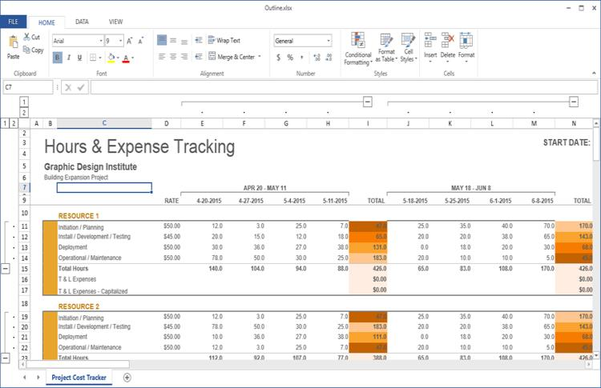

# Workbook Operations in WPF Spreadsheet

This section explains how to manage Excel workbooks in SfSpreadsheet, including creating new files, opening existing workbooks from various sources, and saving changes efficiently.

## Creating a new Excel Workbook

A new workbook can be created by using the [Create](https://help.syncfusion.com/cr/wpf/Syncfusion.UI.Xaml.Spreadsheet.SfSpreadsheet.html#Syncfusion_UI_Xaml_Spreadsheet_SfSpreadsheet_Create_System_Int32_) method with a specified number of worksheets. By default, a workbook will be created with a single worksheet.



spreadsheet.Create(2);



## Opening an existing Excel Workbook

The Excel workbook can be opened in SfSpreadsheet using the [Open](https://help.syncfusion.com/cr/wpf/Syncfusion.UI.Xaml.Spreadsheet.SfSpreadsheet.html#Syncfusion_UI_Xaml_Spreadsheet_SfSpreadsheet_Open_Syncfusion_XlsIO_IWorkbook_) method in various ways.



//Using Stream,
spreadsheet.Open (Stream file);

//Using String,
spreadsheet.Open (string file);

//Using Workbook,
spreadsheet.Open(IWorkbook workbook);

// Example: Open from file path
spreadsheet.Open (@"..\..\Data\Outline.xlsx");




Opening Excel File in SfSpreadsheet
   {:.caption}

## Saving the Excel Workbook

The Excel workbook can be saved in SfSpreadsheet using the [Save](https://help.syncfusion.com/cr/wpf/Syncfusion.UI.Xaml.Spreadsheet.SfSpreadsheet.html#Syncfusion_UI_Xaml_Spreadsheet_SfSpreadsheet_Save) method. If the workbook was originally opened from a file path on the system drive, it will be saved to the same location; otherwise, a Save dialog box opens so the user can specify a location.



spreadsheet.Save();



You can also use [SaveAs](https://help.syncfusion.com/cr/wpf/Syncfusion.UI.Xaml.Spreadsheet.SfSpreadsheet.html#Syncfusion_UI_Xaml_Spreadsheet_SfSpreadsheet_SaveAs) method directly to save the existing excel file with modifications.

The `SaveAs` method in SfSpreadsheet can be used in various ways,



//Using Stream,
spreadsheet.SaveAs (Stream file);

//Using String,
spreadsheet.SaveAs (string file);

//For Dialog box,
spreadsheet.SaveAs();



