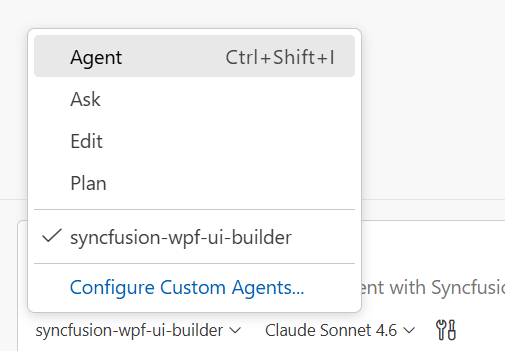

# Syncfusion® WPF UI Builder Skill with Spreadsheet for AI Assistants

**Syncfusion® WPF UI Builder Skill** is an AI-powered agent skill that accelerates WPF Spreadsheet development by transforming natural-language UI requirements into production-ready code using Syncfusion® WPF components.

Integrated with your AI-powered IDE, it leverages deep knowledge of **Syncfusion® Spreadsheet** and other WPF components to deliver accurate and ready-to-use code.
By combining intelligent code generation with best practices, accessibility standards, and design-system consistency, WPF UI Builder helps you rapidly build scalable spreadsheet applications and user interfaces without leaving your development workflow.

## Prerequisites

Before installing WPF UI Builder Skill with Spreadsheet, ensure the following:

- Install [APM (Agent Package Manager)](https://microsoft.github.io/apm/getting-started/installation/#quick-install-recommended)
- Required [.NET SDK](https://dotnet.microsoft.com/en-us/download) version ≥ 6
- WPF application (existing or new); see [Overview](https://help.syncfusion.com/wpf/welcome-to-syncfusion-essential-wpf)
- A supported AI agent or IDE that integrates with the Skills (VS Code, Cursor, Syncfusion® Code Studio, etc.)
- Active Syncfusion<sup style="font-size:70%">&reg;</sup> license(any of the following):  
  - [Commercial](https://www.syncfusion.com/sales/unlimitedlicense)  
  - [Community License](https://www.syncfusion.com/products/communitylicense)  
  - [Free Trial](https://www.syncfusion.com/account/manage-trials/start-trials)

## Key Benefits

### **AI-Driven UI Generation**
- Transforms prompts into fully developed WPF components rather than just partial code snippets.
- Automatically selects appropriate Syncfusion® components and features
- Produces structured, maintainable code

### **Control Usage & API Accuracy**
- Uses correct Syncfusion® control APIs
- Injects required feature modules (sorting, filtering, etc.)
- Avoids unsupported or deprecated patterns

### **Patterns & Best Practices**
- Recommends control composition and state management
- Event handling aligned with WPF standards
- Secure and scalable coding patterns

### **Accessibility & Responsiveness**
- Windows accessibility guidelines (UIA) and Windows Narrator support
- Well-structured XAML markup with proper control hierarchy
- DPI awareness and high-resolution display support

### **Design-System Integration**
- Supports Syncfusion® WPF themes such as FluentLight/Dark, Material3Light/Dark, Windows11Light/Dark, and Office2019 variants
- Ensures consistent Syncfusion® styling, theme usage, and ResourceDictionary configuration

## Installation

Before installing WPF UI Builder, ensure that APM (Agent Package Manager) is installed and available in your environment.

### Verify APM Installation

Run the following command to confirm APM is installed:

```bash
apm --version
```

### Install the Syncfusion® WPF UI Builder package using APM

Use the APM CLI to install the WPF UI Builder skill for your preferred environment:




apm install syncfusion/wpf-ui-builder -t copilot




apm install syncfusion/wpf-ui-builder -t cursor




apm install syncfusion/wpf-ui-builder -t copilot




apm install syncfusion/wpf-ui-builder -t claude




After installation, the following artifacts are added to your project for the GitHub Copilot target:

- `.agent/skills/` – contains the skill files
- `.github/agents/` – contains the agent configuration

Refer to the [documentation](https://microsoft.github.io/apm/reference/cli/targets/#detection-signals) for details about supported deployment targets.

> For [Syncfusion® Code Studio](https://help.syncfusion.com/code-studio/reference/configure-properties/custom-agents#predefined-agents), use the Copilot command above to install the WPF UI Builder.

## How the Syncfusion® WPF UI Builder Skill Works with Spreadsheet

1. **Intent Analysis** — Parse the user's prompt to identify control types and high-level layout intent.
2. **Project Detection** — Automatically detects project framework and existing themes.
3. **Control Mapping** — Map intent to Syncfusion® controls and required feature modules.
4. **Theming & Design System**  
   Load required theming guidelines and confirm key design choices:
   - Syncfusion® WPF theme (FluentLight, FluentDark, Material3Light, Material3Dark, Windows11Light, Windows11Dark, Office2019 variants)
   - Core design basics (colors, spacing, typography, accessibility)
5. **Code Generation** — Produce WPF XAML controls, data bindings, and styling.
6. **Dependency Management** — Recommend or install required Syncfusion® packages and peer dependencies.
7. **Validation** — Run accessibility and basic security checks, request confirmation for changes.
8. **Code Insertion** — Create files or patch existing files following project structure and conventions.

Key enforcement points:

- Adds correct theme resources and ResourceDictionary configuration for chosen Syncfusion® themes
- Injects only the feature modules required by generated controls
- Generates well-structured XAML with proper accessibility support (UIA and Windows Narrator)
- Avoids unsupported or deprecated API usages for Syncfusion® controls

> The assistant handles most stages automatically and may request confirmation where required.

## Using the AI Assistant

After installing WPF UI Builder Skill with Spreadsheet and APM, the relevant agent and skill files are added to your project under:

- `.agent/skills/` (skill files)
- `.github/agents/` (WPF UI builder agent configuration, based on the selected target)

To start using the skill:

1. Open your supported IDE.
2. In the chat panel, select the `syncfusion-wpf-ui-builder` agent from the **Agent dropdown**.

   

3. Start prompting the agent with a clear description of your UI requirements.

> For Syncfusion® Code Studio, if the UI Builder agent is not shown, ensure that the agent location is configured to use it in the chat, and refer to the [documentation](https://help.syncfusion.com/code-studio/reference/configure-properties/usersettings#agent-file-locations) to configure the agent location properly.

Examples Prompts:



Create a WPF application using Syncfusion Spreadsheet with three worksheets and configure the second worksheet as the active sheet when the application loads, ensuring a simple and properly initialized workbook setup.


Create a WPF application using Syncfusion Spreadsheet that initializes a worksheet with sample data (such as sales or invoice details) and applies formulas like SUM and AVERAGE to calculate totals and summaries, ensuring proper data formatting and a clean, user-friendly layout.



Generated code follows best practices with well-structured XAML markup, proper event wiring and binding setup, strong C# typing, DPI awareness, and built-in security measures such as input validation and safe data handling.

## Best Practices

Follow these guidelines to get the most out of UI Builder and ensure high-quality production-ready result:

- **Stay consistent** — Maintain consistent naming conventions (PascalCase for classes, camelCase for variables), control hierarchies, and XAML patterns throughout your project.
- **Use advanced AI models** — For best results, use **Claude Sonnet 4.6 or higher** capability models to produce better code quality and more accurate implementations.
- **Visual Studio designer testing** — Generated XAML code should be compatible with Visual Studio designer; validate layouts visually and ensure proper control initialization.
- **Accessibility validation** — Test generated controls with Windows Narrator and Inspect tool (UIA) to ensure full accessibility support for keyboard navigation and screen readers.
- **DPI awareness** — Test on high-resolution displays and ensure all controls scale properly and maintain visual fidelity.
- **Review all content and assets before production** — Validate the logic, security, and compatibility with your existing code and Syncfusion® licensing before deployment.

## Troubleshooting

- **APM installation failure**: Refer to this [documentation](https://microsoft.github.io/apm/getting-started/installation/#troubleshooting)

- **Skills not loading**: Ensure the **.agent/** and **.github/agents/** folders exist in your project and that the skill was installed successfully using APM. Verify that the correct agent is selected from the Agent dropdown in your IDE.

- **Control not rendering**: Retry generation using the specific control skill to resolve the issue, and ensure required Syncfusion® packages and themes are properly configured.

- **Syncfusion license banner appears**: Use the licensing skill to correctly register and validate your Syncfusion® license key in the application.


## FAQ

**Which agents/IDEs are supported?**
Any Skills-compatible agent that reads local skill files (Code Studio, VS Code, Cursor, etc.).

**Are skills loaded automatically?**  
Yes. Supported agents automatically load relevant skills based on your query.

**Can I customize the generated styles?**
Yes — the generated WPF controls include clear integration points for style adjustments.

**Does it modify files automatically?**
The skill proposes changes and requires confirmation for insertion; automatic dependency installation may be offered depending on agent permissions.

## See also

- [Agent Skills Standards](https://agentskills.io/home)
- [Agent Package Manager](https://microsoft.github.io/apm/getting-started/quick-start/)
