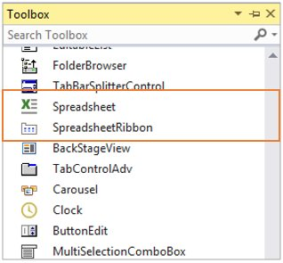

# Getting Started with Windows Forms Spreadsheet
This section briefly explains how to include the [WinForms Spreadsheet Editor](https://www.syncfusion.com/spreadsheet-editor-sdk/winforms-spreadsheet-editor) component in Windows Forms App using Visual Studio.

## Prerequisites
* [System requirements for WinForms components](https://help.syncfusion.com/windowsforms/system-requirements)

## Create a new Windows Forms App in Visual Studio

You can create a **Windows Forms Application** using Visual Studio via [Microsoft Templates](https://learn.microsoft.com/en-us/dotnet/desktop/winforms/get-started/create-app-visual-studio) or the [Syncfusion&reg; Windows Forms](https://help.syncfusion.com/windowsforms/visual-studio-integration/template-studio).

## Installation

You can add the WinForms Spreadsheet component to your application either by installing the NuGet package (recommended) or by manually adding the required assemblies to the project.





### Install Syncfusion&reg; Windows Forms Spreadsheet NuGet package

To add the **Windows Forms Spreadsheet** component in the application, open the NuGet package manager in Visual Studio (*Tools → NuGet Package Manager → Manage NuGet Packages for Solution*), search for and install the following package:

•	[Syncfusion.Spreadsheet.Windows](https://www.nuget.org/packages/Syncfusion.Spreadsheet.Windows)

The following table lists the optional NuGet packages that enable additional features in the Spreadsheet control.

<table>
<tr>
<th>
Optional NuGet Packages</th><th>
Description</th></tr>
<tr>
<td>
[Syncfusion.SpreadsheetHelper.Windows](https://www.nuget.org/packages/Syncfusion.SpreadsheetHelper.Windows)</td><td>
Contains the classes that import charts and sparklines into the Spreadsheet.</td></tr>
<tr>
<td>
[Syncfusion.ExcelChartToImageConverter.WPF](https://www.nuget.org/packages/Syncfusion.ExcelChartToImageConverter.WPF)</td><td>
Contains the classes that convert charts to images.</td></tr>
<tr>
<td>
[Syncfusion.Chart.Windows](https://www.nuget.org/packages/Syncfusion.Chart.Windows)</td><td>
Contains the classes that create charts that hold axes, series, and legends.</td></tr>
</table>





### Add Syncfusion&reg; WinForms Spreadsheet Assemblies

The table below lists the assemblies required to be added to the project when the [Syncfusion WinForms Spreadsheet](https://www.syncfusion.com/winforms-ui-controls/spreadsheet) control is used in your application. The assemblies can be obtained from the Syncfusion Essential Studio installer (default install path: `C:\Program Files (x86)\Syncfusion\Essential Studio\{{site.releaseversion}}\Assemblies`).

**Required Assemblies**

<table>
<tr>
<th>
Assembly</th><th>
Description</th></tr>
<tr>
<td>
Syncfusion.Spreadsheet.Windows.dll</td><td>
Contains the classes that handle all the UI operations of the Spreadsheet, such as importing sheets and applying formulas and styles.</td></tr>
<tr>
<td>
Syncfusion.Shared.Base.dll</td><td>
Contains the classes that provide controls like TabBarPage and TabBarSplitterControl.</td></tr>
<tr>
<td>
Syncfusion.Tools.Windows.dll</td><td>
Contains the classes that provide controls like Ribbon, ToolStripPanelItem, MaskedEditBox, ToolStripGallery, and BackStageButton, which are used in the Spreadsheet.</td></tr>
<tr>
<td>
Syncfusion.XlsIO.Base.dll</td><td>
Contains the base classes that are responsible for reading and writing Excel files, worksheet manipulation, and formula calculations.</td></tr>
</table>

The following table lists the optional assemblies that enable additional features in the Spreadsheet control.

<table>
<tr>
<th>
Optional Assemblies</th><th>
Description</th></tr>
<tr>
<td>
Syncfusion.SpreadsheetHelper.Windows.dll</td><td>
Contains the classes that import charts and sparklines into the Spreadsheet.</td></tr>
<tr>
<td>
Syncfusion.ExcelChartToImageConverter.WPF.dll</td><td>
Contains the classes that convert charts to images.</td></tr>
<tr>
<td>
Syncfusion.Chart.Base.dll</td><td>
Contains the base classes that import charts such as line, pie, and sparklines.</td></tr>
<tr>
<td>
Syncfusion.Chart.Windows.dll</td><td>
Contains the classes that create charts that hold axes, series, and legends.</td></tr>
<tr>
<td>
Syncfusion.ExcelToPDFConverter.Base.dll</td><td>
Contains the base and fundamental classes that convert Excel to PDF.</td></tr>
<tr>
<td>
Syncfusion.Pdf.Base.dll</td><td>
Contains the base and fundamental classes for creating PDFs.</td></tr>
</table>


 


## Add the Windows Forms Spreadsheet Component

WinForms Spreadsheet control can be added to an application either through the designer (Form1.cs[Design]) or programmatically using code.





1. Open the Visual Studio **Toolbox**. Navigate to the **Syncfusion® Controls** tab and find the `Spreadsheet` and `SpreadsheetRibbon` toolbox items.

   

2. Drag `Spreadsheet` and `SpreadsheetRibbon` from the Toolbox onto the Designer area.
    
    
    ....
    partial class Form1
    {
    ....
    private void InitializeComponent()
    {
    Spreadsheet spreadsheet = new Spreadsheet();
    }
    ....
    }
    ....
    
    

3. Ribbon can be added to the application by dragging `SpreadsheetRibbon` to the Designer area.

    
    
    ....
    partial class Form1
    {
    ....
    private void InitializeComponent()
    {
    Spreadsheet spreadsheet = new Spreadsheet();
    SpreadsheetRibbon spreadsheetRibbon = new SpreadsheetRibbon();
    }
    ....
    }
    ....
    
    

4. To make an interaction between Ribbon items and `Spreadsheet`, bind the Spreadsheet as DataContext to the `SpreadsheetRibbon`.

    
    
    ....
    partial class Form1
    {
    ....
    private void InitializeComponent()
    {
    Spreadsheet spreadsheet = new Spreadsheet();
    SpreadsheetRibbon spreadsheetRibbon = new SpreadsheetRibbon();
    spreadsheetRibbon.Spreadsheet = spreadsheet;
    }
    ....
    }
    ....
    
    


 


The `Spreadsheet` control is available in the [Syncfusion.Windows.Forms.Spreadsheet](https://help.syncfusion.com/cr/windowsforms/Syncfusion.Windows.Forms.Spreadsheet.html) namespace and can be created programmatically with the following code.

_For_ _Spreadsheet_




using Syncfusion.Windows.Forms.Spreadsheet;
....
    public Form1()
    {
        InitializeComponent();
        Spreadsheet spreadsheet = new Spreadsheet();
        SpreadsheetRibbon ribbon = new SpreadsheetRibbon() { Spreadsheet = spreadsheet };
        spreadsheet.Dock = DockStyle.Fill;
        spreadsheet.Anchor = AnchorStyles.Left | AnchorStyles.Top;
        this.Controls.Add(spreadsheet);
        this.Controls.Add(ribbon);
    }
....





 


## Run the Application

Press <kbd>Ctrl</kbd>+<kbd>F5</kbd> in Visual Studio to launch the application.The output will appear as follows:

## Next Steps

* To learn how to create, open, and save files in the WinForms Spreadsheet control, see [Workbook Operations](Workbook-Operations).
* For a complete working sample that demonstrates everything in this getting-started guide, see the [WinForms Spreadsheet Getting Started sample on GitHub](https://github.com/SyncfusionExamples/winforms-spreadsheet-getting-started).
* For a full overview of the WinForms Spreadsheet Editor component, including features, pricing, and documentation, visit the [WinForms Spreadsheet Editor](https://www.syncfusion.com/spreadsheet-editor-sdk/winforms-spreadsheet-editor) page.

## See Also
* [Data Management](Data-Management)
* [Formatting](Formatting)
* [Formulas](Formulas)
* [Display Charts and Sparklines](Shapes)
