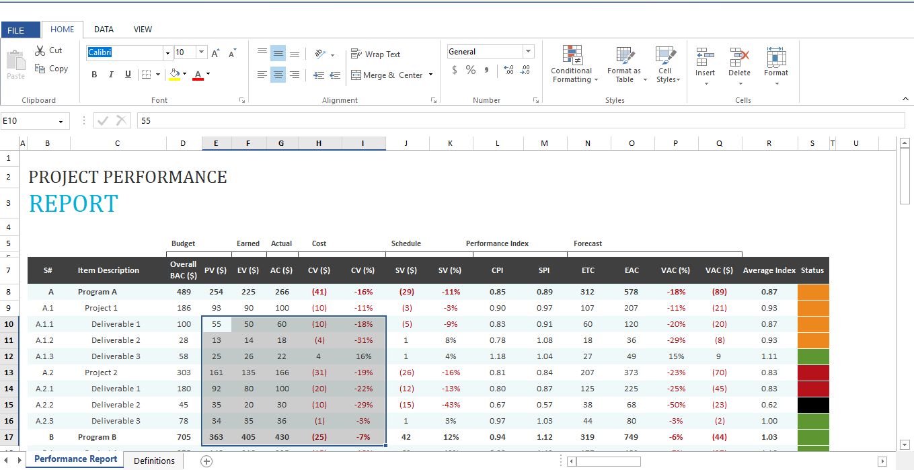

# Windows Forms Spreadsheet Overview

The [WinForms Spreadsheet Editor](https://www.syncfusion.com/spreadsheet-editor-sdk/winforms-spreadsheet-editor) is an Excel inspired control that allows you to create, edit, view and format the Microsoft Excel files without Excel installed. It provides an easy-to-use UI experience with an integrated ribbon for common business scenarios. Spreadsheet comes with built-in calculation engine with support for 400+ most widely used formulas.

Spreadsheet includes several advanced features like 

* **[Editing](Editing) and [Selection](Selection)** - Interactive support for editing and cell selection in the workbook.

* **[Formulas](Formulas)** - Provides support for 400+ most widely used formulas and allows you to add, remove, and edit formulas like in Excel.

* **[Name Manager](https://help.syncfusion.com/document-processing/excel/spreadsheet/winforms/formulas#named-ranges)** - Supports named ranges in formulas. By using named ranges, you can specify a name for a cell range and then use it in formulas more easily without the hassle of remembering cell locations.

* **[Data validation](https://help.syncfusion.com/document-processing/excel/spreadsheet/winforms/editing#data-validation)** - Provides support to ensure data integrity by enforcing end users to enter valid data into cells. If the entered data does not meet the specified criteria, an error message is displayed.

* **[Floating Cells](https://help.syncfusion.com/document-processing/excel/spreadsheet/winforms/formatting#wrap-text)** - Provides support for floating cell mode where text that exceeds the cell width floats into the adjacent cell.

* **[Merge Cells](https://help.syncfusion.com/document-processing/excel/spreadsheet/winforms/formatting#merge-cells)** - Merge two or more adjacent cells into a single cell and display the contents of one cell in the merged cell.

* **[Conditional Formatting](Conditional-Formatting)** - Provides support for Excel-compatible conditional formatting and allows you to apply formats to a cell or range of cells depending on the value of cells or formulas that meet specific criteria. Also provides support to create and import conditional formatting rules such as Data Bars, Icon Sets, and Color Scales, which are used to visualize the data.

* **[Cell Comments](https://help.syncfusion.com/document-processing/excel/spreadsheet/winforms/interactive-features#cell-comments)** - Supports comments that provide additional information about a cell, such as what the value represents. This is useful when end users need to understand the data in cells more deeply.

* **[Hyperlinks and Bookmarks](https://help.syncfusion.com/document-processing/excel/spreadsheet/winforms/editing#hyperlink)** - Provides support to import, create, and edit hyperlinks and bookmarks. The hyperlink is a convenient way to navigate or browse data within a worksheet or other worksheets in a workbook.

* **[Undo/Redo](https://help.syncfusion.com/document-processing/excel/spreadsheet/winforms/interactive-features#undo-or-redo)** - Provides support to undo or redo the changes that you have made in the workbook.

* **[Clipboard Operations](Interactive-Features)** – Provides support for Cut/Copy/Paste Operations in Spreadsheet.

* **Fill Series** - Provides support to automatically fill cells with data that follows or completes a pattern.

* **Ribbon** - Integrated ribbon for an enhanced UI experience.

* **[Freeze panes](https://help.syncfusion.com/document-processing/excel/spreadsheet/winforms/rows-and-columns#freezing-rows-and-columns)** - Provides support to freeze rows and columns.

* **[Resizing and Hiding](https://help.syncfusion.com/document-processing/excel/spreadsheet/winforms/rows-and-columns#hiding-rows-and-columns)** - Provides interactive support to resize or hide and unhide rows and columns.

* **[Charts, Pictures, and Textboxes](Shapes)** - Provides support to import charts, pictures, and text boxes.

* **[Sparklines](https://help.syncfusion.com/document-processing/excel/spreadsheet/winforms/shapes#sparklines)** - Provides support to import sparklines.

* **[Outlines](Outline)** - Provides support to group or ungroup rows and columns.

* **[Workbook and Worksheet Protection](https://help.syncfusion.com/document-processing/excel/spreadsheet/winforms/worksheet-management#protection)** - Provides support to protect the worksheet and also supports locking down the structure and window of the workbook, which enables you to prevent any structural changes or changes in size.

* **[Conversion](Conversion)** - Provides support to export the workbook to PDF, HTML, image, and CSV.

* **[Zooming](https://help.syncfusion.com/document-processing/excel/spreadsheet/winforms/worksheet-management#zooming)** - Provides support to zoom in and zoom out of the worksheet view.

* **[Localization](localization)** - Provides support to localize all the static text in a ribbon and all dialogs to any desired language.

* **Supported file types** - Ability to import the following Excel file types: XLS, XLSX, XLSM, XLT, XLTX, and CSV (comma-delimited).

## Related Link
- [Getting Started](Getting-Started)
- [API Reference](https://help.syncfusion.com/cr/windowsforms/Syncfusion.Windows.Forms.Spreadsheet.html)
- [Online Demos](https://github.com/syncfusion/spreadsheet-editor-sdk-winforms-demos)
- [GitHub Samples](https://github.com/SyncfusionExamples/winforms-spreadsheet-examples)
- [Release Notes](https://help.syncfusion.com/windowsforms/release-notes)