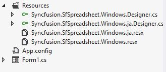
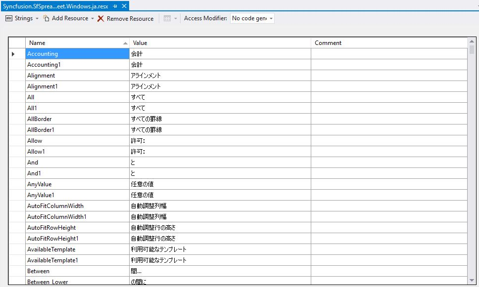
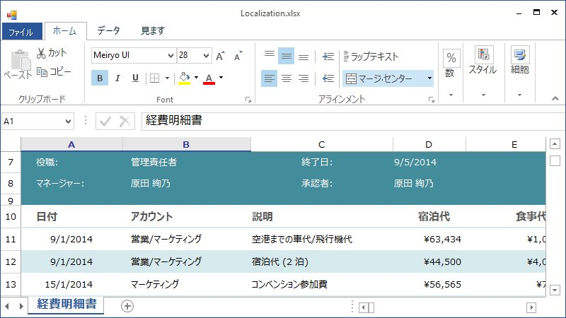
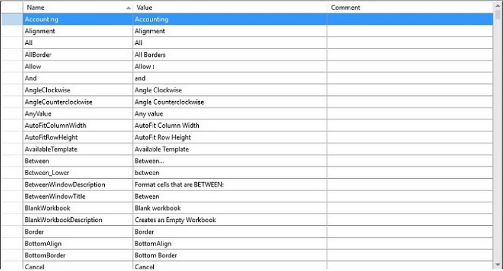

# Localization in Windows Forms Spreadsheet

Localization is the process of adapting the application for a specific language or locale. Spreadsheet supports localizing all the static text in the Ribbon and all its dialogs to any desired language. You can perform localization by adding a resource file and setting the specific culture in the application.

Spreadsheet allows you to set custom resources using a .resx file. You can define your string values in a resource file for a specific culture and then set that culture in your application.

## Set current UI culture to the application

To set the culture in the application, set `CurrentUICulture` before the `InitializeComponent()` method is called.

Set the culture information as shown in the following code:



   
public MainWindow()
{
    System.Threading.Thread.CurrentThread.CurrentUICulture = new CultureInfo("ja-JP");
    InitializeComponent();
}




Now, the application is set to the Japanese culture.

## Localization using resource file

The following steps show how to implement localization in the Spreadsheet control:

1. Create a folder named `Resources` in your application.
2. Add the default English (en-US) resource file for `Spreadsheet` to the `Resources` folder and name it `Syncfusion.Spreadsheet.Windows.resx`.
   You can download the .resx file [here](https://www.syncfusion.com/downloads/support/directtrac/general/ze/Syncfusion.SfSpreadsheet.Windows991194474).
3. Create a .resx file under the `Resources` folder and name it `Syncfusion.Spreadsheet.Windows.[Culture name].resx`.
   For example, `Syncfusion.Spreadsheet.Windows.ja.resx` for the Japanese culture.

   

4. Add the resource keys and their corresponding localized values using the Resource Designer of the `Syncfusion.Spreadsheet.Windows.ja.resx` file.
   For your reference, you can download the Japanese (ja-JP) .resx file [here](https://www.syncfusion.com/downloads/support/directtrac/general/ze/Syncfusion.SfSpreadsheet.Windows991194474).

The following screenshot shows localization in the Spreadsheet:

## Modifying the localized strings in resource file

You can modify the default localized strings by adding the default [.resx](https://www.syncfusion.com/downloads/support/directtrac/general/ze/Syncfusion.SfSpreadsheet.Windows991194474) (resource) file for `Spreadsheet` to the `Resources` folder of your application and naming it `Syncfusion.Spreadsheet.Windows.resx`.

Modify the default strings by changing the Name/Value pairs in the `Syncfusion.Spreadsheet.Windows.resx` file.

