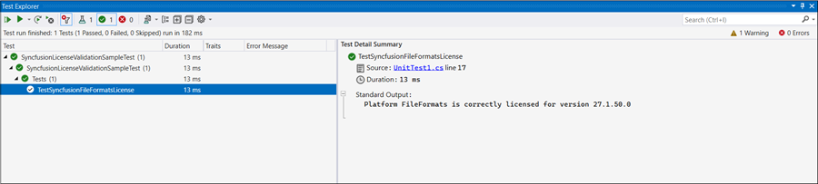
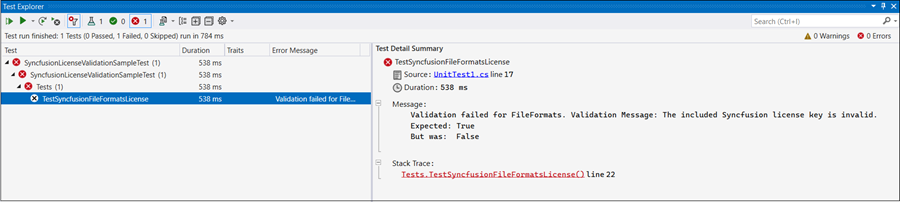

# Overview of Syncfusion license validation in CI services

Validating the Syncfusion&reg; license key as part of your CI pipeline ensures that Syncfusion&reg; Essential Studio components are properly licensed before deployment and helps prevent licensing errors in production. The following sections describe how to validate the license key in Azure Pipelines, GitHub Actions, and Jenkins, and how to validate it programmatically using the `ValidateLicense()` method or a unit test project.

The following section shows how to validate the Syncfusion&reg; license key in CI services.

* Download and extract the LicenseKeyValidator.zip utility from the following link: [LicenseKeyValidator](https://s3.amazonaws.com/files2.syncfusion.com/Installs/LicenseKeyValidation/LicenseKeyValidator.zip).

* Open the LicenseKeyValidation.ps1 PowerShell script in a text or code editor as shown in the following example.



# Replace the parameters with the desired platform, version, and actual license key.

$result = & $PSScriptRoot"\LicenseKeyValidatorConsole.exe" /platform:"WordToPDF" /version:"34.1.29" /licensekey:"Your License Key"

Write-Host $result



# Replace the parameters with the desired platform, version, and actual license key.

$result = & $PSScriptRoot"\LicenseKeyValidatorConsole.exe" /platform:"WordToPDF" /version:"31.1.17" /licensekey:"Your License Key"

Write-Host $result



# Replace the parameters with the desired platform, version, and actual license key.

$result = & $PSScriptRoot"\LicenseKeyValidatorConsole.exe" /platform:"FileFormats" /version:"26.2.4" /licensekey:"Your License Key"

Write-Host $result



* Update the parameters in the script:
  
  **Platform:** Set /platform:"**WordToPDF**" for v34.1.29 and later and v31.1.17 to v33.2.3, or /platform:"**FileFormats**" for before v31.1.17 (use the relevant Syncfusion platform as needed).

  **Version:** Change the value for `/version:` to the required version (for example, `26.2.4`).

  **License Key:** Replace the value for `/licensekey:` with your actual license key (for example, `Your License Key`). To keep the key out of source control, store it as a CI secret and read it in the script (for example, `$env:SYNCFUSION_LICENSE_KEY`).

  N> This feature is supported starting with version 16.2.0.41 of Essential Studio&reg;.

  N> On Windows agents, if script execution is blocked by policy, run the script with `-ExecutionPolicy Bypass` (for example, `powershell -ExecutionPolicy Bypass -File .\LicenseKeyValidation.ps1`). The script returns a non-zero exit code when validation fails so the pipeline step fails.

## Azure Pipelines (YAML)

* Create a new [User-defined Variable](https://learn.microsoft.com/en-us/azure/devops/pipelines/process/variables?view=azure-devops&tabs=yaml%2Cbatch#user-defined-variables) named `LICENSE_VALIDATION` in the Azure Pipeline. Use the path of the LicenseKeyValidation.ps1 script file as the value (for example, `D:\LicenseKeyValidator\LicenseKeyValidation.ps1`).

Integrate the PowerShell task in the pipeline and execute the script to validate the license key. 

The following example shows the syntax for Windows build agents.



pool:
  vmImage: 'windows-latest'

steps:

- task: PowerShell@2
  inputs:
    targetType: filePath
    filePath: $(LICENSE_VALIDATION) #Or the actual path to the LicenseKeyValidation.ps1 script.
  
  displayName: Syncfusion License Validation 



## Azure Pipelines (Classic)

* Create a new [User-defined Variable](https://learn.microsoft.com/en-us/azure/devops/pipelines/process/variables?view=azure-devops&tabs=yaml%2Cbatch#user-defined-variables) named `LICENSE_VALIDATION` in the Azure Pipeline. Use the path of the LicenseKeyValidation.ps1 script file as the value (for example, `D:\LicenseKeyValidator\LicenseKeyValidation.ps1`). Store the license key as a secret variable (for example, `SYNCFUSION_LICENSE_KEY`).

* Add a PowerShell task that runs the script. Mark the build to fail when the script's exit code is non-zero so the pipeline reflects validation failures.

## GitHub Actions

* To execute the script in PowerShell as part of a GitHub Actions workflow, add a step in the workflow YAML file. Update the path of the LicenseKeyValidation.ps1 script file (for example, `./path/LicenseKeyValidator/LicenseKeyValidation.ps1`) and store the license key in a repository or organization secret named `SYNCFUSION_LICENSE_KEY`.

The following example shows the syntax for validating the Syncfusion&reg; license key in GitHub Actions.



steps:
  - name: Syncfusion License Validation
    shell: pwsh
    run: |
	  ./path/LicenseKeyValidator/LicenseKeyValidation.ps1



## Jenkins

* Create an [Environment Variable](https://www.jenkins.io/doc/pipeline/tour/environment) named `LICENSE_VALIDATION`. Use the path of the LicenseKeyValidation.ps1 script file as the value (for example, `D:\LicenseKeyValidator\LicenseKeyValidation.ps1` on Windows agents or `/var/lib/jenkins/LicenseKeyValidator/LicenseKeyValidation.ps1` on Linux agents).

* Add a stage that runs the `LicenseKeyValidation.ps1` script in PowerShell. The example below targets a Linux agent and uses the `sh` step; on Windows agents use the `bat` step with `pwsh`.

The following example shows the syntax for validating the Syncfusion&reg; license key in the Jenkins pipeline.



pipeline {
	agent any
	environment {
		LICENSE_VALIDATION = 'path\\to\\LicenseKeyValidator\\LicenseKeyValidation.ps1'
	}
	stages {
		stage('Syncfusion License Validation') {
			steps {
				sh 'pwsh ${LICENSE_VALIDATION}'
			}
		}
	}
}



## Validate the License Key By Using the ValidateLicense() Method

* Register the license key by calling `SyncfusionLicenseProvider.RegisterLicense("YOUR LICENSE KEY")` before any Syncfusion control is instantiated.

* After registration, validate the key with `SyncfusionLicenseProvider.ValidateLicense(Platform.FileFormats)`, passing the `Platform` enum value that matches your application. This confirms the license is valid for the platform and version in use. The method returns `true` on success and `false` on failure; in overloads that include an `out string validationMessage` parameter, the message describes the failure reason. See the following examples for the correct signature by version.



using Syncfusion.Licensing;

// Register the Syncfusion license key
SyncfusionLicenseProvider.RegisterLicense("YOUR LICENSE KEY");

// Validate the registered license key.
// The array overload allows validating against multiple platforms in a single call.
bool isValid = SyncfusionLicenseProvider.ValidateLicense(new[] { Platform.WordToPDF });



using Syncfusion.Licensing;

// Register the Syncfusion license key
SyncfusionLicenseProvider.RegisterLicense("YOUR LICENSE KEY");

// Validate the registered license key
bool isValid = SyncfusionLicenseProvider.ValidateLicense(Platform.WordToPDF);



using Syncfusion.Licensing;

// Register the Syncfusion license key
SyncfusionLicenseProvider.RegisterLicense("YOUR LICENSE KEY");

// Validate the registered license key
bool isValid = SyncfusionLicenseProvider.ValidateLicense(Platform.FileFormats);



N> Use the specific platform enum (`PDF`, `Word`, `Excel`, `PowerPoint`, `WordToPDF`, `ExcelToPDF`, or `PowerPointToPDF`) for license validation from v31.1.17 and later. `Platform.FileFormats` is not supported from v31.1.17 onwards.

* If the `ValidateLicense()` method returns `true`, the registered license key is valid and the build can proceed with deployment.

* If the `ValidateLicense()` method returns `false`, the build produces invalid license errors. Validation fails when the license key is invalid or the referenced Syncfusion assembly or package versions do not match the version of the license key. Ensure that all referenced Syncfusion&reg; assemblies or NuGet packages share the same version as the license key before deployment.

## Validate the License Key By Using the Unit Test Project

* To create a unit test project in Visual Studio, choose **File -> New -> Project** from the menu. This opens a new dialog for creating a new project. Filter the project type by Test, or type **Test** as a keyword in the search option, to find available unit test projects. Select the appropriate test framework (such as MSTest, NUnit, or xUnit) that best suits your need.

* Add the required Syncfusion references to the test project. The example below uses NUnit, so install the NUnit and NUnit3TestAdapter NuGet packages, then add the `Syncfusion.Licensing` package and the File-Formats platform package (for example, `Syncfusion.PdfToPdfAConverter` or the platform package relevant to your project) at the same version as your license key.

* For more details on creating unit test projects in Visual Studio, refer to the [Getting Started with Unit Testing guide](https://learn.microsoft.com/en-us/visualstudio/test/getting-started-with-unit-testing?view=vs-2022&tabs=dotnet%2Cmstest#create-unit-tests).

* Register the license key by calling `SyncfusionLicenseProvider.RegisterLicense("Your License Key")` in the unit test project. Register the key before any Syncfusion control is instantiated so the validation reflects the runtime configuration.

N> Enclose the license key in double quotes. Also, ensure that `Syncfusion.Licensing` (the `Syncfusion.Licensing.dll` assembly) is referenced in the project where the license key is registered. For .NET Core/5+ projects, add the `Syncfusion.Licensing` NuGet package; for .NET Framework projects, reference `Syncfusion.Licensing.dll` from the installed Essential Studio assemblies.

* Once the license key is registered, it can be validated by using the `ValidateLicense(Platform.FileFormats, out string validationMessage)` method. The `validationMessage` out parameter describes the failure reason when the result is `false`, which makes troubleshooting easier in unit-test output.

* For reference, please check the following example that demonstrates how to register and validate the license key in the unit test project.



public void TestSyncfusionFileFormatsLicense()
{
	var platform = Platform.FileFormats;
	// Register the Syncfusion license key
	SyncfusionLicenseProvider.RegisterLicense("Your License Key");

	bool isValidLicense = SyncfusionLicenseProvider.ValidateLicense(platform, out var validationMessage);
	Assert.That(isValidLicense, Is.True, $"Validation failed for {platform}." + $" Validation Message: {validationMessage}");

	// Log validation messages to TestContext output
	if (isValidLicense)
	{
		TestContext.Out.WriteLine($"Platform {platform} is correctly licensed for version " + $"{typeof(SyncfusionLicenseProvider).Assembly.GetName().Version}");
	}
}



* Once the unit test is executed, if the license key validation passes for the specified platform, output similar to the following is displayed in the **Test Explorer** window.

* If the license validation fails during unit testing, output similar to the following is displayed in the **Test Explorer** window.

* Validation fails when the license key is invalid or the referenced Syncfusion assembly or package versions do not match the version of the license key. Verify that you are using a valid key for the platform and that all referenced Syncfusion packages share the same version as the license key.