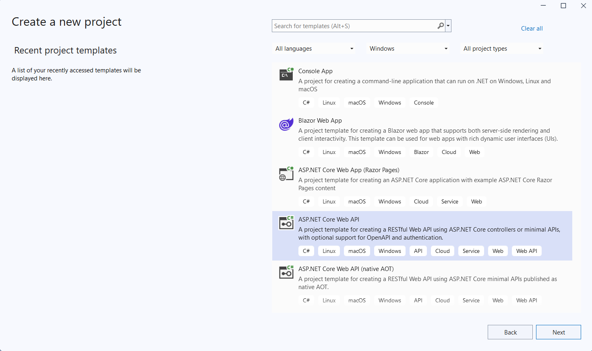
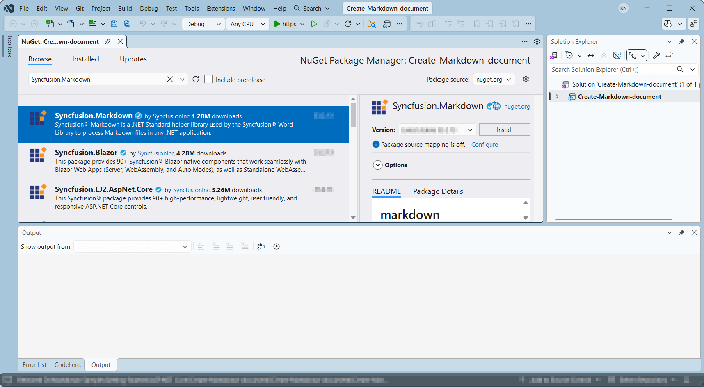
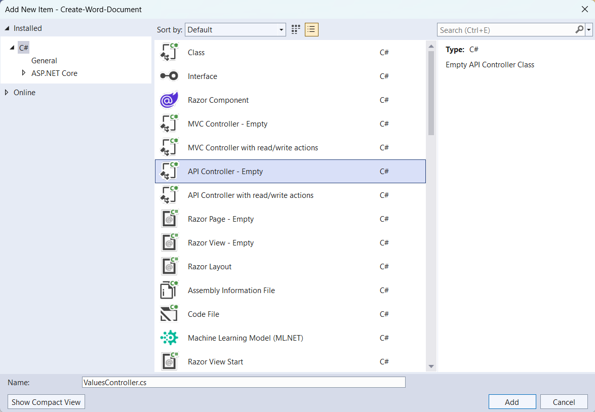

# Create Markdown documents in ASP.NET Core Web API

Syncfusion<sup>&reg;</sup> Essential<sup>&reg;</sup> Markdown is a [.NET Markdown library](https://www.syncfusion.com/document-sdk/net-markdown-library) used to create, read, and edit **Markdown** documents programmatically without external dependencies. Using this library, you can **create a Markdown document in ASP.NET Core Web API**.

## Steps to create Markdown document programmatically

The below steps illustrate creating a simple Markdown document in ASP.NET Core Web API.

Step 1: Create a new C# ASP.NET Core Web API project.



Step 2: Install the [Syncfusion.Markdown](https://www.nuget.org/packages/Syncfusion.Markdown) NuGet package as a reference to your project from [NuGet.org](https://www.nuget.org).



N> **Starting with v16.2.0.x**, if you reference Syncfusion<sup>&reg;</sup> assemblies from the trial setup or from the NuGet feed, you must add a reference to the **Syncfusion.Licensing** assembly and include a valid license key in your application.
N>
N> Install the [Syncfusion.Licensing](https://www.nuget.org/packages/Syncfusion.Licensing) NuGet package and register the license key during application startup.
N>
N> ```csharp
N> Syncfusion.Licensing.SyncfusionLicenseProvider.RegisterLicense("YOUR_LICENSE_KEY");
N> ```
N>
N> For more information about generating and registering a license key, refer to the [Syncfusion<sup>&reg;</sup> licensing documentation](https://help.syncfusion.com/common/essential-studio/licensing/overview).

Step 3: Add a new empty API controller file named **ValuesController.cs** to the project.



Step 4: Include the following namespaces in the **ValuesController.cs** file.





using Microsoft.AspNetCore.Mvc;
using Syncfusion.Office.Markdown;





Step 5: Add a new action method CreateDocument in **ValuesController.cs** and include the below code snippet to create an Markdown file and download it.





[HttpGet]
[Route("api/Word")]
public IActionResult CreateDocument()
{
    try
    {
        var fileDownloadName = "Output.md";
        const string contentType = "text/markdown";
        var stream = GenerateMarkdownDocument();
        stream.Position = 0;
        return File(stream, contentType, fileDownloadName);
    }
    catch (Exception ex)
    {
        // Log or handle the exception
        return BadRequest($"Error occurred while creating Markdown file: {ex.Message}");
    }
}
 
 



Step 6: Implement the `GenerateMarkdownDocument` method in `ValuesController.cs`.
 




 public static MemoryStream GenerateMarkdownDocument()
 {
     // Creates a new instance of MarkdownDocument.
    MarkdownDocument markdownDocument = new MarkdownDocument();
    // Adds a heading to the Markdown document.
    MdParagraph mdHeadingParagraph = markdownDocument.AddParagraph();
    // Applies the Heading 1 style to the paragraph.
    mdHeadingParagraph.ApplyParagraphStyle("Heading 1");
    MdTextRange mdHeadingTextRange = mdHeadingParagraph.AddTextRange();
    mdHeadingTextRange.Text = "Adventure Works Cycles";
    // Adds a paragraph to the Markdown document.
    MdParagraph mdParagraph = markdownDocument.AddParagraph();
    MdTextRange mdTextRange = mdParagraph.AddTextRange();
    mdTextRange.Text = "Adventure Works Cycles, the fictitious company on which the AdventureWorks sample databases are based, is a large, multinational manufacturing company. The company manufactures and sells metal and composite bicycles to North American, European and Asian commercial markets. While its base operation is in Bothell, Washington with 290 employees, several regional sales teams are located throughout their market base.";
    // Adds the first list item.
    MdParagraph item1 = markdownDocument.AddParagraph();
    item1.ListFormat = new MdListFormat();
    item1.ListFormat.IsNumbered = false;
    item1.ListFormat.ListLevel = 0;
    item1.ListFormat.ListValue = "- ";
    item1.AddTextRange().Text = "First item";
    // Adds the second list item.
    MdParagraph item2 = markdownDocument.AddParagraph();
    item2.ListFormat = new MdListFormat();
    item2.ListFormat.IsNumbered = false;
    item2.ListFormat.ListLevel = 0;
    item2.ListFormat.ListValue = "- ";
    item2.AddTextRange().Text = "Second item";
    // Adds the third list item.
    MdParagraph item3 = markdownDocument.AddParagraph();
    item3.ListFormat = new MdListFormat();
    item3.ListFormat.IsNumbered = false;
    item3.ListFormat.ListLevel = 0;
    item3.ListFormat.ListValue = "- ";
    item3.AddTextRange().Text = "Third item";
    // Adds a table to the Markdown document.
    MdTable table = markdownDocument.AddTable();
    table.ColumnAlignments.Add(MdColumnAlignment.Left);
    table.ColumnAlignments.Add(MdColumnAlignment.Left);
    // Adds the header row.
    MdTableRow headerRow = table.AddTableRow();
    MdTableCell header1 = headerRow.AddTableCell();
    header1.Items.Add(new MdTextRange { Text = "Profile picture" });
    MdTableCell header2 = headerRow.AddTableCell();
    header2.Items.Add(new MdTextRange { Text = "Description" });

    // Adds a data row.
    MdTableRow dataRow = table.AddTableRow();
    MdTableCell cell1 = dataRow.AddTableCell();
    MdPicture picture = new MdPicture();
    picture.Url = "Data\\photo.jpg";
    picture.AltText = "Profile picture";
    cell1.Items.Add(picture);
    MdTableCell cell2 = dataRow.AddTableCell();
    cell2.Items.Add(new MdTextRange { Text = "AdventureWorks Cycles, the fictitious company on which the AdventureWorks sample databases are based, is a large, multinational manufacturing company." });
    // Saves the Markdown document to MemoryStream
    MemoryStream stream = new MemoryStream();
    markdownDocument.Save(stream);
    markdownDocument.Dispose();
    //Set the position as '0'.
    stream.Position = 0;
    return stream;
 }





Step 7: Build the project.

Click on Build → Build Solution or press <kbd>Ctrl</kbd>+<kbd>Shift</kbd>+<kbd>B</kbd> to build the project.

Step 8: Run the project.

Click the Start button (green arrow) or press <kbd>F5</kbd> to run the app.

A complete working sample is available on [GitHub](https://github.com/SyncfusionExamples/Markdown-Examples/tree/master/Getting-Started/ASP.NET-Core-Web-API/Create-Markdown-Document).

## Steps for accessing the Web API using HTTP requests

Step 1: Create a console application.


N> Ensure your ASP.NET Core Web API is running on the specified port before running this client. The port number comes from the Web API's `launchSettings.json` adjust it to match your environment.

Step 2: Add the below code snippet in the **Program.cs** file for accessing the Web API using HTTP requests. This example uses C# top-level statements with `await` (supported in .NET 6+ and later).

This method sends a GET request to the Web API endpoint to retrieve and save the generated Markdown document.





 // Create an HttpClient instance
 using (HttpClient client = new HttpClient())
 {
     try
     {
         // Send a GET request to a URL
         HttpResponseMessage response = await client.GetAsync("https://localhost:7152/api/Values/api/Word");
         // Check if the response is successful
         if (response.IsSuccessStatusCode)
         {
             // Read the content as a string
             Stream responseBody = await response.Content.ReadAsStreamAsync();
             FileStream fileStream = File.Create("../../../Output/Output.md");
             responseBody.CopyTo(fileStream);
             fileStream.Close();
         }
         else
         {
             Console.WriteLine("HTTP error status code: " + response.StatusCode);
         }
     }
     catch (HttpRequestException e)
     {
         Console.WriteLine("Request exception: " + e.Message);
     }
 }





Step 3: Build the project.

Click on Build → Build Solution or press <kbd>Ctrl</kbd>+<kbd>Shift</kbd>+<kbd>B</kbd> to build the project.

Step 4: Run the project.

Click the Start button (green arrow) or press <kbd>F5</kbd> to run the app.

A complete working sample is available on [GitHub](https://github.com/SyncfusionExamples/Markdown-Examples/tree/master/Getting-Started/ASP.NET-Core-Web-API/Client%20Application).

Upon executing the program, the **Markdown document** will be generated as follows.


Looking for the full .NET Markdown Library overview, features, pricing, and documentation? Visit the [.NET Markdown Library](https://www.syncfusion.com/document-sdk/net-markdown-library) page.

An online sample link to [create a Markdown document](https://document.syncfusion.com/demos/markdown/createmarkdown#/tailwind) in ASP.NET Core.
