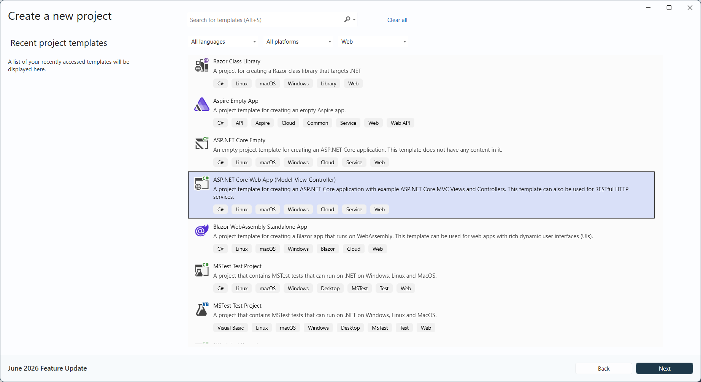
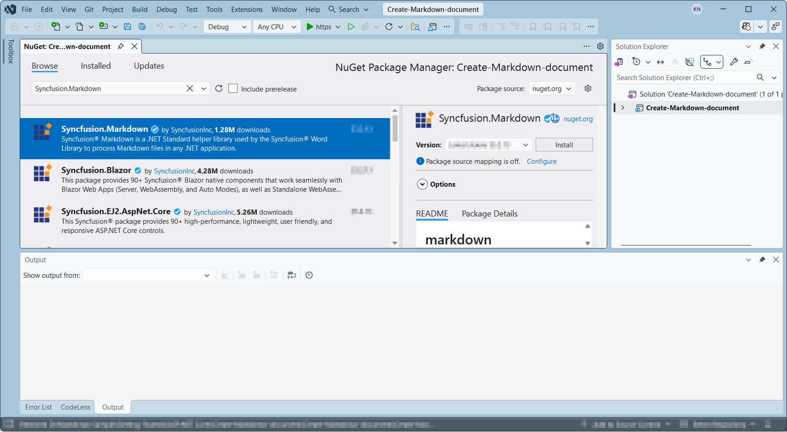
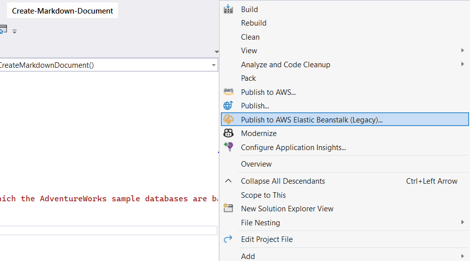
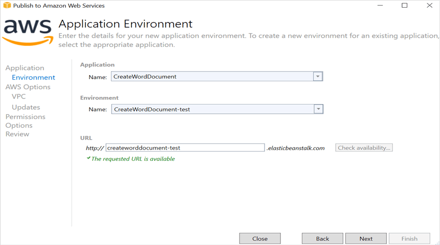
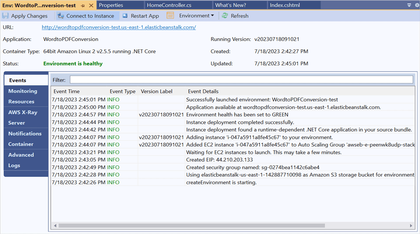
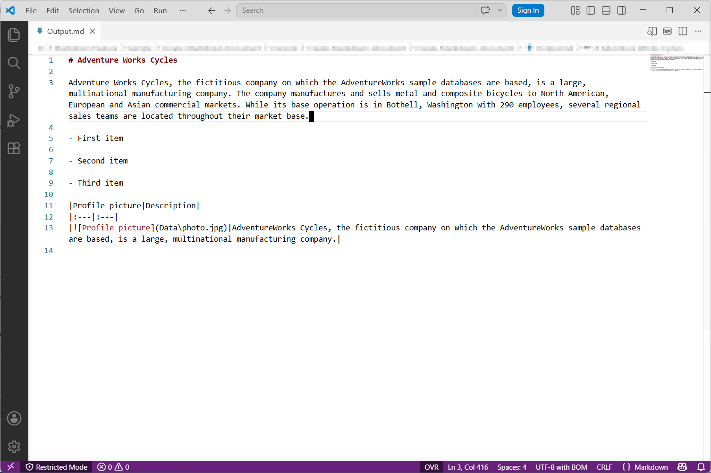

# Create Markdown document in AWS Elastic Beanstalk

Syncfusion<sup>&reg;</sup> Essential<sup>&reg;</sup> Markdown is a [.NET Markdown library](https://www.syncfusion.com/document-sdk/net-markdown-library) used to create, read, edit, and convert Markdown documents programmatically without external dependencies. Using this library, you can **create a Markdown document in AWS Elastic Beanstalk**.

## Prerequisites

* An active **AWS account** with permissions to manage Elastic Beanstalk environments and EC2 instances.
* **AWS Toolkit for Visual Studio** installed and signed in with a configured AWS credentials profile. Refer to the [AWS Toolkit for Visual Studio setup guide](https://docs.aws.amazon.com/toolkit-for-visual-studio/latest/user-guide/welcome.html).
* **Visual Studio 2022** (or later) with the **ASP.NET and web development** workload.
* **.NET 8.0** (or later) SDK installed. Target the project against a .NET version that Elastic Beanstalk supports; see the [AWS Elastic Beanstalk platform support matrix](https://docs.aws.amazon.com/elasticbeanstalk/latest/dg/concepts.platforms.html).

## Steps to create a Markdown document in AWS Elastic Beanstalk

Step 1: Create a new **ASP.NET Core Web application (Model-View-Controller)** project targeting **.NET 8.0** (or later). No authentication is required for this sample.



Step 2: Install the [Syncfusion.Markdown](https://www.nuget.org/packages/Syncfusion.Markdown) NuGet package as a reference to your project from [NuGet.org](https://www.nuget.org/). It is recommended to use the latest version available on NuGet.



N> **Starting with v16.2.0.x**, if you reference Syncfusion<sup>&reg;</sup> assemblies from the trial setup or from the NuGet feed, you must add a reference to the **Syncfusion.Licensing** assembly and include a valid license key in your application.
N>
N> Install the [Syncfusion.Licensing](https://www.nuget.org/packages/Syncfusion.Licensing) NuGet package and register the license key during application startup.
N>
N> ```csharp
N> Syncfusion.Licensing.SyncfusionLicenseProvider.RegisterLicense("YOUR_LICENSE_KEY");
N> ```
N>
N> For more information about generating and registering a license key, refer to the [Syncfusion<sup>&reg;</sup> licensing documentation](https://help.syncfusion.com/common/essential-studio/licensing/overview).

Step 3: Include the following namespaces in the **HomeController.cs** file.




using Syncfusion.Office.Markdown;




Step 4: A default action method named Index will be present in HomeController.cs. Right click on Index method and select **Go To View** where you will be directed to its associated view page **Index.cshtml**.

Step 5: Add a new button in the **Index.cshtml** as shown below. Because the action only downloads a file (no side effects), `FormMethod.Get` is used and the controller action is decorated as an HTTP GET endpoint.




@{
    Html.BeginForm("CreateMarkdownDocument", "Home", FormMethod.Get);
    {
        <div>
           <input type="submit" value="Create Markdown document" style="width:200px;height:27px" />
        </div>
    }
    Html.EndForm();
}




Step 6: Add a new action method **CreateMarkdownDocument** in HomeController.cs and include the below code snippet to **create a Markdown document** and download it.




// Creates a new instance of MarkdownDocument.
MarkdownDocument markdownDocument = new MarkdownDocument();
// Adds a heading to the Markdown document.
MdParagraph mdHeadingParagraph = markdownDocument.AddParagraph();
// Applies the Heading 1 style to the paragraph.
mdHeadingParagraph.ApplyParagraphStyle("Heading 1");
MdTextRange mdHeadingTextRange = mdHeadingParagraph.AddTextRange();
mdHeadingTextRange.Text = "Adventure Works Cycles";
// Adds a paragraph to the Markdown document.
MdParagraph mdParagraph = markdownDocument.AddParagraph();
MdTextRange mdTextRange = mdParagraph.AddTextRange();
mdTextRange.Text = "Adventure Works Cycles, the fictitious company on which the AdventureWorks sample databases are based, is a large, multinational manufacturing company. The company manufactures and sells metal and composite bicycles to North American, European and Asian commercial markets. While its base operation is in Bothell, Washington with 290 employees, several regional sales teams are located throughout their market base.";
// Adds the first list item.
MdParagraph item1 = markdownDocument.AddParagraph();
item1.ListFormat = new MdListFormat();
item1.ListFormat.IsNumbered = false;
item1.ListFormat.ListLevel = 0;
item1.ListFormat.ListValue = "- ";
item1.AddTextRange().Text = "First item";
// Adds the second list item.
MdParagraph item2 = markdownDocument.AddParagraph();
item2.ListFormat = new MdListFormat();
item2.ListFormat.IsNumbered = false;
item2.ListFormat.ListLevel = 0;
item2.ListFormat.ListValue = "- ";
item2.AddTextRange().Text = "Second item";
// Adds the third list item.
MdParagraph item3 = markdownDocument.AddParagraph();
item3.ListFormat = new MdListFormat();
item3.ListFormat.IsNumbered = false;
item3.ListFormat.ListLevel = 0;
item3.ListFormat.ListValue = "- ";
item3.AddTextRange().Text = "Third item";
// Adds a table to the Markdown document.
MdTable table = markdownDocument.AddTable();
table.ColumnAlignments.Add(MdColumnAlignment.Left);
table.ColumnAlignments.Add(MdColumnAlignment.Left);
// Adds the header row.
MdTableRow headerRow = table.AddTableRow();
MdTableCell header1 = headerRow.AddTableCell();
header1.Items.Add(new MdTextRange { Text = "Profile picture" });
MdTableCell header2 = headerRow.AddTableCell();
header2.Items.Add(new MdTextRange { Text = "Description" });

// Adds a data row.
MdTableRow dataRow = table.AddTableRow();
MdTableCell cell1 = dataRow.AddTableCell();
MdPicture picture = new MdPicture();
picture.Url = "wwwroot\\Data\\photo.jpg";
picture.AltText = "Profile picture";
cell1.Items.Add(picture);
MdTableCell cell2 = dataRow.AddTableCell();
cell2.Items.Add(new MdTextRange { Text = "AdventureWorks Cycles, the fictitious company on which the AdventureWorks sample databases are based, is a large, multinational manufacturing company." });

//Saves the Markdown document to MemoryStream.
MemoryStream stream = new MemoryStream();
markdownDocument.Save(stream);

//Download markdown document in the browser.
return File(stream, "text/markdown", "Sample.md");




## Steps to publish as an AWS Elastic Beanstalk application

Step 1: Right-click the project and select **Publish to AWS Elastic Beanstalk (Legacy)** option. (This menu requires the AWS Toolkit for Visual Studio — see [Prerequisites](#prerequisites).)


Step 2: Select the **Deployment Target** as **Create a new application environment** and click **Next**.


Step 3: Choose the **Environment Name** from the dropdown list. The **URL** will be assigned automatically; verify the URL is available. If available, click **Next**; otherwise, change the **URL**.


Step 4: Select the instance type as **t3a.micro** from the dropdown list (sufficient for this lightweight Markdown workload; choose a larger instance for heavier document generation). Configure the platform branch to one that matches your target .NET runtime, then click **Next**.


Step 5: Review the IAM permissions page. Ensure your AWS credentials/profile has the Elastic Beanstalk service and EC2 permissions required to publish. Click **Next** to proceed.


Step 6: Review the application options, then click **Deploy** to deploy the sample to AWS Elastic Beanstalk.


Step 7: After the status changes from **Updating** to **Environment is healthy**, click the **URL**.


Step 8: After opening the provided **URL**, click the **Create Markdown document** button to download the Markdown document.


You can download a complete working sample from [GitHub](https://github.com/SyncfusionExamples/Markdown-Examples/tree/master/Getting-Started/AWS/AWS_Elastic_Beanstalk).

N> The code sample references image files (photo.jpg). Download these assets from the [GitHub sample Data folder](https://github.com/SyncfusionExamples/Markdown-Examples/tree/master/Getting-Started/AWS/AWS_Elastic_Beanstalk/Create-Markdown-Document/wwwroot/Data) and place them in the application's `wwwroot/Data` folder so the relative paths in the code resolve correctly at runtime.

By executing the program, you will get the **Markdown document** as follows.



Looking for the full .NET Markdown Library overview, features, pricing, and documentation? Visit the [.NET Markdown Library](https://www.syncfusion.com/document-sdk/net-markdown-library) page.

An online sample link to [create a Markdown document](https://document.syncfusion.com/demos/markdown/createmarkdown#/tailwind) in ASP.NET Core. 