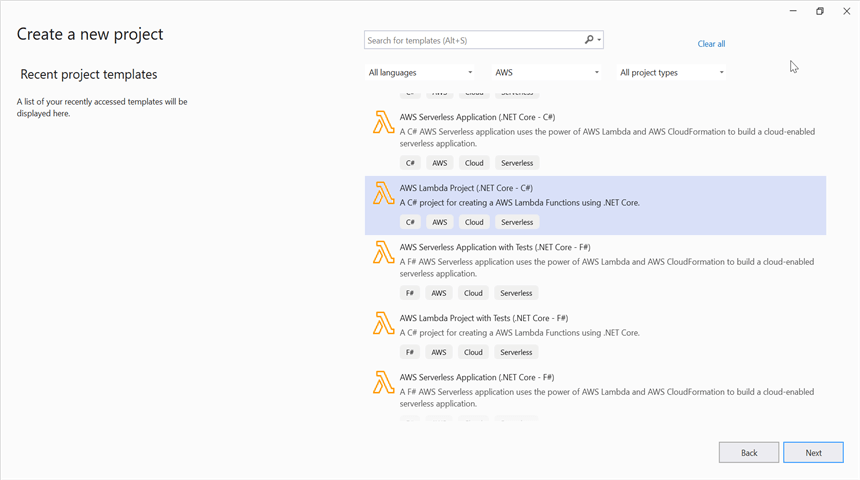
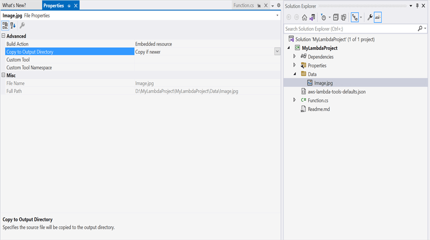
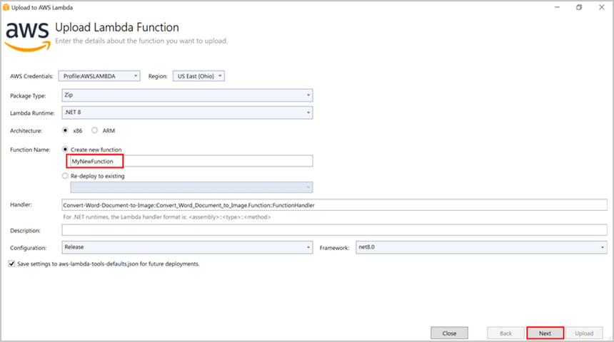
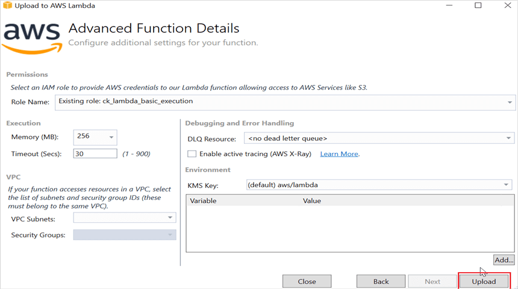
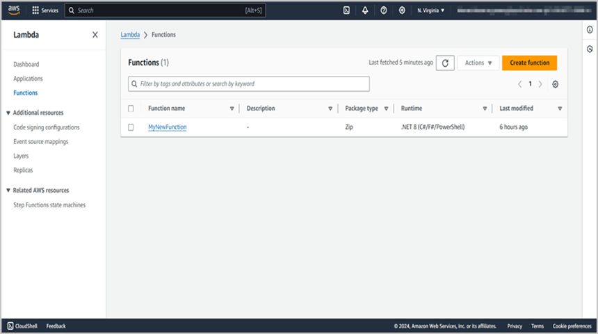
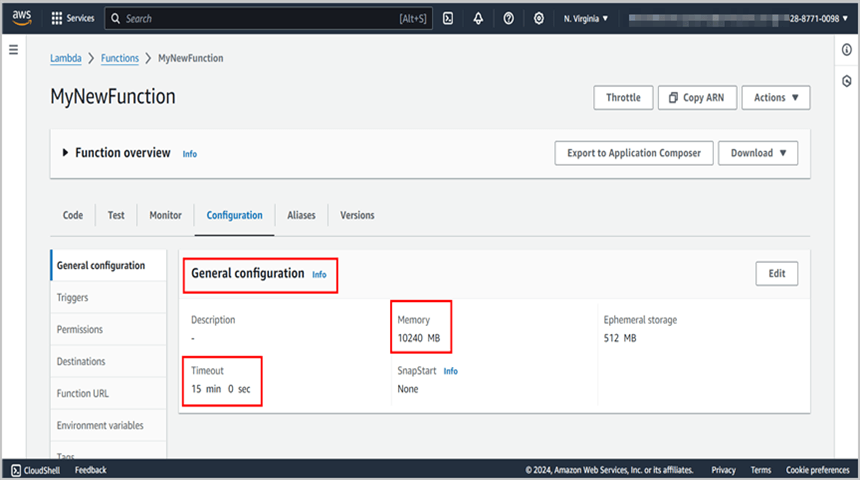
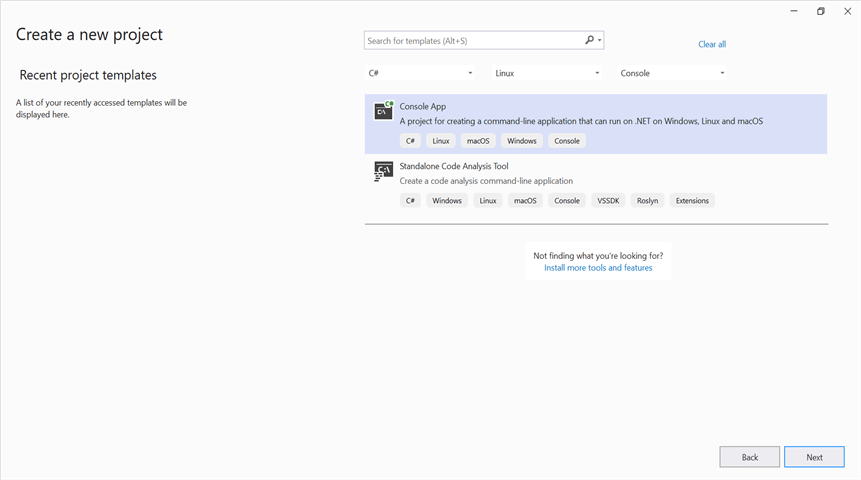
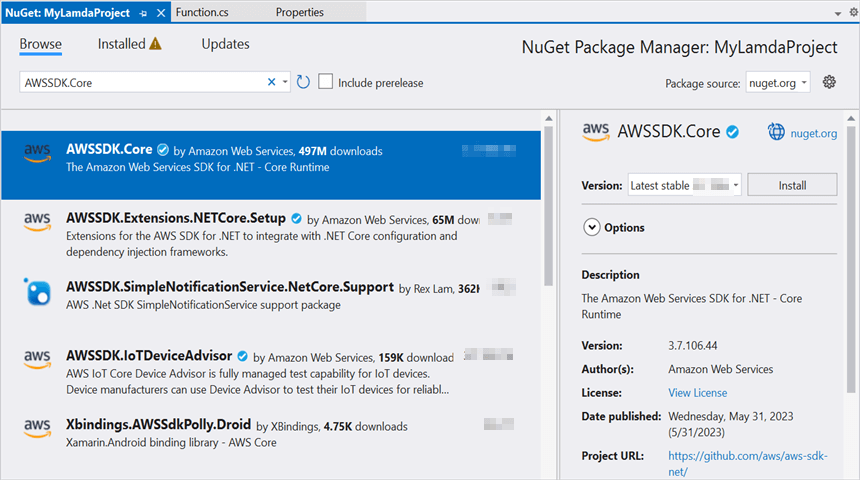
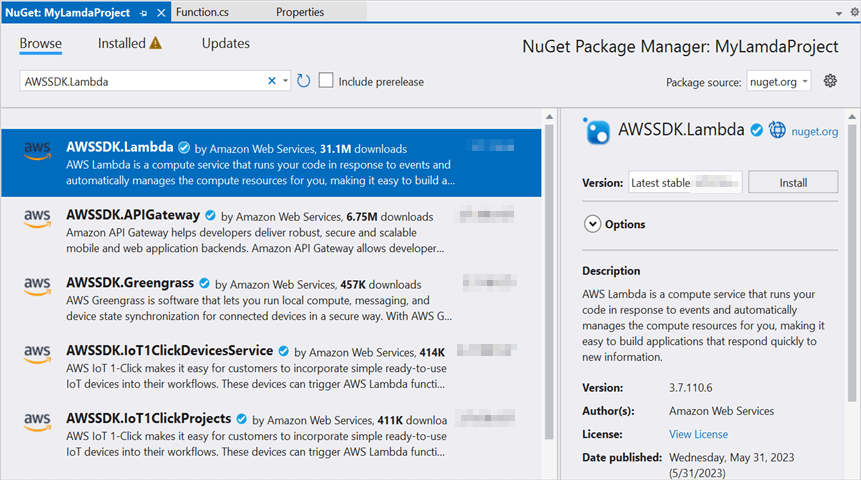
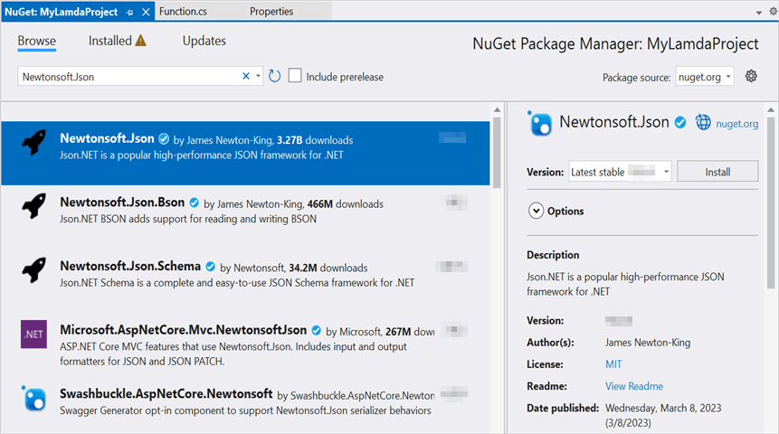

# Create Markdown document in AWS Lambda

Syncfusion<sup>&reg;</sup> Markdown is a [.NET Markdown library](https://www.syncfusion.com/document-sdk/net-markdown-library) used to create, read, edit and convert Markdown documents programmatically without external dependencies. Using this library, you can **create a Markdown document in AWS Lambda**.

## Prerequisites

Before you begin, ensure the following are in place:

* Install the **AWS Toolkit for Visual Studio** extension.
* An active **AWS account** with permission to create and invoke Lambda functions (IAM role with the `AWSLambdaBasicExecutionRole` managed policy).
* **AWS access key ID** and **secret access key** for the console client.
* A supported .NET target framework: **.NET 8 or later**.

## Steps to create Markdown document in AWS Lambda

Step 1: Create a new **AWS Lambda project** as follows.


Step 2: Select Blueprint as Empty Function and click **Finish**.


Step 3: Install the [Syncfusion.Markdown](https://www.nuget.org/packages/Syncfusion.Markdown) NuGet package as a reference to your project from [NuGet.org](https://www.nuget.org/).


N> **Starting with v16.2.0.x**, if you reference Syncfusion<sup>&reg;</sup> assemblies from the trial setup or from the NuGet feed, you must add a reference to the **Syncfusion.Licensing** assembly and include a valid license key in your application.
N>
N> Install the [Syncfusion.Licensing](https://www.nuget.org/packages/Syncfusion.Licensing) NuGet package and register the license key during application startup.
N>
N> ```csharp
N> Syncfusion.Licensing.SyncfusionLicenseProvider.RegisterLicense("YOUR_LICENSE_KEY");
N> ```
N>
N> For more information about generating and registering a license key, refer to the [Syncfusion<sup>&reg;</sup> licensing documentation](https://help.syncfusion.com/common/essential-studio/licensing/overview).

Step 4: Create a folder named `Data` in the project root and copy the following required image files into it. Include the files in the project.

* `photo.jpg`

You can obtain these images from the [Markdown examples repository](https://github.com/SyncfusionExamples/Markdown-Examples/tree/master/Getting-Started/AWS/AWS_Lambda/Create-Markdown-Document/Data).


Step 5: Open the properties of each data file and set **Copy to Output Directory** to **Copy if newer**.


Step 6: Include the following namespaces in **Function.cs** file.




using Syncfusion.Office.Markdown;




step 7: Add the following code snippet in **Function.cs** to **create a Markdown document**.




// Creates a new instance of MarkdownDocument.
MarkdownDocument markdownDocument = new MarkdownDocument();
// Adds a heading to the Markdown document.
MdParagraph mdHeadingParagraph = markdownDocument.AddParagraph();
// Applies the Heading 1 style to the paragraph.
mdHeadingParagraph.ApplyParagraphStyle("Heading 1");
MdTextRange mdHeadingTextRange = mdHeadingParagraph.AddTextRange();
mdHeadingTextRange.Text = "Adventure Works Cycles";
// Adds a paragraph to the Markdown document.
MdParagraph mdParagraph = markdownDocument.AddParagraph();
MdTextRange mdTextRange = mdParagraph.AddTextRange();
mdTextRange.Text = "Adventure Works Cycles, the fictitious company on which the AdventureWorks sample databases are based, is a large, multinational manufacturing company. The company manufactures and sells metal and composite bicycles to North American, European and Asian commercial markets. While its base operation is in Bothell, Washington with 290 employees, several regional sales teams are located throughout their market base.";
// Adds the first list item.
MdParagraph item1 = markdownDocument.AddParagraph();
item1.ListFormat = new MdListFormat();
item1.ListFormat.IsNumbered = false;
item1.ListFormat.ListLevel = 0;
item1.ListFormat.ListValue = "- ";
item1.AddTextRange().Text = "First item";
// Adds the second list item.
MdParagraph item2 = markdownDocument.AddParagraph();
item2.ListFormat = new MdListFormat();
item2.ListFormat.IsNumbered = false;
item2.ListFormat.ListLevel = 0;
item2.ListFormat.ListValue = "- ";
item2.AddTextRange().Text = "Second item";
// Adds the third list item.
MdParagraph item3 = markdownDocument.AddParagraph();
item3.ListFormat = new MdListFormat();
item3.ListFormat.IsNumbered = false;
item3.ListFormat.ListLevel = 0;
item3.ListFormat.ListValue = "- ";
item3.AddTextRange().Text = "Third item";
// Adds a table to the Markdown document.
MdTable table = markdownDocument.AddTable();
table.ColumnAlignments.Add(MdColumnAlignment.Left);
table.ColumnAlignments.Add(MdColumnAlignment.Left);
// Adds the header row.
MdTableRow headerRow = table.AddTableRow();
MdTableCell header1 = headerRow.AddTableCell();
header1.Items.Add(new MdTextRange { Text = "Profile picture" });
MdTableCell header2 = headerRow.AddTableCell();
header2.Items.Add(new MdTextRange { Text = "Description" });

// Adds a data row.
MdTableRow dataRow = table.AddTableRow();
MdTableCell cell1 = dataRow.AddTableCell();
MdPicture picture = new MdPicture();
picture.Url = "Data\\photo.jpg";
picture.AltText = "Profile picture";
cell1.Items.Add(picture);
MdTableCell cell2 = dataRow.AddTableCell();
cell2.Items.Add(new MdTextRange { Text = "AdventureWorks Cycles, the fictitious company on which the AdventureWorks sample databases are based, is a large, multinational manufacturing company." });

//Saves the Markdown document to MemoryStream.
MemoryStream stream = new MemoryStream();
markdownDocument.Save(stream);

//Download markdown document in the browser.
return File(stream, "text/markdown", "Sample.md");




Step 8: Right-click the project and select **Publish to AWS Lambda**.


Step 9: Create a new AWS profile in the Upload Lambda Function Window. To create a profile, you need your AWS access key ID, secret access key, and region. After creating the profile, add a name for the Lambda function to publish. Then, click **Next**.


Step 10: In the Advanced Function Details window, specify the **Role Name** as based on AWS Managed policy. After selecting the role, click the **Upload** button to deploy your application.


Step 11: After deploying the application, you can see the published Lambda function in **the AWS console**.


Step 12: Edit Memory size and Timeout as maximum in General configuration of the AWS Lambda function.


## Steps to invoke the AWS Lambda function from a console app

Step 1: Create a new console project.


Step 2: Install the following **NuGet packages** in your application from [NuGet.org](https://www.nuget.org/).

* [AWSSDK.Core](https://www.nuget.org/packages/AWSSDK.Core/)
* [AWSSDK.Lambda](https://www.nuget.org/packages/AWSSDK.Lambda/)
* [Newtonsoft.Json](https://www.nuget.org/packages/Newtonsoft.Json/)




Step 3: Include the following namespaces in **Program.cs** file.




using Amazon;
using Amazon.Lambda;
using Amazon.Lambda.Model;
using Newtonsoft.Json;




Step 4: Add the following code snippet in **Program.cs** to invoke the published AWS Lambda function using the function name and access keys.

N> The `Payload` value `"\"Test\""` is sent because the Lambda `FunctionHandler` expects a string input, but it is not used inside the handler.




//Create a new AmazonLambdaClient
AmazonLambdaClient client = new AmazonLambdaClient("awsaccessKeyID", "awsSecreteAccessKey", RegionEndpoint.USEast2);
//Create new InvokeRequest with published function name.
InvokeRequest invoke = new InvokeRequest
{
    FunctionName = "MyNewFunction",
    InvocationType = InvocationType.RequestResponse,
    Payload = "\"Test\""
};
//Get the InvokeResponse from client InvokeRequest.
InvokeResponse response = client.Invoke(invoke);
//Read the response stream
var stream = new StreamReader(response.Payload);
JsonReader reader = new JsonTextReader(stream);
var serializer = new JsonSerializer();
var responseText = serializer.Deserialize(reader);
//Convert Base64String into Markdown document
byte[] bytes = Convert.FromBase64String(responseText.ToString());
FileStream fileStream = new FileStream("Sample.md", FileMode.Create);
BinaryWriter writer = new BinaryWriter(fileStream);
writer.Write(bytes, 0, bytes.Length);
writer.Close();
System.Diagnostics.Process.Start("Sample.md");




By executing the program, you will get the **Markdown document** as follows.


From GitHub, you can download the [console application](https://github.com/SyncfusionExamples/Markdown-Examples/tree/master/Getting-Started/AWS/Console_Application) and [AWS Lambda](https://github.com/SyncfusionExamples/Markdown-Examples/tree/master/Getting-Started/AWS/AWS_Lambda) project.

Looking for the full .NET Markdown Library overview, features, pricing, and documentation? Visit the [.NET Markdown Library](https://www.syncfusion.com/document-sdk/net-markdown-library) page.

An online sample link to [create a Markdown document](https://document.syncfusion.com/demos/markdown/createmarkdown#/tailwind) in ASP.NET Core. 