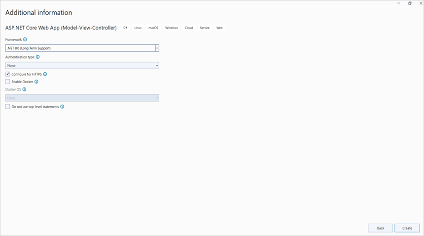
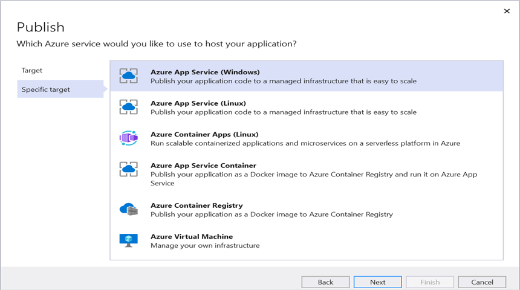
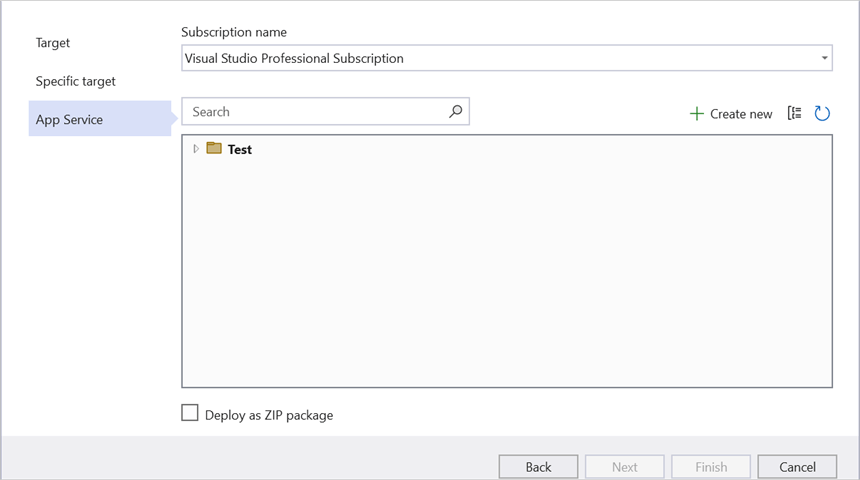
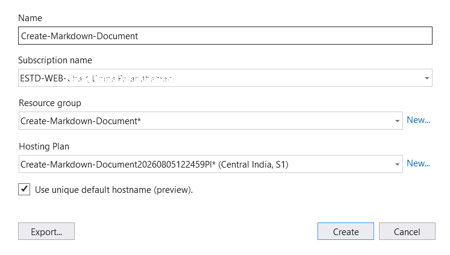
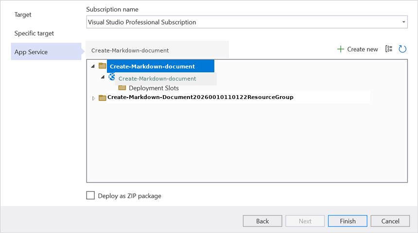
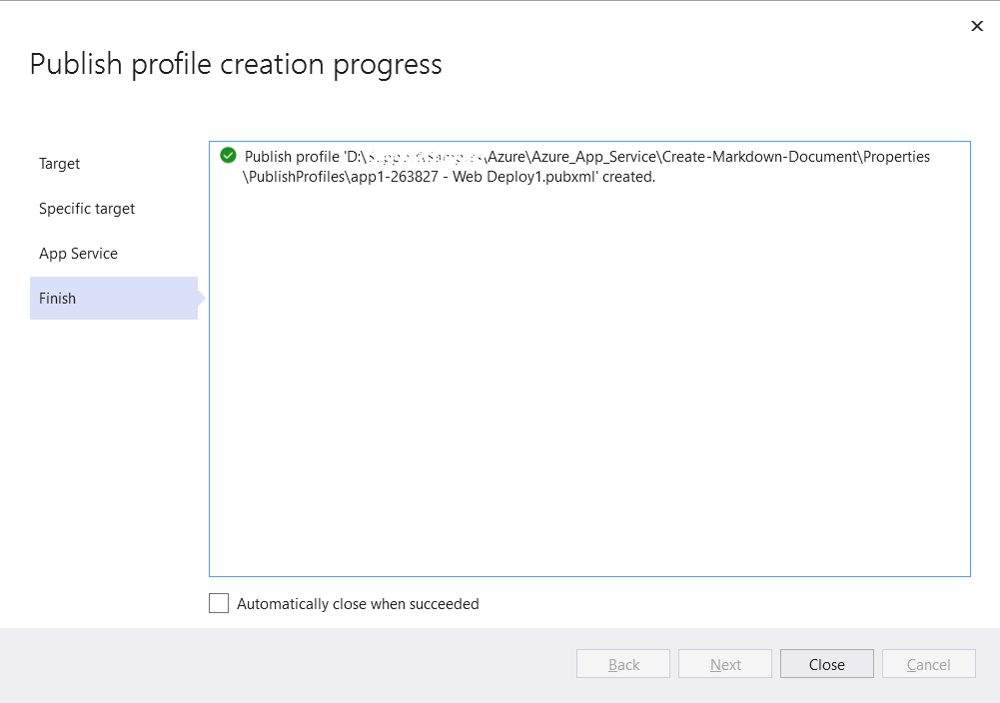
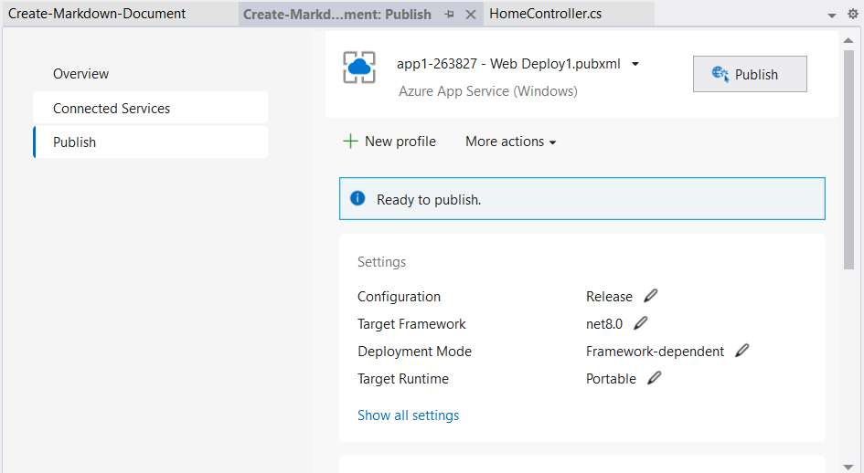
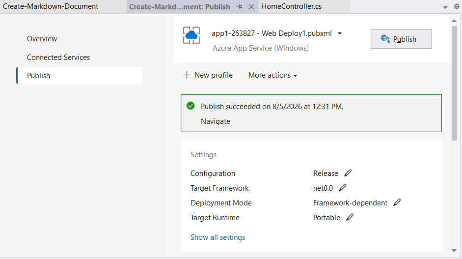
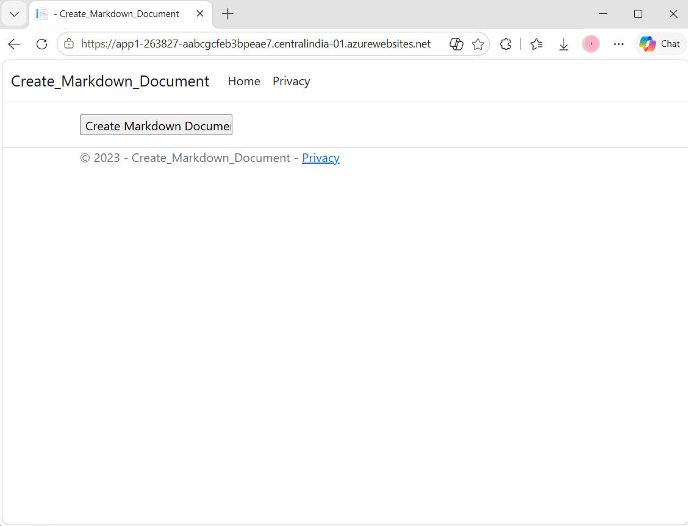

# Create Markdown document in Azure App Service on Windows

Syncfusion<sup>&reg;</sup> Markdown is a [.NET Markdown library](https://www.syncfusion.com/document-sdk/net-markdown-library) used to create, read, edit, and convert Markdown documents programmatically without external dependencies. Using this library, you can **create a Markdown document in Azure App Service on Windows**.

## Steps to create Markdown document in Azure App Service on Windows

Step 1: Create a new ASP.NET Core Web App (Model-View-Controller).


Step 2: Create a project name and select the location.


Step 3: Click the **Create** button.


Step 4: Install the [Syncfusion.Markdown](https://www.nuget.org/packages/Syncfusion.Markdown) NuGet package as a reference to your project from [NuGet.org](https://www.nuget.org/).


N> **Starting with v16.2.0.x**, if you reference Syncfusion<sup>&reg;</sup> assemblies from the trial setup or from the NuGet feed, you must add a reference to the **Syncfusion.Licensing** assembly and include a valid license key in your application.
N>
N> Install the [Syncfusion.Licensing](https://www.nuget.org/packages/Syncfusion.Licensing) NuGet package and register the license key during application startup.
N>
N> ```csharp
N> Syncfusion.Licensing.SyncfusionLicenseProvider.RegisterLicense("YOUR_LICENSE_KEY");
N> ```
N>
N> For more information about generating and registering a license key, refer to the [Syncfusion<sup>&reg;</sup> licensing documentation](https://help.syncfusion.com/common/essential-studio/licensing/overview).

Step 5: Add a new button in the **Index.cshtml** as shown below.




@{
    Html.BeginForm("CreateMarkdownDocument", "Home", FormMethod.Get);
    {
        <div>
            <input type="submit" value="Create Markdown Document" style="width:200px;height:27px" />
        </div>
    }
    Html.EndForm();
}




Step 6: Include the following namespaces in **HomeController.cs**.




using Syncfusion.Office.Markdown;




Step 7: Include the below code snippet in **HomeController.cs** to **create a Markdown document**.




private readonly IWebHostEnvironment _hostingEnvironment;
public HomeController(IWebHostEnvironment hostingEnvironment)
{
  _hostingEnvironment = hostingEnvironment;
}

public ActionResult CreateMarkdownDocument()
{
    // Creates a new instance of MarkdownDocument.
    MarkdownDocument markdownDocument = new MarkdownDocument();
    // Adds a heading to the Markdown document.
    MdParagraph mdHeadingParagraph = markdownDocument.AddParagraph();
    // Applies the Heading 1 style to the paragraph.
    mdHeadingParagraph.ApplyParagraphStyle("Heading 1");
    MdTextRange mdHeadingTextRange = mdHeadingParagraph.AddTextRange();
    mdHeadingTextRange.Text = "Adventure Works Cycles";
    // Adds a paragraph to the Markdown document.
    MdParagraph mdParagraph = markdownDocument.AddParagraph();
    MdTextRange mdTextRange = mdParagraph.AddTextRange();
    mdTextRange.Text = "Adventure Works Cycles, the fictitious company on which the AdventureWorks sample databases are based, is a large, multinational manufacturing company. The company manufactures and sells metal and composite bicycles to North American, European and Asian commercial markets. While its base operation is in Bothell, Washington with 290 employees, several regional sales teams are located throughout their market base.";
    // Adds the first list item.
    MdParagraph item1 = markdownDocument.AddParagraph();
    item1.ListFormat = new MdListFormat();
    item1.ListFormat.IsNumbered = false;
    item1.ListFormat.ListLevel = 0;
    item1.ListFormat.ListValue = "- ";
    item1.AddTextRange().Text = "First item";
    // Adds the second list item.
    MdParagraph item2 = markdownDocument.AddParagraph();
    item2.ListFormat = new MdListFormat();
    item2.ListFormat.IsNumbered = false;
    item2.ListFormat.ListLevel = 0;
    item2.ListFormat.ListValue = "- ";
    item2.AddTextRange().Text = "Second item";
    // Adds the third list item.
    MdParagraph item3 = markdownDocument.AddParagraph();
    item3.ListFormat = new MdListFormat();
    item3.ListFormat.IsNumbered = false;
    item3.ListFormat.ListLevel = 0;
    item3.ListFormat.ListValue = "- ";
    item3.AddTextRange().Text = "Third item";
    // Adds a table to the Markdown document.
    MdTable table = markdownDocument.AddTable();
    table.ColumnAlignments.Add(MdColumnAlignment.Left);
    table.ColumnAlignments.Add(MdColumnAlignment.Left);
    // Adds the header row.
    MdTableRow headerRow = table.AddTableRow();
    MdTableCell header1 = headerRow.AddTableCell();
    header1.Items.Add(new MdTextRange { Text = "Profile picture" });
    MdTableCell header2 = headerRow.AddTableCell();
    header2.Items.Add(new MdTextRange { Text = "Description" });

    // Adds a data row.
    MdTableRow dataRow = table.AddTableRow();
    MdTableCell cell1 = dataRow.AddTableCell();
    MdPicture picture = new MdPicture();
    picture.Url = "wwwroot\\Data\\photo.jpg";
    picture.AltText = "Profile picture";
    cell1.Items.Add(picture);
    MdTableCell cell2 = dataRow.AddTableCell();
    cell2.Items.Add(new MdTextRange { Text = "AdventureWorks Cycles, the fictitious company on which the AdventureWorks sample databases are based, is a large, multinational manufacturing company." });
    // Saves the Markdown document to MemoryStream
    MemoryStream stream = new MemoryStream();
    markdownDocument.Save(stream);
    stream.Position = 0;
    // Disposes the document.
    markdownDocument.Dispose();

    //Download markdown document in the browser.
    return File(stream, "text/markdown", "Sample.md");
}




## Steps to publish as Azure App Service on Windows

Step 1: Right-click the project and select the **Publish** option.


Step 2: Click the **Add a Publish Profile** button.


Step 3: Select the publish target as **Azure**.


Step 4: Select the Specific target as **Azure App Service (Windows)**.


Step 5: To create a new app service, click the **Create new** option.


Step 6: Click the **Create** button to proceed with **App Service** creation.


Step 7: Click the **Finish** button to finalize the **App Service** creation.


Step 8: Click the **Close** button.


Step 9: Click the **Publish** button.


Step 10: The publish has now succeeded.


Step 11: The published webpage will open in the browser.


Step 12: On the published page, click **Create Markdown Document** to generate the document. You will get the output **Markdown document** as follows.


N> The code sample references an image file (`photo.jpg`). Download this asset from the [GitHub sample Assets folder](https://github.com/SyncfusionExamples/Markdown-Examples/tree/master/Getting-Started/Azure/Azure_App_Service/Create-Markdown-Document/wwwroot/Data) and place it in the application's `wwwroot/Data` folder so the `MdPicture.Url` value (`"wwwroot/Data/photo.jpg"`) resolves correctly at runtime.

You can download a complete working sample from [GitHub](https://github.com/SyncfusionExamples/Markdown-Examples/tree/master/Getting-Started/Azure/Azure_App_Service).

Looking for the full .NET Markdown Library overview, features, pricing, and documentation? Visit the [.NET Markdown Library](https://www.syncfusion.com/document-sdk/net-markdown-library) page.