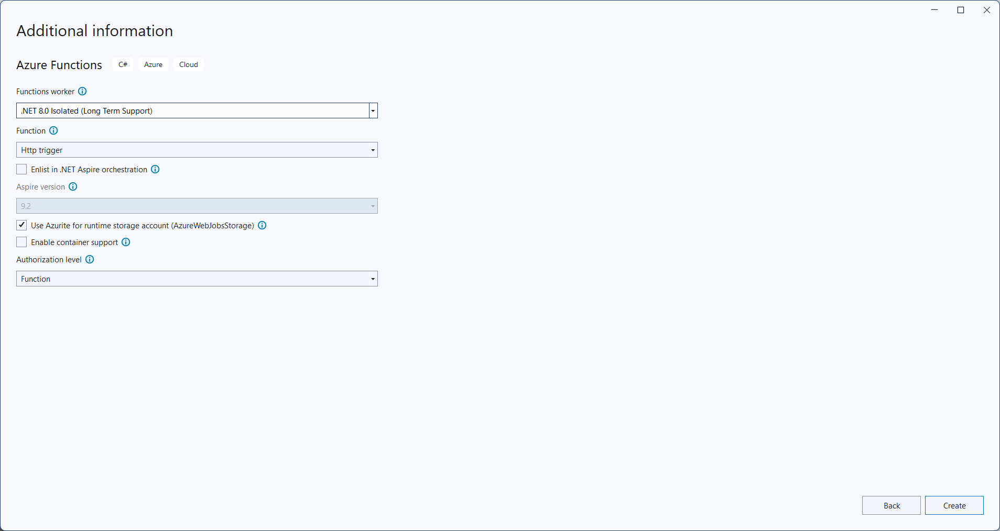
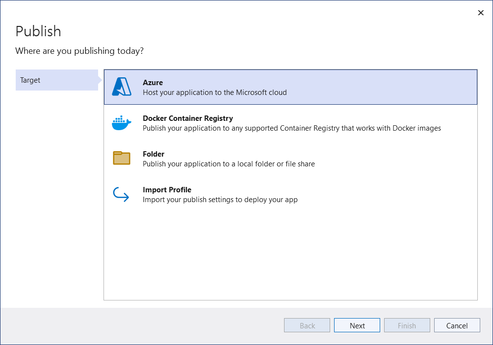
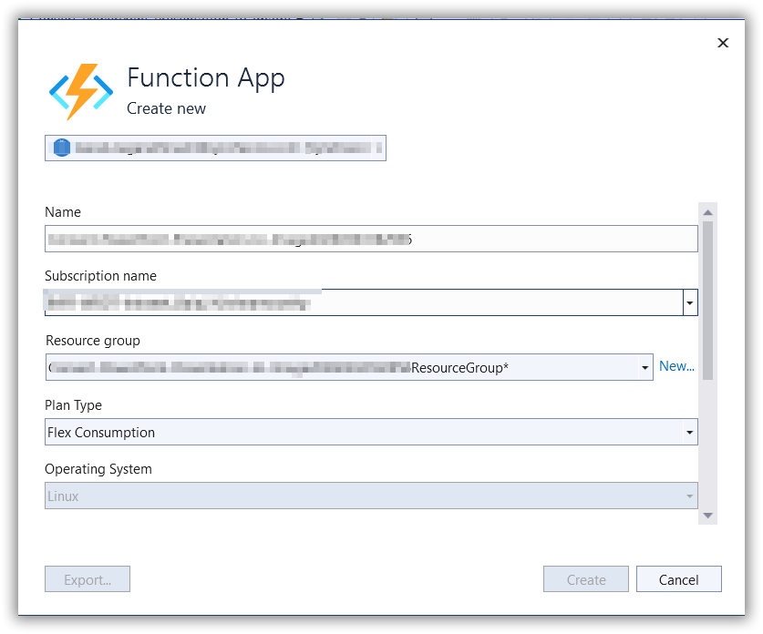
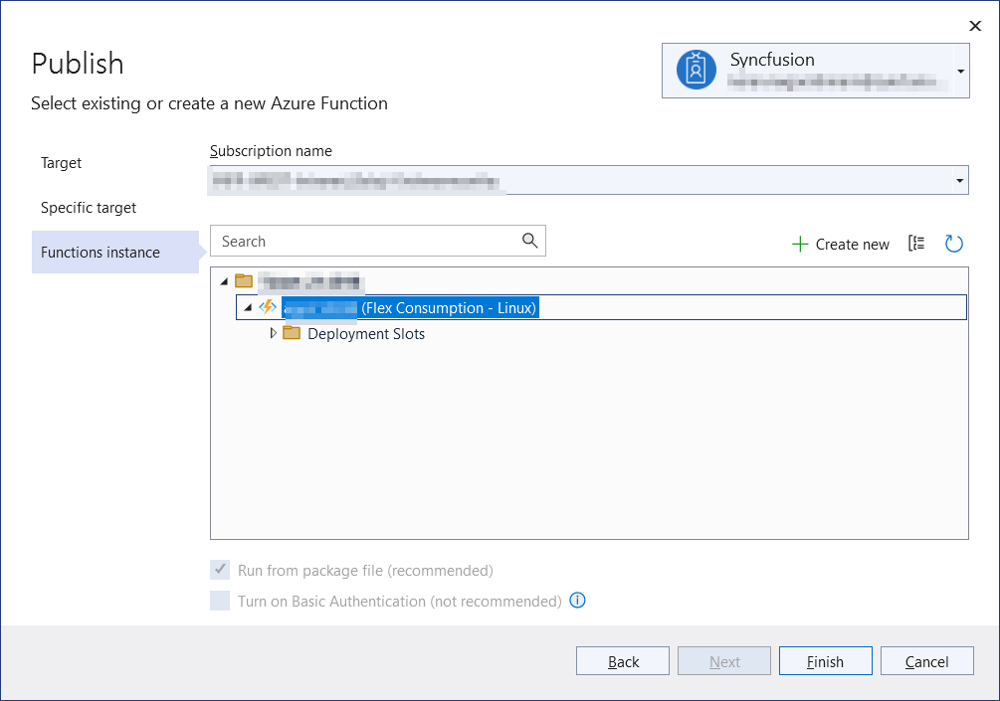
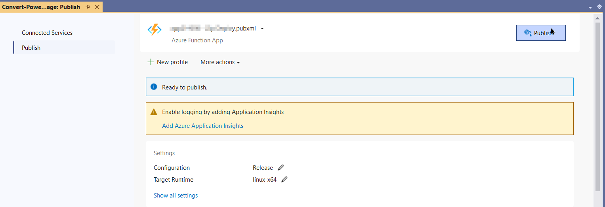

# Create Markdown document in Azure Functions (Flex Consumption)

Syncfusion<sup>&reg;</sup> Markdown is a [.NET Markdown library](https://www.syncfusion.com/document-sdk/net-markdown-library) used to create, read, edit, and convert Markdown documents programmatically without external dependencies. Using this library, you can **Create Markdown document in Azure Functions deployed on Flex (Consumption) plan**.

## Steps to Create Markdown document in Azure Functions (Flex Consumption)

Step 1: Create a new Azure Functions project.


Step 2: Create a project name and select the location.


Step 3: Select function worker as **.NET 8.0 (Long Term Support)** (isolated worker) and target Flex/Consumption hosting suitable for isolated worker.


Step 4: Install the [Syncfusion.Markdown](https://www.nuget.org/packages/Syncfusion.Markdown) NuGet package as a reference to your project from [NuGet.org](https://www.nuget.org/).


N> **Starting with v16.2.0.x**, if you reference Syncfusion<sup>&reg;</sup> assemblies from the trial setup or from the NuGet feed, you must add a reference to the **Syncfusion.Licensing** assembly and include a valid license key in your application.
N>
N> Install the [Syncfusion.Licensing](https://www.nuget.org/packages/Syncfusion.Licensing) NuGet package and register the license key during application startup.
N>
N> ```csharp
N> Syncfusion.Licensing.SyncfusionLicenseProvider.RegisterLicense("YOUR_LICENSE_KEY");
N> ```
N>
N> For more information about generating and registering a license key, refer to the [Syncfusion<sup>&reg;</sup> licensing documentation](https://help.syncfusion.com/common/essential-studio/licensing/overview).

Step 5: Include the following namespaces in the **Function1.cs** file.





using Syncfusion.Office.Markdown;





Step 6: Add the following code snippet in **Run** method of **Function1** class to perform **Create Markdown document** in Azure Functions and return the resultant **Markdown document** to client end.




public async Task<IActionResult> Run([HttpTrigger(AuthorizationLevel.Function, "post")] HttpRequest req)
    {
        try
        {
            // Creates a new instance of MarkdownDocument.
            MarkdownDocument markdownDocument = new MarkdownDocument();
            // Adds a heading to the Markdown document.
            MdParagraph mdHeadingParagraph = markdownDocument.AddParagraph();
            // Applies the Heading 1 style to the paragraph.
            mdHeadingParagraph.ApplyParagraphStyle("Heading 1");
            MdTextRange mdHeadingTextRange = mdHeadingParagraph.AddTextRange();
            mdHeadingTextRange.Text = "Adventure Works Cycles";
            // Adds a paragraph to the Markdown document.
            MdParagraph mdParagraph = markdownDocument.AddParagraph();
            MdTextRange mdTextRange = mdParagraph.AddTextRange();
            mdTextRange.Text = "Adventure Works Cycles, the fictitious company on which the AdventureWorks sample databases are based, is a large, multinational manufacturing company. The company manufactures and sells metal and composite bicycles to North American, European and Asian commercial markets. While its base operation is in Bothell, Washington with 290 employees, several regional sales teams are located throughout their market base.";
            // Adds the first list item.
            MdParagraph item1 = markdownDocument.AddParagraph();
            item1.ListFormat = new MdListFormat();
            item1.ListFormat.IsNumbered = false;
            item1.ListFormat.ListLevel = 0;
            item1.ListFormat.ListValue = "- ";
            item1.AddTextRange().Text = "First item";
            // Adds the second list item.
            MdParagraph item2 = markdownDocument.AddParagraph();
            item2.ListFormat = new MdListFormat();
            item2.ListFormat.IsNumbered = false;
            item2.ListFormat.ListLevel = 0;
            item2.ListFormat.ListValue = "- ";
            item2.AddTextRange().Text = "Second item";
            // Adds the third list item.
            MdParagraph item3 = markdownDocument.AddParagraph();
            item3.ListFormat = new MdListFormat();
            item3.ListFormat.IsNumbered = false;
            item3.ListFormat.ListLevel = 0;
            item3.ListFormat.ListValue = "- ";
            item3.AddTextRange().Text = "Third item";
            // Adds a table to the Markdown document.
            MdTable table = markdownDocument.AddTable();
            table.ColumnAlignments.Add(MdColumnAlignment.Left);
            table.ColumnAlignments.Add(MdColumnAlignment.Left);
            // Adds the header row.
            MdTableRow headerRow = table.AddTableRow();
            MdTableCell header1 = headerRow.AddTableCell();
            header1.Items.Add(new MdTextRange { Text = "Profile picture" });
            MdTableCell header2 = headerRow.AddTableCell();
            header2.Items.Add(new MdTextRange { Text = "Description" });

            // Adds a data row.
            MdTableRow dataRow = table.AddTableRow();
            MdTableCell cell1 = dataRow.AddTableCell();
            MdPicture picture = new MdPicture();
            picture.Url = "Data\\photo.jpg";
            picture.AltText = "Profile picture";
            cell1.Items.Add(picture);
            MdTableCell cell2 = dataRow.AddTableCell();
            cell2.Items.Add(new MdTextRange { Text = "AdventureWorks Cycles, the fictitious company on which the AdventureWorks sample databases are based, is a large, multinational manufacturing company." });
            

            MemoryStream memoryStream = new MemoryStream();
            //Saves the Markdown document file.
            markdownDocument.Save(memoryStream);
            memoryStream.Position = 0;
            markdownDocument.Dispose();
            var bytes = memoryStream.ToArray();
            return new FileContentResult(bytes, "text/markdown")
            {
                FileDownloadName = "document.md"
            };
        }
        catch (Exception ex)
        {
            // Log the error with details for troubleshooting
            _logger.LogError(ex, "Error converting Markdown document to Image.");
            // Prepare error message including exception details
            var msg = $"Exception: {ex.Message}\n\n{ex}";
            // Return a 500 Internal Server Error response with the message
            return new ContentResult { StatusCode = 500, Content = msg, ContentType = "text/plain; charset=utf-8" };
        }
    }
	



Step 7: Right click the project and select **Publish**. Then, create a new profile in the Publish Window.


Step 8: Select the target as **Azure** and click **Next** button.


Step 9: Select the specific target as **Azure Function App** and click **Next** button.


Step 10: Select the **Create new** button.


Step 11: Click **Create** button. 


Step 12: After creating app service then click **Finish** button. 


Step 13: Click the **Publish** button.


Step 14: Publish has been succeed.


Step 15: Now, go to Azure portal and select the App Services. After running the service, click **Get function URL by copying it**. Then, paste it in the below client sample (which will request the Azure Functions, to perform **create a Markdown document** using the template Markdown document). You will get the output Markdown document as follows.


## Steps to post the request to Azure Functions

Step 1: Create a console application to request the Azure Functions API.

Step 2: Add the following code snippet into Main method to post the request to Azure Functions with template Markdown document and get the resultant Markdown document.



static async Task Main()
    {
        try
        {
            Console.Write("Please enter your Azure Function URL: ");
            string url = Console.ReadLine();
            if (string.IsNullOrWhiteSpace(url)) return;
            // Create a new HttpClient instance for sending HTTP requests
            using var http = new HttpClient();
            using var content = new StringContent(string.Empty);
            using var res = await http.PostAsync(url, content);
            // Read the response body as a byte array
            var resBytes = await res.Content.ReadAsByteArrayAsync();
            // Extract the media type from the response headers
            string mediaType = res.Content.Headers.ContentType?.MediaType ?? string.Empty;
            // Decide the output file path the response is an markdown or txt   
            string outputPath = mediaType.Contains("word", StringComparison.OrdinalIgnoreCase)
                || mediaType.Contains("officedocument", StringComparison.OrdinalIgnoreCase)
                || mediaType.Equals("text/markdown", StringComparison.OrdinalIgnoreCase)
                ? Path.GetFullPath("../../../Output/Output.md")
                : Path.GetFullPath("../../../Output/function-error.txt");
            // Write the response bytes to the output markdown file
            await File.WriteAllBytesAsync(outputPath, resBytes);
            Console.WriteLine($"Saved: {outputPath}");
        }
        catch (Exception ex)
        {
           throw;
        }        
    }



From GitHub, you can download the [console application](https://github.com/SyncfusionExamples/Markdown-Examples/tree/master/Getting-Started/Azure/Azure_Functions/Console_App_Flex_Consumption) and [Azure Functions Flex Consumption](https://github.com/SyncfusionExamples/Markdown-Examples/tree/master/Getting-Started/Azure/Azure_Functions/Azure_Functions_Flex_Consumption).

N> The code sample references an image file (`photo.jpg`). Download this asset from the [GitHub sample Data folder](https://github.com/SyncfusionExamples/Markdown-Examples/tree/master/Getting-Started/Azure/Azure_Functions/Azure_Functions_Flex_Consumption/Create-Markdown-Document/Data) and place it in the application's `Data` folder so the `MdPicture.Url` value (`"Data/photo.jpg"`) resolves correctly at runtime.

Looking for the full .NET Markdown Library overview, features, pricing, and documentation? Visit the [.NET Markdown Library](https://www.syncfusion.com/document-sdk/net-markdown-library) page.

An online sample link to [create a Markdown document](https://document.syncfusion.com/demos/markdown/createmarkdown#/tailwind) in ASP.NET Core. 