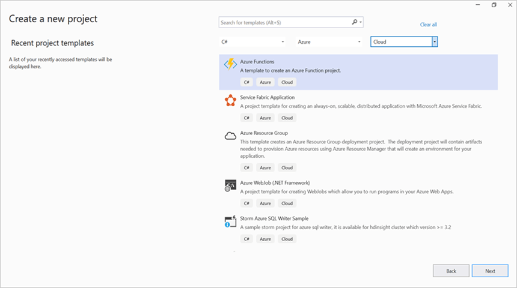
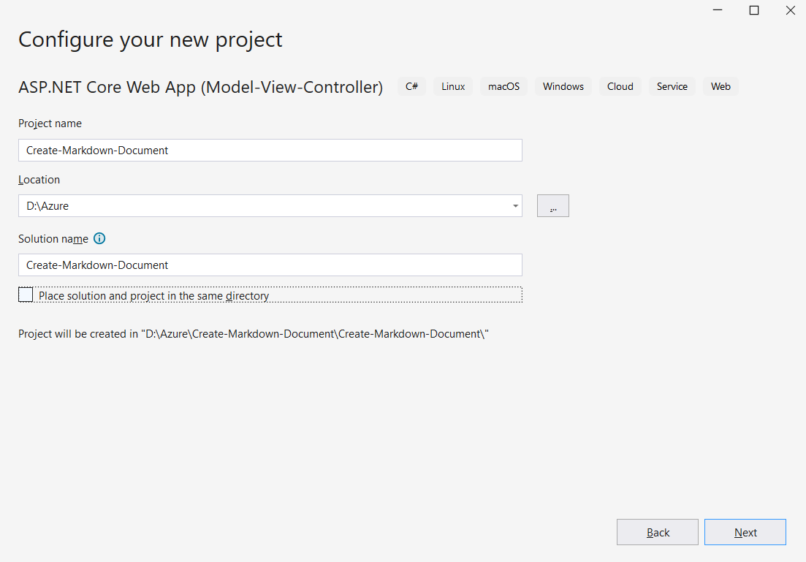
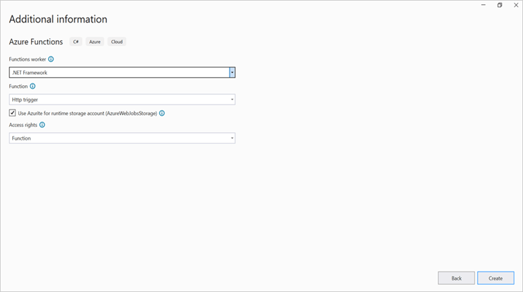
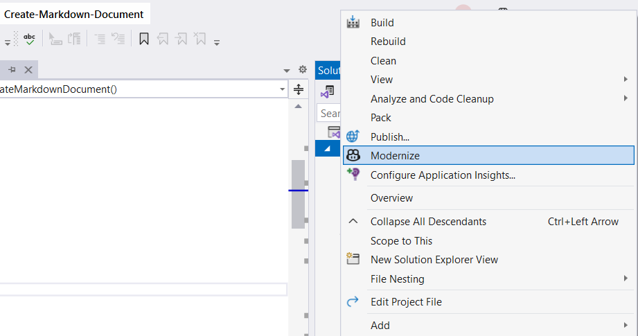
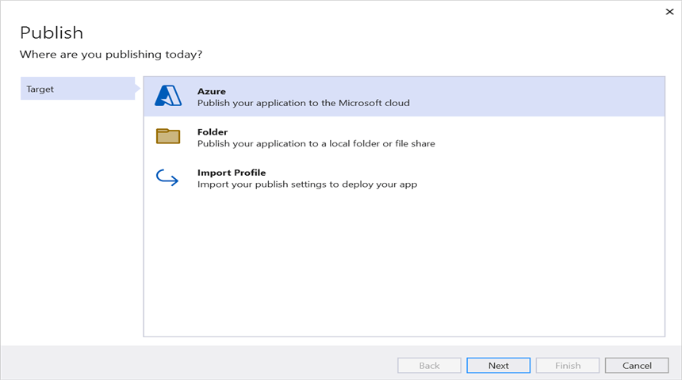
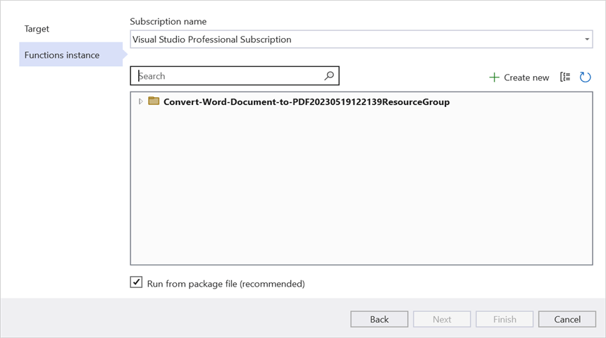
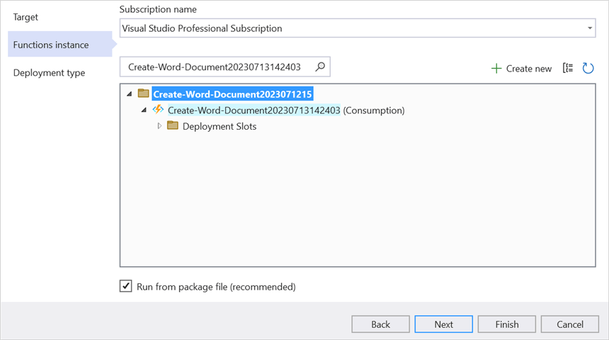
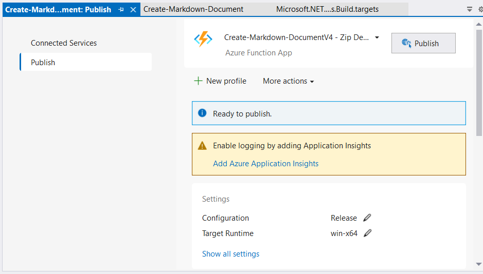
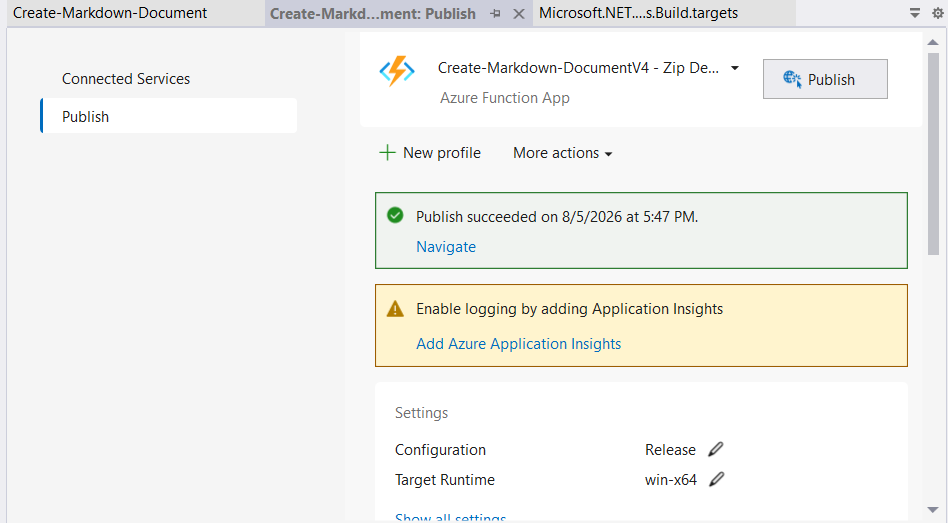

# Create Markdown document in Azure Functions v4

Syncfusion<sup>&reg;</sup> Markdown is a [.NET Markdown library](https://www.syncfusion.com/document-sdk/net-markdown-library) used to create, read, edit and convert Markdown documents programmatically without **Microsoft Markdown** or interop dependencies. Using this library, you can **create a Markdown document in Azure Functions v4**.

## Prerequisites

* Visual Studio 2022 with the **Azure Development** workload installed.
* An active Azure subscription.
* The **Azure Functions Core Tools** for local debugging.
* The example uses the Azure Functions **.NET 8 isolated worker** model. When you create the project, select **.NET 8.0 (Long Term Support)** and **Isolated** as the worker model.

## Steps to create a Markdown document in Azure Functions v4

Step 1: Create a new Azure Functions project.


Step 2: Create a project name and select the location.


Step 3: Select the function worker as **.NET 8.0 (Long Term Support)** and the **Isolated** worker model.


Step 4: Install the [Syncfusion.Markdown](https://www.nuget.org/packages/Syncfusion.Markdown) NuGet package as a reference to your project from [NuGet.org](https://www.nuget.org/).


N> **Starting with v16.2.0.x**, if you reference Syncfusion<sup>&reg;</sup> assemblies from the trial setup or from the NuGet feed, you must add a reference to the **Syncfusion.Licensing** assembly and include a valid license key in your application.
N>
N> Install the [Syncfusion.Licensing](https://www.nuget.org/packages/Syncfusion.Licensing) NuGet package and register the license key during application startup.
N>
N> ```csharp
N> Syncfusion.Licensing.SyncfusionLicenseProvider.RegisterLicense("YOUR_LICENSE_KEY");
N> ```
N>
N> For more information about generating and registering a license key, refer to the [Syncfusion<sup>&reg;</sup> licensing documentation](https://help.syncfusion.com/common/essential-studio/licensing/overview).

Step 5: Include the following namespaces in the **Function1.cs** file.




using System;
using System.IO;
using System.Net;
using System.Net.Http;
using System.Net.Http.Headers;
using System.Reflection;
using Syncfusion.Office.Markdown;




Step 6: Add the following code snippet in the **Run** method of the **Function1** class to create a Markdown document in Azure Functions and return the resulting Markdown document to the client. The full method signature is shown below; the `[Function]` and `[HttpTrigger]` attributes define the HTTP trigger that the function responds to.




// Creates a new instance of MarkdownDocument.
MarkdownDocument markdownDocument = new MarkdownDocument();
// Adds a heading to the Markdown document.
MdParagraph mdHeadingParagraph = markdownDocument.AddParagraph();
// Applies the Heading 1 style to the paragraph.
mdHeadingParagraph.ApplyParagraphStyle("Heading 1");
MdTextRange mdHeadingTextRange = mdHeadingParagraph.AddTextRange();
mdHeadingTextRange.Text = "Adventure Works Cycles";
// Adds a paragraph to the Markdown document.
MdParagraph mdParagraph = markdownDocument.AddParagraph();
MdTextRange mdTextRange = mdParagraph.AddTextRange();
mdTextRange.Text = "Adventure Works Cycles, the fictitious company on which the AdventureWorks sample databases are based, is a large, multinational manufacturing company. The company manufactures and sells metal and composite bicycles to North American, European and Asian commercial markets. While its base operation is in Bothell, Washington with 290 employees, several regional sales teams are located throughout their market base.";
// Adds the first list item.
MdParagraph item1 = markdownDocument.AddParagraph();
item1.ListFormat = new MdListFormat();
item1.ListFormat.IsNumbered = false;
item1.ListFormat.ListLevel = 0;
item1.ListFormat.ListValue = "- ";
item1.AddTextRange().Text = "First item";
// Adds the second list item.
MdParagraph item2 = markdownDocument.AddParagraph();
item2.ListFormat = new MdListFormat();
item2.ListFormat.IsNumbered = false;
item2.ListFormat.ListLevel = 0;
item2.ListFormat.ListValue = "- ";
item2.AddTextRange().Text = "Second item";
// Adds the third list item.
MdParagraph item3 = markdownDocument.AddParagraph();
item3.ListFormat = new MdListFormat();
item3.ListFormat.IsNumbered = false;
item3.ListFormat.ListLevel = 0;
item3.ListFormat.ListValue = "- ";
item3.AddTextRange().Text = "Third item";
// Adds a table to the Markdown document.
MdTable table = markdownDocument.AddTable();
table.ColumnAlignments.Add(MdColumnAlignment.Left);
table.ColumnAlignments.Add(MdColumnAlignment.Left);
// Adds the header row.
MdTableRow headerRow = table.AddTableRow();
MdTableCell header1 = headerRow.AddTableCell();
header1.Items.Add(new MdTextRange { Text = "Profile picture" });
MdTableCell header2 = headerRow.AddTableCell();
header2.Items.Add(new MdTextRange { Text = "Description" });

// Adds a data row.
MdTableRow dataRow = table.AddTableRow();
MdTableCell cell1 = dataRow.AddTableCell();
MdPicture picture = new MdPicture();
picture.Url = "Data\\photo.jpg";
picture.AltText = "Profile picture";
cell1.Items.Add(picture);
MdTableCell cell2 = dataRow.AddTableCell();
cell2.Items.Add(new MdTextRange { Text = "AdventureWorks Cycles, the fictitious company on which the AdventureWorks sample databases are based, is a large, multinational manufacturing company." });

MemoryStream memoryStream = new MemoryStream();
//Saves the Markdown document file.
markdownDocument.Save(memoryStream);
//Create the response to return.
HttpResponseMessage response = new HttpResponseMessage(HttpStatusCode.OK);
//Set the Markdown document saved stream as content of response.
response.Content = new ByteArrayContent(memoryStream.ToArray());
//Set the contentDisposition as attachment.
response.Content.Headers.ContentDisposition = new ContentDispositionHeaderValue("attachment")
{
    FileName = "Sample.md"
};
//Set the content type as Markdown document mime type.
response.Content.Headers.ContentType = new System.Net.Http.Headers.MediaTypeHeaderValue("text/markdown");
//Return the response with output Markdown document stream.
return response;




Step 7: Right-click the project and select **Publish**. Then, create a new profile in the Publish window.


Step 8: Select the target as **Azure** and click the **Next** button.


Step 9: Select the **Create new** button.


Step 10: Click the **Create** button.


Step 11: After the app service is created, click the **Finish** button.


Step 12: Click the **Publish** button.


Step 13: Publish succeeded.


Step 14: Go to the Azure portal and select **App Services**. After running the service, click **Get Function URL** and copy it. Then, use it in the client sample below, which requests the Azure Functions to create a Markdown document. You will get the output Markdown document as follows.


## Steps to post the request to Azure Functions

Step 1: Create a console application to request the Azure Functions API. Make sure these `using` directives are present:




using System;
using System.IO;
using System.Net;




Step 2: Add the following code snippet into the **Main** method to post a request to the Azure Functions endpoint and save the returned Markdown document. The Azure Functions URL should include the function key as a `code=` query parameter if authorization is enabled.




//Reads the template Markdown document.
FileStream fs = new FileStream(@"../../Data/Input.md", FileMode.Open, FileAccess.ReadWrite, FileShare.ReadWrite);
fs.Position = 0;
//Saves the Markdown document in memory stream.
MemoryStream inputStream = new MemoryStream();
fs.CopyTo(inputStream);
inputStream.Position = 0;

try
{
    Console.WriteLine("Please enter your Azure Functions URL :");
    string functionURL = Console.ReadLine();

    //Create HttpWebRequest with hosted azure functions URL.                
    HttpWebRequest req = (HttpWebRequest)WebRequest.Create(functionURL);
    //Set request method as POST
    req.Method = "POST";
    //Get the request stream to save the Markdown document stream
    Stream stream = req.GetRequestStream();
    //Write the Markdown document stream into request stream
    stream.Write(inputStream.ToArray(), 0, inputStream.ToArray().Length);

    //Gets the responce from the Azure Functions.
    HttpWebResponse res = (HttpWebResponse)req.GetResponse();

    //Saves the Markdown document stream.
    FileStream fileStream = File.Create("Sample.md");
    res.GetResponseStream().CopyTo(fileStream);
    //Dispose the streams
    inputStream.Dispose();
    fileStream.Dispose();
}
catch (Exception ex)
{
    Console.WriteLine("Error: " + ex.Message);
}




From GitHub, you can download the [console application](https://github.com/SyncfusionExamples/Markdown-Examples/tree/master/Getting-Started/Azure/Azure_Functions/Console_Application) and [Azure Functions v4](https://github.com/SyncfusionExamples/Markdown-Examples/tree/master/Getting-Started/Azure/Azure_Functions/Azure_Functions_v4).

N> The code sample references an image file (`photo.jpg`). Download this asset from the [GitHub sample Data folder](https://github.com/SyncfusionExamples/Markdown-Examples/tree/master/Getting-Started/Azure/Azure_Functions/Azure_Functions_v4/Create-Markdown-document/Data) and place it in the application's `Data` folder so the `MdPicture.Url` value (`"Data/photo.jpg"`) resolves correctly at runtime.

Looking for the full .NET Markdown Library overview, features, pricing, and documentation? Visit the [.NET Markdown Library](https://www.syncfusion.com/document-sdk/net-markdown-library) page.

An online sample link to [create a Markdown document](https://document.syncfusion.com/demos/markdown/createmarkdown#/tailwind) in ASP.NET Core.
