# Create Markdown document in Google App Engine

Syncfusion<sup>&reg;</sup> Markdown is a [.NET Markdown library](https://www.syncfusion.com/document-sdk/net-markdown-library) that allows you to create, read, edit, and convert Markdown documents programmatically, without the need for external dependencies. Using this library, you can **create Markdown document in Google App Engine**.

N> This sample targets **.NET 8**. Install the .NET 8 SDK before you begin. You also need a Google Cloud project with **billing enabled** and the **App Engine Admin API** enabled. Install the [`gcloud` CLI](https://cloud.google.com/sdk/docs/install) (or use the pre-provisioned Cloud Shell) and run `gcloud auth login` before proceeding.

## Set up App Engine

Step 1: Open the **Google Cloud Console** and click the **Activate Cloud Shell** button.


Step 2: Click the **Cloud Shell Editor** button to view the **Workspace**.


Step 3: Open **Cloud Shell Terminal**, and run the following **command** to confirm authentication.




gcloud auth list




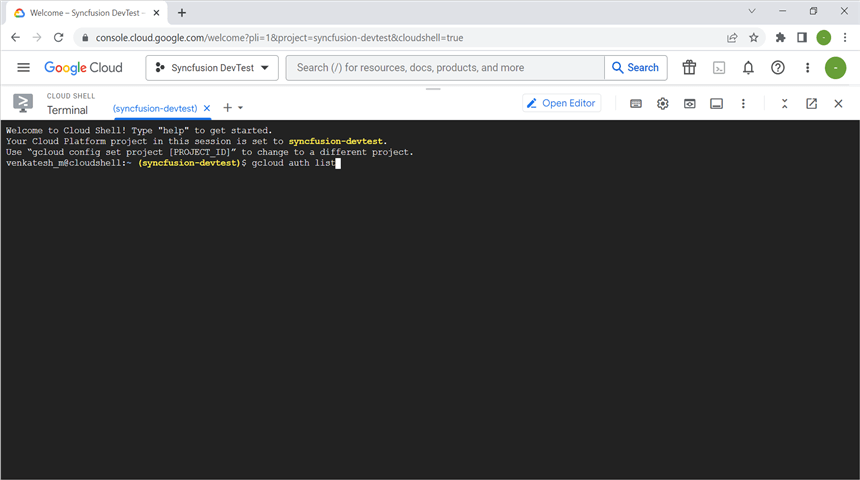

Step 4: Click the **Authorize** button to grant the Cloud Shell session the permissions it needs to manage your App Engine application.
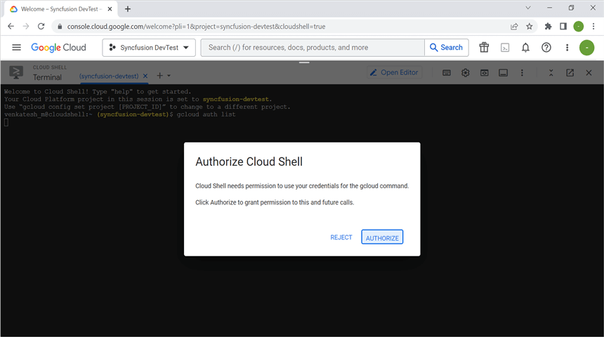

## Create an application for App Engine

Step 1: Open Visual Studio and select the ASP.NET Core Web app (Model-View-Controller) template.


Step 2: Configure your new project according to your requirements.
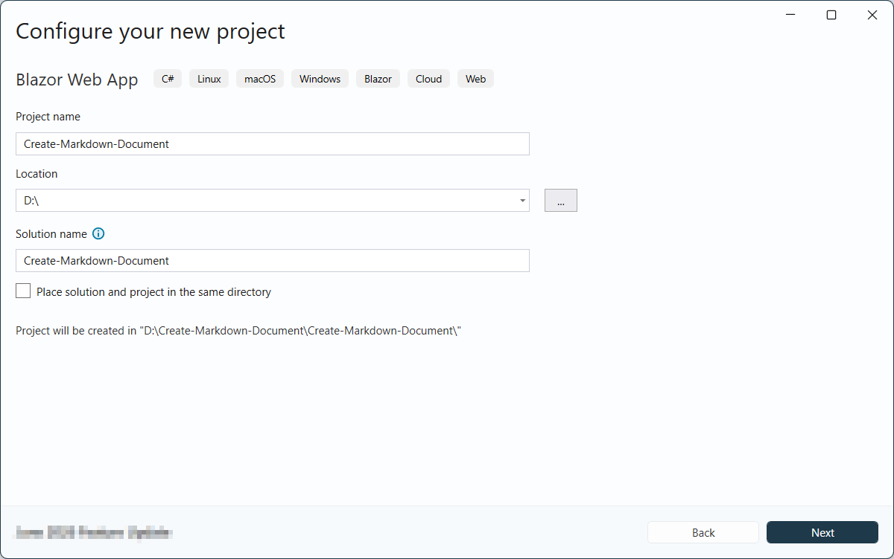

Step 3: Click the **Create** button.
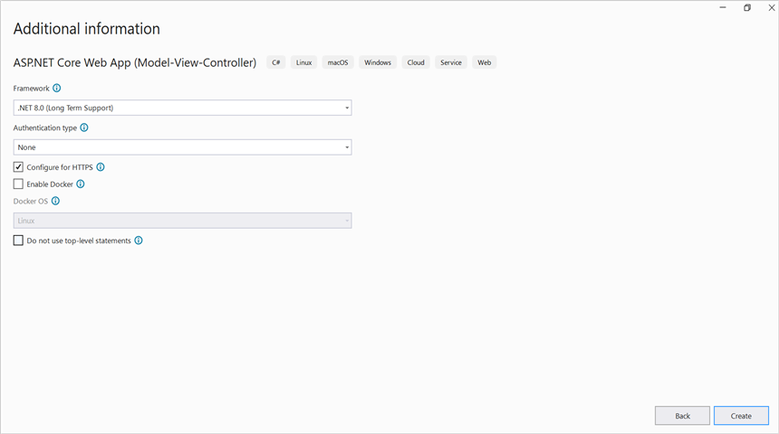

Step 4: Install the [Syncfusion.Markdown](https://www.nuget.org/packages/Syncfusion.Markdown) NuGet package as a reference to your project from [NuGet.org](https://www.nuget.org/).


N> **Starting with v16.2.0.x**, if you reference Syncfusion<sup>&reg;</sup> assemblies from the trial setup or from the NuGet feed, you must add a reference to the **Syncfusion.Licensing** assembly and include a valid license key in your application.
N>
N> Install the [Syncfusion.Licensing](https://www.nuget.org/packages/Syncfusion.Licensing) NuGet package and register the license key during application startup.
N>
N> ```csharp
N> Syncfusion.Licensing.SyncfusionLicenseProvider.RegisterLicense("YOUR_LICENSE_KEY");
N> ```
N>
N> For more information about generating and registering a license key, refer to the [Syncfusion<sup>&reg;</sup> licensing documentation](https://help.syncfusion.com/common/essential-studio/licensing/overview).

Step 5: Include the following namespaces in the **HomeController.cs** file.




using Syncfusion.Office.Markdown;




Step 6: A default action method named Index will be present in HomeController.cs. Right-click on the Index method and select **Go To View**. You will be directed to its associated view page **Index.cshtml**.

Step 7: Add a new button in the Index.cshtml as shown below.




@{
    Html.BeginForm("CreateDocument", "Home", FormMethod.Get);
    {
        <div>
            <input type="submit" value="Create Document" style="width:150px;height:27px" />
        </div>
    }
    Html.EndForm();
}




Step 8: Add a new action method **CreateDocument** in HomeController.cs and include the below code snippet to **create Markdown document** and download it.




// Creates a new instance of MarkdownDocument.
MarkdownDocument markdownDocument = new MarkdownDocument();
// Adds a heading to the Markdown document.
MdParagraph mdHeadingParagraph = markdownDocument.AddParagraph();
// Applies the Heading 1 style to the paragraph.
mdHeadingParagraph.ApplyParagraphStyle("Heading 1");
MdTextRange mdHeadingTextRange = mdHeadingParagraph.AddTextRange();
mdHeadingTextRange.Text = "Adventure Works Cycles";
// Adds a paragraph to the Markdown document.
MdParagraph mdParagraph = markdownDocument.AddParagraph();
MdTextRange mdTextRange = mdParagraph.AddTextRange();
mdTextRange.Text = "Adventure Works Cycles, the fictitious company on which the AdventureWorks sample databases are based, is a large, multinational manufacturing company. The company manufactures and sells metal and composite bicycles to North American, European and Asian commercial markets. While its base operation is in Bothell, Washington with 290 employees, several regional sales teams are located throughout their market base.";
// Adds the first list item.
MdParagraph item1 = markdownDocument.AddParagraph();
item1.ListFormat = new MdListFormat();
item1.ListFormat.IsNumbered = false;
item1.ListFormat.ListLevel = 0;
item1.ListFormat.ListValue = "- ";
item1.AddTextRange().Text = "First item";
// Adds the second list item.
MdParagraph item2 = markdownDocument.AddParagraph();
item2.ListFormat = new MdListFormat();
item2.ListFormat.IsNumbered = false;
item2.ListFormat.ListLevel = 0;
item2.ListFormat.ListValue = "- ";
item2.AddTextRange().Text = "Second item";
// Adds the third list item.
MdParagraph item3 = markdownDocument.AddParagraph();
item3.ListFormat = new MdListFormat();
item3.ListFormat.IsNumbered = false;
item3.ListFormat.ListLevel = 0;
item3.ListFormat.ListValue = "- ";
item3.AddTextRange().Text = "Third item";
// Adds a table to the Markdown document.
MdTable table = markdownDocument.AddTable();
table.ColumnAlignments.Add(MdColumnAlignment.Left);
table.ColumnAlignments.Add(MdColumnAlignment.Left);
// Adds the header row.
MdTableRow headerRow = table.AddTableRow();
MdTableCell header1 = headerRow.AddTableCell();
header1.Items.Add(new MdTextRange { Text = "Profile picture" });
MdTableCell header2 = headerRow.AddTableCell();
header2.Items.Add(new MdTextRange { Text = "Description" });

// Adds a data row.
MdTableRow dataRow = table.AddTableRow();
MdTableCell cell1 = dataRow.AddTableCell();
MdPicture picture = new MdPicture();
picture.Url = "Data\\photo.jpg";
picture.AltText = "Profile picture";
cell1.Items.Add(picture);
MdTableCell cell2 = dataRow.AddTableCell();
cell2.Items.Add(new MdTextRange { Text = "AdventureWorks Cycles, the fictitious company on which the AdventureWorks sample databases are based, is a large, multinational manufacturing company." });
// Saves the Markdown document to MemoryStream
MemoryStream stream = new MemoryStream();
markdownDocument.Save(stream);
stream.Position = 0;
// Disposes the document.
markdownDocument.Dispose();
// Downloads the Markdown document in the browser.
return File(stream, "text/markdown", "Sample.md");




## Move application to App Engine

Step 1: Open the **Cloud Shell editor**.
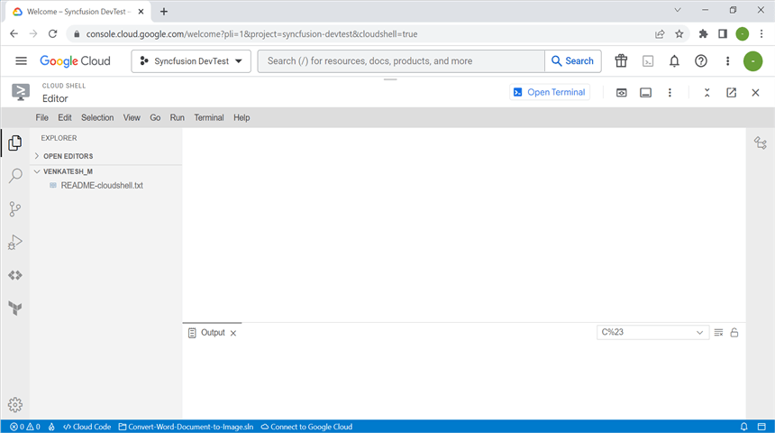

Step 2: Drag and drop the sample from your local machine to **Workspace**.
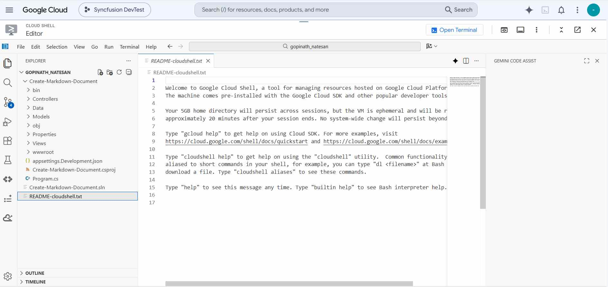

N> If you have your sample application in your local machine, drag and drop it into the Workspace. If you created the sample using the Cloud Shell terminal command, it will be available in the Workspace.

Step 3: Open the Cloud Shell Terminal and run the following **command** to view the files and directories within your **current Workspace**.




ls




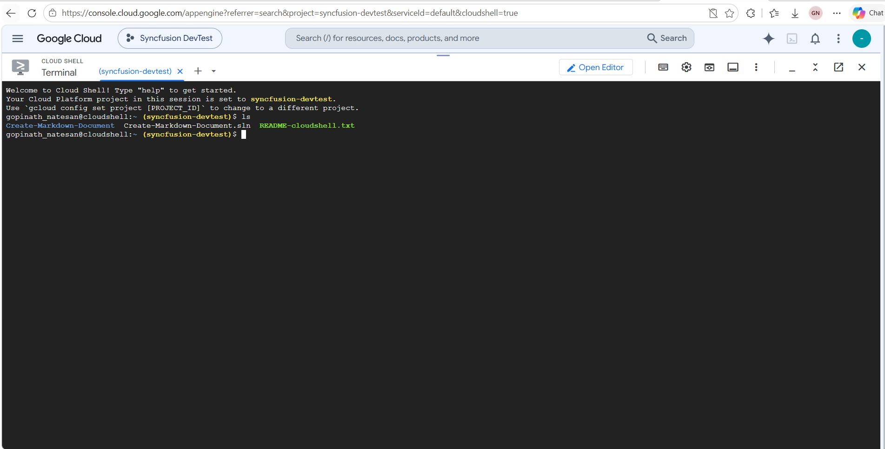

Step 4: Run the following **command** to navigate to the sample you want to run.




cd Create-Markdown-Document




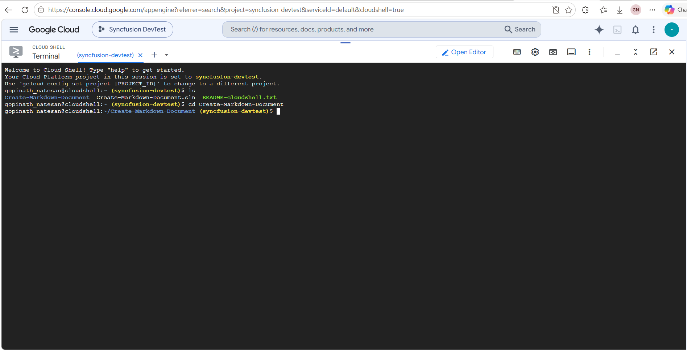

Step 5: To ensure that the sample is working correctly, restore the dependencies and run the application using the following commands.




dotnet restore
dotnet run --urls=http://localhost:8080




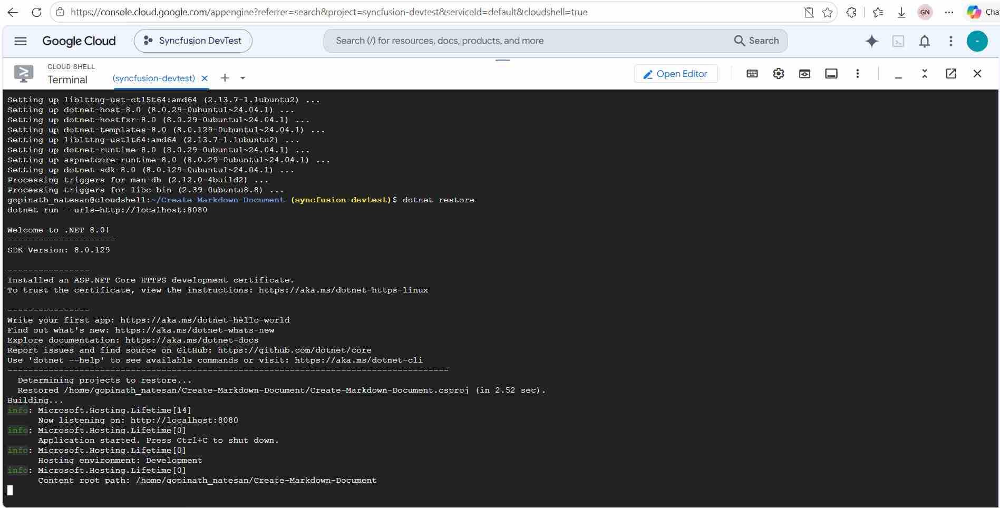

Step 6: Verify that the application is running properly by accessing the **Web View** -> **Preview on port 8080**.
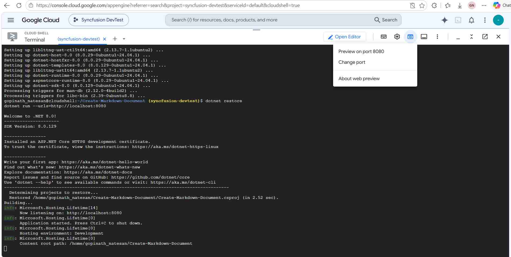

Step 7: Now you can see the sample output on the preview page.


Step 8: Close the preview page and return to the terminal, then press **Ctrl+C**, which will stop the process.
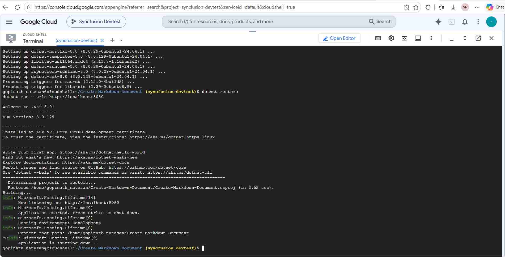

## Publish the application

Step 1: Run the following command in **Cloud Shell Terminal** to publish the application.




dotnet publish -c Release




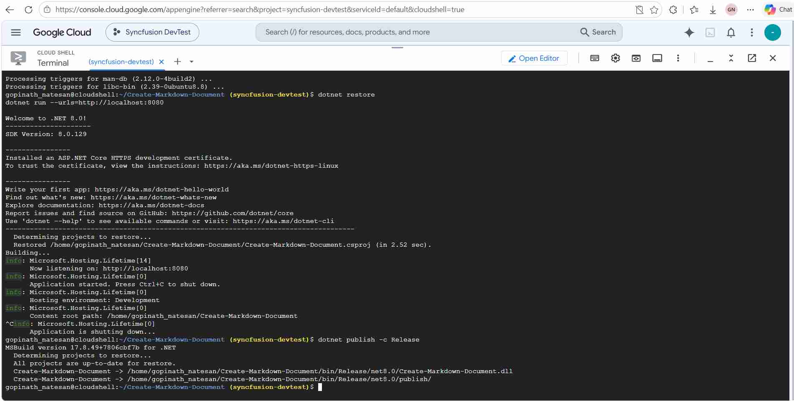

Step 2: Run the following command in **Cloud Shell Terminal** to navigate to the publish folder. The folder name matches your target framework (for example, `net8.0`); adjust it if you targeted a different TFM.



cd bin/Release/net8.0/publish/




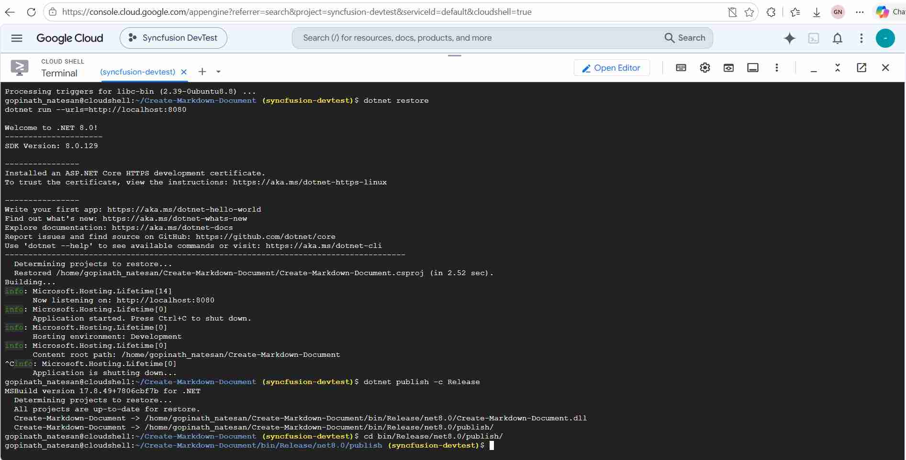

## Configure app.yaml and Dockerfile

Step 1: Add the app.yaml file to the publish folder with the following contents.




cat <<EOT >> app.yaml
env: flex
runtime: custom   
EOT




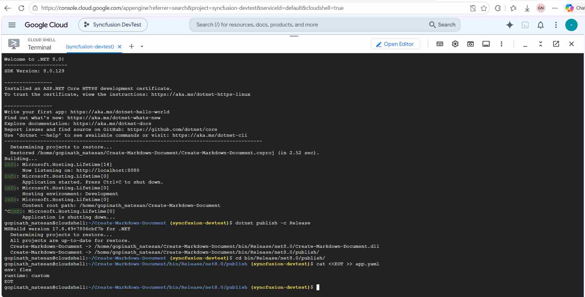

Step 2: Add the Dockerfile to the publish folder with the following contents.




cat <<EOT >> Dockerfile
FROM mcr.microsoft.com/dotnet/aspnet8.0
RUN apt-get update -y && apt-get install libfontconfig -y
ADD / /app
EXPOSE 8080
ENV ASPNETCORE_URLS=http://*:8080
WORKDIR /app
ENTRYPOINT [ "dotnet", "Create-Markdown-Document.dll"]
EOT




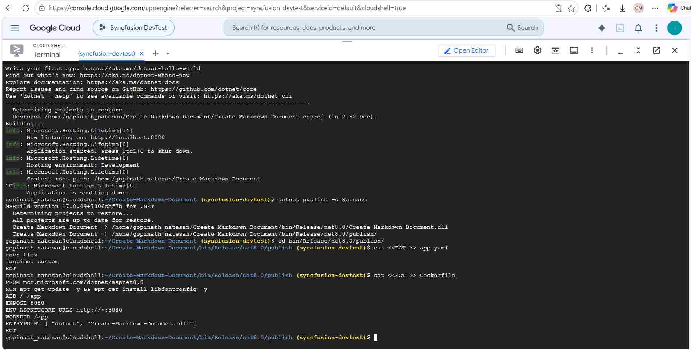

Step 3: You can ensure **Dockerfile** and **app.yaml** files are added in **Workspace**.
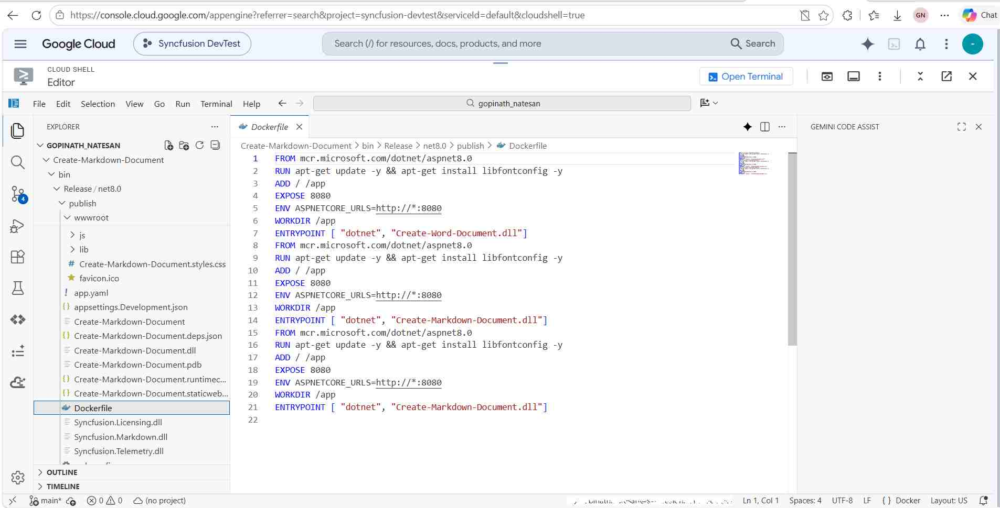

## Deploy to App Engine

Step 1: To deploy the application to the App Engine, run the following command in Cloud Shell Terminal. On the first deploy, you will be prompted to select a region for your App Engine app; choose one close to your users. The `--version v0` flag assigns a specific version id to this deployment. Then retrieve the **URL** from the Cloud Shell Terminal.




gcloud app deploy --version v0




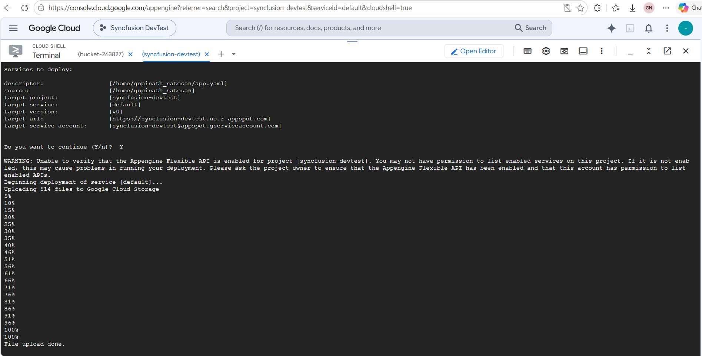

Step 2: Open the **URL** to access the application, which has been successfully deployed.


You can download a complete working sample from [GitHub](https://github.com/SyncfusionExamples/Markdown-Examples/tree/master/Getting-Started/GCP/Google_App_Engine).

N> The code sample references image files (photo.jpg). Download these assets from the [GitHub sample Data folder](https://github.com/SyncfusionExamples/Markdown-Examples/tree/master/Getting-Started/GCP/Google_App_Engine/Create-Markdown-Document/Data) and place them in the application's `Data` folder so the relative paths in the code resolve correctly at runtime.

By executing the program, you will get the **Markdown document** as follows. The output will be saved in **bin** folder.


Looking for the full .NET Markdown Library overview, features, pricing, and documentation? Visit the [.NET Markdown Library](https://www.syncfusion.com/document-sdk/net-markdown-library) page.

An online sample link to [create a Markdown document](https://document.syncfusion.com/demos/markdown/createmarkdown#/tailwind) in ASP.NET Core.   