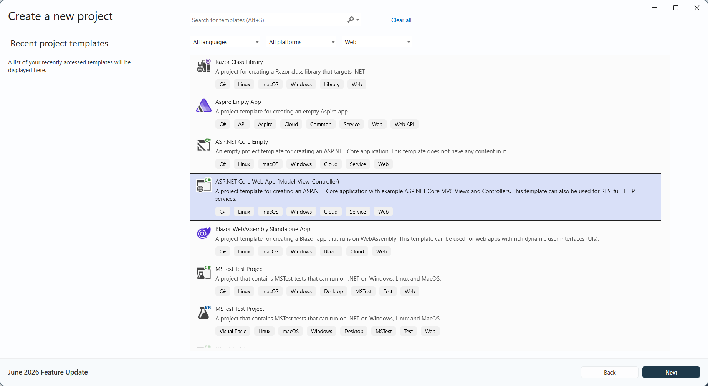

# Create Markdown document in ASP.NET Core

Syncfusion&reg; Essential&reg; Markdown is a `.NET Core Markdown library` used to create, read, and edit **Markdown** documents programmatically without external dependencies. Using this library, you can **create a Markdown document in ASP.NET Core**.

## Steps to create Markdown document programmatically:

**Prerequisites:**

* Visual Studio 2022 or later.
* Install [.NET 8 SDK](https://dotnet.microsoft.com/en-us/download/dotnet/8.0) or later.

Step 1: Create a new ASP.NET Core Web application (Model-View-Controller) project.

Step 2: Install the [Syncfusion.Markdown](https://www.nuget.org/packages/Syncfusion.Markdown) NuGet package as a reference to your project from [NuGet.org](https://www.nuget.org/).

N> Starting with v34.x.x, if you reference Syncfusion&reg; assemblies from trial setup or from the NuGet feed, you also have to add "Syncfusion.Licensing" assembly reference and include a license key in your projects. Please refer to this [link](https://help.syncfusion.com/common/essential-studio/licensing/overview) to know about registering Syncfusion&reg; license key in your application to use our components.

Step 3: Include the following namespaces in the HomeController.cs file.





using Syncfusion.Markdown;
using System.IO;





Step 4: A default action method named Index will be present in HomeController.cs. Right click on Index method and select **Go To View** where you will be directed to its associated view page **Index.cshtml**.

Step 5: Add a new button in the Index.cshtml as shown below.





@{Html.BeginForm("CreateDocument", "Home", FormMethod.Get);
{

    <input type="submit" value="Create Document" style="width:150px;height:27px" />

}
Html.EndForm();
}





Step 6: Add a new action method **CreateDocument** in HomeController.cs and include the below code snippet to **create Markdown document** and download it.





// Creates a new instance of MarkdownDocument.
MarkdownDocument markdownDocument = new MarkdownDocument();
// Adds a heading to the Markdown document.
MdParagraph mdHeadingParagraph = markdownDocument.AddParagraph();
// Applies the Heading 1 style to the paragraph.
mdHeadingParagraph.ApplyParagraphStyle("Heading 1");
MdTextRange mdHeadingTextRange = mdHeadingParagraph.AddTextRange();
mdHeadingTextRange.Text = "Adventure Works Cycles";
// Adds a paragraph to the Markdown document.
MdParagraph mdParagraph = markdownDocument.AddParagraph();
MdTextRange mdTextRange = mdParagraph.AddTextRange();
mdTextRange.Text = "Adventure Works Cycles, the fictitious company on which the AdventureWorks sample databases are based, is a large, multinational manufacturing company. The company manufactures and sells metal and composite bicycles to North American, European and Asian commercial markets. While its base operation is in Bothell, Washington with 290 employees, several regional sales teams are located throughout their market base.";
// Adds the first list item.
MdParagraph item1 = markdownDocument.AddParagraph();
item1.ListFormat = new MdListFormat();
item1.ListFormat.IsNumbered = false;
item1.ListFormat.ListLevel = 0;
item1.ListFormat.ListValue = "- ";
item1.AddTextRange().Text = "First item";
// Adds the second list item.
MdParagraph item2 = markdownDocument.AddParagraph();
item2.ListFormat = new MdListFormat();
item2.ListFormat.IsNumbered = false;
item2.ListFormat.ListLevel = 0;
item2.ListFormat.ListValue = "- ";
item2.AddTextRange().Text = "Second item";
// Adds the third list item.
MdParagraph item3 = markdownDocument.AddParagraph();
item3.ListFormat = new MdListFormat();
item3.ListFormat.IsNumbered = false;
item3.ListFormat.ListLevel = 0;
item3.ListFormat.ListValue = "- ";
item3.AddTextRange().Text = "Third item";
// Adds a table to the Markdown document.
MdTable table = markdownDocument.AddTable();
table.ColumnAlignments.Add(MdColumnAlignment.Left);
table.ColumnAlignments.Add(MdColumnAlignment.Left);
// Adds the header row.
MdTableRow headerRow = table.AddTableRow();
MdTableCell header1 = headerRow.AddTableCell();
header1.Items.Add(new MdTextRange { Text = "Profile picture" });
MdTableCell header2 = headerRow.AddTableCell();
header2.Items.Add(new MdTextRange { Text = "Description" });

// Adds a data row.
MdTableRow dataRow = table.AddTableRow();
MdTableCell cell1 = dataRow.AddTableCell();
MdPicture picture = new MdPicture();
picture.Url = "Data\\photo.jpg";
picture.AltText = "Profile picture";
cell1.Items.Add(picture);
MdTableCell cell2 = dataRow.AddTableCell();
cell2.Items.Add(new MdTextRange { Text = "AdventureWorks Cycles, the fictitious company on which the AdventureWorks sample databases are based, is a large, multinational manufacturing company." });
// Saves the Markdown document to MemoryStream
MemoryStream stream = new MemoryStream();
markdownDocument.Save(stream);
stream.Position = 0;
// Disposes the document
markdownDocument.Dispose();
//Download Markdown document in the browser
return File(stream, "text/markdown", "Sample.md");





Step 7: Build the project.

Click on Build → Build Solution or press <kbd>Ctrl</kbd>+<kbd>Shift</kbd>+<kbd>B</kbd> to build the project.

Step 8: Run the project.

Click the Start button (green arrow) or press <kbd>F5</kbd> to run the app.

By executing the program, you will get the **Markdown document** as follows.

