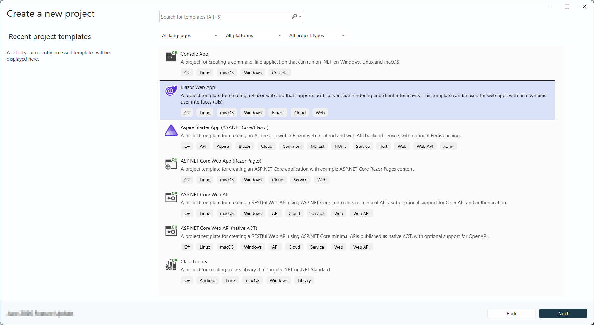
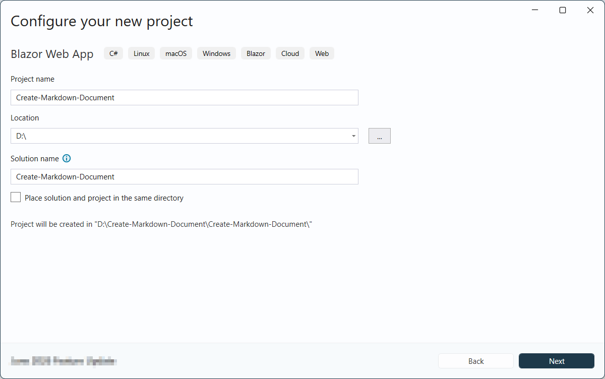
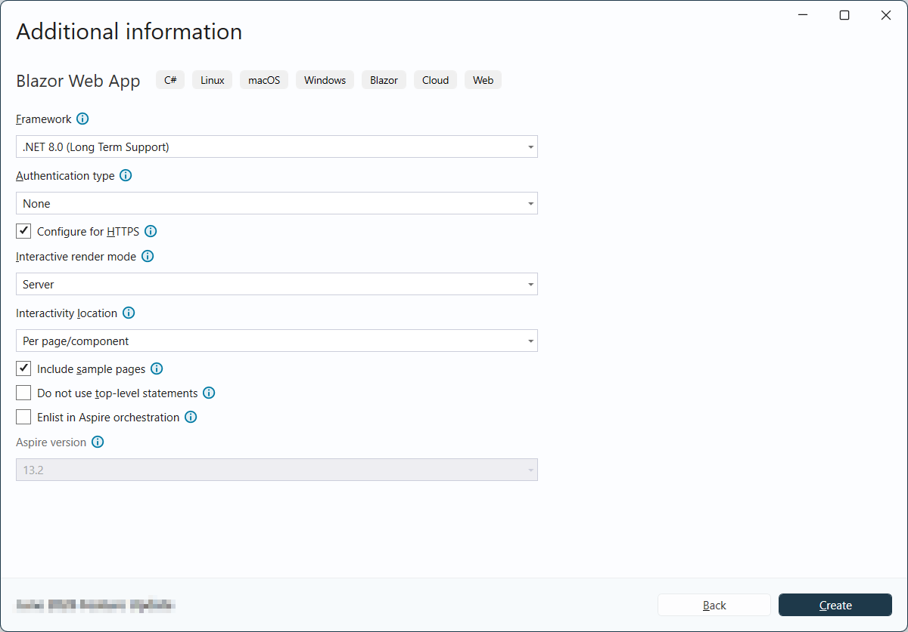
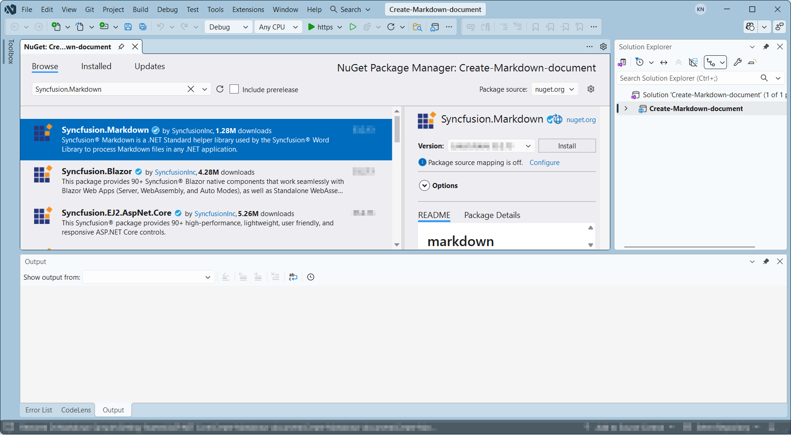
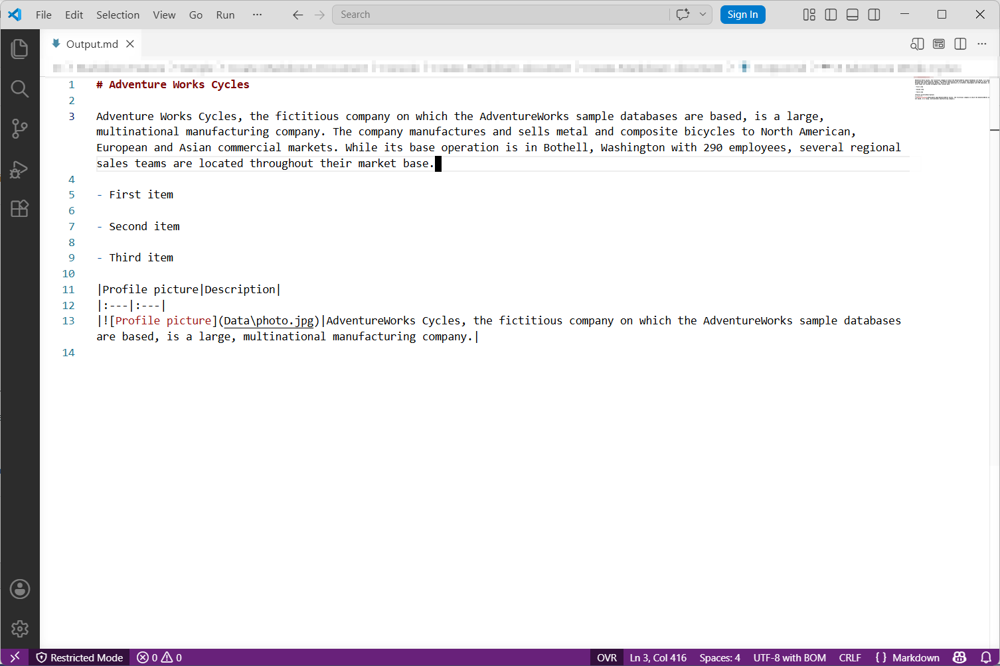
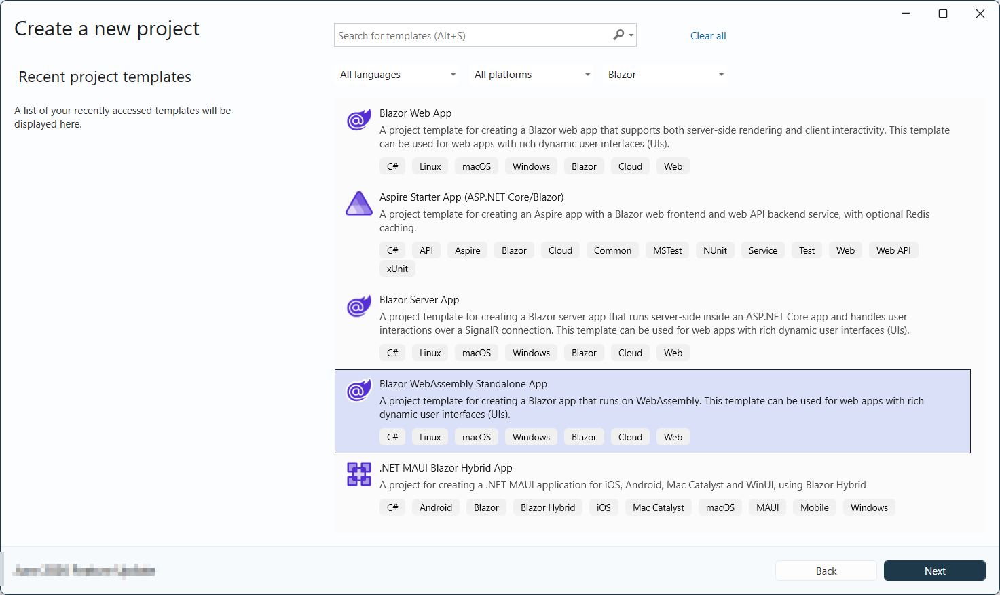

# Create Markdown Document in Blazor

Syncfusion&reg; Essential&reg; Markdown is a `.NET Markdown library` used to create, read, and edit **Markdown** documents programmatically without external dependencies. Using this library, you can **create a Markdown document in Blazor**.

## Blazor Web App (Server)

**Prerequisites:**

*   Visual Studio 2022 or later.
*   Install [.NET 8 SDK](https://dotnet.microsoft.com/en-us/download/dotnet/8.0) or later.

Step 1: Create a new C# Blazor Web app project.
*   Select "Blazor Web App" from the template and click **Next**.

*   Name the project and click **Next**.

*   Select the framework and click **Create** button.

N> Ensure the **Interactive render mode** is set to **Server** and **Interactivity location** is set to **Per page/component** during project creation so the `@rendermode InteractiveServer` directive works correctly.

Step 2: Install the `Syncfusion.Markdown` NuGet package.

To **create a Markdown document in a Blazor Web App Server**, install [Syncfusion.Markdown](https://www.nuget.org/packages/Syncfusion.Markdown) into the Blazor project.

N> If you reference Syncfusion&reg; assemblies from trial setup or the NuGet feed (v34.x.x and later), install the `Syncfusion.Licensing` NuGet package and register the license key in `Program.cs` by calling `Syncfusion.Licensing.SyncfusionLicenseProvider.RegisterLicense("YOUR_LICENSE_KEY")` before any Syncfusion type is used. Refer to this [link](https://help.syncfusion.com/common/essential-studio/licensing/overview) to know about registering Syncfusion&reg; license key in an application to use Syncfusion components.

Step 3: Create a Razor file named `Markdown.razor` in the `Pages` folder, which is located inside the `Components` folder.

Include the following namespaces in the file:



@rendermode InteractiveServer
@page "/Markdown"
@using System.IO;
@using Create_Markdown_Document;
@inject Create_Markdown_Document.Data.MarkdownService service
@inject Microsoft.JSInterop.IJSRuntime JS



Step 4: Add a button to `Markdown.razor`.

Include the following code to create a new button that triggers document creation:



<h2>Syncfusion Markdown Library</h2>

The Syncfusion Markdown library is a Blazor Markdown library used to create, read, and edit Markdown files in applications without external dependencies.

<button class="btn btn-primary" @onclick="@CreateMarkdown">Create Markdown</button>



Step 5: Implement `CreateMarkdown` method in `Markdown.razor`.

Add the following code to create and download the Markdown document:



@code {
    MemoryStream documentStream;
    /// 

    /// Creates and downloads the Markdown document.
    /// 

    protected async void CreateMarkdown()
    {
        documentStream = service.CreateMarkdown();
        await JS.SaveAs("Sample.md", documentStream.ToArray());
        documentStream.Dispose();
    }
}



Step 6: Create a new cs file `MarkdownService.cs` in the `Data` folder.

N> Create the `Data` folder inside the project root if it does not already exist.

Include the following namespaces in the file:




using Syncfusion.Office.Markdown;
using System.IO;




Step 7: Implement the `CreateMarkdown` method in `MarkdownService.cs`.

Create a new `MemoryStream` method named `CreateMarkdown` in the `MarkdownService` class, and include the following code snippet to **create a simple Markdown document in Blazor** Web App Server:





public MemoryStream CreateMarkdown()
{
    // Creates a new instance of MarkdownDocument.
    MarkdownDocument markdownDocument = new MarkdownDocument();
    // Adds a heading to the Markdown document.
    MdParagraph mdHeadingParagraph = markdownDocument.AddParagraph();
    // Applies the Heading 1 style to the paragraph.
    mdHeadingParagraph.ApplyParagraphStyle("Heading 1");
    MdTextRange mdHeadingTextRange = mdHeadingParagraph.AddTextRange();
    mdHeadingTextRange.Text = "Adventure Works Cycles";
    // Adds a paragraph to the Markdown document.
    MdParagraph mdParagraph = markdownDocument.AddParagraph();
    MdTextRange mdTextRange = mdParagraph.AddTextRange();
    mdTextRange.Text = "Adventure Works Cycles, the fictitious company on which the AdventureWorks sample databases are based, is a large, multinational manufacturing company. The company manufactures and sells metal and composite bicycles to North American, European and Asian commercial markets. While its base operation is in Bothell, Washington with 290 employees, several regional sales teams are located throughout their market base.";
    // Adds the first list item.
    MdParagraph item1 = markdownDocument.AddParagraph();
    item1.ListFormat = new MdListFormat();
    item1.ListFormat.IsNumbered = false;
    item1.ListFormat.ListLevel = 0;
    item1.ListFormat.ListValue = "- ";
    item1.AddTextRange().Text = "First item";
    // Adds the second list item.
    MdParagraph item2 = markdownDocument.AddParagraph();
    item2.ListFormat = new MdListFormat();
    item2.ListFormat.IsNumbered = false;
    item2.ListFormat.ListLevel = 0;
    item2.ListFormat.ListValue = "- ";
    item2.AddTextRange().Text = "Second item";
    // Adds the third list item.
    MdParagraph item3 = markdownDocument.AddParagraph();
    item3.ListFormat = new MdListFormat();
    item3.ListFormat.IsNumbered = false;
    item3.ListFormat.ListLevel = 0;
    item3.ListFormat.ListValue = "- ";
    item3.AddTextRange().Text = "Third item";
    // Adds a table to the Markdown document.
    MdTable table = markdownDocument.AddTable();
    table.ColumnAlignments.Add(MdColumnAlignment.Left);
    table.ColumnAlignments.Add(MdColumnAlignment.Left);
    // Adds the header row.
    MdTableRow headerRow = table.AddTableRow();
    MdTableCell header1 = headerRow.AddTableCell();
    header1.Items.Add(new MdTextRange { Text = "Profile picture" });
    MdTableCell header2 = headerRow.AddTableCell();
    header2.Items.Add(new MdTextRange { Text = "Description" });

    // Adds a data row.
    MdTableRow dataRow = table.AddTableRow();
    MdTableCell cell1 = dataRow.AddTableCell();
    MdPicture picture = new MdPicture();
    picture.Url = "Data\\photo.jpg";
    picture.AltText = "Profile picture";
    cell1.Items.Add(picture);
    MdTableCell cell2 = dataRow.AddTableCell();
    cell2.Items.Add(new MdTextRange { Text = "AdventureWorks Cycles, the fictitious company on which the AdventureWorks sample databases are based, is a large, multinational manufacturing company." });
	// Saves the Markdown document to MemoryStream
	MemoryStream stream = new MemoryStream();
	markdownDocument.Save(stream);
	stream.Position = 0;
	// Disposes the document
	markdownDocument.Dispose();
	return stream;
}




Step 8: Add the service in `Program.cs`. 

Add the following line to the `Program.cs` file to register `MarkdownService` as a scoped service in the Blazor application. 




builder.Services.AddScoped<Create_Markdown_Document.Data.MarkdownService>();




Step 9: Create `FileUtils.cs` for JavaScript interoperability.

Create a new class file named `FileUtils` in the project and add the following code to invoke the JavaScript action for file download in the browser.





public static class FileUtils
{
    public static ValueTask<object> SaveAs(this IJSRuntime js, string filename, byte[] data)
       => js.InvokeAsync<object>(
            "saveAsFile",
            filename,
            Convert.ToBase64String(data));
}




Step 10: Add JavaScript function to `App.razor`.

Add the following JavaScript function in the `App.razor` file located in the `Components` folder.









Step 11: Add navigation link.

Add the following code snippet to the `Components/Layout/NavMenu.razor` file.





    <NavLink class="nav-link" href="markdown">
         Create Markdown
    </NavLink>





Step 12: Build the project.

Click on **Build** → **Build Solution** or press <kbd>Ctrl</kbd>+<kbd>Shift</kbd>+<kbd>B</kbd> to build the project.

Step 13: Run the project.

Click the Start button (green arrow) or press <kbd>F5</kbd> to run the application.

A complete working sample is available on [GitHub](https://github.com/SyncfusionExamples/Markdown-Examples/tree/master/Getting-Started/Blazor/Blazor-Web-Server-app).

By executing the program, you will get the **Markdown document** as follows.

## Blazor WebAssembly Standalone App

**Prerequisites:**

*   Visual Studio 2022 or later.
*   Install [.NET 8 SDK](https://dotnet.microsoft.com/en-us/download/dotnet/8.0) or later.

Step 1: Create a new C# Blazor WASM Standalone app project.

Select "Blazor WebAssembly Standalone App" from the template and click **Next**.

Step 2: Install the `Syncfusion.Markdown` NuGet package.

To **create a Markdown document in a Blazor WASM Standalone app**, install [Syncfusion.Markdown](https://www.nuget.org/packages/Syncfusion.Markdown) into the Blazor project.

N> Starting with v34.x.x, if Syncfusion&reg; assemblies are referenced from trial setup or from the NuGet feed, the "Syncfusion.Licensing" assembly reference must also be added and a license key included in projects. Refer to this [link](https://help.syncfusion.com/common/essential-studio/licensing/overview) to know about registering Syncfusion&reg; license key in an application to use Syncfusion components.

Step 3: Create a Razor file named `Markdown.razor` in the `Pages` folder.

Add the following namespaces:




@page "/Markdown"
@inject Microsoft.JSInterop.IJSRuntime JS
@using Syncfusion.Office.Markdown
@using System.IO




Step 4: Add a button to `Markdown.razor`.

Add the following code to create a new button that triggers document creation:





<h2>Syncfusion Markdown Library</h2>

The Syncfusion Markdown library is used to create, read, and edit Markdown files in applications without external dependencies.

<button class="btn btn-primary" @onclick="@CreateMarkdown">Create Markdown</button>





Step 5: Implement `CreateMarkdown` method in `Markdown.razor`.

Create a new `async` method named `CreateMarkdown` and include the following code snippet to **create a Markdown document in the Blazor** WASM Standalone app.





@functions {
    async void CreateMarkdown()
    {
        // Creates a new instance of MarkdownDocument.
        MarkdownDocument markdownDocument = new MarkdownDocument();
        // Adds a heading to the Markdown document.
        MdParagraph mdHeadingParagraph = markdownDocument.AddParagraph();
        // Applies the Heading 1 style to the paragraph.
        mdHeadingParagraph.ApplyParagraphStyle("Heading 1");
        MdTextRange mdHeadingTextRange = mdHeadingParagraph.AddTextRange();
        mdHeadingTextRange.Text = "Adventure Works Cycles";
        // Adds a paragraph to the Markdown document.
        MdParagraph mdParagraph = markdownDocument.AddParagraph();
        MdTextRange mdTextRange = mdParagraph.AddTextRange();
        mdTextRange.Text = "Adventure Works Cycles, the fictitious company on which the AdventureWorks sample databases are based, is a large, multinational manufacturing company. The company manufactures and sells metal and composite bicycles to North American, European and Asian commercial markets. While its base operation is in Bothell, Washington with 290 employees, several regional sales teams are located throughout their market base.";
        // Adds the first list item.
        MdParagraph item1 = markdownDocument.AddParagraph();
        item1.ListFormat = new MdListFormat();
        item1.ListFormat.IsNumbered = false;
        item1.ListFormat.ListLevel = 0;
        item1.ListFormat.ListValue = "- ";
        item1.AddTextRange().Text = "First item";
        // Adds the second list item.
        MdParagraph item2 = markdownDocument.AddParagraph();
        item2.ListFormat = new MdListFormat();
        item2.ListFormat.IsNumbered = false;
        item2.ListFormat.ListLevel = 0;
        item2.ListFormat.ListValue = "- ";
        item2.AddTextRange().Text = "Second item";
        // Adds the third list item.
        MdParagraph item3 = markdownDocument.AddParagraph();
        item3.ListFormat = new MdListFormat();
        item3.ListFormat.IsNumbered = false;
        item3.ListFormat.ListLevel = 0;
        item3.ListFormat.ListValue = "- ";
        item3.AddTextRange().Text = "Third item";
        // Adds a table to the Markdown document.
        MdTable table = markdownDocument.AddTable();
        table.ColumnAlignments.Add(MdColumnAlignment.Left);
        table.ColumnAlignments.Add(MdColumnAlignment.Left);
        // Adds the header row.
        MdTableRow headerRow = table.AddTableRow();
        MdTableCell header1 = headerRow.AddTableCell();
        header1.Items.Add(new MdTextRange { Text = "Profile picture" });
        MdTableCell header2 = headerRow.AddTableCell();
        header2.Items.Add(new MdTextRange { Text = "Description" });

        // Adds a data row.
        MdTableRow dataRow = table.AddTableRow();
        MdTableCell cell1 = dataRow.AddTableCell();
        MdPicture picture = new MdPicture();
        picture.Url = "Data\\photo.jpg";
        picture.AltText = "Profile picture";
        cell1.Items.Add(picture);
        MdTableCell cell2 = dataRow.AddTableCell();
        cell2.Items.Add(new MdTextRange { Text = "AdventureWorks Cycles, the fictitious company on which the AdventureWorks sample databases are based, is a large, multinational manufacturing company." });
        // Saves the Markdown document to MemoryStream
        MemoryStream stream = new MemoryStream();
        markdownDocument.Save(stream);
        stream.Position = 0;
		// Disposes the document
		markdownDocument.Dispose();
        await JS.SaveAs("Sample.md", stream.ToArray());
        stream.Dispose();
    }
}




Step 6: Create `FileUtils.cs` for JavaScript interoperability.

Create a new class file named `FileUtils` and add the following code to invoke the JavaScript action for file download in the browser.





public static class FileUtils
{
    public static ValueTask<object> SaveAs(this IJSRuntime js, string filename, byte[] data)
       => js.InvokeAsync<object>(
            "saveAsFile",
            filename,
            Convert.ToBase64String(data));
}





Step 7: Add JavaScript function to `index.html`.

Add the following JavaScript function in the `index.html` file present under `wwwroot`.









Step 8: Add navigation link.

Add the following code snippet to the `Layout/NavMenu.razor` file.





    <NavLink class="nav-link" href="markdown">
         Create Markdown
    </NavLink>





Step 9: Build the project.

Click on **Build** → **Build Solution** or press <kbd>Ctrl</kbd>+<kbd>Shift</kbd>+<kbd>B</kbd> to build the project.

Step 10: Run the project.

Click the Start button (green arrow) or press <kbd>F5</kbd> to run the application.

A complete working sample is available on [GitHub](https://github.com/SyncfusionExamples/Markdown-Examples/tree/master/Getting-Started/Blazor/Blazor-WASM-Standalone-app).

By executing the program, you will get the **Markdown document** as follows.

N> While the Markdown library functions in WASM Standalone, server-side deployment is recommended. Running the Markdown library client-side in WASM Standalone increases the application payload size because the library assemblies are downloaded to the browser.

