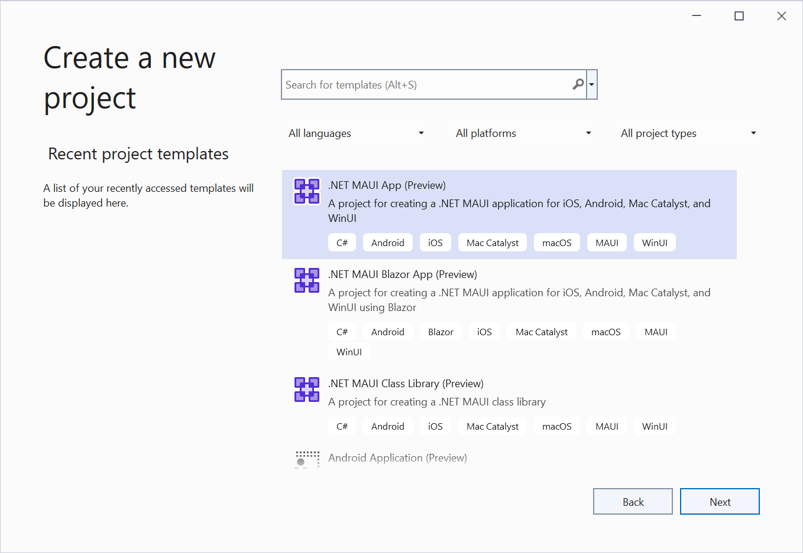
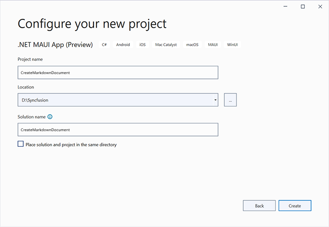

# Create Markdown document in .NET MAUI

Syncfusion<sup>&reg;</sup> Essential<sup>&reg;</sup> Markdown is a [.NET Markdown library](https://www.syncfusion.com/document-sdk/net-markdown-library) used to create, read, and edit **Markdown** documents programmatically without external dependencies. Using this library, you can **create a Markdown document in .NET MAUI**.

## Steps to create Markdown document programmatically in .NET MAUI

**Prerequisites:**

* Visual Studio 2022.
* Install [.NET 8 SDK](https://dotnet.microsoft.com/en-us/download/dotnet/8.0) or later.
* For more details about installation, refer [here](https://learn.microsoft.com/en-us/dotnet/maui/get-started/installation?view=net-maui-7.0&tabs=vswin).


Step 1: Create a new C# .NET MAUI app. Select **.NET MAUI App** from the template and click the **Next** button.



Step 2: Enter the project name, select the target framework (e.g., .NET 8.0 and later), and click **Create**.



Step 3: Install the [Syncfusion.Markdown](https://www.nuget.org/packages/Syncfusion.Markdown) NuGet package as a reference to your project from [NuGet.org](https://www.nuget.org/).


N> **Starting with v16.2.0.x**, if you reference Syncfusion<sup>&reg;</sup> assemblies from the trial setup or from the NuGet feed, you must add a reference to the **Syncfusion.Licensing** assembly and include a valid license key in your application.
N>
N> Install the [Syncfusion.Licensing](https://www.nuget.org/packages/Syncfusion.Licensing) NuGet package and register the license key during application startup.
N>
N> ```csharp
N> Syncfusion.Licensing.SyncfusionLicenseProvider.RegisterLicense("YOUR_LICENSE_KEY");
N> ```
N>
N> For more information about generating and registering a license key, refer to the [Syncfusion<sup>&reg;</sup> licensing documentation](https://help.syncfusion.com/common/essential-studio/licensing/overview).

Step 4: Add a new button to the **MainPage.xaml** as shown below.




<ContentPage xmlns="http://schemas.microsoft.com/dotnet/2021/maui"
             xmlns:x="http://schemas.microsoft.com/winfx/2009/xaml"
             x:Class="Create_Markdown_document.MainPage"
             BackgroundColor="{DynamicResource SecondaryColor}">

    <ScrollView>
        <Grid RowSpacing="25" RowDefinitions="Auto,Auto,Auto,Auto,*"
              Padding="{OnPlatform iOS='30,60,30,30', Default='30'}">
            <Button 
                Text="Create Document"
                FontAttributes="Bold"
                Grid.Row="0"
                SemanticProperties.Hint="Creates Markdown document when clicked"
                Clicked="CreateDocument"
                HorizontalOptions="Center" />
        </Grid>
    </ScrollView>
</ContentPage>




Step 5: Include the following namespaces in the **MainPage.xaml.cs** file.




using Syncfusion.Office.Markdown;
using System.IO;
using System.Reflection;




Step 6: Add a new action method **CreateDocument** in the **MainPage.xaml.cs** file and include the following code snippet to **create a Markdown document**.




// Creates a new instance of MarkdownDocument.
MarkdownDocument markdownDocument = new MarkdownDocument();
// Adds a heading to the Markdown document.
MdParagraph mdHeadingParagraph = markdownDocument.AddParagraph();
// Applies the Heading 1 style to the paragraph.
mdHeadingParagraph.ApplyParagraphStyle("Heading 1");
MdTextRange mdHeadingTextRange = mdHeadingParagraph.AddTextRange();
mdHeadingTextRange.Text = "Adventure Works Cycles";
// Adds a paragraph to the Markdown document.
MdParagraph mdParagraph = markdownDocument.AddParagraph();
MdTextRange mdTextRange = mdParagraph.AddTextRange();
mdTextRange.Text = "Adventure Works Cycles, the fictitious company on which the AdventureWorks sample databases are based, is a large, multinational manufacturing company. The company manufactures and sells metal and composite bicycles to North American, European and Asian commercial markets. While its base operation is in Bothell, Washington with 290 employees, several regional sales teams are located throughout their market base.";
// Adds the first list item.
MdParagraph item1 = markdownDocument.AddParagraph();
item1.ListFormat = new MdListFormat();
item1.ListFormat.IsNumbered = false;
item1.ListFormat.ListLevel = 0;
item1.ListFormat.ListValue = "- ";
item1.AddTextRange().Text = "First item";
// Adds the second list item.
MdParagraph item2 = markdownDocument.AddParagraph();
item2.ListFormat = new MdListFormat();
item2.ListFormat.IsNumbered = false;
item2.ListFormat.ListLevel = 0;
item2.ListFormat.ListValue = "- ";
item2.AddTextRange().Text = "Second item";
// Adds the third list item.
MdParagraph item3 = markdownDocument.AddParagraph();
item3.ListFormat = new MdListFormat();
item3.ListFormat.IsNumbered = false;
item3.ListFormat.ListLevel = 0;
item3.ListFormat.ListValue = "- ";
item3.AddTextRange().Text = "Third item";
// Adds a table to the Markdown document.
MdTable table = markdownDocument.AddTable();
table.ColumnAlignments.Add(MdColumnAlignment.Left);
table.ColumnAlignments.Add(MdColumnAlignment.Left);
// Adds the header row.
MdTableRow headerRow = table.AddTableRow();
MdTableCell header1 = headerRow.AddTableCell();
header1.Items.Add(new MdTextRange { Text = "Profile picture" });
MdTableCell header2 = headerRow.AddTableCell();
header2.Items.Add(new MdTextRange { Text = "Description" });

// Adds a data row.
MdTableRow dataRow = table.AddTableRow();
MdTableCell cell1 = dataRow.AddTableCell();
MdPicture picture = new MdPicture();
picture.Url = "Resources\\Markdown\\photo.jpg";
picture.AltText = "Profile picture";
cell1.Items.Add(picture);
MdTableCell cell2 = dataRow.AddTableCell();
cell2.Items.Add(new MdTextRange { Text = "AdventureWorks Cycles, the fictitious company on which the AdventureWorks sample databases are based, is a large, multinational manufacturing company." });

using MemoryStream ms = new();
//Saves the Markdown document to the memory stream.
markdownDocument.Save(ms);
ms.Position = 0;
// Saves the memory stream as file.
SaveService saveService = new();
saveService.SaveAndView("Sample.md", "text/markdown", ms);




Step 7: Add the platform-specific helper files listed in the [Helper files for .NET MAUI](#helper-files-for-net-maui) section to your project. These files are required for the `SaveService.SaveAndView` method used in the code to compile and run.

Step 8: Run the application.

1. Select the target framework, device or emulator.
2. Press <kbd>F5</kbd> to run the application.

## Helper files for .NET MAUI

Refer to the helper files that should be added to your project. These helper files allow you to **save the stream as a physical file and open the file for viewing**.

<table>
  <tr>
  <td>
    <b>Folder Name</b>
  </td>
  <td>
    <b>File Name</b>
  </td>
  <td>
    <b>Summary</b>
  </td>
  </tr>
  <tr>
  <td>
    .NET MAUI Project
  </td>
  <td>
    {{'[SaveService.cs](https://github.com/SyncfusionExamples/Markdown-Examples/tree/master/Getting-Started/.NET-MAUI/Create-Markdown-document/Services/SaveService.cs)' | markdownify}} 
  </td>
  <td>Represent the base class for save operation.
  </td>
  </tr>
  <tr>
  <td>
    Windows
  </td>
  <td>
    {{'[SaveWindows.cs](https://github.com/SyncfusionExamples/Markdown-Examples/tree/master/Getting-Started/.NET-MAUI/Create-Markdown-document/Platforms/Windows/SaveWindows.cs)' | markdownify}} 
  </td>
  <td>Save implementation for Windows.
  </td>
  </tr>
  <tr>
  <td>
    Android
  </td>
  <td>
    {{'[SaveAndroid.cs](https://github.com/SyncfusionExamples/Markdown-Examples/tree/master/Getting-Started/.NET-MAUI/Create-Markdown-document/Platforms/Android/SaveAndroid.cs)' | markdownify}} 
   </td>
  <td>Save implementation for Android device.
  </td>
  </tr>
  <tr>
  <td>
    Mac Catalyst
  </td>
  <td>
    {{'[SaveMac.cs](https://github.com/SyncfusionExamples/Markdown-Examples/tree/master/Getting-Started/.NET-MAUI/Create-Markdown-document/Platforms/MacCatalyst/SaveMac.cs)' | markdownify}} 
    </td>
  <td>Save implementation for Mac Catalyst device.
  </td>
  </tr>
  <tr>
  <td rowspan="2">
    iOS
  </td>
  <td>
    {{'[SaveIOS.cs](https://github.com/SyncfusionExamples/Markdown-Examples/tree/master/Getting-Started/.NET-MAUI/Create-Markdown-document/Platforms/iOS/SaveIOS.cs)' | markdownify}}
  </td>
  <td>
    Save implementation for iOS device.
  </td>
  </tr>
  <tr>
  <td>
     {{'[PreviewControllerDS.cs](https://github.com/SyncfusionExamples/Markdown-Examples/tree/master/Getting-Started/.NET-MAUI/Create-Markdown-document/Platforms/iOS/PreviewControllerDS.cs)' | markdownify}} 
    <br/>{{'[QLPreviewItemFileSystem.cs](https://github.com/SyncfusionExamples/Markdown-Examples/tree/master/Getting-Started/.NET-MAUI/Create-Markdown-document/Platforms/iOS/QLPreviewItemFileSystem.cs)' | markdownify}} 
  </td>
  <td>
    Helper classes for viewing the <b>Markdown document</b> in iOS device
  </td>
  </tr>
</table>

You can download a complete working sample from [GitHub](https://github.com/SyncfusionExamples/Markdown-Examples/tree/master/Getting-Started/.NET-MAUI).

N> The code sample references an image file (`photo.jpg`). Download this asset from the [GitHub sample folder](https://github.com/SyncfusionExamples/Markdown-Examples/tree/master/Getting-Started/.NET-MAUI/Create-Markdown-document/Resources/Markdown) and place it in the application's `Resources/Markdown` folder so the `MdPicture.Url` value (`"Resources/Markdown/photo.jpg"`) resolves correctly at runtime.

By executing the program, you will get the **Markdown document** as follows.

Looking for the full .NET Markdown Library overview, features, pricing, and documentation? Visit the [.NET Markdown Library](https://www.syncfusion.com/document-sdk/net-markdown-library) page.

An online sample link to [create a Markdown document](https://document.syncfusion.com/demos/markdown/createmarkdown#/tailwind) in ASP.NET Core.
