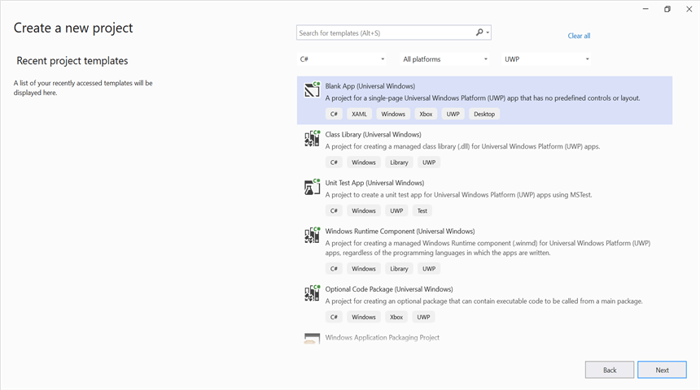

# Create Markdown document in UWP

Syncfusion<sup>&reg;</sup> Essential<sup>&reg;</sup> Markdown is a [.NET Markdown library](https://www.syncfusion.com/document-sdk/net-markdown-library) used to create, read, and edit **Markdown** documents programmatically without external dependencies. Using this library, you can **create a Markdown document in UWP**.

## Steps to create Markdown document programmatically in UWP

Step 1: Create a new C# Blank App (Universal Windows) project.



Step 2: Install the [Syncfusion.Markdown](https://www.nuget.org/packages/Syncfusion.Markdown) NuGet package as a reference to your UWP application from [NuGet.org](https://www.nuget.org/).


N> **Starting with v34.x.x**, if you reference Syncfusion<sup>&reg;</sup> assemblies from the trial setup or from the NuGet feed, you must add a reference to the **Syncfusion.Licensing** assembly and include a valid license key in your application.
N>
N> Install the [Syncfusion.Licensing](https://www.nuget.org/packages/Syncfusion.Licensing) NuGet package and register the license key during application startup.
N>
N> ```csharp
N> Syncfusion.Licensing.SyncfusionLicenseProvider.RegisterLicense("YOUR_LICENSE_KEY");
N> ```
N>
N> For more information about generating and registering a license key, refer to the [Syncfusion<sup>&reg;</sup> licensing documentation](https://help.syncfusion.com/common/essential-studio/licensing/overview).

Step 3: Add a new button in the MainPage.xaml as shown below.





<Page
    x:Class="Create_Markdown_document.MainPage"
    xmlns="http://schemas.microsoft.com/winfx/2006/xaml/presentation"
    xmlns:x="http://schemas.microsoft.com/winfx/2006/xaml"
    xmlns:local="using:Create_Markdown_document"
    xmlns:d="http://schemas.microsoft.com/expression/blend/2008"
    xmlns:mc="http://schemas.openxmlformats.org/markup-compatibility/2006"
    mc:Ignorable="d">

    <Grid Background="{ThemeResource ApplicationPageBackgroundThemeBrush}">
        <Button x:Name="button" Content="Create Document" Click="OnButtonClicked" HorizontalAlignment="Center" VerticalAlignment="Center"/>
    </Grid>
</Page>





Step 4: Include the following namespaces in the **MainPage.xaml.cs** file.




using Syncfusion.Office.Markdown;
using Windows.Storage.Pickers;
using Windows.Storage;
using Windows.Storage.Streams;
using System.Reflection;




Step 5: Include the following code snippet in the click event of the button in **MainPage.xaml.cs** to **create a Markdown document** and save it as a physical file. The file will be opened for viewing automatically.




private async void OnButtonClicked(object sender, RoutedEventArgs e)
{
    // Creates a new instance of MarkdownDocument.
    MarkdownDocument markdownDocument = new MarkdownDocument();
    // Adds a heading to the Markdown document.
    MdParagraph mdHeadingParagraph = markdownDocument.AddParagraph();
    // Applies the Heading 1 style to the paragraph.
    mdHeadingParagraph.ApplyParagraphStyle("Heading 1");
    MdTextRange mdHeadingTextRange = mdHeadingParagraph.AddTextRange();
    mdHeadingTextRange.Text = "Adventure Works Cycles";
    // Adds a paragraph to the Markdown document.
    MdParagraph mdParagraph = markdownDocument.AddParagraph();
    MdTextRange mdTextRange = mdParagraph.AddTextRange();
    mdTextRange.Text = "Adventure Works Cycles, the fictitious company on which the AdventureWorks sample databases are based, is a large, multinational manufacturing company. The company manufactures and sells metal and composite bicycles to North American, European and Asian commercial markets. While its base operation is in Bothell, Washington with 290 employees, several regional sales teams are located throughout their market base.";
    // Adds the first list item.
    MdParagraph item1 = markdownDocument.AddParagraph();
    item1.ListFormat = new MdListFormat();
    item1.ListFormat.IsNumbered = false;
    item1.ListFormat.ListLevel = 0;
    item1.ListFormat.ListValue = "- ";
    item1.AddTextRange().Text = "First item";
    // Adds the second list item.
    MdParagraph item2 = markdownDocument.AddParagraph();
    item2.ListFormat = new MdListFormat();
    item2.ListFormat.IsNumbered = false;
    item2.ListFormat.ListLevel = 0;
    item2.ListFormat.ListValue = "- ";
    item2.AddTextRange().Text = "Second item";
    // Adds the third list item.
    MdParagraph item3 = markdownDocument.AddParagraph();
    item3.ListFormat = new MdListFormat();
    item3.ListFormat.IsNumbered = false;
    item3.ListFormat.ListLevel = 0;
    item3.ListFormat.ListValue = "- ";
    item3.AddTextRange().Text = "Third item";
    // Adds a table to the Markdown document.
    MdTable table = markdownDocument.AddTable();
    table.ColumnAlignments.Add(MdColumnAlignment.Left);
    table.ColumnAlignments.Add(MdColumnAlignment.Left);
    // Adds the header row.
    MdTableRow headerRow = table.AddTableRow();
    MdTableCell header1 = headerRow.AddTableCell();
    header1.Items.Add(new MdTextRange { Text = "Profile picture" });
    MdTableCell header2 = headerRow.AddTableCell();
    header2.Items.Add(new MdTextRange { Text = "Description" });

    // Adds a data row.
    MdTableRow dataRow = table.AddTableRow();
    MdTableCell cell1 = dataRow.AddTableCell();
    MdPicture picture = new MdPicture();
    picture.Url = "Assets\\photo.jpg";
    picture.AltText = "Profile picture";
    cell1.Items.Add(picture);
    MdTableCell cell2 = dataRow.AddTableCell();
    cell2.Items.Add(new MdTextRange { Text = "AdventureWorks Cycles, the fictitious company on which the AdventureWorks sample databases are based, is a large, multinational manufacturing company." });


    // Downloads the Markdown document in the browser.

    MemoryStream stream = new MemoryStream();
    markdownDocument.Save(stream);
    stream.Position = 0;
    // Disposes the document.
    markdownDocument.Dispose();
    //Saves the stream as Markdown document file in local machine.
    Save(stream, "Sample.md");
}




## Save a Markdown document in UWP




// Saves the Markdown document.
async void Save(MemoryStream streams, string filename)
{
    streams.Position = 0;
    StorageFile stFile;
    if (!(Windows.Foundation.Metadata.ApiInformation.IsTypePresent("Windows.Phone.UI.Input.HardwareButtons")))
    {
        FileSavePicker savePicker = new FileSavePicker();
        savePicker.DefaultFileExtension = ".md";
        savePicker.SuggestedFileName = filename;
        savePicker.FileTypeChoices.Add("Markdown Documents", new List<string>() { ".md" });
        stFile = await savePicker.PickSaveFileAsync();
    }
    else
    {
        StorageFolder local = Windows.Storage.ApplicationData.Current.LocalFolder;
        stFile = await local.CreateFileAsync(filename, CreationCollisionOption.ReplaceExisting);
    }
    if (stFile != null)
    {
        using (IRandomAccessStream zipStream = await stFile.OpenAsync(FileAccessMode.ReadWrite))
        {
            //Write compressed data from memory to file.
            using (Stream outstream = zipStream.AsStreamForWrite())
            {
                byte[] buffer = streams.ToArray();
                outstream.Write(buffer, 0, buffer.Length);
                outstream.Flush();
            }
        }
    }
    //Launch the saved Markdown file.
    await Windows.System.Launcher.LaunchFileAsync(stFile);
}




Step 6: Build and run the UWP application. Click the **Create Document** button to generate and view the Markdown document.

You can download a complete working sample from [GitHub](https://github.com/SyncfusionExamples/Markdown-Examples/tree/master/Getting-Started/UWP).

N> The code sample references an image file (`photo.jpg`). Download this asset from the [GitHub sample Assets folder](https://github.com/SyncfusionExamples/Markdown-Examples/tree/master/Getting-Started/UWP/Create-Markdown-document/Assets) and place it in the application's `Assets` folder so the `MdPicture.Url` value (`"Assets/photo.jpg"`) resolves correctly at runtime.

By executing the program, you will get the **Markdown document** as follows.


Looking for the full .NET Markdown Library overview, features, pricing, and documentation? Visit the [.NET Markdown Library](https://www.syncfusion.com/document-sdk/net-markdown-library) page.

An online sample link to [create a Markdown document](https://document.syncfusion.com/demos/markdown/createmarkdown#/tailwind) in ASP.NET Core.