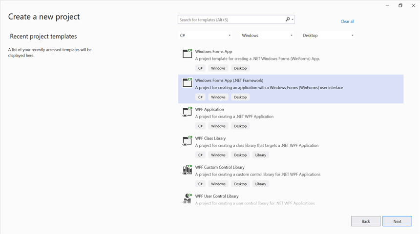

# Create Markdown document in Windows Forms

Syncfusion<sup>&reg;</sup> Essential<sup>&reg;</sup> Markdown is a [.NET Markdown library](https://www.syncfusion.com/document-sdk/net-markdown-library) used to create, read, and edit **Markdown documents** programmatically without external dependencies. Using this library, you can **create a Markdown document in Windows Forms**.

## Steps to create a Markdown document programmatically

## Prerequisites

* Visual Studio 2022.
* Install the .NET desktop development workload along with the required .NET Framework SDK.
* .NET Framework 4.6.2 or later (4.8 recommended). This sample targets .NET Framework (not .NET / .NET Core).

Step 1: Create a new Windows Forms application project.



Step 2: Install the [Syncfusion.Markdown](https://www.nuget.org/packages/Syncfusion.Markdown) NuGet package as a reference to your Windows Forms application from the [NuGet.org](https://www.nuget.org/).


N> **Starting with v34.x.x**, if you reference Syncfusion<sup>&reg;</sup> assemblies from the trial setup or from the NuGet feed, you must add a reference to the **Syncfusion.Licensing** assembly and include a valid license key in your application.
N>
N> Install the [Syncfusion.Licensing](https://www.nuget.org/packages/Syncfusion.Licensing) NuGet package and register the license key during application startup.
N>
N> ```csharp
N> Syncfusion.Licensing.SyncfusionLicenseProvider.RegisterLicense("YOUR_LICENSE_KEY");
N> ```
N>
N> For more information about generating and registering a license key, refer to the [Syncfusion<sup>&reg;</sup> licensing documentation](https://help.syncfusion.com/common/essential-studio/licensing/overview).

Step 3: Add the following `using` directives to the top of **Form1.cs** (the Syncfusion namespaces are used by the click handler added in Step 5).





using Syncfusion.Office.Markdown;
using System;
using System.IO;
using System.Windows.Forms;





Step 4: Add a new button in **Form1.Designer.cs** to create a Markdown document as follows. The `btnCreate_Click` handler referenced below is added in **Form1.cs** in Step 5.





private Button btnCreate;
private Label label;
  
private void InitializeComponent()
{
    label = new Label();
    btnCreate = new Button();
    //Label
    label.Location = new System.Drawing.Point(0, 40);
    label.Size = new System.Drawing.Size(426, 35);
    label.Text = "Click the button to generate a Markdown document using Essential Markdown.";
    label.TextAlign = System.Drawing.ContentAlignment.MiddleCenter;
  
    //Button
    btnCreate.Location = new System.Drawing.Point(180, 110);
    btnCreate.Size = new System.Drawing.Size(85, 36);
    btnCreate.Text = "Create Document";
    btnCreate.Click += new EventHandler(btnCreate_Click);
  
    //Form settings
    ClientSize = new System.Drawing.Size(450, 150);
    Controls.Add(label);
    Controls.Add(btnCreate);
    Text = "Create Markdown";
}




Step 5: Add the following code in the **btnCreate_Click** event handler in **Form1.cs** to **create a Markdown document** with simple text.




// Creates a new instance of MarkdownDocument.
MarkdownDocument markdownDocument = new MarkdownDocument();
// Adds a heading to the Markdown document.
MdParagraph mdHeadingParagraph = markdownDocument.AddParagraph();
// Applies the Heading 1 style to the paragraph.
mdHeadingParagraph.ApplyParagraphStyle("Heading 1");
MdTextRange mdHeadingTextRange = mdHeadingParagraph.AddTextRange();
mdHeadingTextRange.Text = "Adventure Works Cycles";
// Adds a paragraph to the Markdown document.
MdParagraph mdParagraph = markdownDocument.AddParagraph();
MdTextRange mdTextRange = mdParagraph.AddTextRange();
mdTextRange.Text = "Adventure Works Cycles, the fictitious company on which the AdventureWorks sample databases are based, is a large, multinational manufacturing company. The company manufactures and sells metal and composite bicycles to North American, European and Asian commercial markets. While its base operation is in Bothell, Washington with 290 employees, several regional sales teams are located throughout their market base.";
// Adds the first list item.
MdParagraph item1 = markdownDocument.AddParagraph();
item1.ListFormat = new MdListFormat();
item1.ListFormat.IsNumbered = false;
item1.ListFormat.ListLevel = 0;
item1.ListFormat.ListValue = "- ";
item1.AddTextRange().Text = "First item";
// Adds the second list item.
MdParagraph item2 = markdownDocument.AddParagraph();
item2.ListFormat = new MdListFormat();
item2.ListFormat.IsNumbered = false;
item2.ListFormat.ListLevel = 0;
item2.ListFormat.ListValue = "- ";
item2.AddTextRange().Text = "Second item";
// Adds the third list item.
MdParagraph item3 = markdownDocument.AddParagraph();
item3.ListFormat = new MdListFormat();
item3.ListFormat.IsNumbered = false;
item3.ListFormat.ListLevel = 0;
item3.ListFormat.ListValue = "- ";
item3.AddTextRange().Text = "Third item";
// Adds a table to the Markdown document.
MdTable table = markdownDocument.AddTable();
table.ColumnAlignments.Add(MdColumnAlignment.Left);
table.ColumnAlignments.Add(MdColumnAlignment.Left);
// Adds the header row.
MdTableRow headerRow = table.AddTableRow();
MdTableCell header1 = headerRow.AddTableCell();
header1.Items.Add(new MdTextRange { Text = "Profile picture" });
MdTableCell header2 = headerRow.AddTableCell();
header2.Items.Add(new MdTextRange { Text = "Description" });

// Adds a data row.
MdTableRow dataRow = table.AddTableRow();
MdTableCell cell1 = dataRow.AddTableCell();
MdPicture picture = new MdPicture();
picture.Url = "Data\\Photo.jpg";
picture.AltText = "Profile picture";
cell1.Items.Add(picture);
MdTableCell cell2 = dataRow.AddTableCell();
cell2.Items.Add(new MdTextRange { Text = "AdventureWorks Cycles, the fictitious company on which the AdventureWorks sample databases are based, is a large, multinational manufacturing company." });
// Saves the Markdown document
markdownDocument.Save(Path.GetFullPath(@"Output/Sample.md"));
// Disposes the document
markdownDocument.Dispose();
           




N> The code sample references an image file (`photo.jpg`). Download this asset from the [GitHub sample Data folder](https://github.com/SyncfusionExamples/Markdown-Examples/tree/master/Getting-Started/Windows-Forms/Create-Markdown-document/Data) and place it in the application's `Data` folder so the `MdPicture.Url` value (`"Data/photo.jpg"`) resolves correctly at runtime.

Step 6: Build the project.

Click on Build → Build Solution or press <kbd>Ctrl</kbd>+<kbd>Shift</kbd>+<kbd>B</kbd> to build the project.

Step 7: Run the project.

Click the Start button (green arrow) or press <kbd>F5</kbd> to run the application.

You can download a complete working sample from [GitHub](https://github.com/SyncfusionExamples/Markdown-Examples/tree/master/Getting-Started/Windows-Forms).

By executing the program, you will get the **Markdown document** as follows.


Looking for the full .NET Markdown Library overview, features, pricing, and documentation? Visit the [.NET Markdown Library](https://www.syncfusion.com/document-sdk/net-markdown-library) page.

An online sample link to [create a Markdown document](https://document.syncfusion.com/demos/markdown/createmarkdown#/tailwind) in ASP.NET Core.