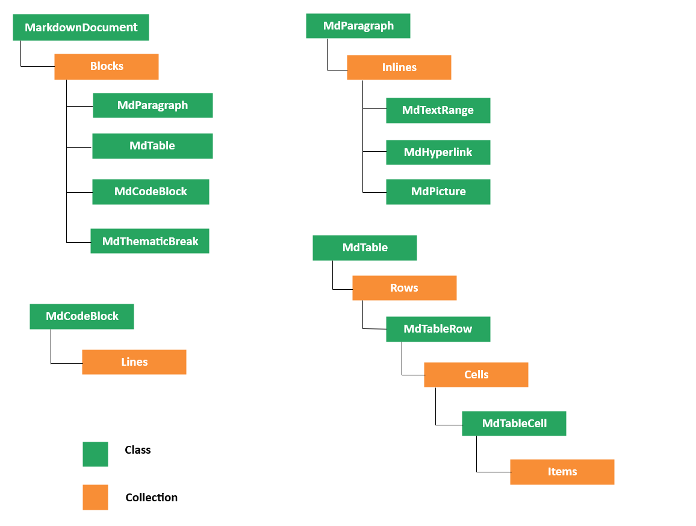

# Document Object Model Representation in the Syncfusion&reg; .NET Markdown Library

When an existing Markdown document is opened or a new document is created, the Markdown library creates a **Document Object Model** (DOM) of the document in main memory. This object model can be used to manipulate the document as needed.

